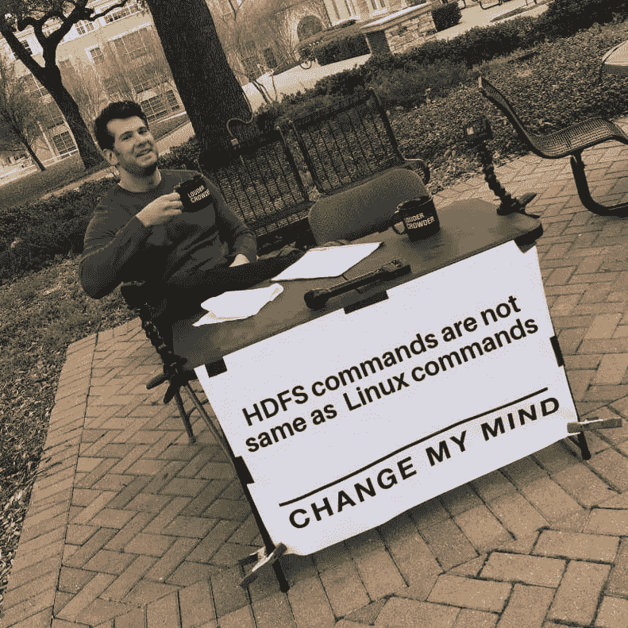
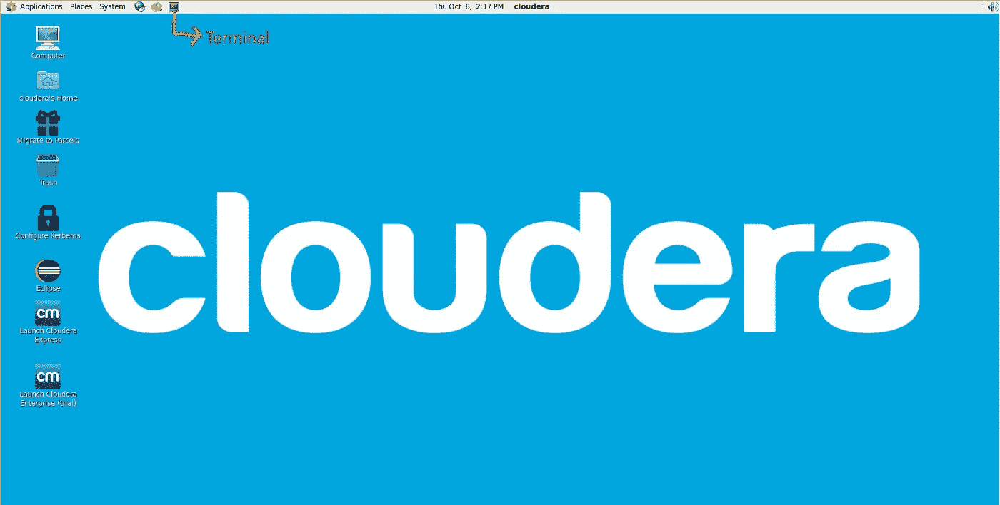
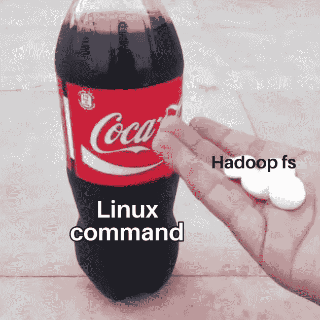

# HDFS 命令

> 原文：<https://blog.devgenius.io/hdfs-commands-db5865e6305e?source=collection_archive---------9----------------------->



他们只需要一个前缀😗

之后，我们安装了 Cloudera Quickstart VM，我们可以开始尝试在终端上运行一些基本命令，并尝试做一些基本的事情，如重命名文件、创建文件等。如果你还没有在你的机器上安装 Quickstart VM，那就按照我上一篇[文章](https://medium.com/@prikshitsingla78/installation-of-hadoop-on-windows-266671e79921)在 windows 上安装吧(我没有 mac💻直到现在，但我一定会写安装步骤，当我得到一个)。

要打开终端，只需点击顶部的终端图标



在开始编写代码之前，让我们先了解一下 hdfs 的基本文件结构。

我们可以使用两种主目录，一种是本地目录，另一种是 HDFS 目录本地目录就像 windows 或 Linux 中的任何其他目录一样，没有分布式处理，而在 HDFS 有分布式处理。

本地用户的主目录: **/home/cloudera**

HDFS 用户的主目录:**/用户/云时代**

# HDFS 命令是如何工作的？


😶😶

所有 HDFS 命令都将与名称节点交互(例如:ls)。但是，有些命令会转到数据节点，从文件中读取数据(例如:cat、tail)

## **一些有助于进一步理解的基本符号**

1.  根文件夹 **/**
2.  首页 **~**
3.  当前。
4.  父级**..**
5.  上一个 **-**

# 一些 HDFS 命令

命令就像 Linux 中的命令一样，但我们只是在每个命令中都有 ***hadoop fs*** -或 ***hdfs dfs -*** 前缀，所以命令变成了。



这就是 HDFS 处理大数据的方式🌋🌋

```
**hadoop fs - <command name>
hdfs dfs - <command name>**
```

> 注意:-获取任何命令的帮助 **hadoop fs -help <命令名>**

## ls 命令

查看目录中的文件列表

```
**hadoop fs -ls /user/cloudera
hadoop fs -ls (it will display all the files and folders in current directory)**
```

按时间排序文件

```
**hadoop fs -ls -t -r /**
```

*这里，t 代表时间，r 代表反向，因此最早的文件将首先显示*

按大小排序(默认情况下，最大的在顶部)

```
**hadoop fs -ls -S /
hadoop fs -ls -S -h / (size will be displayed now in human readable form)**
```

使用 grep 在列出的文件中搜索

```
**hadoop fs - ls /user | grep cloudera**
```

我们将首先在/user 目录中查找文件，然后在该列表中查找 cloudera。当我们需要一个接一个地使用命令时，可以使用管道运算符(|)。

## mkdir 命令

它用于创建目录

```
**hadoop fs -mkdir /user/cloudera/testing**
```

## rm 命令

rm 可以用来删除文件

```
**hadoop fs -rm /user/cloudera/file1.txt (will just remove files not directories)****hadoop fs -rm -R /user/cloudera/testing (will remove directory)**
```

## 将文件或文件夹从本地复制到 hdfs

(copyFromLocal 或 put)命令用于将本地文件复制到 hdfs。

```
*hadoop fs -copyFromLocal <local_path> <hdfs_path>***hadoop fs -copyFromLocal Desktop/file1.txt /data
hadoop fs -put Desktop/file1.txt /data**
```

## 将文件或文件夹从 hdfs 复制到本地

(copyToLocal 或 get)命令用于将 hdfs 文件复制到本地。

```
*hadoop fs -copyToLocal <hdfs_path> <local_path>
hadoop fs -get <hdfs_path> <local_path>*
```

## **cp 命令**

将一个位置从一个 hdfs 位置复制到另一个位置

```
*hadoop fs -cp <hdfs_path1> <hdfs_path2>*
```

## mv 命令

该命令用于将文件从一个位置移动到另一个位置。这仅仅意味着我们正在重命名一个文件。所以只需要更新元数据，这非常快

```
*hadoop fs -mv <hdfs_path1> <hdfs_path2>*
```

> 注意:-对于 cp 和 mv 命令，条件是我们可以在 hdfs 或本地移动/复制它。使用这些命令无法在本地和 hdfs 之间进行交叉移动，反之亦然

## 测向命令

df 命令用于检查可用磁盘空间

```
**hadoop fs -df -h /user/cloudera (h is for human readable form)**
```

**杜命令**

du 命令用于检查磁盘使用情况

```
**hadoop fs -du -h /user/cloudera**
```

# 一些重要且有用的命令

## 动态改变复制因子

为了更改默认情况下数据节点的复制因子 **3** ，我们需要设置以下属性

**dfs.replication=5**

## fsck 命令

该命令用于查看 hdfs 中的元数据。fsck 代表文件系统检查

```
**hdfs  fsck  /user/data.csv -files  -blocks  -locations**
```

上述命令将给出数据块信息和复制信息，以及保存数据块的数据节点的 ip 地址。


当我键入这些命令时，我的父母和兄弟姐妹如何看待我🤣🤣

我想今天要消化的太多了。我知道这可能看起来像是一个很长的命令列表，但实际上您并不需要学习它们，您实际上可以看到命令名称实际上告诉了它很多信息，因为我们将练习这些命令，我们将掌握它们。所以，不要担心和冷却🧊.我们将会有很多的乐趣📝部分之后会有很多实用的东西。

下一次，我们见面的时候，我们将开始我们的冒险🎢使用 Map Reduce，您将看到 Hadoop 的实际功率⚡。相信我，这是令人敬畏的家伙！我们今天已经伸展够久了。

让我们结束这篇博客吧🤗暂时的！


直到下次伙计们🥰🥰

**谢谢！为了阅读。**

如果你喜欢这个博客，请鼓掌回应👏

**跟随..☺️** [**我**](https://medium.com/@prikshitsingla78) **更多这样有见地的 articles✍️**

请在评论中分享你的想法，并请分享对需要改进的部分的反馈，以便我下次改进。

祝大家有美好的一天！