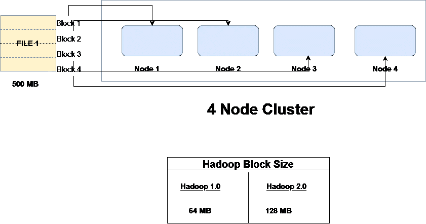
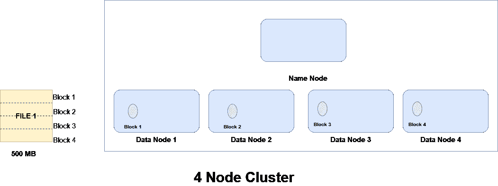
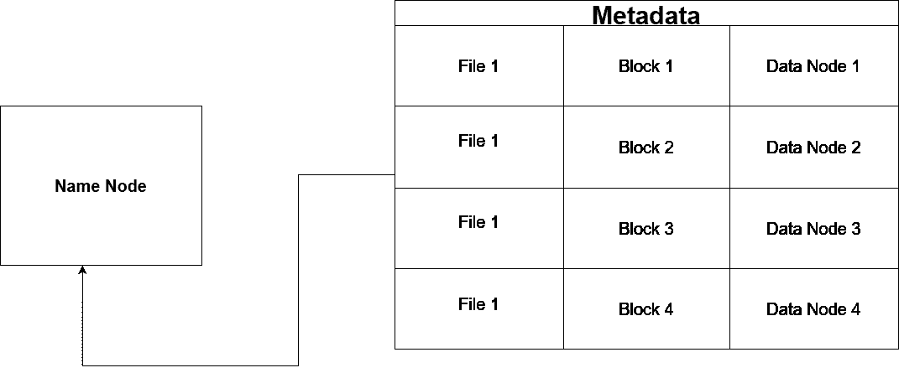
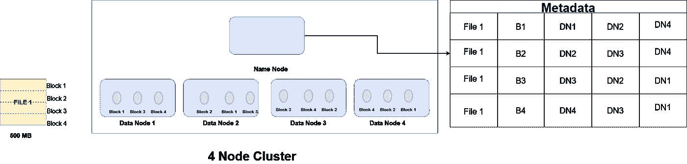
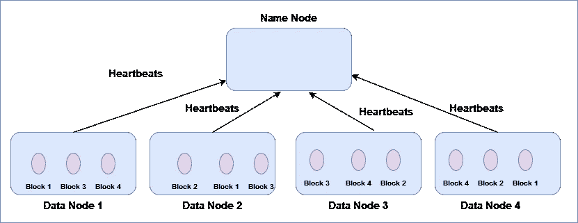
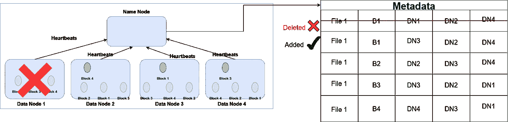

# HDFS——Hadoop 的存储单元

> 原文：<https://blog.devgenius.io/hdfs-the-storage-unit-of-hadoop-612494d1de01?source=collection_archive---------4----------------------->

我帮助存储数据！

在上一篇文章中，我们已经介绍了 Hadoop，这是一个我们将要学习的解决大数据问题的平台。所以，如果你还没有看过我的上一篇文章，请一定要看看👉[这里的**这里的**这里的](https://medium.com/p/8b063fc2d83f)👈(不要脸！自我推销😁) .现在，在本文中，让我们了解数据如何存储在 Hadoop 中，并将了解 HDFS — Hadoop 分布式文件结构。

# 介绍

因此，大数据意味着将会有大量的数据，而如此大量的数据不能以传统方式仅仅放入我们的 pc。这将影响我们系统的性能，并且效率不高。在我的《大数据简介》一文中，我们已经讨论了单片和分布式系统，请查看👉[**此处**](https://medium.com/p/8cebc140c2cf) 👈(又不要脸！自我推销😁)

请记住，对于大数据，我们将使用分布式系统。那么，现在让我们了解一下 HDFS 是如何存储这么多数据的。

# HDFS 建筑

假设我们现在正在一个 4 节点集群的分布式系统上工作(这里 1 个节点表示分布式系统中的一台机器，它们一起构成集群)，我们有一个大小为 500 MB 的文件(实际上文件大小会很大，我们这样做只是为了简化计算)。现在，这个文件将如何存储在这个 4 节点群集上？让我们看看..

抱歉箭头排列不准！

这个 500 MB 的文件将被分成块。块数将取决于 HDFS 的块大小，这些块将存储在磁盘上。在 Hadoop 2.0 中，默认情况下块大小为 128 MB，而在 Hadoop 1.0 中，块大小为 64 MB。如果需要，Hadoop 管理员可以更改块大小。因此，块数将等于(文件大小/块大小)。

对于上述示例，我们将有 500 MB / 128 MB = 4 个数据块，这 4 个数据块将分布在这 4 个节点上。

*   块 1 : 128 MB
*   第二块:128 兆字节
*   区块 3:128 兆字节
*   第四块:116 兆字节

# 名称节点和数据节点

HDFS 遵循主从架构。主节点称为名称节点或主节点，从节点称为数据节点或从节点。

数据节点存储实际数据，它包含 HDFS 中块形式的文件。名称节点是做什么的，我们为什么需要它？

名称节点存储元数据。元数据只是块和数据节点的映射表。

让我们借助一个例子来理解它的必要性。让我们假设你需要研究一本书的一个特定主题，假设它有页码，但没有索引，那么你必须搜索整本书来寻找这个特定的主题，但如果你在开始时有一个索引页，那么通过查看索引中的页码就可以很容易地找到包含该主题的页面。

找章节没有索引页就好了！

元数据帮助我们以类似的方式找到数据。每当客户端从 HDFS 请求数据时，它将向名称节点发出请求，名称节点将查看元数据表，并向客户端提供所请求的数据。这个表保存在内存中，而不是磁盘上，这样可以更快地加载它。

在整篇文章中，我们都遵循了同一个例子

# 一些需要回答的问题

**名字节点和数据节点是用什么材料做的？**

名称节点由高质量硬件制成，而数据节点由廉价硬件制成。因此，数据节点更有可能出现故障

**为什么名字节点都是用高质量的硬件做的？**

名称节点存储集群的元数据，因此，如果它宕机，整个集群都将面临灾难。另一个原因是，与数据节点相比，群集中的名称节点数量确实较少。

# 如果数据节点出现故障怎么办

如果数据节点发生故障，我们如何保护宝贵的数据不丢失？为了处理这种故障，Hadoop 依赖于复制因素。默认情况下，复制因子为 3(但可以根据需要进行更改)。复制因子只是意味着我们将在不同的计算机上保留数据块的多个副本，并且名称节点还将为此维护此元表。

请记住，同一个数据块应该保存在不同的数据节点上。如果所有 3 个数据块都保存在同一台计算机上，那么如果它发生故障，复制就没有用了。当我们制作复制品时，我们不是使用了大量的存储空间吗？是的，我们确实使用了大量存储，但这是一种权衡，我们需要付出代价来保护我们的数据不丢失，而且存储很便宜，所以没关系。

# 心跳❤

我们如何知道数据节点是否关闭？

*   每个数据节点每 3 秒钟向每个节点发送一次心跳。
*   如果名称节点没有接收到 10 个连续心跳(30 秒),则认为数据节点已经死亡或运行缓慢。记住这个数字 30 秒，我们将在讨论名称节点故障时再次看到它。

🤣🤣

# 容错

现在，如果一个数据节点出现故障，复制因子将下降到< 3\. Name Node will create one more copy to maintain the replication factor

Keeping up with Failures

Did you notice that all blocks are still in different blocks.

**，我想知道我们如何处理名称节点故障？**

我们不能仅仅通过复制来实现，因为元数据存储在内存中，而内存是昂贵的。我们下次见面的时候再做吧，你可能会喜欢的。

干杯🤗读者们，如果你们已经走了这么远..

让我们暂时结束这个博客吧！

**《直到我们再次相遇》**

**谢谢！为了阅读。**

如果你喜欢这个博客，请鼓掌回应👏

**跟随..☺️** [**我**](https://medium.com/@prikshitsingla78) **更多这样有见地的 articles✍️**

请在评论中分享你的想法，并请分享对需要改进部分的反馈，以便我下次改进。

**祝大家愉快！**