# Head First Java-第 11 章(异常处理)

> 原文：<https://blog.devgenius.io/head-first-java-chapter-11-exception-handling-acdd970d4265?source=collection_archive---------2----------------------->

*   Java 的异常处理机制是处理运行时突然出现的“异常情况”的一种简洁明了的方式；它允许您将所有的错误处理代码放在一个易于阅读的地方。

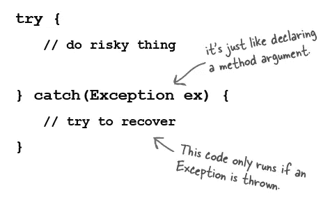

*   编译器需要知道你知道你在调用一个有风险的方法。如果你把有风险的代码放在一个 try/catch 中，编译器会放松。try/catch 块告诉编译器，您知道在您调用的方法中可能会发生异常情况，并且您已经准备好处理它。那个编译器不在乎你怎么处理它；它只在乎你说你在处理它。

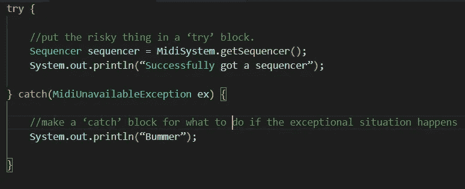

**已检查和未检查的异常:**

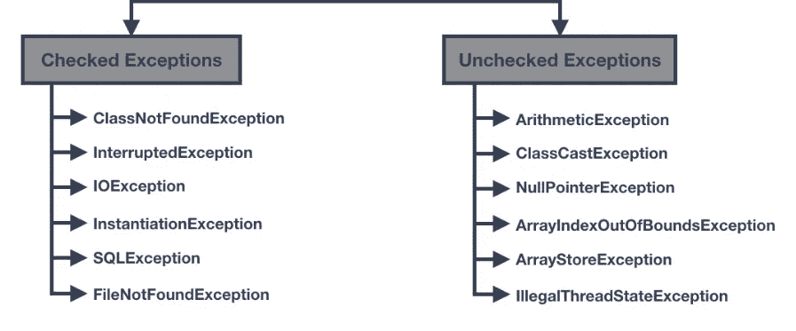

*   编译器会检查不是 RuntimeException 子类的异常。它们被称为“**检查异常**”。
*   编译器不检查运行时异常。他们被称为(此处大惊喜)“**未检查的例外**”。您可以抛出、捕捉和声明 RuntimeExceptions，但您不必这样做，编译器也不会检查。

除了 RuntimeExceptions 之外，编译器检查所有内容。

1.  如果在代码中抛出异常，必须在方法声明中使用 throws 关键字来声明它。
2.  如果你调用一个抛出异常的方法，你必须承认你知道异常的可能性。让编译器满意的一种方法是将调用包装在 try/catch 中。

> 要点
> 
> 当某个东西在运行时失败时，方法可以抛出异常。
> 
> 异常总是异常类型的对象。(正如您在多态性章节中所记得的，这意味着该对象来自一个在其继承树上某处有异常的类。)
> 
> 编译器不会关注 RuntimeException 类型的异常。RuntimeException 不一定要在 try/catch 中声明或包装(尽管您可以自由地做这两件事中的一件或两件)
> 
> 编译器关心的所有异常都被称为“检查过的异常”，这实际上意味着编译器检查过的异常。编译器检查只排除 RuntimeExceptions。根据规则，所有其他异常都必须在代码中得到确认。
> 
> 一个方法抛出一个带有关键字 throw 的异常，后跟一个新的异常对象:
> 
> **抛出新的 NoCaffeineException()；**
> 
> 可能引发检查异常的方法必须用 throws 异常声明来声明它。
> 
> 如果您的代码调用检查异常抛出方法，它必须向编译器保证已经采取了预防措施。
> 
> 如果您准备好处理异常，将调用包装在 try/catch 中，并将您的异常处理/恢复代码放在 catch 块中。
> 
> 如果您不准备处理异常，您仍然可以通过正式“回避”异常来让编译器高兴。

**try/catch 块中的流量控制**

*   当你调用一个有风险的方法时，有两种情况会发生。

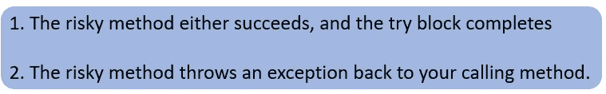

**最终阻塞**

*   这是放置代码的地方，这些代码必须在没有任何异常同意的情况下运行。

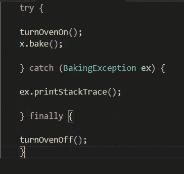

*   如果没有 finally，你必须在 try 和 catch 中都放上 turnOvenOff()，因为无论如何你都必须关掉烤箱。
*   该块允许您将所有清理代码放在一个地方，而不是像下面这样复制代码:

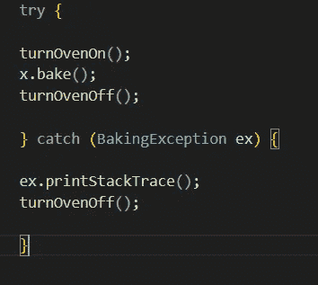

*   **如果 try 块失败(异常):**

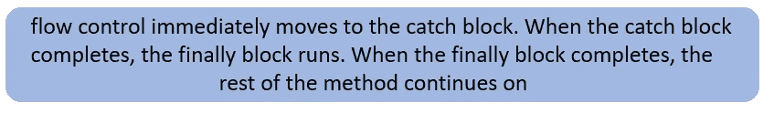

*   **如果 try 块成功(无异常):**

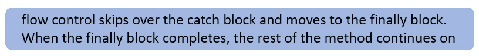

*   **如果 try 或 catch 块有返回语句:**

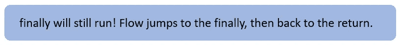

现在让我们检查两个用例。

此处变量“测试”的值为“是”。

所以我们编译后得到这个结果。

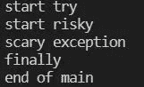

当我将变量“test”的值改为“no”时。

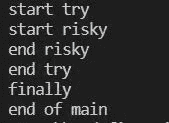

**捕捉多个异常:**

编译器会确保你已经处理了所有被你调用的方法抛出的异常。将 catch 块一个接一个地堆叠在 try 下。有时你堆叠 catch 块的顺序很重要，但是我们稍后会讲到。

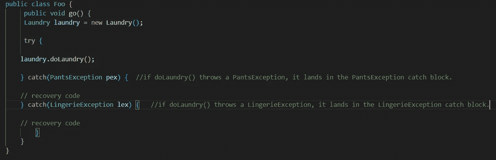

*   多个 catch 块必须从最小到最大排序。
*   Catch 块不像重载方法那样选择最佳匹配。

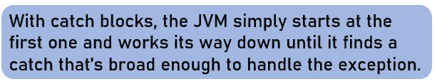