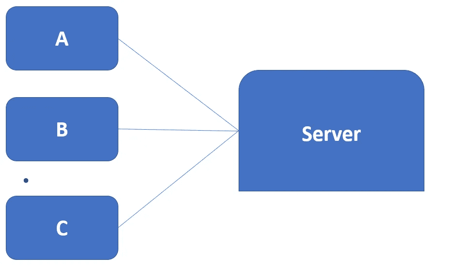

# head First Java-第 15 章(网络和线程)

> 原文：<https://blog.devgenius.io/head-first-java-chapter-15-networking-and-threads-427d099aa73a?source=collection_archive---------12----------------------->

*   Java 程序可以接触到另一台机器上的程序。所有底层网络细节都由 java.net 图书馆的班级负责。
*   Java 具有通过网络发送和接收数据的能力。它只需要在链的末端使用稍微不同的连接流进行 I/O。如果有 BufferedReader，可以阅读。
*   在这一章中，我们将看到如何制作客户端和服务器。我们会让他们互相交流。

让我们看一个聊天程序的场景。

*   客户端必须了解服务器。
*   服务器必须知道所有的客户机。

**工作原理:**

1.  客户端连接到服务器。
2.  服务器建立连接并将客户端添加到参与者列表中。
3.  另一个客户端连接
4.  客户端 A 向聊天服务发送消息。
5.  服务器将消息分发给所有参与者(包括原始发送者)。

**插座连接**

> 连接、发送和接收

**我们必须让客户端工作的三件事是:**

1.  建立初始连接(套接字连接。)在客户端和服务器之间。
2.  向服务器发送消息
3.  从服务器接收消息

**制作网络插座连接**

要进行套接字连接，您需要了解关于服务器的两件事情:

1.  是谁(IP 地址)
2.  它在哪个端口上运行(TCP 端口号)

> Socket chat Socket = new Socket(" 196 . 164 . 1 . 103 "，5000)；

这里 ip 地址= 196.164.1.103

TCP 端口号=5000

*   从 0 到 1023 的 TCP 端口号保留给众所周知的服务。
*   我们编写的聊天服务器使用端口 5000。我们只是在 1024 和 65535 之间选了一个数字。

# 知名港口

*   如果没有端口号，服务器将无法知道客户机想要连接到哪个应用程序。

> internet web (HTTP)服务器运行在端口 80 上
> 
> Telnet 服务器，它运行在端口 23 上。
> 
> FTP :20。
> 
> POP3 邮件服务器:110
> 
> SMTP: 25。
> 
> 时间服务器位于 37。

*   每个应用程序都有自己独特的协议。
*   当服务器程序在公司网络上运行时，你必须向系统管理员查询哪些端口已经被占用。

问题 1:你怎么知道你要对话的服务器程序的端口号？

**从插座读取**

第一步。与服务器建立套接字连接

*   127.0.0.1 是运行此代码的“本地主机”的 IP 地址。当您在一台单独的机器上测试您的客户机和服务器时，您可以使用它。

第二步。将 InputStreamReader 链接到套接字的低级(连接)输入流

第三步。做一个 BufferedReader 来读吧！

*   将 BufferedReader 链接到 InputStreamReader

**将数据写入套接字(使用 PrintWriter)**

步骤 1:建立到服务器的套接字连接

步骤 2:制作一个链接到套接字的低级(连接)输出流的 PrintWriter

*   PrintWriter 在字符数据和它从套接字的低级输出流获得的字节之间充当自己的桥梁

第三步:写(打印)一些东西

*   println()在发送内容的末尾添加一个新行。
*   print()不添加新行。

**编写客户端:**

这里，

*   班级插座在 java.net
*   在运行这段代码的同一台主机上，对端口 4242 上运行的任何东西进行套接字连接。

**编写一个简单的服务器**

*   一个 ServerSocket，它等待客户端请求(当客户端创建一个新的 Socket())和一个普通的旧 Socket socket，用于与客户端通信。

步骤 1:服务器应用程序在特定端口上创建一个服务器套接字

*   这将启动服务器应用程序来侦听来自端口 4242 的客户机请求

步骤 2:客户机与服务器应用程序建立套接字连接

*   客户端知道 IP 地址和端口号

步骤 3:服务器创建一个新的套接字来与这个客户端通信

*   accept()方法在等待客户端套接字连接时会阻塞(只是停留在那里)。当客户端最终尝试连接时，该方法返回一个知道如何与客户端通信的普通旧套接字(在不同的端口上)。

> **要点**
> 
> 客户端和服务器应用程序通过套接字连接进行通信。
> 
> 套接字表示两个应用程序之间的连接，这两个应用程序可能(也可能不)运行在两个不同的物理机器上。
> 
> 客户端必须知道服务器应用程序的 IP 地址(或域名)和 TCP 端口号。
> 
> TCP 端口是分配给特定服务器应用程序的 16 位无符号数字。TCP 端口号允许不同的客户端连接到同一台机器，但与该机器上运行的不同应用程序进行通信。
> 
> 从 0 到 1023 的端口号是为“众所周知的服务”保留的，包括 HTTP、FTP、SMTP 等。
> 
> 客户端通过使服务器 Socket Socket s = new Socket(" 127 . 0 . 0 . 1 "，4200)连接到服务器；
> 
> 一旦连接上，客户机就可以从套接字获得输入和输出流。这些是低级的“连接”流。
> *sock . getinputstream()；
> sock . get output stream()；*
> 
> 要从服务器读取文本数据，请创建一个 BufferedReader，链接到 InputStreamReader，后者链接到来自套接字的输入流。
> 
> InputStreamReader 是一个“桥”流，它接收字节并将它们转换为文本(字符)数据。它主要用作高级 BufferedReader 和低级 Socket 输入流之间的中间链。
> 
> 要将文本数据写入服务器，创建一个直接链接到套接字输出流的 PrintWriter。调用 print()或 println()方法将字符串发送到服务器。
> 
> 服务器使用 ServerSocket 在特定的端口号上等待客户端请求。
> 
> 当服务器套接字收到请求时，它通过与客户端建立套接字连接来“接受”请求。

## 如何启动新线程:

步骤 1:创建一个可运行的对象(线程的任务)

> runnable thread job = new my runnable()；

步骤 2:创建一个线程对象(worker ),并赋予它一个 Runnable

> Thread myThread = new Thread(Thread job)；

第三步:启动线程

> myth read . start()；

## **实现可运行的接口**

MyRunnable.java

**ThreadTester.java**

****

**输出:**

****

> ****要点****
> 
> **带有小写字母“t”的线程在 Java 中是一个独立的执行线程。**
> 
> **Java 中的每个线程都有自己的调用栈。**
> 
> **带有大写字母“T”的线程是 java.lang.Thread 类。一个线程对象代表一个执行线程。**
> 
> **一个线程需要一个任务来完成。线程的任务是实现 Runnable 接口的实例。**
> 
> **Runnable 接口只有一个方法，run()。这是位于新调用堆栈底部的方法。换句话说，它是在新线程中运行的第一个方法。**
> 
> **要启动一个新线程，您需要一个 Runnable 来传递给线程的构造函数。**
> 
> **当您实例化了一个线程对象但尚未调用 start()时，线程就处于新状态。**
> 
> **当您启动一个线程时(通过调用 thread 对象的 start()方法)，会创建一个新的堆栈，Runnable 的 run()方法位于堆栈的底部。线程现在处于可运行状态，等待被选择运行。**
> 
> **当 JVM 的线程调度器选择一个线程作为当前正在运行的线程时，就说这个线程正在运行。在单处理器机器上，只能有一个当前正在运行的线程。**
> 
> **有时线程可以从运行状态转移到阻塞(暂时不可运行)状态。线程可能会被阻塞，因为它正在等待来自流的数据，或者因为它已经进入睡眠状态，或者因为它正在等待对象的锁。**
> 
> **线程调度不能保证以任何特定的方式工作，所以您不能确定线程会很好地轮流。您可以通过定期让线程休眠来帮助影响轮流**