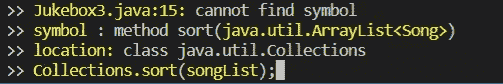
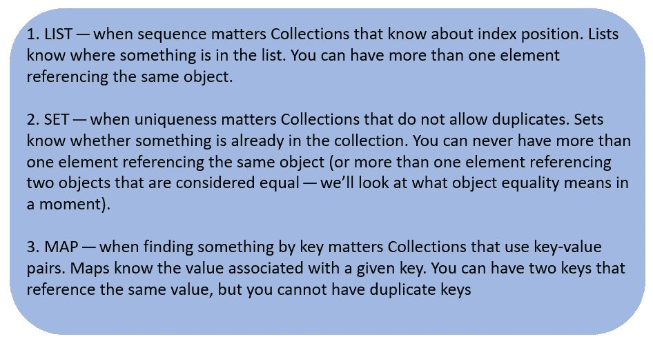

# head First Java-第 16 章(集合和泛型)

> 原文：<https://blog.devgenius.io/head-first-java-chapter-16-collections-and-generics-b0447b3733e9?source=collection_archive---------8----------------------->

# **数据结构**

> **收藏-整理**

*   **collections . sort()方法按字母顺序对字符串列表进行排序**

例如:

> ArrayList<string>song list = new ArrayList<string>()；</string></string>
> 
> Collections.sort(歌曲列表)；

**排序对象**

*   假设我们希望列表中有实际的类实例，在这种情况下每个实例可以有更多的数据。
*   这里我们将需要一个被覆盖的 toString()方法。
*   因为 toString()方法是在打印对象(System.out.println(anObject))时调用的，所以您应该重写它以打印比默认的唯一标识符代码更易读的内容。

*   我们覆盖 toString()，因为当你做一个 System.out.println(aSongObject)的时候，我们希望看到标题。当您执行 system . out . println(aListOfSongs)时，它会调用列表中每个元素的 toString()方法。

**改为歌曲对象的数组列表，而不是字符串**

*   现在使用这四个标记创建一个新的歌曲对象，然后将歌曲添加到列表中。

*   不会编译！

但是 Collections 类清楚地表明有一个 sort()方法，它接受一个列表。

*   ArrayList 是-一个列表，因为 ArrayList 实现了 List 接口，所以…应该可以。

*   编译器说它找不到采用 ArrayList <song>的排序方法。</song>

*   让我们看看为什么编译器甚至不让我们将一个 Song 数组列表传递给 sort()方法。

> 编译器不知道如何读取这个上的方法声明。上面说 sort()取一个列表<t>，但是 T 是什么？</t>

**sort()方法声明**

*   这是因为 sort()方法(以及 Java 中整个集合框架中的其他东西)大量使用了泛型。每当你在 Java 源代码或文档中看到带尖括号的东西，它就意味着泛型 Java 5.0 中增加的一个特性。

> 泛型类型

*   使用泛型，您可以创建类型安全的集合，其中更多的问题是在编译时而不是运行时解决的。
*   如果没有泛型，编译器会很乐意让你把一个南瓜放到一个应该只存放 Cat 对象的数组列表中。
*   在泛型出现之前，没有办法声明数组列表的类型，所以它的 add()方法接受 type Object。

没有泛型

使用泛型

*   现在有了泛型，你可以只把 Fish 对象放在 ArrayList <fish>中，所以对象以 Fish 引用的形式出现。你不必担心有人把一辆大众汽车放在那里，或者你得到的东西不会真的被铸造成鱼的参照物。</fish>

**通用类**

在泛型类中，有两个主要方面需要关注:

1)类声明

2)允许您添加元素的方法声明

> 公共类数组列表<e>扩展抽象列表<e>实现列表 <e>…{</e></e></e>

*   可以把“E”看作是“您希望这个集合保存并返回的元素类型”的替身。(E 代表元素。).
*   ArrayList 是 AbstractList 的子类，所以您为 ArrayList 指定的任何类型都会自动用于 AbstractList 的类型。

**泛型方法**

1.  使用在类声明中定义的类型参数

2.使用未在类声明中定义的类型参数

*   这里我们可以使用<t>,因为我们之前在方法声明中声明了“T”。方法说 T 可以是“任何类型的动物”。</t>

**可比界面**

*   Comparable 接口定义了用于比较对象的 **compareTo** 方法。

> 类宋器物可比

*   我们正在指定实现类可以与之比较的类型。这意味着 **Song** 对象可以与其他 **Song** 对象进行比较，以便进行排序。

> 公共 int compareTo(Song s) {

*   sort()方法向 compareTo()发送一首歌曲，以查看该歌曲与调用该方法的歌曲相比如何。

示例代码:

输出:

# 列出、设置和映射接口

**对象相等**

1.  引用相等:引用堆上同一对象的两个引用相等。句号。如果对两个引用都调用 hashCode()方法，会得到相同的结果。如果不覆盖 hashCode()方法，默认行为。

2.对象相等性:如果您想将两个不同的歌曲对象视为相等的(例如，如果您确定两首歌曲具有匹配的标题变量，则它们是相同的)，您必须重写从类对象继承的 hashCode()和 equals()方法。

