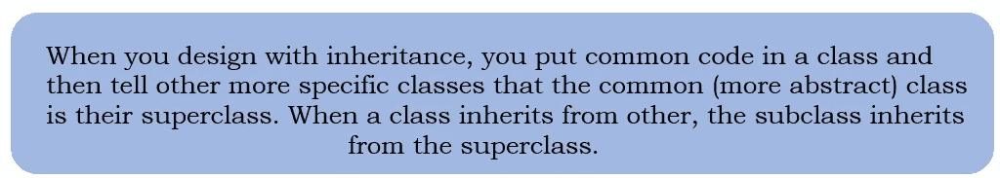
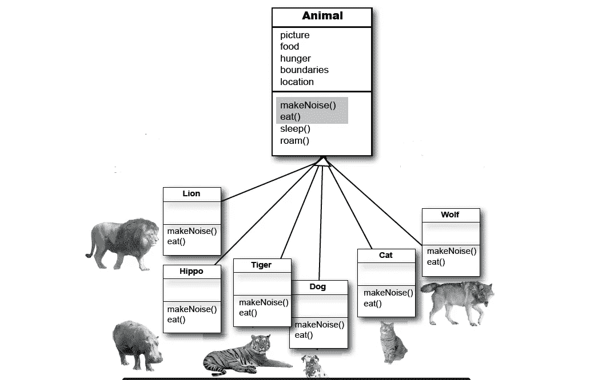
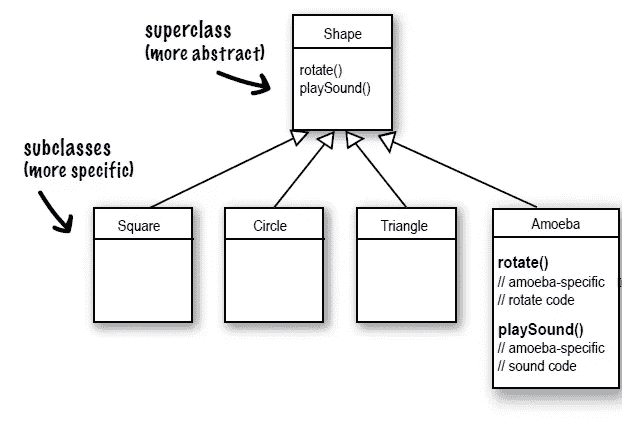
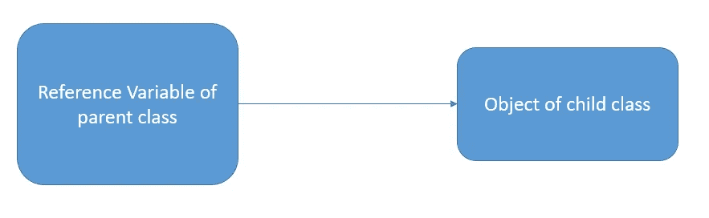

# head First Java-第 7 章(继承和多态)

> 原文：<https://blog.devgenius.io/head-first-java-chapter-7-inheritance-and-polymorphism-66c7a5095c14?source=collection_archive---------7----------------------->

> 用一些长期的意图来计划你的项目。

*   如果您可以编写其他人可以轻松扩展的代码，会怎么样？如果你能写出灵活的代码呢？
*   当你参加多态计划时，你将学到更好的类设计的 5 个步骤，多态的 3 个技巧，制作灵活代码的 8 种方法。这将给你应得的设计自由和编程灵活性。
*   所以当我们设计一个软件时，可能会有一些类具有相同的功能。因此，如果我们一遍又一遍地使用相同的代码来获得那个功能，可能会有重复。
*   为了克服这一点，我们可以使用继承。

**了解传承**

在 Java 中，我们说子类扩展了超类。

1.  看看这四个类的共同点。
2.  抽象出通用的特性，放入一个新的类(超类)。
3.  将其他 f 类链接到新类(超类)，这种关系称为继承。

假设我们需要改变功能运作的方式。所以我们有一个选项叫做**超越**。

**覆盖规则:**

1.  参数必须相同，并且 returntypes 必须兼容。
2.  这个方法不能再简单了。

**哪种方法叫？**

*   当你在一个对象引用上调用一个方法时，你调用的是该对象类型的方法的最具体的版本。换句话说，最低的赢！“最低”意味着在继承树上最低。
*   如果 JVM 没有在最低的类中找到该方法的版本，它就开始沿着继承层次结构往回走，直到找到匹配的为止。

**使用 IS-A 和 HAS-A**

> 当你想知道一件事是否应该延伸到另一件事时，应用 IS-A 测试。

*   三角形是一种形状，是的，很有用，
*   猫是一种猫科动物的作品，
*   外科医生是-医生工作，
*   浴缸延伸了浴室工程，

> 直到你应用了 IS-A 测试。
> 
> 如果类 B 扩展了类 A，那么类 B 就是-A 类 A。这在继承树的任何地方都是正确的。如果 C 类扩展了 B 类，那么 C 类通过了 B 和 A 的 IS-A 测试。

问:在一个子类中，如果我想同时使用一个方法的超类版本和我的重写子类版本，该怎么办？换句话说，我不想完全取代超类版本，我只是想给它添加更多的东西。

**答**:你可以这样！这是一个重要的设计特征。把“扩展”这个词理解为“我想扩展超类的功能”。

> 公共 void roam() {
> 
> super.roam()。
> 
> //我自己漫游的东西
> 
> }

*   在子类重写方法中，可以使用关键字 super 调用超类版本。这就像说，“先去运行超类版本，然后回来用我自己的代码完成…”

**要点**

> 子类扩展了超类。
> 
> 子类继承超类的所有公共实例变量和方法，但不继承超类的私有实例变量和方法。
> 
> 继承的方法可以被重写；实例变量不能被覆盖(虽然它们可以在子类中被重定义，但那不是一回事，而且几乎从来没有必要这么做。)
> 
> 使用 IS-A 测试来验证您的继承层次结构是否有效。如果 X 延伸了 Y，那么 X 是-A Y 一定有意义。
> 
> 这种关系只有一个方向。河马是一种动物，但不是所有的动物都是河马。
> 
> 当一个方法在子类中被覆盖，并且该方法在子类的实例上被调用时，该方法的被覆盖版本被调用。(最低者胜。)
> 
> 如果 B 类扩展了 A，C 扩展了 B，那么 B 类是-A 类，C 类是-A 类，C 类也是-A 类。

## **多态性的工作方式:**

*   首先，最好看看我们通常声明引用和创建对象的方式。使用多态性，引用类型可以是实际对象类型的超类。
*   当您声明引用变量时，任何通过引用变量声明类型的 IS-A 测试的对象都可以被赋给该引用。
*   有了多态性，当你在程序中引入新的子类类型时，你可以编写不需要改变的代码。

> ***类*** *一类*
> 
> ***类*** *B* ***延伸***
> 
> **A =****新****B()；//向上投射**

*对于向上转换，我们可以使用类类型或接口类型的引用变量。例如:*

> ***接口** I{}*
> 
> ***类** A{}*
> 
> ***类** B **扩展** A **实现** I{}*

*在这里，B 类的关系将是:*

> *B 是-A A
> B 是-A I
> B 是-A 对象*

*问:你为什么会想上最后一堂课？阻止一个类被子类化会有什么好处？*

*   *通常，您不会将您的类设置为最终类。但是如果你需要安全，知道方法总是按照你写的方式工作的安全(因为它们不能被覆盖)，final 类会给你这个。由于这个原因，Java API 中的许多类都是最终类。例如，String 类是 final 类，因为，嗯，想象一下如果有人改变了字符串的行为方式会造成多大的破坏！*