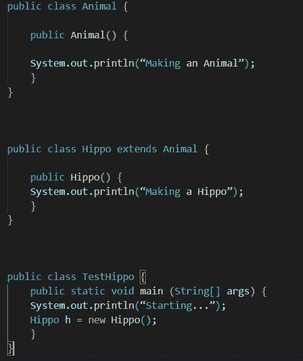

# head First Java-第 9 章(构造函数和垃圾收集)

> 原文：<https://blog.devgenius.io/head-first-java-chapter-9-constructors-and-garbage-collection-8dd89d0135d6?source=collection_archive---------5----------------------->

当我们考虑对象时，我们是负责对象生命周期的人。我们决定何时以及如何建造它。我们决定何时放弃它。但是一旦它被放弃，垃圾收集器(gc)可以蒸发它，回收该对象正在使用的内存。

## **栈和堆**

在 Java 中，程序员关心两个内存区域，**对象所在的区域(堆)**、**以及方法调用和局部变量所在的区域(堆栈)。**

我们知道所有的对象都存在于垃圾回收堆中。变量的位置取决于它是什么类型的变量。

两种变量

1.  实例变量
2.  局部变量。

**方法堆叠**

*   调用该方法后，这些方法将被放在调用堆栈的顶部。实际上被推到堆栈上的新东西是堆栈框架，它保存方法的状态，包括正在执行哪一行代码，以及所有局部变量的值。
*   位于堆栈顶部的方法始终是该堆栈当前运行的方法。

**要点**

> Java 有两个我们关心的内存区域:堆栈和堆。
> 
> 实例变量是在类内部而不是任何方法外部声明的变量。
> 
> 局部变量是在方法或方法参数中声明的变量。
> 
> 所有局部变量都存在于堆栈中，在对应于声明变量的方法的框架中。
> 
> 对象引用变量的工作方式就像原始变量一样——如果引用被声明为局部变量，它就进入堆栈。
> 
> 所有对象都存在于堆中，不管引用是局部变量还是实例变量。

**回顾对象的 3 个步骤**

1.  申报
2.  创造
3.  作业

**我们是在调用一个名为 Duck()的方法吗？**

> *否我们调用鸭子构造函数。*

*   调用构造函数的唯一方法是用关键字 new 后跟类名。JVM 找到该类并调用该类中的构造函数。

考虑一个名为 Duck 的类。因此，当我们创建一个新的鸭子时，有两种方法来创建一个新的鸭子:

**知道尺寸就做鸭子:**

> Duck2 d =新 duck 2(15)；

**不知道大小就做鸭子:**

> duck 2 D2 = new duck 2()；

**重载和默认构造函数**

*   如果一个类中有多个构造函数，这些构造函数必须有不同的参数列表。论点单包括参数的顺序和类型。只要它们不同，你就可以有不止一个构造函数。

要点

> 实例变量存在于它们所属的对象中，在堆上。
> 
> 如果实例变量是对对象的引用，那么引用和它所引用的对象都在堆上。
> 
> 构造函数是当你对一个类类型说 new 时运行的代码。
> 
> 构造函数必须与类同名，并且不能有返回类型。
> 
> 您可以使用构造函数来初始化正在构造的对象的状态(即实例变量)。
> 
> 如果你没有在你的类中放入一个构造函数，编译器会放入一个默认的构造函数。
> 
> 默认构造函数总是无参数构造函数。
> 
> 如果您在类中放置一个构造函数(任何构造函数),编译器将不会构建默认的构造函数。
> 
> 如果你想要一个无参数的构造函数，并且你已经放入了一个带参数的构造函数，你将不得不自己构建这个无参数的构造函数。
> 
> 如果可能的话，总是提供一个无参数的构造函数，让程序员更容易创建一个工作对象。提供默认值。重载的构造函数意味着你的类中有不止一个构造函数。
> 
> 重载的构造函数必须有不同的参数列表。
> 不能有两个具有相同参数列表的构造函数。自变量列表包括自变量的顺序和/或类型。
> 
> 实例变量被赋予一个默认值，即使你没有明确地赋予一个。对于原语，默认值为 0/0.0/false，对于引用，默认值为 null。

**关于构造函数的四件事**

1.  构造函数是当有人对类类型说 new 时运行的代码

> 鸭 d =新鸭()；

2.构造函数必须与类同名，并且没有返回类型

> 公共鸭(int size) { }

3.如果你没有在你的类中放入一个构造函数，编译器会放入一个默认的构造函数。默认构造函数总是无参数构造函数。

> 公鸭(){ }

4.只要参数列表不同，您的类中可以有多个构造函数。一个类中有多个构造函数意味着你重载了构造函数。

> 公鸭(){ }
> 
> 公共鸭(int size) { }
> 
> 公共鸭(字符串名){ }
> 
> public Duck(String name，int size) { }

**物体构造**

让我们想象一个制作河马的场景。所以制造河马也意味着制造动物和物体的部分。

1.  另一个类的代码说 new Hippo()和 Hippo()构造函数进入堆栈顶部的堆栈框架。
2.  Hippo()调用超类构造函数，将 Animal()构造函数推到堆栈顶部。
3.  Animal()调用超类构造函数，因为它将 Object()构造函数推到堆栈的顶部，因为 Object 是 Animal 的超类。
4.  Object()完成，其堆栈帧从堆栈中弹出。执行返回到 Animal()构造函数，然后在 Animal 对其超类构造函数的调用之后的行上继续执行。

一个物体能存在多久？

*   对象的寿命完全取决于引用它的引用的寿命。所以是引用被标识为“活的”，对象在堆上仍然是活的。如果引用死了，对象也会死。

一个变量存在多久？

*   这取决于变量是局部变量还是实例变量。下面的代码展示了一个局部变量的生命。在这个例子中，变量是一个原始变量，但是无论它是原始变量还是引用变量，变量的生命周期都是相同的。