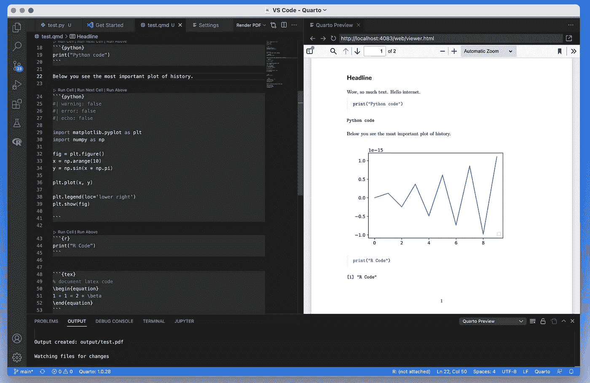
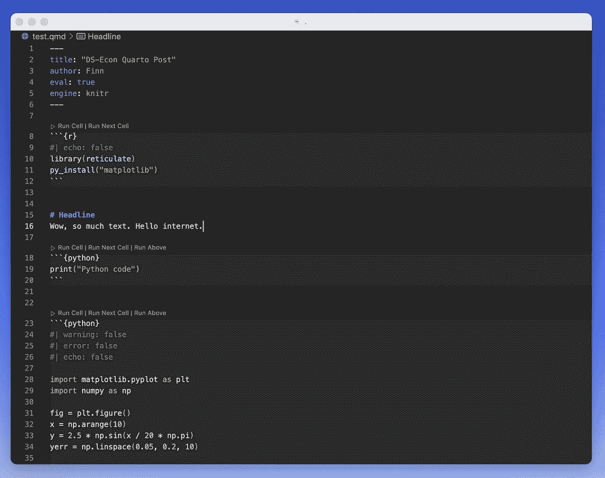

# 抬头！四开在这里停留。在你的下一篇文档中立即结合 R & Python:对最近一篇文章的扩展。

> 原文：<https://blog.devgenius.io/heads-up-quarto-is-here-to-stay-aa861ef87491?source=collection_archive---------5----------------------->

这个帖子也可以在 ds-econ.com 上找到。

在最近的一篇文章中，[我展示了我用 R](https://www.ds-econ.com/write-your-whole-paper-in-r-it-is-better/) 写学术论文的设置。今天，我们通过`Python`和其他语言扩展这个设置。

我们看两个选项:第一个，是使用`R Markdown`的`reticulate`包，第二个选项是移动到`Quarto`。

`Quarto`是同一[核心开发者](https://quarto.org/docs/faq/)对`R Markdown`的概括。这个框架允许你将`R`、`Python`、`Julia`和`OJS`与代码的输出和你的写作编织在一起。

# R Markdown 中的 Python 使用`reticulate`包

`[reticulate](https://rstudio.github.io/reticulate/)`包装`R`和`Python`之间的中间产品。

除了编写包含两种语言的混合脚本，它还允许你在`R Markdown`中使用`Python`代码块。

为此，您需要加载`reticulate`，并在您的`r setup`代码块中设置您的`Python`解释器。

现在你可以像使用`R`代码一样使用`Python`:你只需要将块的标签从`r`改为`python`。甚至像`echo`或`warnings`这样的块选项仍然可以像预期的那样工作。

如果您想简单地通过偶尔的代码块扩展您当前的工作流，这是一个很好的选择。

# 通过转换到 Quarto 来拥抱混合文档

`Quarto`****能从一个普通*生成任何东西***。docx 或*。pdf* ，来个全互动网站。它可以编译降价文件(*)。qmd* )，引擎也将 *Jupyter 笔记本*渲染成文档。你可以在 quarto.org 找到例子和大量的文档。**

****

# **我喜欢 R Markdown——为什么我要换成 Quarto？**

**首先，切换成本*低*:只有语法上的微小差异，工作流程是一样的。**知道** `**R Markdown**` **就基本知道** `**Quarto**` **。****

**然而，`Quarto`是一个更“通用”的框架，因为它不太特定于`R`:它与其他编程语言的集成是自然的，并且它没有一个“最喜欢的”IDE。`Quarto`在 *Jupyter* 、 *R Studio* ，或者 [*VS Code*](https://code.visualstudio.com/) *中很容易上手。***

**`**Quarto**` **还可以将 *Jupyter 笔记本*渲染成完整的文档**，使其成为`R` *和* `Python`社区之间的中介。**

# **在 VS 代码中设置 Quarto**

****

**我开始使用 VS 代码，因为我想要一个可以用于任何编码项目的 IDE。**

**我对 VS 代码进行了全新的安装，只从`R Extension`、`Python Extension`和`Quarto Extension`开始。**

****VS 代码的** `**Quarto Extension**` **让使用** `**Quarto**` **工作变得毫不费力。有块选项的代码建议，文档预览，等等。****

**起初，我以为`Quarto`会为不同的编码语言使用不同的解释器，但事实上**利用了现有的引擎**，可以将`R`和`Python`结合起来。标准设置是，`Quarto`对`.qmd`文件使用`knitr` + `reticulate`，对*笔记本使用`R kernel`*。**

**请注意这些默认值，以防您在使用这些引擎时遇到问题。简单地将文档的 YAML 中的`engine: knitr`改为`engine: jupyter`可能会创造奇迹。点击阅读更多关于引擎绑定选项[的信息。](https://quarto.org/docs/computations/execution-options.html#engine-binding)**

# **M1 Mac 用户:确保 R 和 Python 使用 arm64**

****M1 苹果电脑的用户请注意** : [**当你在同一个脚本中使用不同的语言时，你可能会遇到麻烦！**](https://github.com/rstudio/reticulate/issues/1019)**

**如果一个解释器(例如`R`解释器)将您的 CPU 识别为一个 *arm64* 芯片，而您的`Python`会话将它作为一个标准的 *x64* 芯片来处理，就会发生这个问题。**

**不出所料，这会导致冲突，因为同一台计算机上的两个解释器假设他们使用的是不同类型的 CPU。**

****重要的是，你的** `**R**` **和你的** `**Python**` **都采用同一类型的处理器。**因此，要么让*的两个*解释器都采用标准的英特尔芯片( *x64* )，要么将两者都设置为 M1 芯片( *arm64* )。**

**如果你通过`reticulate`安装`miniconda`应该没问题，因为如果你的`R`在 *arm64* 上运行，它会得到一个*arm 64*T16，否则会得到一个 *x64* 版本。这对于设置很重要，因为当使用`knitr`引擎时`Quarto`在后台调用`reticulate`。**

**请注意，这是一个全新的环境，您还需要安装带有`reticulate`的`Python`模块。**

**虽然默认情况下`reticulate`应该使用这个`Python`解释器，但是显式定义你的解释器并没有坏处。**

# **你读到这里了吗？—祝贺你🎉**

****🔓授予**到[的访问权限，加入](https://www.ds-econ.com/#/portal/signup/free) `[get_update()](https://www.ds-econ.com/#/portal/signup/free)` [邮件列表！](https://www.ds-econ.com/#/portal/signup/free)**