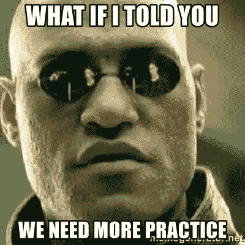

# 医疗工作者到软件工程师之旅第 1 周

> 原文：<https://blog.devgenius.io/healthcare-worker-to-software-engineer-journeyweek-1-2a356077952?source=collection_archive---------21----------------------->

所以我正式结束了熨斗学校软件工程训练营的第一周(耶！)，我想现在是开博客的好时机，这样我就可以写下我从课上学到的东西，以及我如何将这项研究与我之前的研究联系起来。

在这篇博客中，我将谈论:

*   **我如何/为什么选择转行，为什么选择软件工程师**
*   **学习准备训练营编码面试的技巧**
*   **我如何将销售工程师与我之前的职业/学习联系起来**

# **如何开始…**

在石溪大学医院做了四年的注册护理助理后，我终于被石溪大学护理学院录取了。当我在 CNA 工作的时候，很多护士来来往往告诉我，现在找别的职业还不晚。

他们说，“你必须真正喜欢这份工作，才能一直干到退休。”我从来没有真正考虑过，因为我知道我想成为一名护士。做一名 CNA 很难，但我喜欢做一名护士，我可以想象自己穿着护士服，一手拿着听诊器，一手拿着 40 美元/小时的支票(说实话，高薪是选择职业的一个重要因素)。

在我护理学校的第二个学期，由于新冠肺炎的原因，我的课程改为在线，所以我大部分时间都在家里学习和上网。当我对医院有一些随意的想法时，一个我非常喜欢的项目想法出现了。为了建立这个想法或项目，我需要一些软件工程师应该具备的技能，所以我开始自学语言。像任何其他学科一样，独立学习非常困难，尤其是因为我不知道如何学习语言，也不知道从哪里开始。有这么多不同的语言可供我选择，有这么多不同的应用程序可供我使用。但我知道一件事是肯定的。仅仅学习了三个星期的 Javascript，我就已经从中获得了乐趣，并对这个领域产生了巨大的兴趣。在和妻子认真讨论了几天后，我报名参加了一个编码面试，并在被录取后支付了定金。

关键时刻:我第一次尝试时没有通过编码挑战。但老实说，当我接到电话说我应该再准备一周，尝试第二轮编码挑战时，我感觉好多了。到那时，我知道我必须学习什么，也知道面试官可能会问什么样的问题。虽然我是新手，但我会列出一个学习建议的清单，来帮助初学者准备 bootcamp 编码挑战。

*   **利用训练营为您提供的准备工作实验室。**

*这个准备工作包信息非常丰富，给了我一个很好的方向，告诉我应该从哪里开始，需要为我的编码挑战做些什么。*

*   **熟悉使用语法、方法等。通过在 Codewars.com 和 Edabit.com 等网站上练习编码**

**和*[*【https://edabit.com】*](https://edabit.com)*有数百个免费问题，从非常容易的水平到专家。每个问题都有资源链接，如果你被卡住了，可以指导你解决问题。如果真的卡住了，可以查看答案。答案给了你所有其他人提交的不同答案，所以你可以查看人们提交的各种答案，这非常整洁。这些网站真正的好处是，每次你答对一些问题，你就会得到分数和级别，从而感到有成就感，自我感觉良好。**

**

*   ***利用其他教育网站，如 StackOverFlow.com、Reddit.com 和“YOUTUBE”。COM"***

*是的，StackOverFlow 和 Reddit 很有教育意义，很有帮助，也很有启发性，但是说实话。有多少初学者会去那些网站问有史以来最简单的事情？对于更喜欢视觉学习的人来说，我认为开始学习语言的最好方式是观看 youtube 视频和讲座。*

*   ***练习，练习，练习***

**

*你可能看过 youtube 视频，读过某个主题的讲座，但是如果没有任何练习，你就无法完全掌握这些信息。确保您按照自己的进度练习 bootcamp 提供的准备工作实验室中的任何内容。*

*对于所有三分之一在两年内寻找新职业的新毕业护士来说，你们可能找对了地方。通过上周对 Ruby 的深入研究，我注意到找到解决方案的思维过程与护理专业学生准备考试 NCLEX 非常相似。很多人会想，“嘿，护士不就是从医生那里得到指令，然后传给病人吗？”你只说对了一半。护士确实需要医生的命令才能给病人开药。但是，护士除了照顾病人之外，做了大部分的工作。这包括如果病人表现出任何疾病迹象，护士是第一个需要检查病人的应答者，并做出判断给予正确的护理。*

*同样的概念也适用于编码。在学习了语法、方法等之后。，你被期望使用那些信息来制作一个程序。你有责任知道如何编码，有了这些代码，会有什么样的结果，并且能够用你从学习中所知道的来调试它。*

*从某种意义上说，这两种职业都需要明确的解决问题的技能。因此，如果有任何护理专业的学生、刚毕业的护士或其他任何想改变职业的人，不要犹豫，去看看软件工程。你永远也猜不到护理研究和软件工程研究有什么相似之处。*

*今天到此为止，第二周我有一个编码挑战需要学习，我会回来写更多关于我是如何准备的。*

* [## 拜拜

### 再见，荷马·辛普森·布什主演

memecrunch.com](https://memecrunch.com/meme/BMFZD/bye-bye)*