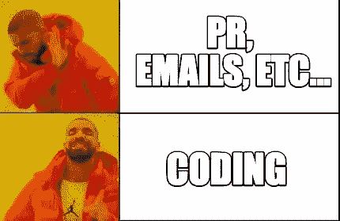
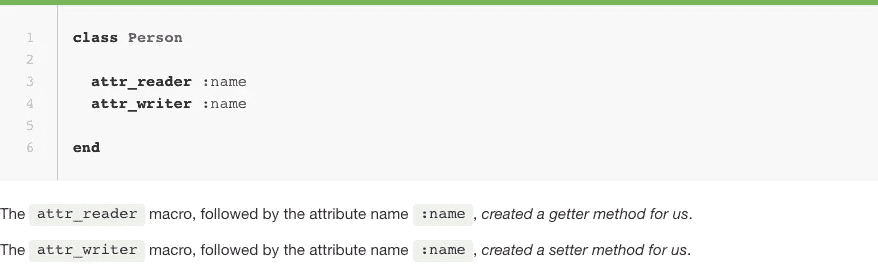
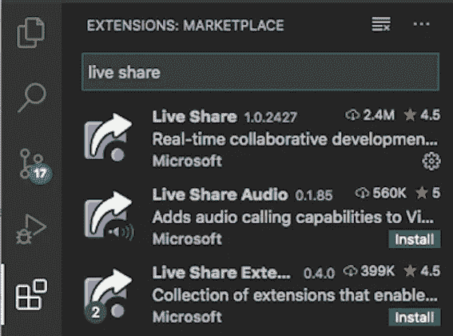
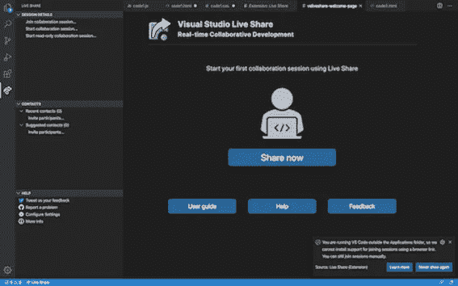
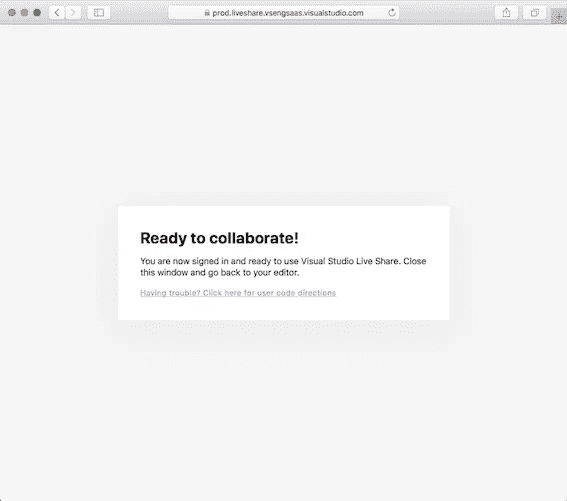
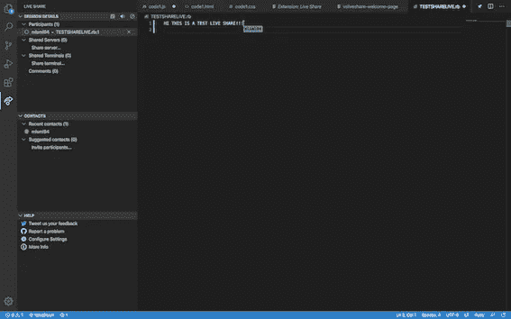

# 医疗工作者到软件工程师之旅第 2 周

> 原文：<https://blog.devgenius.io/healthcare-worker-to-software-engineer-journeyweek-2-29b318d240d0?source=collection_archive---------22----------------------->

第二周比第一周快多了。由于独立日假期，周四和周五的讲座被取消了，所以这可能是因素之一，但我认为更多的是因为我开始有更多的乐趣。第一周无疑更加令人生畏和紧张，因为我必须认识新的人，并且记住我是一个内向的人(参考我以前的帖子)。但是感谢一些破冰者，结对实验室，互相放松，我遇到了一些伟大的人，他们毫不犹豫地互相帮助，这很棒。

在我的第一篇博客中，我提到了这周我有模块一代码挑战。所以在这个博客上，我将谈论:

*   **模块一代码挑战的标题，**
*   **代码挑战赛应该关注哪个话题，**
*   **什么亲自帮我熬过来了。**

# **代码挑战的标题**

这个挑战可以分为三大部分，我把它们按照我认为对解决问题最重要到最不重要的顺序排列。

1.  **使用 Ruby 建模关系。**

为了解决第一个模块代码挑战，您需要完全理解并练习可视化问题所要求的内容。你可能对问题抛给你的对象很熟悉，但是这些对象和问题所问内容之间的关系可能会有所不同。因此，请务必仔细阅读 README.md，并想象(勾画)问题的内容。一种练习方法是使用 https://awwapp.com。

2.**使用 OO Ruby 语法构建类**

如果您弄清楚了给定的类之间的关系，您需要在正确的时间和地点使用正确的语法，知道类和实例之间的区别，以及如何在正确的范围内使用方法。知道如何使用 self 来表示它是用于类的方法，而不是实例。

使用正确的 attr_macros 也很重要。如果您在 attr_reader 和 attr_writer 中都有一个属性，而不是使用 attr_accessor，这将告诉教师您没有完全理解 attr_macros 的区别。下面是 attr_reader 和 attr_writer 的区别图。如果一个属性需要这两者，那么就要使用 attr_accessor。

3.**解决收集数据的问题。**

我觉得这部分挑战没有前两部分重要。我的导师甚至提到，你可能一生只看到一次具体的方法，但逼近问题的通用算法却一直在用。

尽管如此，这次挑战中最常用的方法是我们在第一天课上学到的基本方法。每个，。请务必练习这些方法，并了解它们是如何工作的。

请记住，代码挑战的问题每次都可能改变，测试的讲座范围也可能不同，因为假期可能会打乱一些计划。所以把这个博客当作一个帮手，而不是你学习的指南。

# **Visual Studio 代码(实时共享)**

我第一次和另一个学生一起做配对实验时，我非常紧张，害怕我会羞辱自己。只用了五分钟，我就改变了对配对实验室的想法。配对实验室由负责编码的驱动程序和负责告诉驱动程序编码内容的导航程序组成。我们轮流改变我们的角色来适应这两者。

使 pairing lab 更加出色的是 Visual Studio 代码的实时共享扩展。它像谷歌文档一样使用，帮助不同的作者在同一时间处理同一份文件。Live Share 在一个代码文件中链接多个人，对于被邀请的人有不同的属性。

这是下载和使用扩展的一种方式:

1.  从扩展中找到 Live Share 并安装应用程序。

2.安装完成后，选择是加入协作还是创建协作组。一旦你选择了任何一个，它会要求你登录到你的 Github 帐户。

3.这将在您授权 VisualStudioLiveShare 与 Github 链接时弹出。现在，您已经准备好返回文本编辑器，与您的队友协作。

4.正如您在这个文本编辑器中看到的，编写代码的人的名字是可见的。这个特性帮助人们更容易地一起编写代码。此外，在右上角有一个大头针图标，它可以钉住书写者并跟随书写者。

如果你还没试过 Live Share 扩展，建议你试试。它对我的结对实验室，甚至对我的同伴的代码挑战学习会议帮助很大。我希望这有助于未来的 Flatiron 软件工程学生和任何其他编码初学者。下周是项目周，所以我会带着我的项目回来。

 [## 拜拜

### 再见，荷马·辛普森·布什主演

memecrunch.com](https://memecrunch.com/meme/BMFZD/bye-bye)