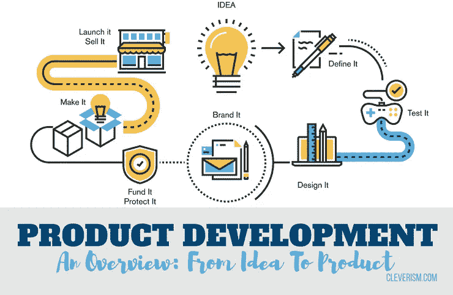
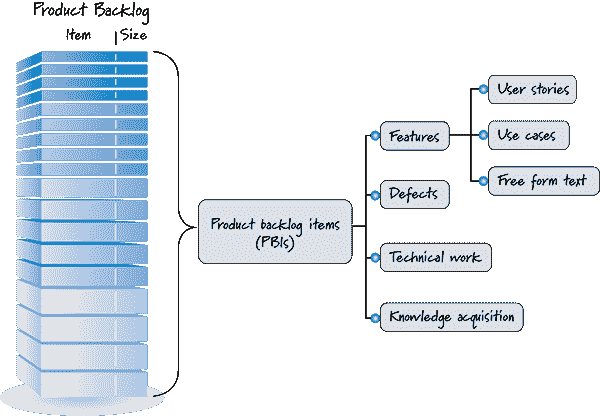
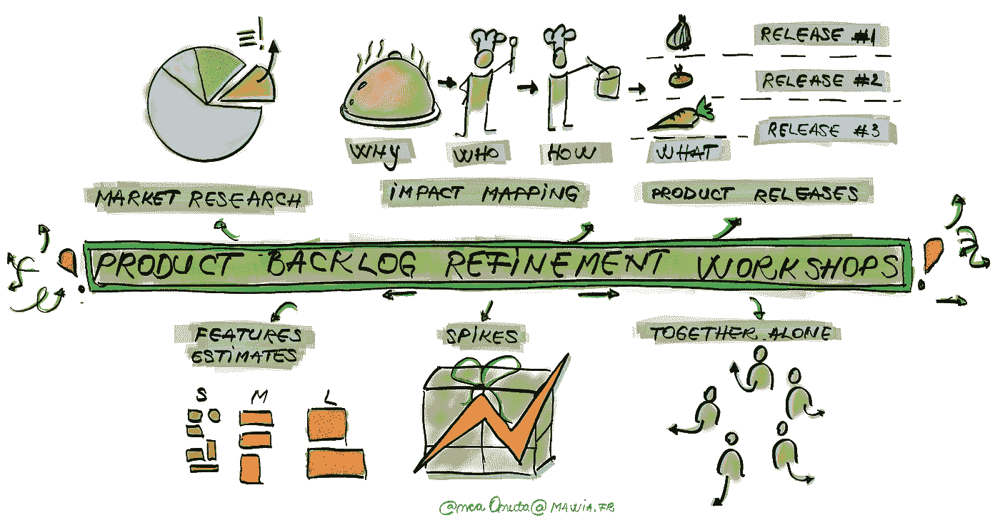

# 健康敏捷的产品开发:产品储备/愿景

> 原文：<https://blog.devgenius.io/healthy-agile-product-development-product-backlog-vision-95663e377f18?source=collection_archive---------15----------------------->

产品是由一群建造者和伪造者聚集在一起的一堆想法，它的生命周期非常简单，但有时很难理解，并且很容易在整个过程中犯错误。

通过 [cleverism](https://www.cleverism.com/product-development-overview-idea-product/) 进行产品开发概述。

这一切都始于愿景，这是产品起源应该听起来像什么，然后随着愿景而来的是细化、迭代和改进。有各种各样的产品开发方法和原则，但是现在我只关注敏捷产品开发。

## 愿景

我选择从这个开始，因为它代表了产品的灵魂，没有愿景，你不可能坚持足够长的时间来运输、销售它，甚至说服人们与你合作，并最终给自己足够的动力继续做你正在做的事情。愿景是非常重要的，它是每个产品的抽象，应该永远是每个产品开发周期的起点和最重要的点。

愿景必须清晰，没有模糊的术语，并且是可实现的，愿景越远大越好，但是在远大和可实现之间的平衡是成功的关键。

## 产生想法

成功的第二个最重要的因素是知道如何收集想法，有许多方法可以做到这一点(例如:头脑风暴)。你不能忘记，你的产品必须被目标用户使用，为了做到这一点，你必须和他们一起做。让你的目标用户参与到产品构建阶段是很重要的，因为这可以最小化风险，并防止你偏离你的目标“拥有一个可用的产品”。

## 组织想法

我想一堆乱七八糟的想法，不是你能向你的同事或客户解释的，有时甚至不可能向你自己解释。我认为组织是很重要的，这里有一个敏捷术语“产品积压”，它是一个包含想法和任务的项目的集合，这些想法和任务是为了易于计划。下图显示了产品待办事项应该包含的内容。

产品积压

有一个缩写词综合了好产品积压的相似特征。这是深刻的:

*   适当详述
*   紧急的
*   估计的
*   优先处理

## 优先处理

最重要的是要注意优先级，尽管它很容易理解，但不是每个人都能正确理解。最常见的错误是“一切都被优先考虑”。这是非常不健康的，有时会杀死产品。优先权这一术语在顺序上导致了唯一性，没有任何东西可以在同一时间被执行。如果只有一个执行成员，估计您的积压，多任务和调度是产品执行阶段需要处理的其他事情。问题是，大多数产品开发人员和所有者认为一切都是优先的，因为客户是这么说的，而实际上客户有时不了解什么是优先，必须进一步询问才能获得更多的细节。我确实承认，有时两个功能可以有同等的优先级，但是如果我们考虑影响、实施时间、资源和成本……我们肯定会得出不同的优先级分数。所以我认为它是懒惰的接受它的现状，我想我们应该深入一点。

## 技术优先权

技术优先考虑的是项目相关性，有时先实现一个功能，再实现另一个功能会让我们更有效率。技术洞察力来了，它意味着使积压计划更接近完美的计划。

## 优先化技术

流行的产品积压优先级排序技术帮助产品所有者定义团队接下来应该处理哪些项目。

*   卡诺模型
*   机会评分
*   MoSCoW
*   ICE 评分法
*   故事映射

我会在这篇[文章](https://cuspy.io/blog/5-prioritization-techniques-to-narrow-a-product-backlog/)中为您找到多余的细节。

## 产品积压细化

积压项目，应不时进行细化。在产品积压细化期间，对项目进行审查和修订。但是[产品所有人](https://www.visual-paradigm.com/scrum/what-is-project-owner-role-in-scrum/)可以随时或根据产品所有人的决定更新产品积压。PBR 是一个合作的讨论过程，以确认积压是否为下一次冲刺做好了准备。

通过 [Anca Onuta](https://medium.com/@anca_51481?source=post_page-----4fcb01006705----------------------) 细化产品积压

产品积压细化的目标是与 [Scrum 团队](https://www.visual-paradigm.com/scrum/what-is-scrum-team/)和利益相关者(当相关时)合作，使产品积压项目处于“就绪状态”。这意味着什么？这基本上意味着开发团队认为一个项目是:

*   足够清楚，这样他们就明白利益相关者在要求什么以及他们为什么要求。
*   足够小，所以项目应该足够小，可以在一个 sprint(通常是几天的工作)内完成，以符合完成的[定义。](https://www.visual-paradigm.com/scrum/definition-of-done-vs-acceptance-criteria/)

## 产品路线图

产品路线图是一个高层次的视觉总结，它描绘了一段时间内您的产品提供的愿景和方向。产品路线图传达了您正在构建的产品背后的原因和内容。路线图是指导性的战略文件，也是执行[产品战略](https://www.productplan.com/guide-to-product-strategy/)的计划。

## 要避免的错误

*   解决令人困惑的积压项目。
*   在最后一分钟准备冲刺积压。
*   忽略技术待定项。
*   假设一些工作可以在不经过产品 backlog 的情况下完成。
*   忽略你所遵循的方法论的指导方针。
*   懒惰。

## 参考

 [## 如何细化产品积压？

### 产品积压优化(PBR)是一种保持积压更新、干净和有序的技术。这是一个基本的…

www.visual-paradigm.com](https://www.visual-paradigm.com/scrum/how-to-define-product-backlog/)  [## 产品路线图的终极指南|定义和资源

### 产品路线图是一个高层次的视觉总结，描绘了您的产品在以下方面的愿景和方向…

www.productplan.com](https://www.productplan.com/what-is-a-product-roadmap/)