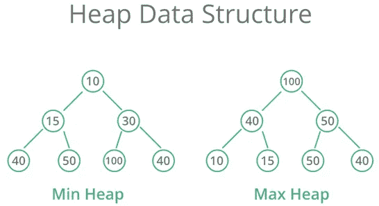
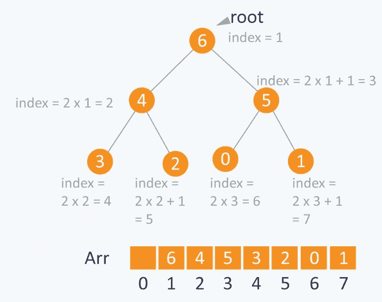

# 很

> 原文：<https://blog.devgenius.io/heaps-fff0f776a8f?source=collection_archive---------19----------------------->

## 遵循一些属性的专门的基于树的数据结构

卢卡斯·布拉塞克在 [Unsplash](https://unsplash.com?utm_source=medium&utm_medium=referral) 上的照片

在计算机科学中，堆是一种专门的基于树的数据结构，它遵循一些导致堆形成的属性。在堆中，所有的节点都是按特定的顺序排列的，可以是升序，也可以是降序，这就形成了两种类型的堆。堆本质上是一种称为优先级队列的抽象数据类型的最充分的实现，事实上，优先级队列通常被称为堆，而不管它们是如何实现的。

例如，如果 X 是 Y 的父节点，那么 X 的值遵循关于 Y 的值的特定顺序，并且在整个树中将遵循相同的顺序。下图也对此进行了解释。

堆中节点的最大子节点数取决于堆的类型。然而，在更常用的堆类型中，一个节点最多有两个子节点，这就是所谓的二进制堆。

在二进制堆中，如果堆是具有 N 个节点的完全二叉树，那么它具有最小的可能高度，即 log N。

现在你已经对什么是堆有了一个基本的概念，让我们来谈谈导致堆形成的三个重要属性。

1.  二叉树:树应该是一个确定的二叉树，也就是说，它应该有 0 个子节点或 1 个子节点或最多 2 个子节点。
2.  完全二叉树:除了树是二叉树之外，它还应该遵循完全二叉树的属性，即除了树的最后一层，所有层都应该完全填充。在最后一层，从左到右填充节点，填充空节点，使树成为二叉树。
3.  堆顺序属性:这意味着树应该遵循它们被填充的节点顺序，因为它们应该在整个树中以节点值的升序或降序排列(下面将详细解释)

我们在第三点中谈到的树，现在我们要讨论一下。堆树基本上有两种类型:

1.  **Max Heap** :在 Max Heap 中，出现在根节点的值必须是树的所有节点中最大的，同样，一个子树中的父节点应该是所有树中最大的，依此类推。基本上，值的比较是在父节点和它的子节点之间完成的，如果所有的父节点都大于它的子节点，那么它最终将是一个最大堆。
2.  **最小堆**:在最小堆中，出现在根节点的键必须小于堆树中出现的所有节点。如果从节点值的排列来比较，Min heap 正好与 Max Heap 相反。在这种情况下，也对父节点和子节点的值进行比较，唯一的区别是父节点的值应该小于子节点的值，类似地，如果所有节点都遵循该属性，将导致形成最小堆。

为了更好的理解，你可以参考下面的图片。

现在让我们讨论一下，如果给我们一个数组，我们想把它转换成一个堆，我们该怎么做:

让我们假设，如果我们在数组 Arr 中的索引 I 处保存一个元素，那么它的父元素将保存在索引 i/2 处(除非它是根，因为根没有父元素)并且可以通过 Arr[i/2]获得，它的左子元素可以通过 Arr[2∫I]获得，它的右子元素可以通过 Arr[2∫I+1]访问。根的索引在数组中是 1。

借助下面给出的图片，可以更好地理解这一点。

现在让我们研究一下如何将我们的树转换成一个堆，这个堆具有我们前面讨论过的所有属性

1.  **Upheapify()** —该函数在堆中添加节点的操作中执行，因为在我们在堆中添加节点后，树不再是堆，然后我们使用 Upheapify 使其再次成为堆。upheapify 函数不言自明，如果您仍然不明白，可以查看参考资料。代码是通用的数据类型，你可以根据自己的需要修改它。

**添加一个节点**的过程代码片段

public void add(T element){
this . data . add(element)；
this . upheapify(this . data . size()-1)；
}

private void upheapify(int ci){
if(ci = = 0){
return；
}

int pi =(ci-1)/2；
如果(！isLarger(pi，ci)) {
this.swap(pi，ci)；
this . upheapify(pi)；
}
}
}

私有 void swap(int pi，int ci){
T ithitem = this . data . get(pi)；
T JT hitem = this . data . get(ci)；

this.data.set(pi，jthitem)；
this.data.set(ci，ithitem)；
}

私有布尔 isLarger(int pi，int ci){
T ithitem = this . data . get(pi)；//parent
T JT hitem = this . data . get(ci)；//child

if(this . ismin){
return ithitem . compare to(jthitem)<0；
} else {
return ithitem . compare to(JT hitem)>0；
}
}

2. **DownHeapify:** 这个函数在我们从树中删除一个节点的过程中使用，类似于 add。当我们从树中删除一个节点时，我们也扰乱了堆的属性，所以为了重新获得正确的堆，我们应用 DownHeapify 函数。下面也给出了它的代码，请仔细阅读它的不言自明的部分，如果你想了解更多，你可以去查阅参考资料。代码是通用的数据类型，你可以根据自己的需要修改它。

**删除一个节点过程的代码片段**

public T remove(){
T RV = this . data . get(0)；
this.swap(0，this . data . size()-1)；
this . data . remove(this . data . size()-1)；
this . downheapify(0)；
返回房车；
}

私有 void downheapify(int pi){
int LCI = 2 * pi+1；
int rci = 2 * pi+2；
int mi = pi；

if(LCI<this . data . size()&&this . is larger(LCI，mi)){
mi = LCI；
}

if(rci<this . data . size()&&this . is larger(rci，mi)){
mi = rci；
}

如果(mi！=pi) {
this.swap(mi，pi)；
this . downheapify(mi)；
}

}

希望你已经理解了堆的概念。你可以尝试更多的问题，如寻找堆的最大元素，堆的最小元素，堆中元素的数量来测试你的知识。

如果你觉得这个博客有任何帮助，请一定要为它鼓掌。您还可以在 Medium 上关注我，并在我的社交媒体手柄上关注我，以获得更多类似这样的信息。

参考资料:

 [## 二进制堆和优先级队列

### 该树是一个完整的二叉树:每一层都包含它的全部子节点，除了最深的一层，它…

pages.cs.wisc.edu](http://pages.cs.wisc.edu/~mcw/cs367/lectures/heaps.html)  [## 堆/优先级队列教程和注释|数据结构|黑客地球

### 堆是一种基于树的数据结构，其中树的所有节点都按照特定的顺序排列。例如，如果…

www.hackerearth.com](https://www.hackerearth.com/practice/data-structures/trees/heapspriority-queues/tutorial/)  [## 堆数据结构— GeeksforGeeks

### 极客的计算机科学门户。它包含写得很好，很好的思想和很好的解释计算机科学和…

www.geeksforgeeks.org](https://www.geeksforgeeks.org/heap-data-structure/)  [## 堆(数据结构)

### 在计算机科学中，堆是一种专门的基于树的数据结构，本质上是一种几乎完整的树…

en.wikipedia.org](https://en.wikipedia.org/wiki/Heap_%28data_structure%29)