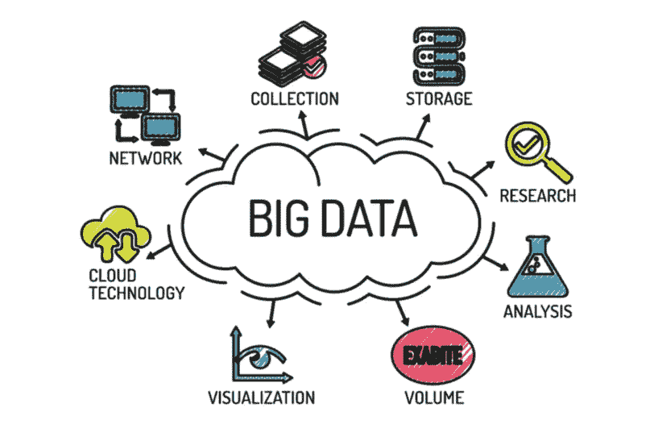
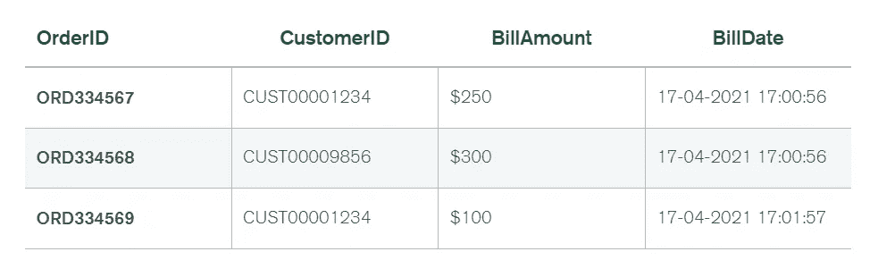
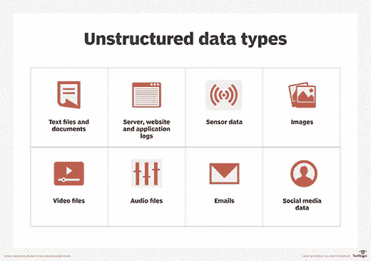
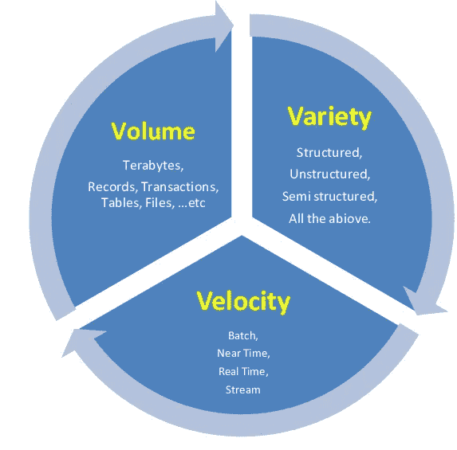
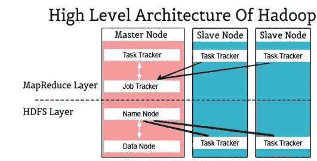
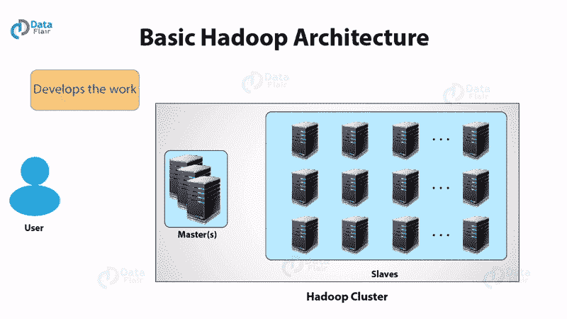
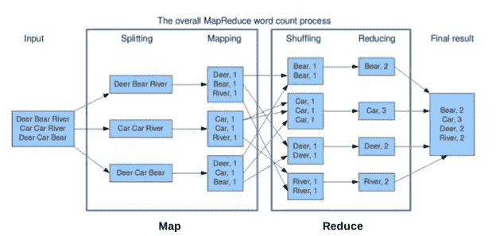

# 听过大数据，来认识一下吧。

> 原文：<https://blog.devgenius.io/heard-big-data-lets-know-it-a3aac6cf5ae7?source=collection_archive---------7----------------------->



我相信在你的一生中，你曾经听说过大数据这个术语(特别是如果你知道或工作在技术相关领域)，但真正的问题是，你知道它吗？

如果你的答案是否定的，你将能够讨论它。是的，我现在知道了，如果是的话，你会学到更多的东西。

那么什么是**大数据**？非常大的数据(简单，对吗？嗯，没那么多)，那么你能想到的最大号是什么？让我猜猜，1000 TB(取最常见猜测的平均值..如果你猜的大很多，你就更接近回答了)。嗯，这个数字通常都不接近大数据，

大数据大小源于**Pb(1，024 TB)或 EB(1，024 Pb)**(告诉..你)

现在我已经引起了你们的注意，那么给出如此大量数据的一些来源是什么呢？让我们看看

1.  **社交媒体——**insta gram、LinkedIn、Google+(不再赘述)和脸书，因为它们在全球拥有**数十亿**的用户，每秒产生**百万**的数据。
2.  **电子商务-** 亚马逊、易贝、Flipkart 和阿里巴巴产生大量交易和用户购买趋势的日志数据。
3.  **气象站-** 卫星和气象站产生大量数据，这些数据被存储起来，以后用于天气预报。
4.  **Telecom-** Jio、沃达丰、Airtel 存储用户数据，看他们的各种动向，为公司规划数据和通话方案。

然后，您必须考虑它们必须生成的数据类型。当然，它不会只是单一的特定格式。**结构化、非结构化、**和**半结构化数据**都是**大数据的类型。**

# 结构数据

结构化数据以表格和列的形式以有组织的固定方式存储。

听说过 **RDBMS** (关系数据库管理系统)是以表和列的格式存储的，通常通过 SQL(结构化查询语言)来处理和检索存储在其中的数据。



RDBMS 表示例图片屈膝礼 [**MongoDB**](https://www.mongodb.com/basics/big-data-explained)

# 半结构化数据

好吧，我假设你们大多数人都看过 JSON 文件。它同时是结构化和非结构化的，被称为半结构化数据格式。

数据是结构化的，但不是严格的，它不是表格和列的形式。这些来源包括 JSON、XML、传感器数据等。

```
{
"customerID": "CUST0001234",
"name" : "Ben Kinsley",
"address": {
    "street": "piccadilly",
    "zip" : "W1J9LL",
    "city" : "London",
    "state" : "England" 
},
"orders": [{
    "orderid":"ORD334567",
    "billamount":"$250",
    "billdate":"17-04-2021 17:00:56"
}, {
    "orderid":"ORD334569",
    "billamount":"$100",
    "billdate":"17-04-2021 17:01:57"
}]
}
```

上面是一个 JSON 文件的例子，它有一个键-值对，即 customerID 是一个值为“CUST0001234”的键。

# 多重结构化/非结构化数据

这些数据是原始的，并且具有不同的格式。其来源包括传感器数据、网络日志、社交媒体数据、音频文件、视频和图像、文档、文本文件、二进制数据等。

这些数据没有特定的结构，这就是为什么称之为非结构化数据。例如文本文件、音频文件和图像。



非结构化数据类型来源，图片来自 [**Techtarget**](https://www.techtarget.com/searchbusinessanalytics/definition/unstructured-data)

# 大数据有一些特征，也称为 3 V

大数据的特征或 3 V 是量、速度和多样性。

1.  **量** —量不大就不算技术上的大数据(对吧？).因此，大数据包含大量数据，例如，一个人每秒产生 **1.7 MB** 的数据，现在想象一下几个小时。
2.  **速度** —拥有大量数据是可以的，但它们也需要以闪电般的速度进行处理，例如，想象一下观看一场足球比赛，你正在观看 10 秒钟的延迟流，并看到其他人庆祝胜利，而你仍在等待最后一个进球。
3.  **多样性** —如上所述，数据有多种形式，如地理空间、3D、视频、文本、音频等。，而传统的方法，比如 RDBMS，是无法处理的。这就是为什么新的现代系统，如 MongoDB(将在本文后面更深入地讨论)被用来处理这种多样性。



大数据的 3 V，图像屈膝礼 [**研究之门**](https://www.researchgate.net/figure/Big-Data-Definition-3-Vs_fig3_264129835)

# **现在来处理大数据**

为此，使用了 Hadoop(Apache 的一个开源框架，用于存储、处理和分析海量数据)。

它用于批处理/离线处理。许多大公司都在使用它，比如脸书、雅虎、谷歌、Twitter、LinkedIn 等等。

它的纵向扩展非常简单，只需在集群中添加节点即可。

其中的模块有

1.  **HDFS:** 基于谷歌 GFS 的 Hadoop 分布式文件系统。它声明文件将被分成块并存储在分布式体系结构的节点中。
2.  **Yarn:** 还有一个资源协商器用于作业调度和管理集群。
3.  **Map Reduce:** 这个框架帮助 Java 程序使用键值对对数据进行并行计算。Map 任务获取输入数据，并将其转换为可以在键值对中计算的数据集。Map 任务的输出由 Reduce 任务消耗，然后 reducer 的 out 给出期望的结果。
4.  **Hadoop 常用:**这些 Java 库用于启动 Hadoop，并被其他 Hadoop 模块使用。

# Hadoop 架构



图片由[training hub提供](https://www.traininghub.io/blogs/bigdata/hadoop_architecture)

**HDFS** (Hadoop 分布式文件系统)— 作为大量数据的存储场所，并提供对数据的简单访问。它将数据分成称为块的小部分，并以分布式方式存储它们。它遵循主从方法。



Hadoop 架构如何工作，图片来自**[**data flair**](https://data-flair.training/blogs/how-hadoop-works-internally/)**

**它具有以下组件，**

****a) Namenode —** 它充当主服务器，执行各种任务，包括管理文件系统存储、执行各种文件操作，包括关闭、重命名和打开文件和目录，以及监控和关联文件的客户端。**

****b) Datanode —** 群集中的每个节点都由一个数据节点组成，这些节点负责管理其系统的存储，它执行各种任务，包括根据客户端的要求在文件系统上执行读写操作，以及 Namenode 分配的任务，包括创建、删除和复制。**

****c)块—** 用户数据存储在 **HDFS** 文件中(一般来说，还记得科学书籍吗？一般来说)。每个文件在分布式文件系统中被分成一个或多个段，并存储在单独的**数据**节点上。每个文件段被视为一个块(块的默认大小为 **128 MB** )，可以根据需要通过在 HDFS 配置中进行适当的更改来修改大小。**

****d)复制管理—** 它制作数据块的多个副本，并将它们存储在不同的节点上。副本的数量由复制因子决定(默认为 3)**

****e)机架感知—** 机架是 Hadoop 集群中节点的物理集合，生产中有许多机架，每个机架包含多个 Datanodes。**

****MapReduce** —用于编写应用程序以处理大量数据的软件框架。它以容错和可靠的方式在商用硬件集群上并行运行这些应用程序。**

****

**Map Reduce 算法，图片来自 [**TrainingHub**](https://www.traininghub.io/blogs/bigdata/hadoop_architecture)**

**该算法由两个任务组成:映射和归约。MapReduce 作业与许多 Map 和 Reduce 任务相关联。**

**每个任务处理数据的特定部分，这个过程将负载分布到整个集群。**

**Map 函数执行诸如**加载、解析、转换、**和**过滤**数据的任务。地图功能的**输出**是减少任务的**输入**。Reduce tasks 从 Map 函数中获取数据，并应用**分组**和**聚合**。**

****地图阶段**有这些任务，**

****a)记录读取器—** It 将面向字节的输入视图转换为面向记录的视图，用于映射器和缩减器任务的处理。它负责处理记录边界，并为任务提供值和键。**

****b)映射—** 映射器函数产生零个或多个键值对。该值是在 reducer 函数中聚合产生最终结果的数据**

****c)组合器—** 它接收来自 Map 类的输入，并将输出键值传递给 Reducer 类。它使用相同的键聚合地图输出记录(就像您将厨房货架上的所有小吃组合在一起一样)。**

****d)分割器—** It 从映射器函数中取出中间键值对，然后将它们分割成碎片。**

**减少阶段有这些任务，**

****a) Shuffle and Sort —** 分区写入的数据将被下载到减速器正在运行的机器上。这个混洗和排序步骤收集所有单个的数据片段，并使其成为一个大的数据集。sort 函数的核心任务是收集所有等价的键。**

****b) Reduce —** 聚合键值对。**

****c)输出格式—** 它从 reducer 阶段接收键值对&使用记录写入器将其写入文件。**

****YARN (** 又一个资源协商器)——它将系统的**资源**分配给 Hadoop **集群**中运行的不同应用，并且还调度需要在不同集群节点上执行的任务。**

**它有一个全局资源管理器和每个应用程序的主应用程序。和两个守护进程，**节点管理器**(监控资源使用情况并将其报告给**资源管理器**。资源包括内存、CPU、磁盘、网络等。)和资源管理器(将资源分配给系统中不同的运行应用程序)。**

**资源管理器由两个重要组件组成，它们是**

****a)调度器—** 根据需求为各种正在运行的应用分配资源。**

****b)应用程序管理器—** 它管理一组已提交的应用程序或任务。它的工作范围从验证应用程序的规格(如果应用程序没有足够的资源，就像没有原材料的工厂一样，则拒绝)到消除具有相同 ID 的应用程序。**

> ****参考文献****
> 
> **[https://www . training hub . io/blogs/big data/Hadoop _ architecture](https://www.traininghub.io/blogs/bigdata/hadoop_architecture)**
> 
> **[https://www.projectpro.io/article/mongodb-and-hadoop/81](https://www.projectpro.io/article/mongodb-and-hadoop/81)**
> 
> **[https://www.javatpoint.com/what-is-hadoop](https://www.javatpoint.com/what-is-hadoop)**

**如果你喜欢这篇文章，跟着我，你也可以做下面的事情。**

**下面我们连线**LinkedIn**:[https://www.linkedin.com/in/tripathiadityaprakash](https://www.linkedin.com/in/tripathiadityaprakash)**

**或者我的**网站**:**

**[https://tripathiaditya.netlify.app/](https://tripathiaditya.netlify.app/)**