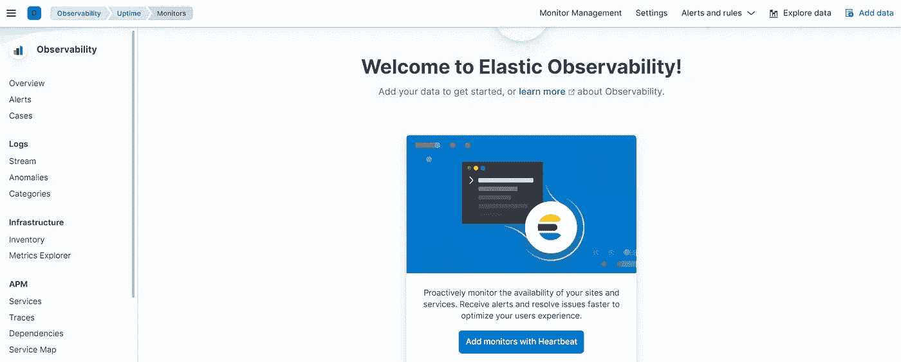
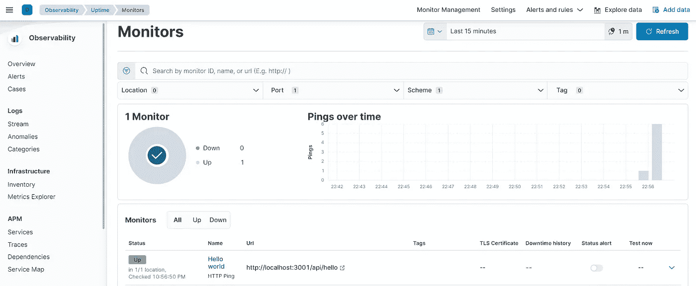
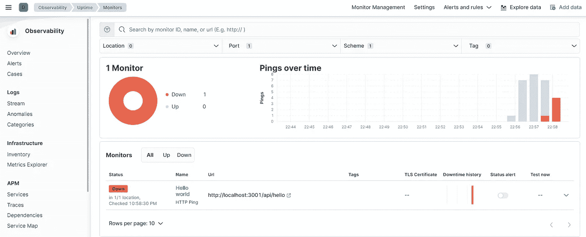

# 心跳与局部弹性搜索和基巴纳

> 原文：<https://blog.devgenius.io/heartbeat-with-local-elasticsearch-and-kibana-69b99f7e23a6?source=collection_archive---------9----------------------->


瑞安·斯通在 [Unsplash](https://unsplash.com/s/photos/heartbeat?utm_source=unsplash&utm_medium=referral&utm_content=creditCopyText) 上的照片

很高兴在这个弹性堆栈系列中再次见到您😊。今天我们来关注一下垮掉的一族。到目前为止，我们已经讨论了 [Metricbeat](/metricbeat-with-local-elasticsearch-and-kibana-c330c902e473) 和 [Filebeat](https://medium.com/@mhdabdel151/ship-logs-to-local-elasticsearch-using-filebeat-36e7fe1bff83) 。如果你还没有，请看看它。

为了提供最佳的用户体验，必须保证某些特性，尤其是最重要的特性之一**可用性。**你可以把它定义为了解你的系统、服务和数据的正常运行时间的过程。持续可用性确保了无论用户何时在您的服务中发起事务，他都不会遇到“*发生错误，稍后再来*”这堵墙。

因此，我们知道这一特征非常重要，衡量这一特征的方法是定期收集核心系统、服务和数据的节拍。这些节拍可以存储到高度可扩展和耐用的存储中，如 Elasticsearch，并在以后使用 Kibana 进行分析。

**Heartbeat** 是一个轻量级代理，可安装在服务器和容器中，能够定期收集信息并将其发送到任何已配置的输出。所有的数据都以 Kibana 可读的格式收集，并且可以自动创建可视化的图表。因此，这是一个端到端的解决方案，不仅可以收集数据，还可以处理、存储和分析数据。这在其他情况下也很有帮助，比如安全用例。Kibana 中有一个名为 **Uptime** 的内置应用程序，它允许您在一个地方查看与您的系统或服务可用性相关的所有事情。第一次打开时，它看起来像这样:



配置心跳时，选择与您希望检查的主机名对应的**监视器**。根据您选择的时间表，每个监视器都会运行。目前，Heartbeat 支持 *HTTP* 、 *ICMP* ( *v4 和 v6* ) *Echo 请求*和 *TCP* 。

## 心跳安装

现在让我们看看如何安装和配置 Heartbeat 来探测来自系统和服务的可用性信息，并将它们发送到 Elasticsearch。

在我们开始之前，确保 Elasticsearch 和 Kibana 正在您的机器上运行。如果不是这样，请阅读[这篇关于如何使用 Docker Compose 启动本地 Elasticsearch 和 Kibana 的文章](https://medium.com/@mhdabdel151/elasticsearch-and-kibana-installation-using-docker-compose-886c4823495e)。你还需要根据你的发行版从[官网](https://www.elastic.co/downloads/beats/heartbeat)下载 Heartbeat。

## 微服务

我们还将使用一个非常简单的微服务，它将返回" *Hello world👋*“每次向端点发送请求时(*http://localhhost:3001/API/hello*)。我们将部署 Heartbeat 来收集端点的正常运行时间信息，并将其传输到 Elasticsearch。下面是我们应用程序的代码:

```
const express = require('express')
const app = express()
const port = 3001app.get('/api/hello', (request, response) => {
  response.send('Hello World 👋')
})app.listen(port, () => {
  console.log(`App listening on port ${port}`)
})
```

## 心跳配置

下载并提取文件夹的内容后，我们需要配置我们的监视器指向我们的微服务。在`heartbeat.yml`文件中，在【T10 监视器】部分下，指定其类型( *http* )、将用于探测目标系统可用性的 *URL* 、用于标识监视器的*名称*和 *id* 以及*时间表*(此处为*，从心跳开始*起每 5 秒运行一次监视器)。由于我们在禁用安全性的情况下使用 Elasticsearch，因此在**输出部分**中不需要额外的信息，只需检查是否提到了用于连接 Elasticsearch 的正确 URL。

```
heartbeat.monitors:- type: http # ID used to uniquely identify this monitor
  id: hello-microservice # Display name for this service
  name: Hello world # List or urls to query
  urls: ["http://localhost:3001/api/hello"] # Configure task schedule
  schedule: '@every 5s'
```

因此，我们可以使用这个配置来启动 Heartbeat，并从我们的微服务中收集正常运行时间信息。在解压缩的文件夹中，有一个启动 Heartbeat 的可执行文件，我们只需使用以下命令启动它:

```
./heartbeat -e
```

注意:`-e`是可选的，将输出发送到标准错误，而不是配置的日志输出。

一旦执行完毕，返回到 Kibana 并检查 uptime 部分下的可用性信息。例如，您可以查看有问题的微服务的状态，是启动还是关闭。



我们可以通过强制应用程序崩溃来测试打印信息的可靠性，并查看 Kibana 是否会改变其结果。在这里，我们只是停止我们的应用程序，回到基巴纳。



此外，要设置**资产**来解析、索引和可视化数据，您可以运行以下命令:

```
./heartbeat setup -e
```

一切似乎都正常😎！在这里你还可以做很多事情。请查看关于该主题的官方文件以了解更多细节。

今天就到这里，感谢您的阅读，如果您对本文有任何问题或意见，请在下面留下您的评论。

我们下次再见，看更多的帖子🚀。

阿卜杜尔-巴吉