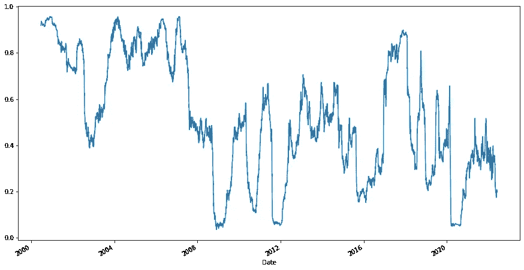
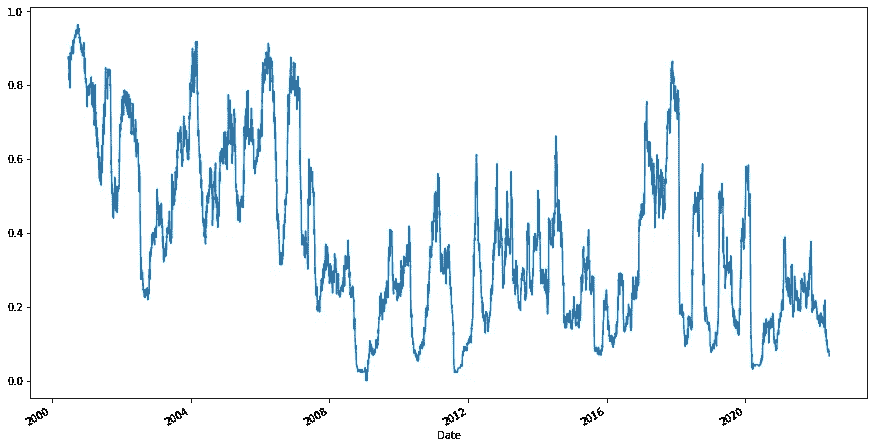
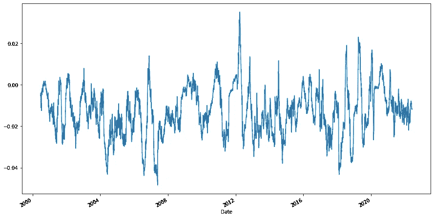
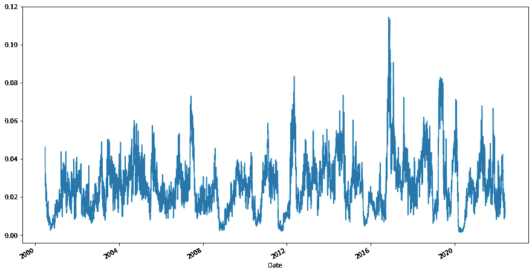
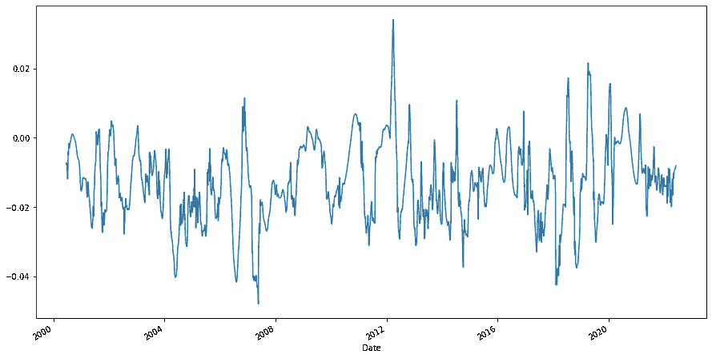
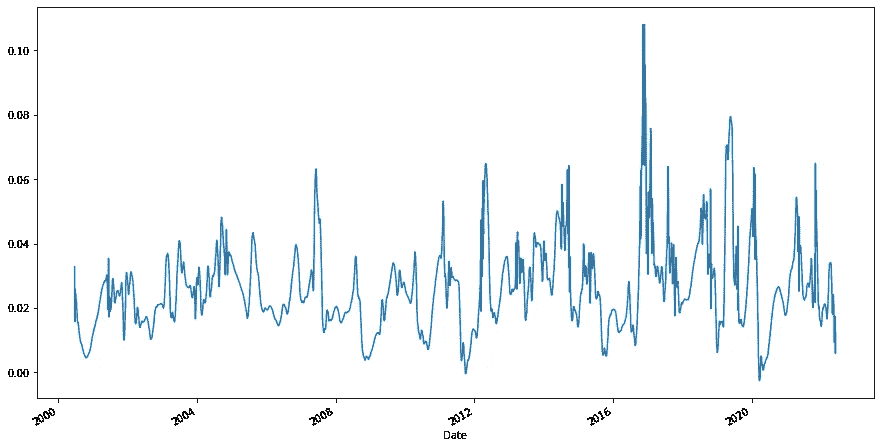
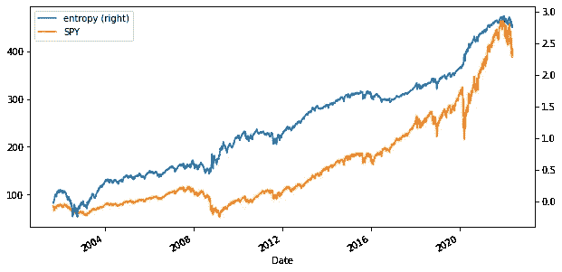

# 使用结构熵对冲只做多投资组合。

> 原文：<https://blog.devgenius.io/hedging-long-only-portfolios-using-structural-entropy-e53d71330370?source=collection_archive---------1----------------------->

# **简介**

本文旨在使用扩展版本的结构熵指标，评估/证明在 Russell 2000(我使用 IWM 交易所交易基金，因为我没有滚动的未来价格)中使用空头头寸对冲仅做多的美国股票投资组合的有效性。

我第一次读到结构熵是在这篇[文章](https://www.nature.com/articles/s41598-019-47210-8)中。作者将金融市场视为一个复杂的相互关联的网络(以资产为节点、相关性为边的图形)，并定义/描述了一种称为“结构熵”的新度量。这使他们能够识别金融市场中的传染时刻(当风险在资产间传播时)，并显示他们采用这一措施的不同结果。

这个想法是，当市场在压力事件中下跌时(比如 2008 年或 2020 年的 COVID)，资产之间的相关性会增加。

一篇解释结构熵并简化 Python 实现的中型文章是[这里](https://towardsdatascience.com/entropy-application-in-the-stock-market-b211914ed1f3)。

我们能否识别这些下跌趋势或风险时期，以有效对冲仅做多的投资组合？我们能预测市场的传染吗？

为了进行评估，本文使用 S&P500 的买入并持有(或多头头寸)(使用 SPY ETF)，计算 S&P500 成份股的结构熵，并使用该结构熵度量来决定何时用 Russell 2000 (IWM ETF)的空头头寸对冲 SPY ETF 的多头头寸。

# 获取历史价格

```
import pandas as pd
import numpy as np
import yfinance as yf
import matplotlib.pyplot as plt
from tqdm import tqdm
```

在这个实验中有幸存者偏差，因为我们使用最新的 SP500 组件。理想情况下，我们应该使用 SP500 不断变化的成分，但金融数据何时可以免费获得？

为了避免下载所有 S&P500 成份股的数据，我们使用一个本地 zip 文件(之前创建的),其中包含所有这些股票的历史价格。

```
data = pd.read_csv("spy_component_prices.zip", index_col=0,
                    parse_dates=True, infer_datetime_format=True, 
                    header=0).sort_index()
```

由于我们在退货空间工作，价格被转换成对数退货。

```
returns = data.pct_change().fillna(0).apply(np.log1p)
```

然后我们下载 22 年的间谍和 IWM 价格，并将它们转换成回报(不是对数回报，因为我们用它来进行回溯测试)。

```
spy = yf.download(“SPY”, start=”2000–01–01", 
                   end=”2022–06–10")[‘Adj Close’]
spy.name = “SPY”
spy_returns = spy.pct_change().dropna()iwm = yf.download("IWM", start="2000-01-01", 
                    end="2022-05-20")['Adj Close']
iwm_returns = iwm.pct_change().dropna()
```

# 结构熵

在这里，我们每天使用历史数据在滚动窗口的基础上计算结构熵。它使用 0.6 的相关性阈值来确定两只股票之间是否存在优势，并使用该阈值来计算结构熵。使用随机矩阵理论来避免这种阈值的更好的技术目前不在范围之内。

结构熵指标被归一化为范围(0，1)。

```
def cov2corr( A ):
 d = np.sqrt(A.diagonal())
 A = ((A.T/d).T)/d
 return Afrom scipy.sparse.csgraph import connected_components
import scipy as sp
from sklearn.covariance import EmpiricalCovariance as ECdef structural_entropy(df, lags):
 entropy_df = pd.DataFrame(index=df.index)
     for i in tqdm(range(max(lags), df.shape[0])):
         for lag in lags:
             X = df.iloc[i-lag:i+1] # i+1 because it is exclusive
             C = cov2corr(EC().fit(X.loc[:, 
                   (X != 0).any(axis=0)].values).covariance_)
             C = (np.abs(C)>0.6).astype(int)
             _, labels = connected_components(C)
             counts = np.unique(labels, return_counts=True)[1]
             probs = counts / np.sum(counts)
             if len(counts) > 1:
                 e = sp.stats.entropy(probs) / np.log(len(counts))
             else:
                 e = 0.0

 entropy_df.loc[df.index[i], str(lag)] = e
 return entropy_df
```

由于相关性是对定义的窗口长度的依赖性的静态测量，我们试图计算范围从 120 天到 60 天的不同窗口大小的结构熵。

下面一行被注释掉，因为它需要一些时间来计算所有窗口大小在 22 年中每天的滚动结构熵度量。相反，我们使用一个预先计算的文件，其中包含每天和窗口大小的度量。

```
#entropy_df = structural_entropy(data, lags=[120, 110, 105, 100, 95,
                                        90, 85, 80, 75, 70, 65, 60])
entropy_df = pd.read_csv('entropy.zip', header=0, 
                         index_col=0, parse_dates=True).dropna()
```

## 下面我们绘制了窗口长度为 120 和窗口长度为 60 的归一化结构熵，用于比较。



熵 120 天窗口



熵 60 天窗口

# 熵截面

观察到窗口长度 120 上的熵比窗口 60 上的熵移动得慢。因此，我们相信我们可以尝试捕捉熵的趋势，从而获得不同窗口长度的差异，并计算该横截面差异的平均值及其标准偏差。请记住，这是一个横截面差异，即在给定的一天，每个窗口大小的熵的差异。



截面熵一阶差均值



截面熵一阶差分标准差

# 小波去噪信号

上面的图显示信号噪声很大，我们希望对这些信号进行降噪处理。在各种平滑技术中，本文选择了小波技术对这些信号进行去噪处理。



去噪横截面平均值



去噪横截面标准偏差

# 交易策略

我们将上述去噪信号转换成 z 分数，它们是我们第二天的交易信号。去噪后的均值用于识别进场信号或何时开始对冲，去噪后的标准差是出场信号(何时停止对冲)。

# 朗·S&P500(间谍)——与拉塞尔·赫奇(IWM)

在下一节中，我们复制一个长期只买并持有的间谍位置。然后，我们使用上述信号来确定我们可以用短 IWM 对冲的时期，并绘制长间谍头寸和基于熵的间谍与 IWM 头寸对冲的损益曲线。



多头 SPY 和对冲 SPY 损益的比较

# 结论

这种方法似乎有一些优点。进一步的实验可以尝试:

1.  选择不同的投资组合，而不是间谍。
2.  选择不同的对冲工具，而不是罗素 2000。
3.  按行业将投资组合分解成子投资组合，并尝试按行业 ETF 对冲每个子投资组合。
4.  使用随机矩阵理论计算结构熵，而不是相关临界值(例如 0.6)。
5.  探索其他去噪技术。

# 源代码和数据

github:[https://github.com/satyapravin/StructuralEntropy](https://github.com/satyapravin/StructuralEntropy)