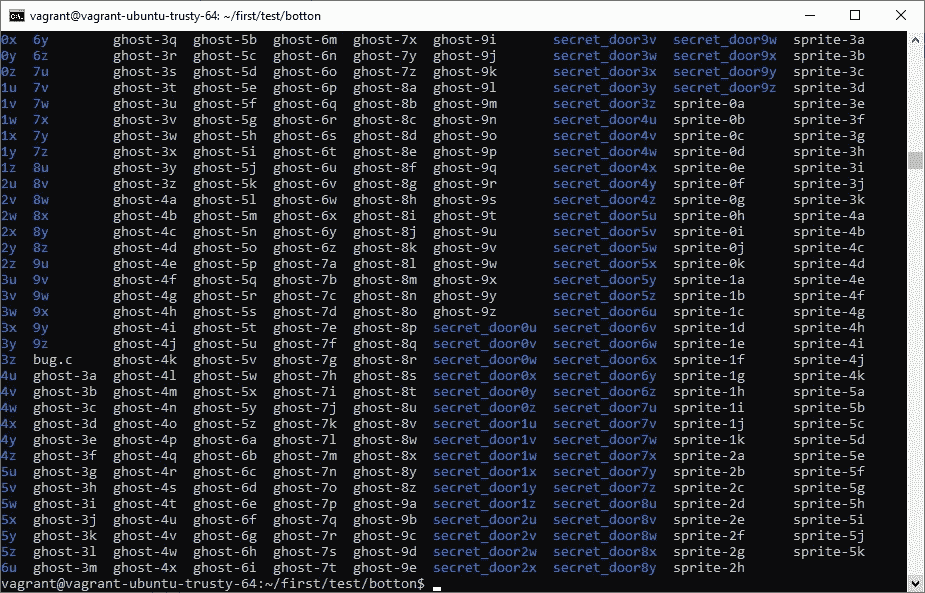

# 你好世界！…里面有什么？

> 原文：<https://blog.devgenius.io/hello-orld-whats-in-there-31856826ffd1?source=collection_archive---------27----------------------->

[KOBU 机构](https://unsplash.com/@kobuagency?utm_source=medium&utm_medium=referral)在 [Unsplash](https://unsplash.com?utm_source=medium&utm_medium=referral) 上拍摄的照片

这不仅仅是一个“是”或“不是”的问题。决定开始这次冒险要考虑更多的变量，但最终，要么是“1”，要么是“0”。

不管你是否不知道 shell 或脚本是什么，我有一个非常有用的提示给你，你将最终看到它的大图。我们将了解下面一行是什么意思:

**ls *。c**

在我们的计算机中，我们有一个丰富多彩的友好的环境来导航和执行我们的任务。我们可以把光标移动到任何我们想要的地方，打开文件和文件夹，点击几乎所有的东西。但是，如果我们把一切都拿走呢？

没有更多的窗口，没有更多的按钮，没有更多的交互式对话框弹出标志告诉我们去哪里。只是电脑和你将要用同一种语言交谈。嗯…差不多了。

我来给你介绍一下贝壳。它是理解你想告诉计算机什么的人。它能以特定的方式向你展示所有的文件和文件夹。它能听懂各种语言，其中有一种是我们喜欢的。

起初，我们可能会发现自己迷路了。但是就像在外面的世界一样，每当我们想要在 ***家*** 感受时，我们通常所做的就是相互了解。让我们告诉电脑我们想看这里有什么，它会 ***列出*** 我们能看到的一切。我们只需输入 ***ls*** 就可以看到:

似乎有很多东西要清理，所有的东西看起来都很破旧。我们可以用手指轻轻一挥就把这一切都扔掉。只需输入

*我们正在选择目前房间里的所有东西。这就是“*”的力量，我们最好小心对待它。让我们找一种小昆虫，我们知道它的形状是“bug(中间的东西)”。c”并全部列出。*

***类型 *ls *。c****

**

*通配符*选择所有内容，我们附加在它右边的内容表示“所有以…结尾的内容”。所以 ****。c****

*现在我们可以松口气了，因为我们已经迈出了第一步。*