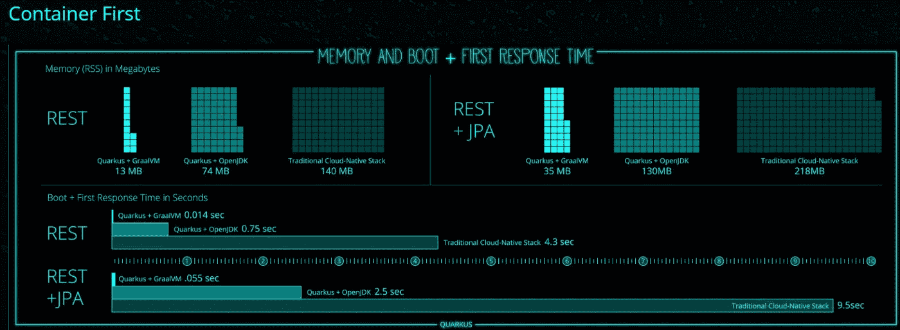
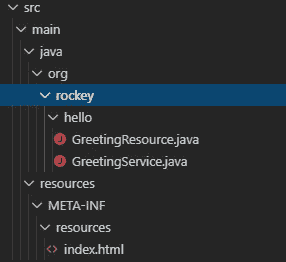

# 超高速亚原子 java (Quarkus)

> 原文：<https://blog.devgenius.io/hello-world-on-quarkus-graalvm-gradle-5209357b423a?source=collection_archive---------0----------------------->

## 作为我寻求将我的想法作为一个应用程序融入云的一部分，我偶然发现了这个叫做 QUARKUS 的美丽产品


作为我寻求将我的想法作为一个应用程序融入云的一部分，我偶然发现了这个叫做 QUARKUS 的美丽产品。在浏览了他们网站上的许多页材料后，我说服自己在 Quarkus(超音速亚原子 java)上构建我的应用程序后端服务。不再拖延。

注:这里使用的部分图片引用自 [https://quarkus.io](https://quarkus.io/) 。

> 准备…设置…开始

假设您的开发机器安装了 Gradle(在撰写本文时，我使用的是 Gradle 5.3.1

```
Create a folder 'helloworld'
```

在文件夹下创建以下三个与 Gradle 相关的文件

```
Build.gradle
```

```
gradle. properties
```

```
settings.gradle
```

并在 gradle 命令下运行以创建 Gradle 包装器

```
gradle wrapper --gradle-version 5.6.2
```



现在我们有了项目的基本设置，让我们编写一个 hello world 程序，它将你的名字作为查询参数，并通过 **HTTP GET** 响应调用

> 首先如下设置一个文件夹结构，创建 GreetingService.java 和 GreetingResource.java 文件。



将下面的代码添加到各自的 java 文件中，这些代码服务于我们马上要发出的 HTTP 请求。

现在，如果您在 [http://localhost:8080](http://localhost:8080/hello/greeting/rakesh) 上发出以下命令以开发模式启动 Quarkus

```
gradlew quarkusDev
```

从 chrome 浏览器进入下面，查看我们的 java 代码提供的响应。

[http://localhost:8080/hello/greeting/rakesh](http://localhost:8080/hello/greeting/rakesh)

或者

[http://localhost:8080/hello/](http://localhost:8080/hello/greeting/rakesh)

Quarkus 的优势之一是它的实时重新加载功能。每次您在代码中进行更改，我们的开发服务器都会立即重新加载这些更改。quarkus 网站有许多优势，我们将在以后的另一个教程中揭示。

