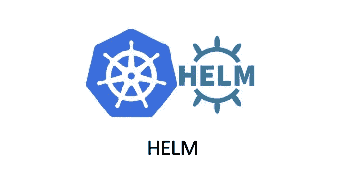

# HELM 模板控制流程

> 原文：<https://blog.devgenius.io/helm-template-control-flow-5501d3eace7d?source=collection_archive---------0----------------------->

## 高级头盔使用



有时，您需要添加一些比插入字符串更复杂的模板逻辑。这需要使用 HELM 模板语言中提供的控制结构。

控制流为我们提供了控制模板生成过程的能力。HELM 的模板语言提供了以下过程控制:

*   `if/else`条件性阻滞
*   `with`规定范围
*   `range`环路阻塞

其中，它提供了一些声明和使用命名模板节的操作:

*   `define`在模板中声明一个新的命名模板
*   `template`导入命名模板
*   `block`声明一个特殊的可填充模板区域

# if/else 条件

`if/else`块是一种用于在模板中有条件地包含文本块的方法。条件块的基本结构如下:

```
{{ if PIPELINE }}
  # Do something
{{ else if OTHER PIPELINE }}
  # Do something else
{{ else }}
  # Default case
{{ end }}
```

当然，如果您想使用条件块，您必须判断条件是否为真。如果值如下，则管道的结果为假:

*   布尔型假
*   数字 0
*   空字符串
*   a `nil` (null 或`null`)
*   空集合(`map`、`slice`、`tuple`、`dict`、`array`)

除上述情况外，其他条件均属实。

例如，我们想添加一个简单的条件判断，如果 python 设置为 django，在数据中添加一条`web: true`语句:

```
apiVersion: v1
kind: ConfigMap
metadata:
  name: {{ .Release.Name }}-configmap
data:
  myvalue: {{ .Values.hello | default  "Hello World" | quote }}
  k8s: {{ .Values.course.k8s | upper | quote }}
  python: {{ .Values.course.python | repeat 3 | quote }}
  {{ if eq .Values.course.python "django" }}web: true{{ end }}
```

在上述模板文件中，增加了条件语句判断`{{ if eq .Values.course.python "django" }}web: true{{ end }}`，其中运算符`eq`是判断其是否相等的运算。

此外，HELM 模板还实现了`ne`、`lt`、`gt`、`and`、`or`等操作符，可以直接使用。当渲染时，模板文件最终会有一个如下所示的条目:

```
$ helm install --dry-run --debug .
[debug] Created tunnel using local port: '40143'

......

---
# Source: mychart/templates/configmap.yaml
apiVersion: v1
kind: ConfigMap
metadata:
  name: fallacious-prawn-configmap
data:
  myvalue: "Hello World"
  k8s: "DEVOPS"
  python: "djangodjangodjangodjangodjango"
  web: true
```

您可以看到上面的模板渲染后出现的条目`web: true`。如果我们在安装过程中覆盖 python 的值呢，例如，我们将其更改为 quant:

```
$ helm install --dry-run --debug --set course.python=quant .
[debug] Created tunnel using local port: '42802'

......

---
# Source: mychart/templates/configmap.yaml
apiVersion: v1
kind: ConfigMap
metadata:
  name: dull-mite-configmap
data:
  myvalue: "Hello World"
  k8s: "DEVOPS"
  python: "quantquantquant"
```

现在我们通过参数将值设置为 quant，所以这里的条件判断为 **false** ，最终通过 debug 模式渲染的值`web: true`没有出现，证明条件判断是正确的。

# 空间控制

上面的条件判断语句是一整行，我们可以把它格式化成可读性更好的形式，比如:

```
{{ if eq .Values.course.python "django" }}
web: **true**
{{ end }}
```

这看起来比以前清楚多了，但是如果我们通过模板引擎渲染，会得到如下结果:

```
$ helm install --dry-run --debug .
[debug] Created tunnel using local port: '44537'

......

---
# Source: mychart/templates/configmap.yaml
apiVersion: v1
kind: ConfigMap
metadata:
  name: bald-narwhal-configmap
data:
  myvalue: "Hello World"
  k8s: "DEVOPS"
  python: "djangodjangodjango"

  web: true
```

我们可以看到渲染中会有多余的空行，这是因为模板引擎运行的时候，在它渲染了一些值之后，前面的指令被删除了，但是它之前占据的位置完全原样保留，所以有多余的空行。

YAML 文件中的空格非常严格，所以空格的管理非常重要，如果你不小心，你的`YAML`文件格式就会出错。

您可以在模板 ID `{{-`之后和`-}}`之前添加一个破折号和一个空格，以表示应该删除空白，需要注意的是**换行符也是一个空格！**

让我们尝试将模板更新为:

```
apiVersion: v1
kind: ConfigMap
metadata:
  name: {{ .Release.Name }}-configmap
data:
  myvalue: {{ .Values.hello | default  "Hello World" | quote }}
  k8s: {{ .Values.course.k8s | upper | quote }}
  python: {{ .Values.course.python | repeat 3 | quote }}
  {{- if eq .Values.course.python "django" }}
  web: **true**
  {{- end }}
```

现在我们来看看上面的模板渲染后是什么样子的:

```
$ helm install --dry-run --debug .
[debug] Created tunnel using local port: '34702'

......

---
# Source: mychart/templates/configmap.yaml
apiVersion: v1
kind: ConfigMap
metadata:
  name: mangy-olm-configmap
data:
  myvalue: "Hello World"
  k8s: "DEVOPS"
  python: "djangodjangodjango"
  web: true
```

# 一起使用

接下来我们来看看`with`关键词。`with`用于控制变量范围。还记得我们之前的例子`{{ .Release.xxx }}`或者`{{ .Values.xxx }}`吗？其中`.`是对当前作用域的引用，`.Values`告诉模板在当前作用域中查找对象的值。`with`语句可以控制变量的范围，其语法类似于简单的`if`语句:

```
{{ with PIPELINE }}
  #  restricted scope
{{ end }}
```

一个真实的例子:

```
apiVersion: v1
kind: ConfigMap
metadata:
  name: {{ .Release.Name }}-configmap
data:
  myvalue: {{ .Values.hello | default  "Hello World" | quote }}
  **{{- with .Values.course }}**
  k8s: {{ .k8s | upper | quote }}
  python: {{ .python | repeat 3 | quote }}
  {{- if eq .python "django" }}
  web: **true**
  {{- end }}
  {{- end }}
```

这里我们添加了一个块`{{- with .Values.course }}xxx{{- end }}`，这样就可以直接引用当前块中的`.python`和`.k8s`而不需要对其进行限制。

但是，应该注意的是，在声明的`with`范围内，此时不能从父范围访问其他对象。比如下面这个模板在渲染的时候会报错，因为很明显`.Release`根本不在当前的`.`范围内。

```
{{- with .Values.course }}
k8s: {{ .k8s | upper | quote }}
python: {{ .python | repeat 3 | quote }}
release: {{ .Release.Name }}
{{- end }}
```

# 距离环

在 HELM 模板语言中，`range`关键字用于执行循环操作。

例如，让我们定义下面的`values.yaml`文件:

```
course:
  k8s: devops
  python: django
courselist:
- k8s
- python
- search
- golang
```

现在我们有了一个课程列表，修改 ConfigMap 模板文件以循环打印出列表:

```
apiVersion: v1
kind: ConfigMap
metadata:
  name: {{ .Release.Name }}-configmap
data:
  myvalue: {{ .Values.hello | default  "Hello World" | quote }}
  {{- with .Values.course }}
  k8s: {{ .k8s | upper | quote }}
  python: {{ .python | repeat 3 | quote }}
  {{- if eq .python "django" }}
  web: **true**
  {{- end }}
  {{- end }}
  courselist:
  {{- range .Values.courselist }}
  - {{ . | title | quote }}
  {{- end }}
```

你可以看到我们在底部使用了一个`range`函数，它将遍历`{{ .Values.courselist }}`列表。

结果将会是这样的:

```
$ helm install --dry-run --debug .
[debug] Created tunnel using local port: '34626'

......

---
# Source: mychart/templates/configmap.yaml
apiVersion: v1
kind: ConfigMap
metadata:
  name: dining-terrier-configmap
data:
  myvalue: "Hello World"
  k8s: "DEVOPS"
  python: "djangodjangodjango"
  web: true
  courselist:
  - "K8s"
  - "Python"
  - "Search"
  - "Golang"
```

# 可变的

我们已经学会了如何使用功能、管理和控制流。我们知道编程语言中还有一个非常重要的概念:**变量**。

在舵模板中，使用变量的场合不多，但在适当的时候会用到:

```
{{- with .Values.course }}
k8s: {{ .k8s | upper | quote }}
python: {{ .python | repeat 3 | quote }}
release: {{ .Release.Name }}
{{- end }}
```

上面的定义会出错，因为`.Release.Name`不在语句块的`with`范围内，我们可以将对象赋给一个变量来解决这个问题:

```
apiVersion: v1
kind: ConfigMap
metadata:
  name: {{ .Release.Name }}-configmap
data:
  {{- $releaseName := .Release.Name -}}
  {{- with .Values.course }}
  k8s: {{ .k8s | upper | quote }}
  python: {{ .python | repeat 3 | quote }}
  release: {{ $releaseName }}
  {{- end }}
```

这里我们添加一个语句`{{- $releaseName := .Release.Name -}}`，这个`$releaseName`是后面对象的引用变量。然后我们可以查看输出:

```
$ helm install --dry-run --debug .
[debug] Created tunnel using local port: '45474'

......

---
# Source: mychart/templates/configmap.yaml
apiVersion: v1
kind: ConfigMap
metadata:
  name: nosy-seagull-configmap
data:
  k8s: "DEVOPS"
  python: "djangodjangodjango"
  release: nosy-seagull
```

另外，变量`range`在循环中也很有用。我们可以在循环中使用变量来同时捕获索引的值:

```
courselist:
{{- range $index, $course := .Values.courselist }}
- {{ $index }}: {{ $course | title | quote }}
{{- end }}
```