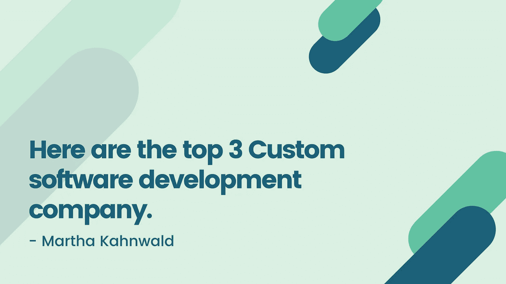

# 以下是排名前三的定制软件开发公司。

> 原文：<https://blog.devgenius.io/here-are-the-top-3-custom-software-development-company-ddca0d9808ea?source=collection_archive---------39----------------------->

显然，提及习惯项目增长业务的数量也在攀升，这也是为什么。从初创企业到成功企业，每一家公司都希望了解电子时代的信息，并从中受益。因此，查询是找到满足您所有需求的企业的方法？

我指定了最佳/最佳定制计划增长业务。这种地位是松散地基于关键的标准，例如公司的规模，它自己最好的客户，他们的经验，专业知识和地位。这就是为什么很快你就可以在清单中导航并选择正确的职业。

在我们开始之前，标题 Hackernoon，Extract，Clutch，甚至 Upcity state 有这样的东西吗？所有这些都将是驻留在最新发明、即将到来的成功和趋势中的顶级技术平台。一个个性化的程序开发提供商应该很难在这些平台上运作。因此，不言而喻，这份名单包括了技术行业最好的公司。

如果你正在读下面这篇文章，你可能已经意识到了一次机会对于一个真正熟练的人来说是至关重要的。专业应用销售将是最好的营销技术，简化操作方法，促进你的收入，并提高你对未来的新认识。

无论你是在计划中遇到问题，还是需要提高信息安全，或者寻找一个忠诚的团队来从头开始建立商品——我的列表提供了最好的定制计划增长业务，能够解决任何一个人自己的问题。

对于许多企业家来说，这个企业的准确位置只是一个关键的组成部分，而是每个企业都乐于与外包团队一起把工作做好。这就是为什么，在下面你会发现位于美国、英国和加拿大的最优/最优定制计算机软件改进组织。

然而，对于许多希望保持一段时间，并从与经验丰富的专业人士打交道中受益的人(也包括那些不容易被时间和种族差距吓到的人)，我已经将挪威、芬兰、白俄罗斯、印度、乌克兰、阿联酋、哥伦比亚、沙特阿拉伯、波兰、西班牙、德国的最佳风险投资习惯计划增长提供商包括在内。

即使是现在，外包是否仍然是每个企业家的选择。有些人声称这是值得的，但有些人通常甚至不认为这是有效的。

另一个衡量供应商能力的标准是它自己最好的客户。正因为如此，我选择了为全球顶级企业工作的定制项目增长型企业，包括奥迪、捷豹、雀巢、common、易趣、沃尔玛、谷歌、Discovery、麦当劳、阿迪达斯——这份名单将继续下去。

此外，最佳/最佳定制程序开发公司通常以其在该领域的经验为特征。在我自己的列表中，你会将服务与过去 20 年的普通联系放在一起，换句话说，确实有一些公司在当前市场上获得了自己的地位，他们改善了自己的时尚，也了解如何满足消费者的需求。这意味着你肯定会找到知识渊博的专家来为这个行业考虑先进的电子替代品。

在正确使用清单之前，要谈的第一点可能是组织的规模。这是绝对没有不确定性的。企业的专业知识可能不会以其员工的多样性为特征。但它可以被描述为组织的一个关键要素，就好像你的工作是大是小，都需要不同数量的程序员。这就是为什么你必须显示出一些企业有能力满足你的愿望，并扩大其中一个劳动力可能会毫不费力地工作。

说得够多了，是时候让你深入了解这个网站本身，并找到一个适合你完美需求的业务了。

申请人入围了 20 20 年高度定制的计算机软件增长组织，其评论如下:

*   Codevision 技术公司
*   西塔科技公司
*   商业技术

# Codevision 技术公司

Codevision Technologies 实际上是一家获得多项大奖的定制程序开发企业，主要专注于众多服务和解决方案。目前在相当多的评论中，这个供应商是最好的选择，此外，它还获得了绝对最可靠的定制计算机软件开发公司的地位。此外，它还积累了大量的案例研究，帮助主要客户进行自动补救、支出选择、I pad 程序、收益统计优化等。

关于 Codevision Technologies 在市场上提供的特定运输和交付，供应商将主要致力于区块链和货币工程、云计算、B2B 和 B2C 互联网门户网站、文档、互联网收费和成本答案。在同一时期，由于其产品和服务范围广泛，它借用了最好的定制程序创建公司的名称。它最重要的因素之一，你可以找到 UI 和 UX，DevOps 和蜂窝程序的进步。在上面提到的每一个产品上，专业团队卓越的决心和先进技术的使用也创造了差距。最后，最理想/最佳定制程序开发公司有足够的资金来提供全周期的技术诀窍，这意味着新成立的区块链实验室和统一 4 业务仅在一个移动平台下。结合起来，这些变量有助于说明哪些 Codevision 技术可以成为您的公司提供市场上最佳的解决方案和服务。

在任何情况下，这个高质量的定制程序开发公司可以自豪地向其客户承诺最高质量的几乎每一个仪式，也回答预期。具体来说，Codevision Technologies 能够将其近三分之二的客户展示为忠实客户，并满足几乎所有这些客户对您的应用程序援助的询问程度。在这种情况下，定制程序创建提供商不害怕应对应用技术、智能咨询、同事补救以及物联网和人工智能进步方面的所有复杂职责。总的来说，这些方面大大有助于与客户(如 Google、Eurostar、Cirruspath 和许多其他财富 500 强代理商)一起建立成功的故事。这有助于 Codevision Technologies 获得商界名人的青睐，也有助于关注当今一系列高度定制的计算机软件增长业务。

# 西塔科技公司

美国定制程序开发公司 Theta Technolabs ，专注于 IT 咨询和发展，也符合全球客户近 30 年的要求。就组织工作者展示其能力和想象力的业务范围而言，它包括医疗保健、银行业、零售业以及通信业。在选定的 sway 领域，Theta Technolabs 自豪地声称其主要收入来自客户，这些客户至少在通常的日历年与所有供应商在一起。

具体来说，Theta Technolabs 保证了其在最佳/最佳定制程序增长业务列表中的地位，这是其展示的熟练技能的结果，即使精心制作了各种补救措施。在这种情况下，商业先锋可以习惯于这种物质网络，人工智能，机器学习和个人视觉，以及大数据。无论如何，Theta Technolabs 主要专注于软件；其结果是互联网，便携式，实时，大数据和后台计算机。此外，定制的计算机软件创作提供商对自己的连接单元给予了充分的考虑，并包含了在技术咨询方面实现的卓越，在零起点或围绕其小组先决条件的基础上取得的进展，以及遗产计划现代化。

从展示的高定制程序增长业务评估来看，Theta Technolabs 因其在所选业务中的杰出成就而脱颖而出。但是在医疗方面，供应商对 CRM 设备和公司智能选项都很满意。关于零售业，最大的成就是 PLM 系统，它被可口可乐、家乐福团队和宝洁这样的领导者所采用。Viber 是地球上最受欢迎的信使，它也是 Theta Technolab 的 progress crew 尝试的最终结果。总之，这真的是一个强大的和鼓舞人心的公司，已经跳转到可以在顶级习惯计算机软件增长业务的分数中找到。

# n 流技术

[N-Flow Technologies](https://nflowtech.com/) 因其所提供的产品和服务符合道德规范而保证其高级定制程序制作公司的名称。换句话说，这个定制程序创建提供商在市场上推出端到端的解决方案，并使其完全满足您的消费者需求。在许多情况下获奖(2017 年 IAOP 国际 100 强，“德勤科技 500 强和 20-16 家 pc 软件公司 500 强，这是其最新奖项之一)，“N-Flow Technologies”按照工艺、信心和耐用性等所有原则指导其工作。

N-Flow Technologies 是一个崭露头角的定制节目增长解决方案，它对互联网视频方向、广告技术、电子商务和企业智能有着深刻的认识。在同一时期，所展示的 N-Flow 技术能力继续存在缺陷。此外，最佳/最佳定制程序创建公司顺利地帮助客户进行网络和移动程序开发、自动筛选、大量信息和个人愿景。N-Flow Technologies 在关注每一个引入的解决方案和服务的同时，将自己定位为一家定制程序开发公司，简化了他们当前充满活力的市场和持续创新目标的几乎所有障碍。

在这种情况下，消费者的关心程度和 N-Flow 技术证明了它的成就。值得注意的是:97%的客户放弃了对该提供商提供给数千名用户的专业服务的好评。此外，N-Flow Technologies 的顶级客户之一的广泛选择支持了该组织对成功和扩张的渴望。特别是，最好的定制程序开发公司指导了谷歌和沃达丰等公司巨头的近 500 项任务:负责培训分析平台、舞台优化、发明发布以及数字广告变更。最后，N-Flow Technologies 创建了一个可靠的投资组合，客户对其创作团队中最热情的工作人员所做的冒险活动的热切评论很高。