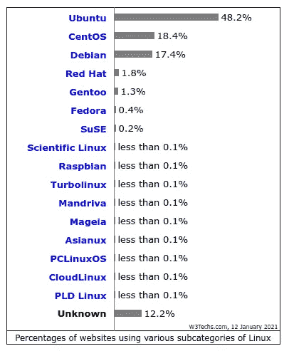
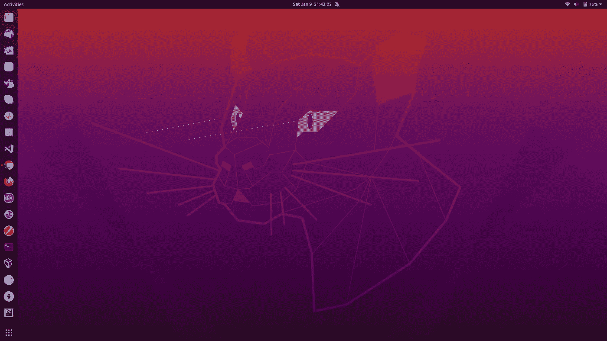
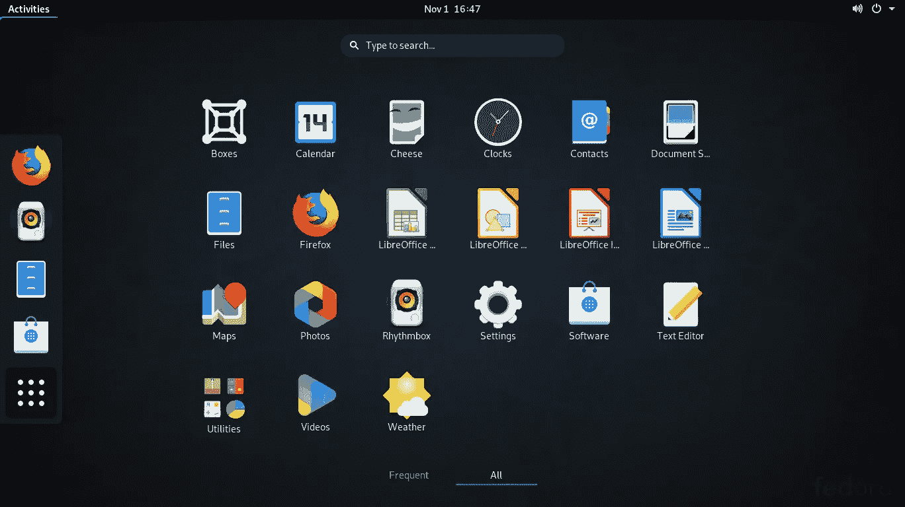
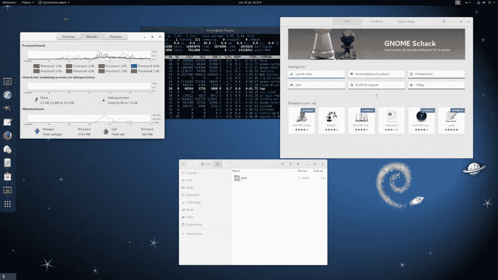
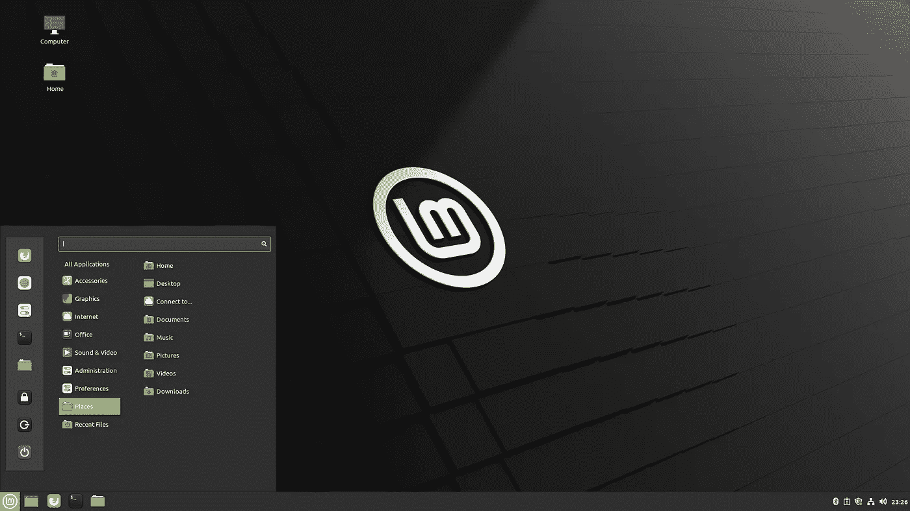
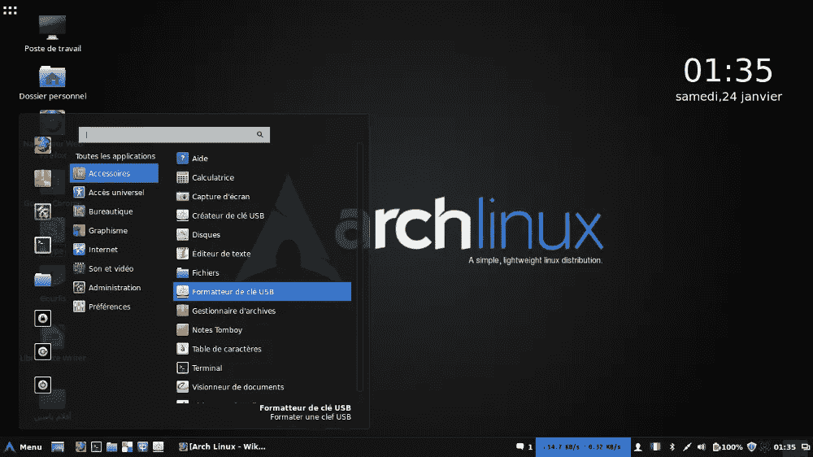

# 以下是 2021 年面向开发者的 5 大 Linux 发行版！

> 原文：<https://blog.devgenius.io/here-are-top-5-linux-distros-for-developers-in-2021-800050c810b2?source=collection_archive---------0----------------------->

自从我开始使用 Linux，它就成了我的首选驱动程序。现在已经用了五年多了。我的第一个 Linux 发行版是 Ubuntu 12.04 LTS(精确的穿山甲)。从那以后，我在 virtual box 和主驱动上都使用了大量的发行版。

如今，Linux 无处不在——从你的电脑到汽车到移动设备。它为大部分互联网提供动力，全球 500 台超级计算机 100%使用 Linux 操作系统。

来源:w3Techs.com

Linux 在台式电脑领域并不流行。Windows 和 macOS 是。但是在过去的几年里，Linux 桌面在开发人员和工程师中越来越受欢迎。

在本文中，我为开发者列出了 5 个最受欢迎的 Linux 发行版。

## 1# [Ubuntu](https://ubuntu.com/)

Ubuntu 桌面

Ubuntu 是 Canonical 开发的广泛使用的基于 Debian 的 Linux 操作系统之一。如果看到上面的数据，那么这么长时间都是第一。它有三个版本:服务器版、台式机版和核心版。

## 2# [软呢帽](https://getfedora.org/)

Fedora 工作站

Fedora 是另一个流行的 Linux 发行版，由 Red Hat 赞助的 Fedora 社区提供支持。Linux 的创造者 Linus Torvalds 也使用 Fedora。

## 3# [Debian](https://www.debian.org/)

Debian 桌面

Debian，又称 Debian GNU/Linux。

它是由社区支持的 Debian 项目开发的。

你可以在一分钟内在 Shells.com 上试用 Debian now。

## 4# [Linux Mint](https://linuxmint.com/)

Linux Mint

我个人对 Linux mint 的看法是，它是如此简单化，易于安装和运行。来自 Windows 的人会喜欢的。它附带了许多免费的开源应用程序。

## 5# [Arch Linux](https://archlinux.org/)

Arch Linux

Arch Linux 是另一个著名的 Linux 发行版。它有自己的粉丝群。

## 我的建议

有成千上万的 Linux 发行版。这些是开发人员中使用最多的。

如果你是 Linux 新手，我建议你不要尝试 Linux。我认为安装过程有点困难或麻烦。

你可能有完全不同的观点，这也没关系。因为你可能觉得自己做的 Linux 发行版是最好的。

我个人在虚拟盒子上使用 Ubuntu Linux 20.04 LTS 和其他一些发行版来玩。

如果你真的想对 Linux 了如指掌，那就自己尝试一下 LFS 项目。

你最喜欢的日常司机是哪个？请在评论区告诉我。

感谢阅读！保重。:)