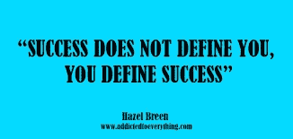

# 成功是幸福和爱情，而不是金钱。

> 原文：<https://blog.devgenius.io/heres-why-everyone-can-be-successful-2ba57ebe1ed1?source=collection_archive---------1----------------------->

首先让我们从成功的定义开始“目标或目的的实现”这是一个相当宽泛的陈述，但是大多数人认为成功就是金钱或者金钱等于成功。

这就是为什么绝对不是这样，为什么每个人都在某种程度上成功了。许多成功的名人悲惨地结束了抑郁，有些人甚至不幸地结束了自己的生命，想想就令人震惊，因为对于普通人来说，他们没有什么可担心的，他们有比我们知道该怎么做的更多的钱。

所以，如果金钱等同于成功，那么成功对一些人来说可能是坏事？生活中主要的成功是(这听起来可能是老生常谈)但却是真正的幸福。幸福是真正的成功，因为你可能拥有世界上所有的钱，但仍然不幸福。

当然，对一些人来说，金钱会让生活变得更容易，包括我自己，但是太多的成功对你是有害的，让我来解释为什么…

比方说，你有 1 亿美元，可以拥有任何你想要的汽车，对于没有钱的我来说，驾驶兰博基尼将是一生中令人兴奋和难忘的经历，但对于一个经历了多年的富人来说，过一段时间后它就显得乏味和没有吸引力了。

想象一下，一件事情做了那么多遍，以至于不再有趣，或者你不再感到兴奋。这确实是很多富人的情况，他们可以体验他们想要的一切，所以很多事情变得无聊，很难获得刺激或快乐。

所以我坚信财富和运气不一定等于成功，真正的成功是幸福，你需要在生活中找到平衡。在我看来，许多穷人可以获得巨大的成功，因为他们欣赏生活中简单的事情，这将使他们快乐。

它最终是关于找到你的位置，满足并从地球上的日子里找到快乐，这就是为什么钱不等于成功，因为钱(很多钱)不能在特定的时间框架内买到幸福。

所以，要欣赏和关心，因为你是成功的，为让世界变得更美好而做得很好。

