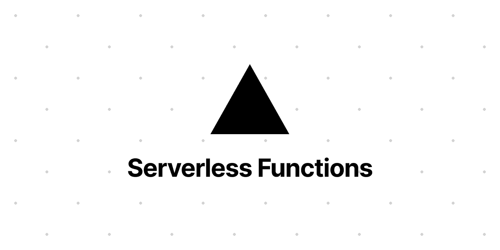

# 这就是为什么你应该为你的下一个项目使用免费的无服务器后端

> 原文：<https://blog.devgenius.io/heres-why-you-should-use-a-free-serverless-backend-for-your-next-side-project-3eeb6773965c?source=collection_archive---------0----------------------->

阿诺·弗朗西斯卡在 [Unsplash](https://unsplash.com?utm_source=medium&utm_medium=referral) 上的照片

作为一名软件开发人员，兼职项目在我们的个人和职业发展中扮演着重要的角色，能够将您的项目部署到 web 上就像看着我们的孩子去上大学一样(您会感到自豪，也希望它有一天会出名并让您变得富有)。一些项目需要你有一个后端 API，这些通常需要一个 24/7 运行的服务器。如果你像我一样预算有限，你应该知道没有多少免费的服务器可供选择。Heroku 是最受推荐的免费后端解决方案之一，最近也删除了它的免费层，所以是时候我们去别处看看了。

# 满足无服务器功能

什么是无服务器？顾名思义——无服务器，意思是在没有服务器的情况下运行你的后端。这是一种按需提供后端的服务，它的工作原理是只有当流量到达时才启动后端，这意味着只有当有流量时才收费。

但是等等，如果每次有新的请求时，我的 API 都必须加速，这难道不意味着它的响应时间会很慢吗？—不，无服务器功能保持轻量级和最小化，以便能够快速启动。此外，根据您托管无服务器功能的位置，启动时间可能会有所不同，我将在下面介绍可用的选项。然而，无服务器功能通常不需要几秒钟就可以启动，有些选项甚至只需要几毫秒就可以启动，为您的用户提供无缝体验。

现在回到免费期权的问题。无服务器功能有付费等级，然而有许多平台提供慷慨的免费等级。有些选项基于 API 调用的数量进行限制，有些则基于无服务器功能的计算时间。然而，免费层足以支持您的后端项目。

# 算我一个！我从哪里开始？

有许多平台为其用户提供无服务器功能，但我将介绍我认为最好的两个免费选项。

## 1.云闪工人

Cloudflare Workers 是我的首选，因为它承诺没有冷启动，并且全球用户的响应时间为毫秒级。在我个人使用 Cloudflare Workers 的过程中，它能够如此快速地响应我的 API 调用，感觉与普通服务器一样快，甚至更快。没有冷启动，由于其高性能的全球网络，它对我的 API 调用的响应速度最快。它的免费等级被限制为每个账户每天 100，000 次请求，但这对我的使用来说已经足够了。如果你想要一个 API 后端，它能以闪电般的速度响应，但流量可能会稍微少一点，这就是你要走的路。一个缺点是你需要学习如何使用牧马人，但我觉得仅仅是为了利用其特殊的免费层就值得学习。https://workers.cloudflare.com/
T2

## 2.Vercel 无服务器功能

Vercel 无服务器函数是我的第二个选择，因为它允许我们通过使用 NextJS 在熟悉的环境中编写无服务器函数，这意味着您可以在单个平台上部署前端和后端。对空闲层的请求数量没有硬性限制，但是响应时间可能会比 Cloudflare Workers 慢几秒钟。如果你能忍受 1-2 秒的响应时间，但你期望更高的流量，我会推荐 Vercel 无服务器功能。
[https://vercel . com/docs/concepts/functions/server less-functions](https://vercel.com/docs/concepts/functions/serverless-functions)