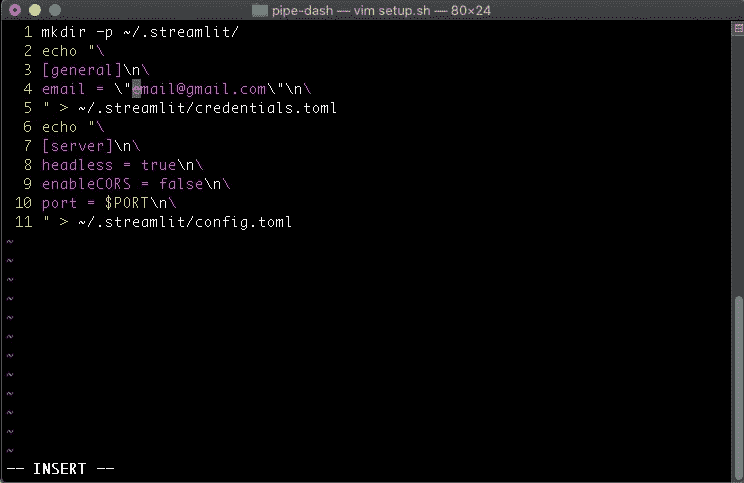
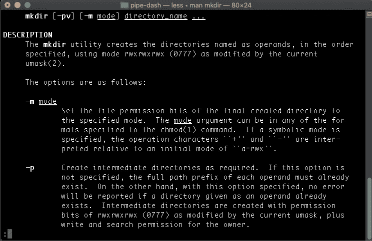

# 引擎盖下的 Heroku 和 Streamlit

> 原文：<https://blog.devgenius.io/heroku-and-streamlit-under-the-hood-f77ba6ae5a22?source=collection_archive---------7----------------------->

## 了解 Procfile 和 setup.sh

你可能听说过 streamlit。这是快速构建有吸引力、用户友好的数据应用程序的最佳方式之一。如果你没有听说过 streamlit，你一定要去看看，你可以在这里找到快速入门指南[。](https://docs.streamlit.io/en/stable/getting_started.html)

如果你听说过 streamlit，并且已经开始使用它了，那么迟早你会想要在本地机器之外分享你的应用。我将更进一步说，因为 streamlit 的大部分魅力在于它能够使那些通常属于开发人员而不是数据科学家的领域的组件对任何懂一点 python 的人都是可访问的。它对用户非常友好。

Heroku 是使用 streamlit 部署应用程序的最佳方式之一，无需大量启动和运行开销。有很多指导让你的应用程序上线:请看[这里](https://towardsdatascience.com/deploy-streamlit-on-heroku-9c87798d2088)和[这里](https://towardsdatascience.com/from-streamlit-to-heroku-62a655b7319)的几个很好的例子。

如果你开始阅读这些指南，你会发现它们有许多共同点。他们几乎都要求您定义一个 Procfile，并编写一个名为 setup.sh 的 shell 脚本，如下所示:



示例“setup.sh”文本(图片由作者提供)

我还没有找到一个分解这个脚本内容的，但我的兴趣被激起了，所以我想我会分享我的发现。让我们从第一条线索开始:第一行。如果您对终端有所了解，那么您可能已经知道这是怎么回事了，但是如果不是，那么手册页是使用 mkdir 这样的命令的好地方。如果您键入，会发生以下情况:

```
man mkdir
```

进入你的终端。



包含 p 标志的“mkdir”手册页的文本(图片由作者提供)

所以简单地说，我们的 setup.sh 脚本的第一行将在主目录中创建一个名为。streamlit”，根据需要创建任何中间目录(不应该是必要的)。如果你尝试

```
ls ~
```

而且不要找”。在输出中，只需记住您可以使用“-a”来显示任何隐藏的目录，如下所示:

```
ls -a ~
```

我说过这是一个线索，那么…这里的线索是什么？我们刚刚制作了一个叫做“dotfile”的东西，如果你是超级时髦的人，这就是你谈论配置文件的方式(如果这对你来说是新的，请尝试在 github 或 youtube 上搜索 dotfile，这是一个勇敢的新世界)。好了，我们确保了 streamlit 的这个配置文件存在(实际上末尾的斜杠使它成为一个目录，因为 streamlit 有一些东西存在于此)，接下来呢？也许 streamlit 在文档中有关于这个的内容？

确实如此！[这里是](https://docs.streamlit.io/en/stable/streamlit_configuration.html)相关位的链接，恰当地标记为“简化配置”我们在这里做的第一件事是将一些文本回显到一个名为 credentials.toml 的文件中，但是如果您在 streamlit docs 中搜索这个“credentials.toml”位，您将不会找到任何东西，除了可能在论坛页面上。那么我们到底做了什么？这个脚本运行的上下文中还有另一个线索——通过 Procfile。procfile 的内容如下所示:

```
web: sh setup.sh && streamlit run your-app.py
```

那么这个“网络”是什么呢？幸运的是，Heroku 有一些[文档](https://devcenter.heroku.com/articles/procfile)来帮助我们解决这个问题。Procfile 上的页面声明:

> Heroku 应用程序的`web`进程类型是特殊的:它是唯一可以从 Heroku 路由器接收外部 HTTP 流量的进程类型。如果您的应用程序包含一个 web 服务器，您应该将其声明为您的应用程序的`web`进程。

所以我们的应用程序有一个网络服务器。我们已经将它声明为我们的 web 进程，setup.sh 部分是在运行我们的应用程序之前做一些设置工作。设置工作在很大程度上是为了确保我们为 web 服务器构建的映像能够以某种方式与 streamlit 交互，从而允许 streamlit 接触到它为我们的应用程序提供服务所需的组件。最后三个线索都可以在上面提到的配置的 streamlit 文档页面上找到。我们创建一个配置文件(格式是一个 [toml](https://en.wikipedia.org/wiki/TOML) ，我们在[server]部分设置变量如下:

```
[server]
headless = true
```

从我们阅读的文件来看:

```
*# If false, will attempt to open a browser window on start.*
```

足够合理:我们只是希望我们的应用程序被服务，没有必要在服务端的任何地方弹出一个浏览器。

```
enableCORS = false
```

这个很专业。Mozilla 有一个很好的页面解释了底层技术(跨源资源/请求共享)，但这超出了本文的范围。

```
port = $PORT
```

从文档中:

```
*# The port where the server will listen for browser connections.*
```

$PORT 是一个环境变量，用于访问 Heroku 正在使用的端口(通常不是 8501，这是该变量的默认值)。

“\n”序列作为新行回显，因此每个变量在结果 config.toml 中都有自己的一行，streamlit 就是在这一行中读取其配置设置的。

那么这些壳的东西在做什么呢？非常简单，setup.sh 文件允许 Heroku 和 streamlit 在同一个页面上。去做几个 app 吧！