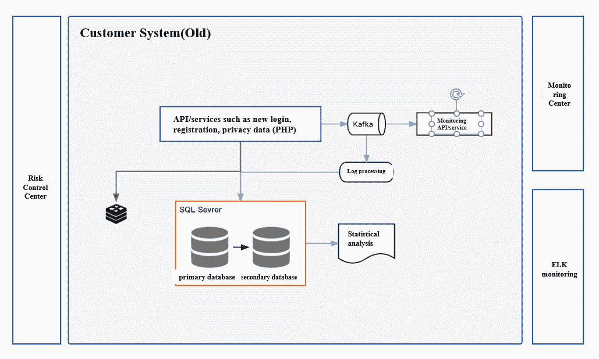
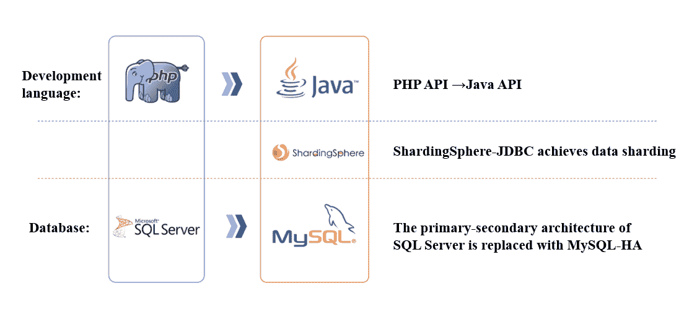
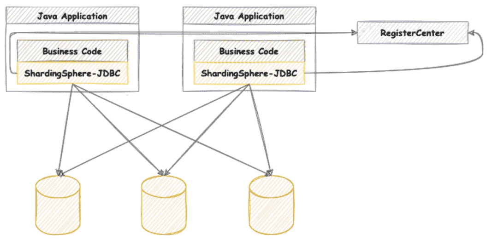
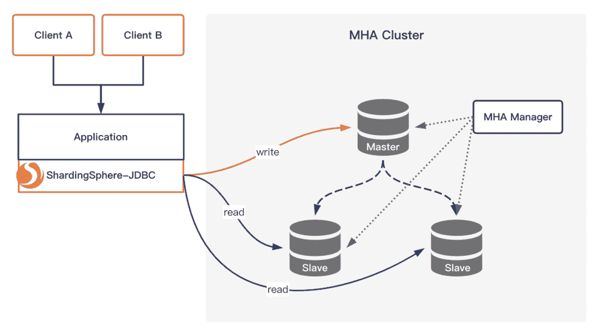
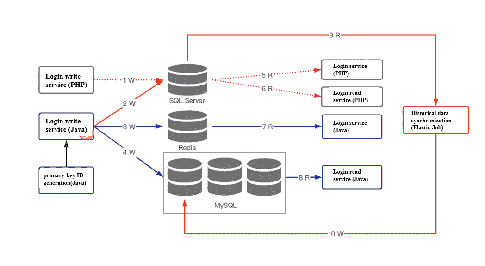
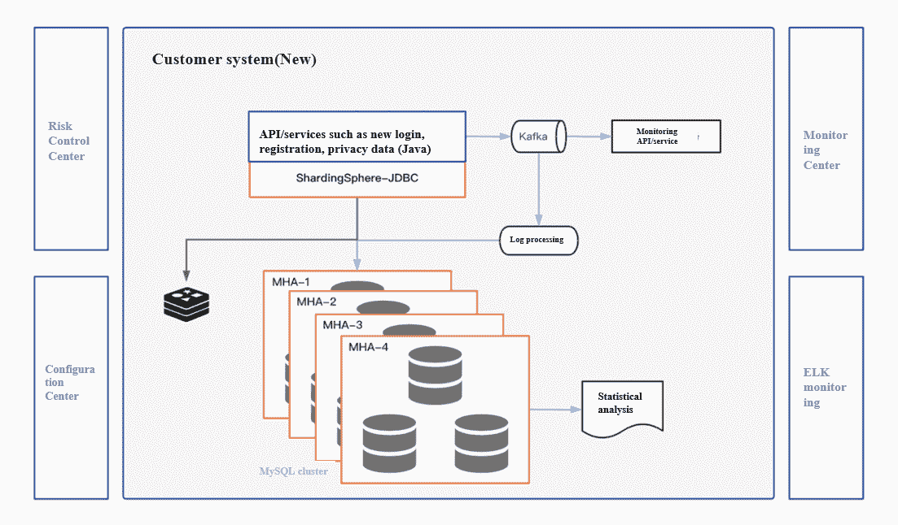

# 异构迁移:将当当网的客户系统 RTO 降低 60 倍，速度提高 20%

> 原文：<https://blog.devgenius.io/heterogeneous-migration-reducing-dangdangs-customer-system-rto-60x-and-increasing-speed-by-20-4e6c84827660?source=collection_archive---------4----------------------->

> [*Apache sharding sphere*](https://shardingsphere.apache.org/)*帮助* [*当当网*](https://www.crunchbase.com/organization/dangdang-com) *重建其拥有 3.5 亿用户的客户体系，从一个*[*PHP*](https://www.php.net/)*+*[*SQL Server*](https://www.microsoft.com/en-us/sql-server/sql-server-downloads)*技术栈无缝过渡到一个 Java+sharding sphere+*[*MySQL*其客户系统的性能、可用性和可维护性得到了显著的提高，这是 ShardingSphere 异构迁移的最佳实践。](https://www.mysql.com/)

## 当当网的客户体系

当当网的客户系统主要负责账号注册、登录、隐私数据维护。它之前的技术栈是基于 PHP 和 SQL Server 的，也就是说是标准的集中式架构，如下图所示。

在重建项目开始之前，客户系统的几个业务模块遇到了多种问题和技术挑战，如逻辑分散、低吞吐量和高运维成本。

为了改善客户的购物体验，当当网的技术团队决定优化业务逻辑和底层数据架构，以实现客户系统在多种场景下的可用性、可扩展性和全面改善。重建还引入了许多技术创新，如跨数据源双写、读/写分离、智能网关和灰色释放。

当当网的技术团队在半年内完成了系统重建，从需求设计、分片规划、逻辑优化、压力测试到正式上线。

项目使用 Java 重构十余个模块，通过 ShardingSphere & MySQL 构建分布式数据库解决方案，最终完成异构数据库的在线迁移。该项目有以下亮点:

*   用 Java 语言重构 PHP 业务代码。
*   用 ShardingSphere & MySQL 替换 SQL Server。
*   完成 3.5 亿用户的在线数据迁移。
*   通过数据双写方案完成无缝启动。

## 棘手问题和挑战

## 业务难点

在业务层面，客户系统的一些模块的注册和登录逻辑分散在不同的端点。这导致了高昂的维护成本，并且旧的技术体系结构在性能改进和高可用性方面受到了限制。

*   **维护难度:**多个平台注册登录逻辑分散，业务维护复杂。
*   **有限的性能:**PHP&SQL Server，一个集中式的技术架构，吞吐量不足。
*   **可用性和安全性差:**如果 SQL Server 的活动/备用状态发生变化，订阅数据库将失效，重新配置需要一段时间。运行在 Windows Server 上的 SQL Server 由于病毒的原因安全性较差，安装补丁后升级需要很长时间(>30 分钟)。

## 挑战

*   **数据完整性:**客户系统涉及超过 3.5 亿用户的数据。从 SQL Server 迁移到 MySQL 后，需要保证数据的一致性和完整性。
*   **API 透明:**API 对调用者透明，保证调用者不改变，尽量减少接口的改变。
*   **无缝切换:**业务系统必须在不影响业务的情况下无缝切换。
*   **时间紧迫:**在“ [618 ( *又名*JD.com 日)](https://edition.cnn.com/2020/06/18/tech/jd-618-china-coronavirus-intl-hnk/index.html)和 [11.11 ( *又名*光棍节)](https://en.wikipedia.org/wiki/Singles%27_Day)”(中国的两个网购节)前后，系统会被封锁，所以我们需要在有限的时间窗口内，在两个购物促销活动之间进行切换，然后进行测试，为 11.11 购物节做准备。

## 解决方法

## 统筹规划

为了提高客户系统的可维护性、可用性和性能，R&D 团队重组了客户系统架构。

在应用层，目标是统一所有终端的功能逻辑，提高业务的可维护性。

在数据库层，将集中式架构转化为分布式数据库架构，以提高性能和可用性，这正是 ShardingSphere & MySQL 构建的开源分布式解决方案。

*   **应用层:**随着当当网整体技术栈的变化，其业务开发语言从 PHP 变成了 Java。
*   **中间件:**sharding sphere 作为一款成熟的开源数据库中间件，用于实现数据分片。
*   **数据库:**多个 MySQL 集群被用来替代 SQL Server 数据库。

总体架构设计引入了多种方案，如分布式主键生成策略、分片管理、数据迁移验证和灰度释放。

## 分布式主键生成策略

数据库体系结构要从集中式体系结构转变为基于中间件的分布式体系结构，分布式主键生成策略是首先要解决的问题。

在系统重建期间，我们选择构建两个或更多的数据库 ID 生成服务器。每个服务器都有一个`Sequence`表，记录每个表的当前`ID`。在`Sequence`表中增加的`ID`的步长是服务器的数量。起始值是交错的，因此 ID 的生成被散列到每个服务器节点。

# 实现分片(Apache ShardingSphere)

在客户系统重建期间，数据库分片通过 Apache ShardingSphere 完成，并且还启用了读/写拆分功能。

由于客户系统对高并发和低延迟的要求，接入端选择了 [ShardingSphere-JDBC](https://shardingsphere.apache.org/document/current/en/overview/#shardingsphere-jdbc) ，定位为轻量级 Java 框架，在 Java 的 JDBC 层提供附加服务。

它通过客户端直接连接到数据库，并以`jar`包的形式提供服务，无需额外的部署和依赖。它可以被看作是 JDBC 驱动的增强版，完全兼容 JDBC 和各种 [ORM](https://www.techopedia.com/definition/24200/object-relational-mapping--orm) 框架。

*   **分片:** ShardingSphere 支持一套完整的分片算法，包括`modulo` 操作、 `hash`、`range`、`time,`和自定义算法。客户使用`modulo`分片算法来分割大型表。
*   **读写拆分:**除了分片，还启用了 ShardingSphere 的读写拆分功能，以充分利用 [MHA](https://myheroacademia.fandom.com/wiki/Cluster) 集群资源，提高系统吞吐能力。

## 双写和数据同步

数据同步贯穿于整个重建项目，数据迁移的完整性和一致性对重建至关重要。

此示例基于弹性作业同步定期将 SQL Server 的历史数据同步到 MySQL。在数据库切换过程中，使用备份方案对数据库进行二次写入，以确保数据的一致性。该流程包括:

**第一步:**实现双写机制

断开链路 1，接通链路 2、3、4，然后是 9、10。

**第二步:**切换登录服务

断开连杆 9、10，接通连杆 7，断开连杆 5。

**第三步:**切换读取服务

接通连杆 8，断开连杆 6。

**第四步:**取消双写机制

断开链路 2 并完成切换。

在服务端和数据库端都定期执行数据验证。在不同的时间段使用不同的频率来采样或全面检查数据完整性。`COUNT` / `SUM`也在数据库端验证。

客户系统重构采用基于 apollo 的 gray 发布。在新的登录处理过程中，逐步释放配置项，并在小范围内进行顺序割接，以保证启动成功率。重建后的系统架构如下图所示。

## 优势

改造后，当当网客户系统的响应速度显著提高，日常运维成本也有所降低。

ShardingSphere 提供的分布式解决方案在这方面发挥了很大作用。该解决方案适用于各种高流量的互联网平台服务，以及电子商务平台和其他数据处理系统。

*   **性能提升:**响应速度提升 20%以上。
*   **高可用性:**由于采用了 sharing sphere&MySQL 设计，RTO 缩短到了 30 秒以下。
*   **易维护:**业务逻辑和数据库可维护性显著提升。
*   **无缝迁移:**6 个月内完成各模块在线割接，窗口时间为零。

## 结论

这是当当网第二次实施 ShardingSphere，之前我们曾在“ [*帖子中分享过，亚洲电子商务巨头当当网将订单处理速度提高了 30% —通过 Apache sharding sphere*](https://shardingsphere.medium.com/asias-e-commerce-giant-dangdang-increases-order-processing-speed-by-30-saves-over-ten-million-113a976e0165)*节省了超过一千万的技术预算。*

*Apache ShardingSphere 为企业系统提供了强大的支持，因为项目力求简单和完美，以实现更简单的业务逻辑和最大的性能。*

# *Apache ShardingSphere 项目链接:*

*[ShardingSphere Github](https://github.com/apache/shardingsphere/issues?page=1&q=is%3Aopen+is%3Aissue+label%3A%22project%3A+OpenForce+2022%22)*

*[ShardingSphere Twitter](https://twitter.com/ShardingSphere)*

*[切割球松弛](https://join.slack.com/t/apacheshardingsphere/shared_invite/zt-sbdde7ie-SjDqo9~I4rYcR18bq0SYTg)*

*[投稿指南](https://shardingsphere.apache.org/community/cn/contribute/)*