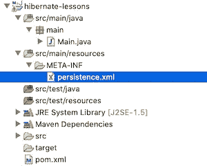

# Hibernate 教程— 1。设置和配置

> 原文：<https://blog.devgenius.io/hibernate-tutorial-1-setup-configuration-e7694939e01d?source=collection_archive---------5----------------------->

法比奥在 [Unsplash](https://unsplash.com/s/photos/database?utm_source=unsplash&utm_medium=referral&utm_content=creditCopyText) 拍摄的照片

在这篇文章中，我将讨论 Hibernate 的 stup 和配置，它是最常用的对象关系映射(ORM)工具之一。我已经在我的[上一篇](https://medium.com/dev-genius/what-is-object-relational-mapping-orm-177b8ab54d85)中谈到了什么是 ORM，使用 ORM 的优点和缺点是什么。

正如 Hibernate 网站上推荐的那样，我将使用 Maven 来设置 Hibernate。因为我这篇文章的主题是关于 Hibernate 的，所以我不会在这里解释 Maven。此外，在后面的例子中，我将使用 MySQL 作为我选择的数据库。

首先，我们打开一个 Maven 项目，并在 pom.xml 文件中添加必要的依赖项来使用 Hibernate。

*   **hibernate-core** :为了使用 hibernate 工具，我们需要添加的依赖项。在撰写本文时，我已经添加了可用的最新版本(5.4.18)。
*   MySQL-connector-java:MySQL 的 Java 数据库连接(JDBC)驱动程序。因为我将在以后的例子中使用 MySQL，所以我添加了这种依赖性，不过 Hibernate 也可以用于其他数据库。

有了这些依赖项，Hibernate 就被添加到了项目中。为了将 Hibernate 与我们正在使用的数据库连接起来，并进行其余的配置，我们需要在 Maven 项目的 src/main/resources 下打开一个名为 META-INF 的文件夹。在这个文件夹中，我们需要添加一个名为 persistence.xml 的文件，然后我们将在其中添加配置。

然后我们将必要的配置添加到 persistence.xml 文件中。

在第一部分中，放置了 JPA (Java 持久性 API)规范的模式。然后我们定义一个持久单元。在这个持久性单元中，我们需要定义一个惟一的名称，以便在应用程序中创建 EntityManager 对象时使用。在属性中，我们添加了与数据库相关的访问信息。

*   **javax . persistence . jdbc . driver**:提供数据库连接的 JDBC 驱动程序
*   **javax . persistence . JDBC . URL**:JDBC 驱动程序用来连接数据库的字符串。它包含访问数据库的信息(搜索位置、数据库名称、配置属性)
*   **javax . persistence . JDBC . user**:用于访问的用户名
*   **javax . persistence . JDBC . password**:用于访问的密码

在实际应用中，建议不要将密码直接放入 persistence.xml 文件并对其进行加密。在第 15 行，我们添加了一个属性来显示在控制台后台运行的 SQL 查询(它通常用于测试目的)。

创建文件后，我们在 main 函数中创建 EntityManagerFactory 和 EntityManager 对象。

有了我们创建的对象，现在我们可以轻松地处理与数据库相关的操作。