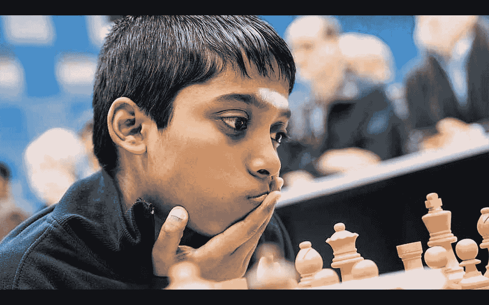
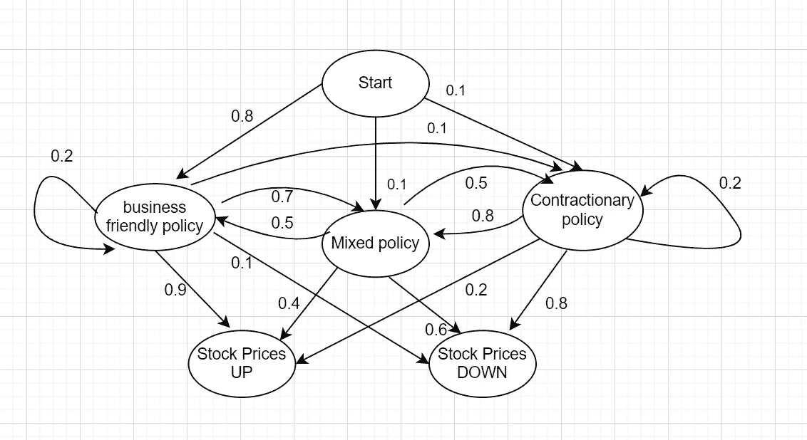
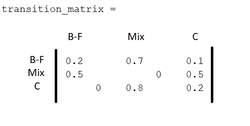
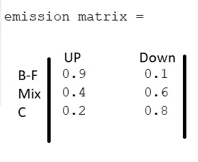

# 儿童隐马尔可夫模型教程

> 原文：<https://blog.devgenius.io/hidden-markov-models-tutorials-for-kids-21c7c7750db8?source=collection_archive---------12----------------------->

我希望你已经学过了幼儿马尔可夫链教程的基础知识

[马尔可夫链幼儿教程-1](https://medium.com/@abhishek3khare1/markov-chain-tutorial-for-toddlers-b32de55035a0)
马尔可夫链幼儿教程-2
[马尔可夫链幼儿教程-3](https://medium.com/@abhishek3khare1/markov-chain-tutorial-for-toddlers-3-8e692daa86e4)

现在是时候学习更多关于马氏链的高级应用及其在数学建模和机器学习中的使用的东西了。

下一步是什么？我应该学习隐马尔可夫模型吗？

为了创建离散事件的统计模型，我们将使用马尔可夫链进行建模，并将一些隐藏的状态/变量视为结果的原因。
这方面的一个简单例子是建模物理事物，如天气和其他事件驱动的现象。

一个这样的例子可以是国家财政政策宣布后股票价格的行为。这是由投资者的投机行为驱动的，政府选择的政策类型由各种其他事件决定，如国家的经济健康状况等
在我们的例子中，我们假设国家的财政政策决策每年都像马尔可夫过程一样运行，并且只取决于当前的财政政策。与此同时，投资者的反应可以基于财政政策进行建模，例如，如果采用“**商业友好型**”财政政策，股票价格就会上涨，因为投资者对企业有信心。然而，如果采取“c **紧缩性财政政策**，投资者失去信心，股票市场下跌的可能性更大，如果采取混合政策，那么投资者的反应同样可能是两种情况。

这整个过程可以建模如下—

图 1 —隐马尔可夫模型示例

**车型简介** —

假设一个投机交易者不知道国家的财政政策公告。所以在某种程度上，投机交易者不知道节点/状态——“商业友好”、“混合政策”和“收缩政策”。所以描述国家财政政策的状态对投机交易者来说是“隐藏的”,他假设了三个对他隐藏的状态。因此，这个例子表现得像一个“隐马尔可夫模型”。

p(商业友好→混合)= 0.7，即如果当前的财政政策是商业友好的，下一年出现混合财政政策的概率是 70%。这被称为“传输概率”

P(商业友好→股票上涨)= 0.9，即如果财政政策对商业友好，股票上涨的概率为 90%，这称为排放概率。

因此，基于上述模型，投机投资者将观察当年的股票价格趋势，并计算股票在下一年上涨或下跌的概率。

基于之前的教程，我们为“业务友好型”、“混合型”和“收缩型”状态建立了转换矩阵，如下所示

隐藏态的传输矩阵

类似地，我们可以将排放矩阵表示为—

现在假设许多年过去了，隐藏状态表现得像有一个稳态发生概率，我们计算这些状态的稳态概率分布。

所以正如在文章—[Markov Chain Tutorial for tutorials-2](https://medium.com/@abhishek3khare1/markov-chain-tutorial-for-toddlers-2-cce583eac064)中所讨论的，我们计算隐藏状态“B-F”、“Mix”和“C”的平稳概率分布为—

[P(" B-F ")P(" Mix ")P(" C ")][0.2 0.7 0.1；0.5 0 0.5;0 0.8 0.2]=[P(" B-F ")P(" Mix ")P(" C ")]

所以，计算一下，我们得到 P("B-F") = 5/22 = 0.227
和 P("mix") = 4/11 = 0.3636
和 P("C") = 9/22 = 0.409

现在，我们来计算一下，如果当年的股市在宣布后上涨，明年股市下跌的概率。所以我们会用贝叶斯定理来计算它。

因此，在这里，P(“B-F”)、P(“mix”)和 P(“C”)将被视为先验概率，因此
P(“B-F”| UP)=假设当年的趋势是“向上”的，则当年的政策对企业友好的概率可以使用贝叶斯定理来计算。

所以 P("B-F"| UP) = P(UP|" B-F ")。P("B-F")/P(向上)

所以 P(UP)= 0.9 * P(" B-F ")+0.4 * P(" Mix ")+0.2 * P(" C ")= 0.204+0.145+0.081 = 0.43
而 P(UP | " B-F ")= 0.9
P(" B-F ")= 0.227

所以 P(" B-F " | UP)=(0.227 * 0.9)/0.43 = 0.475

类似地，我们计算 P("Mix"|UP)和 P("C"|UP)
，因此 P("Mix"|UP) = 0.337
，P("C"|UP) = 0.188

现在我们已经有了隐藏状态的概率，我们将使用转移矩阵计算该状态在下一年/迭代中出现的概率

所以[P(" B-F _ next ")P(" Mix _ next ")P(" C _ next ")]=[0.475 0.337 0.188]* T
其中 T 是如图 1 所示的传输矩阵

解决这个问题，我们得到[P(" B-F _ next ")P(" Mix _ next ")P(" C _ next ")]=[0.2635 0.4829 0.2536]
所以现在，我们得到了明年这些财政政策决策状态出现的概率，现在基于此我们将计算明年股市上涨或下跌的概率

所以 P(UP _ next)= P(“B-F _ next”)。P(UP|"B-F") + P("Mix_next ")。P(UP|"Mix") + P("C_next ")。p(向上|"C ")

所以 P(UP _ next)= 0.2635 * 0.9+0.4829 * 0.4+0.2536 * 0.2 = 0.481

因此 P(下一个)= 0.519

因此，如果从开始算起已经过去了许多年，当年的股票价格在宣布后上涨，那么在财政政策宣布后的第二年，股票市场下跌的可能性为 51.9%，财政政策具有“混合”性质的可能性为 48.29%。

因此，在上面的文章中，我们已经学习了隐藏马尔可夫模型的**使用**以及如何**应用**这些模型来有效地预测未来趋势，这些模型有助于预测各种事情，无论是股票市场趋势，还是它的一些其他机器学习应用。

在下一篇文章中，我们将研究算法来**形成/创建**这样的隐马尔可夫模型，以便这些模型可以用于预测未来趋势。