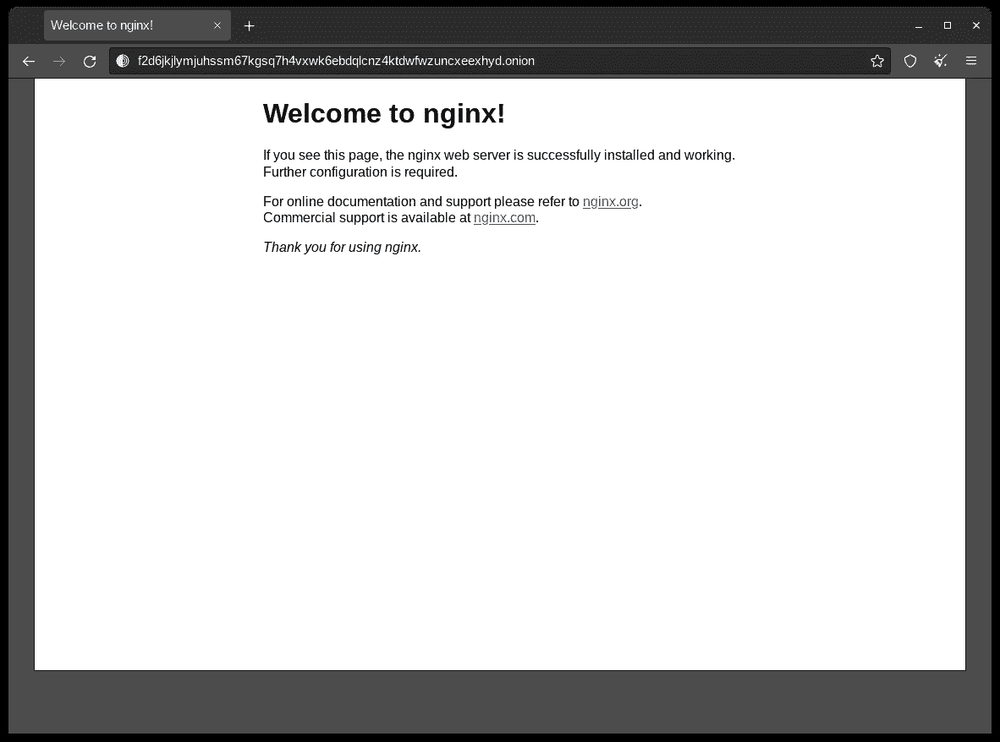

# 使用 Tor、nftables 和 NGINX 的隐藏洋葱服务

> 原文：<https://blog.devgenius.io/hidden-onion-service-using-tor-nftables-and-nginx-de0cf02527e0?source=collection_archive---------0----------------------->


Tor 提供了额外的隐私保护。在这篇文章中，我们将在 NGINX 服务器上使用 Tor 建立一个隐藏的洋葱服务。

我假设您已经知道如何在云提供商或 VPS 上设置 GNU/Linux 服务器，并且知道如何使用您喜欢的 shell。我们将集中在 Debian 衍生的系统上安装它。

# 更新系统

所以我们首先要做的是更新系统。

```
sudo apt update
sudo apt upgrade
```

# 安装防火墙

现在我们将安装 nftables。如果你从未听说过它，它基本上与 iptables (legacy)非常相似，但却是一个更新的版本(自 2014 年以来)。与 iptables 相比，nftables 的优点是代码重复较少，并且更容易扩展到新协议。


```
sudo apt install -y nftables
sudo systemctl enable nftables
sudo systemctl start nftables
```

我们现在已经安装了 nftables，我们将添加一个表和一个链，我们将把规则附加到其中。

```
sudo nft add table inet tor_table
sudo nft add chain inet tor_table tor_chain
```

创建一个规则来接受所有相关的和已建立的流量。

```
sudo nft add rule inet filter tor_chain ct state related,established counter accept
```

然后，我们添加一条规则来接受环回接口流量。

```
sudo nft add rule inet filter tor_chain iif lo counter accept
```

我们还添加了对端口 22 的开放访问，这是我们的 VM/VPS 的 SSH 端口。

```
sudo nft add rule inet filter tor_chain tcp dport 22 counter accept
```

丢弃所有其他传入流量。

```
sudo nft add rule inet filter tor_chain counter drop
```

注意，我们不需要打开端口 80，即 HTTP 端口。这是因为洋葱服务通过集合点与客户端通信的方式。

重启后保留防火墙。

```
sudo nft list ruleset > /etc/nftables.conf
```

# 安装 NGINX 服务器

现在我们要安装 web 服务器 NGINX，这样我们就可以处理 web 请求了。

```
sudo apt -y install nginx
```

编辑主 NGINX 配置文件。

```
sudo vim /etc/nginx/nginx.conf
```

在主 http 块中，取消阻止显示泄露信息的行的注释。

```
server_tokens off;
```

添加一行以防止有人在其他网站的框架中显示您网站的内容。

```
add_header X-Frame-Options "SAMEORIGIN";
```

添加一行以减少跨站脚本的可能性。

```
add_header X-XSS-Protection "1; mode=block";
```

添加行来限制缓冲区大小，从而减少缓冲区溢出攻击的可能性。

```
client_body_buffer_size 1k;
client_header_buffer_size 1k;
client_max_body_size 1k;
large_client_header_buffers 2 1k;
```

将 NGINX 配置文件写入磁盘，并退出编辑器。

编辑默认主机配置文件。

```
sudo vim /etc/nginx/sites-available/default
```

注释掉服务器块中让 NGINX 监听 TCP 端口 80 的行，并添加一行让 NGINX 监听 Unix 套接字的行:

```
#listen 80 default_server;
#listen [::]:80 default_server;
listen unix:/var/run/nginx.sock;
```

仍然在服务器块中，通过添加以下行来限制不必要的 HTTP 请求类型。

```
if ($request_method !~ ^(GET|HEAD|POST)$ )
{
    return 405;
}
```

将默认主机配置文件写入磁盘，并退出编辑器。

编辑系统服务文件。

```
sudo vim /lib/systemd/system/nginx.service
```

在**【业务】**块中，添加一行包含 NGINX 在自己的私网内，只有一个环回接口。

```
PrivateNetwork=yes
```

将 NGINX 服务文件写入磁盘，并退出编辑器。

用新配置重启 NGINX。

```
systemctl daemon-reload
systemctl restart nginx
systemctl status nginx
```

# 安装 Tor

现在我们安装 Tor 并创建隐藏服务。

安装必备软件包。

```
sudo apt install -y apt-transport-https
```

将 Tor 库添加到您的高级打包工具(APT)源列表中。

```
sudo vim /etc/apt/sources.list
```

在 Tor 项目存储库的底部添加行。这可能会因您的操作系统而异。注意，jammy Ubuntu 22.04 LTS 版没有对 Tor 可用的依赖，所以你可能会遇到麻烦。

```
deb https://deb.torproject.org/torproject.org focal main
deb-src https://deb.torproject.org/torproject.org focal main
```

将文件写入磁盘，并退出编辑器。

添加用于签署 Tor 包的 GNU 隐私保护(GPG)密钥。

```
sudo apt install -y gpg curlcurl https://deb.torproject.org/torproject.org/A3C4F0F979CAA22CDBA8F512EE8CBC9E886DDD89.asc | gpg --importgpg --export A3C4F0F979CAA22CDBA8F512EE8CBC9E886DDD89 | apt-key add -
```

更新您的套餐列表:

```
apt update
```

从 Tor 项目存储库中安装 Tor:

```
sudo apt install -y tor deb.torproject.org-keyring
```

编辑主 Tor 配置文件:

```
sudo vim /etc/tor/torrc
```

用以下内容完全替换其原始内容:

```
Log notice file /var/log/tor/log
RunAsDaemon 1
DataDirectory /var/lib/tor
HiddenServiceDir /var/lib/tor/*hiddenservicename*/
HiddenServicePort 80 unix:/var/run/nginx.sock
```

不要把 *hiddenservicename* 放在上面，你应该自己选择一个有意义的名字。

将文件写入磁盘，并退出编辑器。

为此更改重启 Tor。

```
sudo systemctl restart tor
```

检查 Tor 是否启动并运行。

```
tail /var/log/tor/log
```

您应该会看到一条消息。

```
Bootstrapped 100% (done): Done
```

要确定您的洋葱 URL，发出命令。

```
cat /var/lib/tor/*hiddenservicename*/hostname
```

你应该把你之前选择的名字放在上面，而不是字面上写 *hiddenservicename* 。

您将得到一个包含 56 个字符的域名的响应，后缀是**。洋葱**。它看起来会像这样:

```
uvbmrlw3vmbvz3q7cmf3pff777mavz3o4gwtgc6xu7zsvgvfuslcoryd.onion
```

你也应该把钥匙放在安全的地方，只有你能拿到。文件名为 **hs_ed25519_public_key** 和 **hs_ed25519_secret_key** 。

通过编辑默认站点配置文件来更改服务器名称:

```
sudo vim /etc/nginx/sites-available/default
```

修改**服务器名称；**行读:

```
server_name uvbmrlw3vmbvz3q7cmf3pff777mavz3o4gwtgc6xu7zsvgvfuslcoryd.onion;
```

将文件写入磁盘，并退出编辑器。

重启 NGINX。

```
systemctl stop nginx
rm /var/run/nginx.sock
systemctl start nginx
```

# 测试配置

您可能需要等待 10 分钟左右，您的隐藏服务洋葱地址才能通过网络传播。

现在，为了测试您到目前为止的配置，从位于[https://www.torproject.org](https://www.torproject.org/)的 Tor 项目站点下载并安装 Tor 浏览器。

在 Tor 浏览器中，使用 http 协议和洋葱地址访问洋葱站点。例如:

`[http://uvbmrlw3vmbvz3q7cmf3pff777mavz3o4gwtgc6xu7zsvgvfuslcoryd.onion](http://uvbmrlw3vmbvz3q7cmf3pff777mavz3o4gwtgc6xu7zsvgvfuslcoryd.onion)`

您应该看到**欢迎使用 Nginx！**页。太好了！



如果你看不到任何东西，也无法连接。您可能需要通过执行以下操作来更改 tor 服务的所有权。

```
sudo chown -R root /var/lib/tor
sudo service tor restart 
```

通过启动 tor to 和来确认一切正常。

```
tor
```

# 摘要


现在你应该知道如何使用 *nftables* 设置防火墙，以及如何使用 *NGINX* 配置网络服务器来处理通过 *Tor* 网络的流量，这样我们就可以确保我们的隐私得到维护。我希望你觉得这篇文章有用/有趣。如果是这样，请在 Medium 上关注我，以获取更多即将发布的文章。干杯！

# 参考

*   [https://en.wikipedia.org/wiki/Nftables](https://wiki.nftables.org/wiki-nftables/index.php/Main_Page)
*   [https://nginx.org/en/docs/](https://nginx.org/en/docs/)
*   [https://2019.www.torproject.org/docs/documentation.html.en](https://2019.www.torproject.org/docs/documentation.html.en)