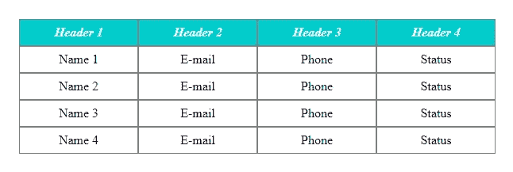

# 借助 CSS 隐藏 html 表格行

> 原文：<https://blog.devgenius.io/hide-html-table-row-with-help-of-css-62bffc75f43?source=collection_archive---------0----------------------->

一些棘手时刻的轻松话题。



只是一个 css 上的 html 表格的例子

可以借助标签**表**或基于 **div** 层创建浏览器表；

```
<style>
.table {
   display: table;
   width: 100%;
}
.tableRow {
   display: table-row;
}
.tableHead {
  font-weight: bold;
  font-style: italic;
}
.tableCell, .tableHead {
   display: table-cell;
   padding: 3px 3px 3px 3px;
   border: 1px solid grey;
}
</style>
<div class="table">
<div class="tableRow">
<div class="tableHead">Name</div>
<div class="tableHead">Email</div>
</div>
<div class="tableRow">
<div class="tableCell">name1</div>
<div class="tableCell">email@email.live</div>
</div>
<div class="tableRow">
<div class="tableCell">name2</div>
<div class="tableCell">[test@test.com](mailto:test@test.com)</div>
</div>
</div>
```

有时使用旧的 HTML 标签会更简单，它提供了更原始、更纯粹、更直接的行为。

基于标签的表头，有时定义它或隐藏它是有用的，视情况而定。当需要定义每一列宽度时，这样的标题也是有用的。

如果您同意在 UI 中看到隐藏项目的空行—使用`visibility: hidden`，否则使用 display: none 将其完全删除。

`opacity: 0`提供类似的隐藏效果，但是不能点击它后面的元素。否则，`visibility: hidden`允许使元素可点击。

`display: none`对常规 div 有好处。

`display: none`对 HTML 表格不友好，`display` 标签可能会使表格列不正确地变形。使用可见性标记隐藏行。因为表格可能很复杂，用`colspan` 和`rowspan`来组织。

我们不仅可以使用`thead`，还可以在`tbody`中显示/隐藏行。所以我将在 TR 行中添加`visibility: collapse`来隐藏额外的空间:

```
.tableDefaultRow {
  visibility: collapse;
}
```

此外，当我们隐藏行时，可能会出现额外的边框。因此，让我们应用这条规则*来避免任何可见的空间。

```
.tableDefaultRow {
  visibility: collapse;
  line-height: 0;
}
tr.tableDefaultRow * {
  padding: 0;
  border: none;
}
```

具体情况取决于你使用的浏览器。在使用 Chrome 浏览器的情况下，你会看到额外的底部边框出现——表格行被隐藏，但边框增加了额外的厚度。因此，规则*帮助我们避免这种行为。

所以不同的浏览器会有不同的招数。可能最好不要用`visibility: collapse`:)

因此，我们的表可以像这样在角度分量中动态创建:

```
<table>
  <tbody **ngIf*="quotes && quotes.length; else ***noQuotes***">
    <tr class="tableDefaultRow">
      <td class="quotes-id"></td>
      <td class="quotes-status"></td>
      <td class="quotes-type"></td>
    </tr> <ng-container **ngFor*="let ***quote*** of quotes">
    <tr class="clickable" (click)="search(***quote***.id)">
      <td class="quotes-id">{{ ***quote***.id }}</td>
      <td class="quotes-status">{{ ***quote***.status }}</td>
      <td class="quotes-type">
        {{ ***quote***.type | type:***quote***.serviceType }}</td>
    </tr>
    </ng-container>
  </tbody>
</table>
```

还有 SonarQube 用很多规则检查 typescript 源代码。它不喜欢 Angular Typescript 中的 html 表格。所以我们在表前加了这条规则。

```
<!-- //NOSONAR --><table>...</table>
```


表格行和单元格

链接

[](https://css-tricks.com/almanac/properties/v/visibility/) [## 能见度

### CSS 中的 visibility 属性有两个不同的功能。它隐藏了表格的行和列，还隐藏了一个…

css-tricks.com](https://css-tricks.com/almanac/properties/v/visibility/) 

*更多内容请看*[*blog . dev genius . io*](http://blog.devgenius.io)*。*