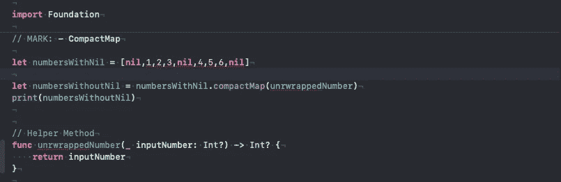
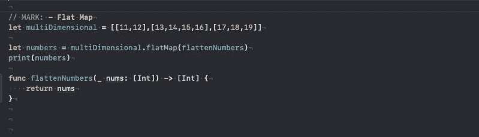
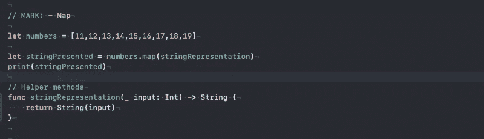
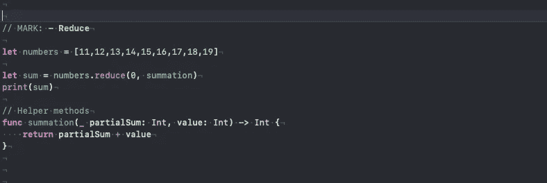
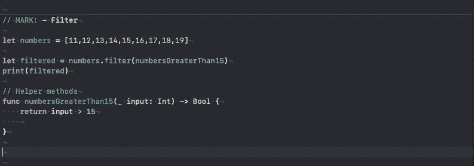
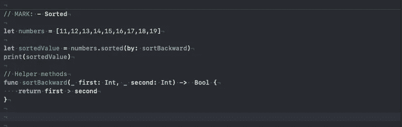
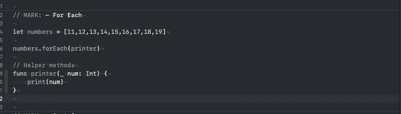
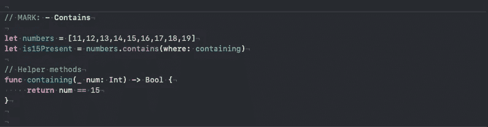
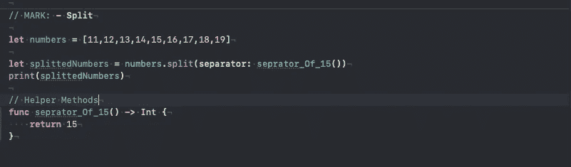

# 带 Swift 的高阶函数(HOF)

> 原文：<https://blog.devgenius.io/high-order-functions-hof-with-swift-b4485b2386d4?source=collection_archive---------2----------------------->

定义:- [高阶函数是接受至少一个函数作为自变量和返回函数的函数。](https://en.wikipedia.org/wiki/Higher-order_function)

其中一些是 compatMap、flatMap、Map、reduce、filter、contain、ForEach、split。您可以在构建数据结构或您定义的数据结构时使用这些。

为了简单起见，在解释每个操作符时，我将严格按照定义来解释。

***a . compact map:-***[返回一个数组，包含用这个序列的每个元素调用给定变换的非](https://developer.apple.com/documentation/swift/sequence/2950916-compactmap) `[nil](https://developer.apple.com/documentation/swift/sequence/2950916-compactmap)` [结果。](https://developer.apple.com/documentation/swift/sequence/2950916-compactmap)

# 观察结果:

这里 compactMap 接受一个名为“unwrappedNumbers”的函数(参见 HOF 的定义)

**关于结果:**
**【1，2，3，4，5，6】**

**相对于**型
1。numbersWithNil:可选 Int 的数组。
2。numbersWithoutNil:Int 的数组。

— — — — — — — — — — — — — — — — — — — — — — — — — — — — —

***b . flat map:-***[返回一个数组，包含调用给定变换与此序列](https://developer.apple.com/documentation/swift/sequence/2905332-flatmap)的每个元素的连接结果。

# 观察结果:

这里，flatMap 接受一个名为“flattenNumbers”的函数

**关于结果:**
**【11，12，13，14，15，16，17，18，19】**

**相对于**型
1。多维:Int 数组的数组。
2。numbers:Int 的数组。

— — — — — — — — — — — — — — — — — — — — — — — — — — — — —

***C. map :-*** [返回一个数组，包含将给定闭包映射到序列的元素](https://developer.apple.com/documentation/swift/enumeratedsequence/2907233-map) s 上的结果。

# 观察结果:

这里 map 接受一个名为“stringRepresentation”的函数

**关于结果:**
**【“11”、“12”、“13”、“14”、“15”、“16”、“17”、“18”、“19”】**

**相对于**型
1。stringPresented:字符串数组。
2。numbers:Int 的数组。

— — — — — — — — — — — — — — — — — — — — — — — — — — — — —

***d . reduce:***[返回使用给定闭包](https://developer.apple.com/documentation/swift/array/2298686-reduce)组合序列元素的结果。

# 意见:

这里约简为接受一个函数名“总和”

**关于结果:**
**135**

**相对于**
型 1。sum: Int
2。数字:Int 数组。

— — — — — — — — — — — — — — — — — — — — — — — — — — — — —

***e . filter:-***[返回按顺序包含满足给定谓词的序列元素的数组。](https://developer.apple.com/documentation/swift/sequence/3018365-filter)

# 意见:

这里，过滤器接受一个函数名“numbersGreaterThan15”

**关于结果:
【16，17，18，19】**

**相对于**型
1。已过滤:Int 数组
2。数字:Int 数组。
————————————————————————————————————————

***f . Sorted:-***[返回序列的元素，使用给定的谓词作为元素之间的比较进行排序](https://developer.apple.com/documentation/swift/array/2296815-sorted)。

# 意见:

这里 sorted 是接受一个函数名“sortBackward”

**关于结果:
【19、18、17、16、15、14、13、12、11】**

**相对于**型
1。sorted value:Int 数组
2。数字:Int 数组。

— — — — — — — — — — — — — — — — — — — — — — — — — — — — —

***g . ForEach:-***[按照与](https://developer.apple.com/documentation/swift/array/1689783-foreach) `[for](https://developer.apple.com/documentation/swift/array/1689783-foreach)` [-](https://developer.apple.com/documentation/swift/array/1689783-foreach) `[in](https://developer.apple.com/documentation/swift/array/1689783-foreach)` [循环](https://developer.apple.com/documentation/swift/array/1689783-foreach)相同的顺序调用序列中每个元素上的给定闭包。

# 意见:

这里 forEach 接受一个函数名“printer”

**关于结果:
11
12
13
14
15
…。最多 19 个**

**相对于**型
1。数字:Int 数组。

— — — — — — — — — — — — — — — — — — — — — — — — — — — — —

***H. Contain:-*** [返回一个布尔值，表示序列中是否包含满足给定谓词的元素。](https://developer.apple.com/documentation/swift/array/2297359-contains)

# 观察结果:

这里 contain 接受一个名为“containing”的函数

**关于结果:
真**

**相对于**型
1。is15Present: Bool
2。numbers:Int 的数组。

— — — — — — — — — — — — — — — — — — — — — — — — — — — — —

***I. Split :-*** 返回集合中最长的可能子序列，按顺序，围绕等于给定元素的元素。

# 观察结果:

这里 split 接受一个名为“separator_Of_15()”的函数

**关于结果:
【数组片([11，12，13，14])，数组片([16，17，18，19])】**

**就类型而言。**
1。splittedNumbers:数组**Array slice**2 的数组。numbers:Int 的数组。

— — — — — — — — — — — — — — — — — — — — — — — — — — — — —

***有些东西你可以自己试试。***
**1。尝试语法糖**
例如:
compactMap 可以重写为

**let**numbers with nil =[**nil**，1，2，3， **nil** ，4，5，6，**nil**]
let numbers with out nil = numbers with nil . compact map { $ 0 }

**2。使用多个高阶函数**以
为例:
过滤大于 15 的数字

**let**numbers with nil =[**nil**，1，2，3， **nil** ，4，5，6，**nil**]
let numer _ greater _ than _ 15 = numbers with nil . compact map { $ 0 }。过滤器{$0 > 15}

尝试不同的有趣组合。🤪

欢迎联系我:roshankumar350@gmail.com

希望你喜欢。
快乐阅读。