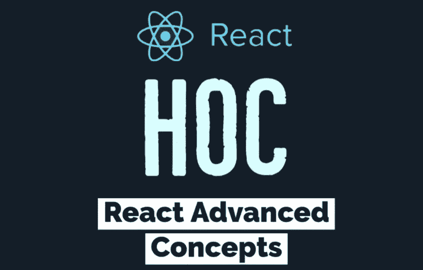
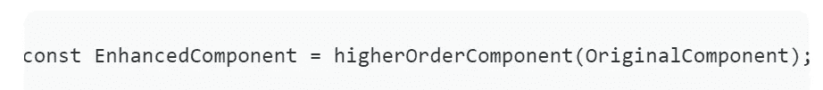
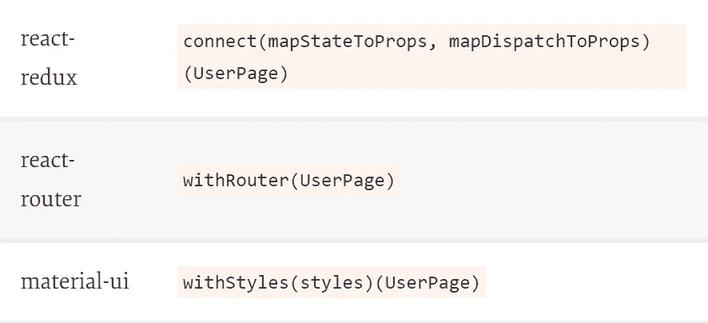
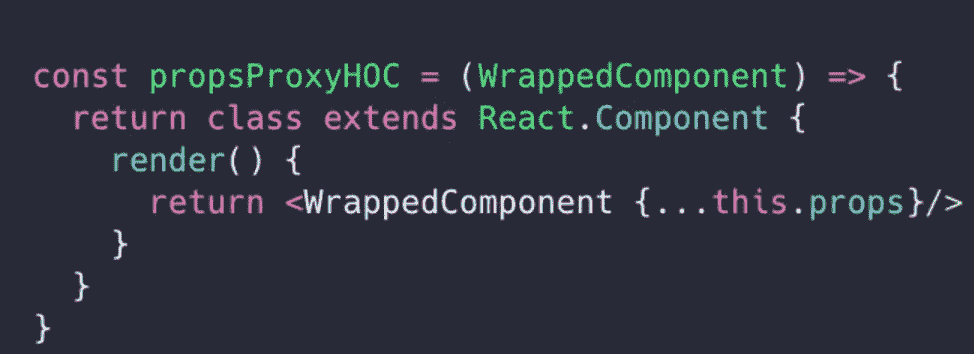
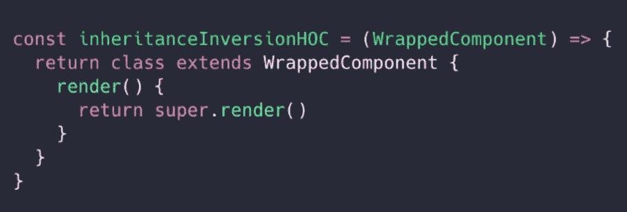

# React 中的高阶分量

> 原文：<https://blog.devgenius.io/higher-order-component-in-react-2bed7b6053f0?source=collection_archive---------11----------------------->

图片来自 morioh.com

一个高阶组件简称为**是 React 中的一种高级技术，用于**复用组件逻辑**。hoc 不是 React API 的一部分。它们是源于自然反应的模式，自然反应优先于遗传。**

*   **高阶组件是一种函数，它采用原始组件，并通过向该组件添加附加功能来返回增强的组件。**

****

**示例即席语法**

**以下是我们可能遇到的一些例子:**

****

**图片来自 smashing 杂志**

**现在让我们继续讨论 react 中可用的**hoc**类型，如下所示:**

## **高阶元件的类型:**

**有两种主要类型的专用实现:**

**(一)。道具代理。**

**㈡。继承倒置。**

*****道具代理(ppHoc):*****

**这有助于**添加/编辑** **道具**传递给组件。它只不过是一个函数 propsProxyHOC，接收一个组件作为参数，并返回一个新组件(包装的组件)。**

**当我们返回包装好的组件时，我们还会传递 HOC 收到的道具。这就解释了这种类型的名称: **props proxy** 。**

****

**Props 代理 HOC(标准实现)。**

**props 代理 hoc 在以下情况下很有用:**

1.  **操纵道具**
2.  **抽象状态**
3.  **用其他元素包装/组合包装的组件**

*****继承反转(iiHOC):*****

**在这种情况下，返回的类**扩展了**包装的组件。叫做**继承**反转。**

****

**继承反转特设(标准实现)**

**继承反转通过*这个*提供了对包装组件实例的特殊访问，这意味着您可以使用状态、属性、组件生命周期和**甚至渲染方法**。**

**继承反转 hoc 在下列情况下很有用:**

1.  **渲染高劫持**
2.  **操纵状态**

*****带 HOCs 的好处:*****

**一、无代码重复。**

**二。使代码更具可读性。**

**三。易于添加“功能”。**

**四。我们不会修改或改变组件。**

## **结论:**

*   **Hoc 用于组合组件以供代码重用。**
*   **特设是一个纯粹的功能。它没有副作用，只返回一个新的组件。**
*   **我们可以跨 Redux、Router、Material UI 使用 HOCs。**

**参考资料:**

**[高阶组件—反应(reactjs.org)](https://reactjs.org/docs/higher-order-components.html)**

**[ReactJS —高阶组件(tutorialspoint.com)](https://www.tutorialspoint.com/reactjs/reactjs_higher_order_components.htm)**

**你觉得这篇文章中列出的策略有用吗？**