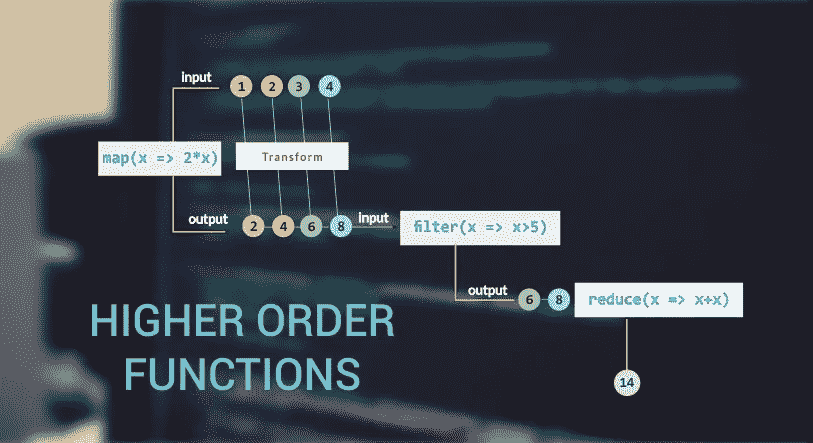

# Javascript 中的高阶函数以及为什么应该更多地使用它们

> 原文：<https://blog.devgenius.io/higher-order-functions-in-javascript-and-why-you-should-use-them-more-7c2b9e7e583e?source=collection_archive---------0----------------------->

快速浏览 js 中的高阶函数，以及它们如何让你的代码看起来更整洁、更优雅



**什么是高阶函数？**

通常当你听到函数这个词时，你会想到一个常规的函数，它接受一个输入，做一些魔术，然后像 little example 一样返回一些值作为输出

```
function sum_nums(x,y){return x+y;}let results = sum_nums(11,22);console.log(results);
```

正常函数和高阶函数有什么区别？

高阶函数是接受一个函数作为参数或返回一个函数的函数

例子包括:

1.  `map()`
2.  `forEach()`
3.  `reduce()`
4.  `filter()`

现在所有这些高阶函数都适用于数组，所以我们将制作一个虚拟数组，用一些数字来练习使用这些函数

我们的阵将是`let nums = [2,4,6,8,3,5]`

1.  **MAP()方法**

该方法迭代一个数组，并接受一个表示当前迭代中的元素的参数，该函数的常见用途是当我们迭代来自 API 的一些响应，并需要在前端记录或呈现元素时

```
// a function to multiply each element by 4
let newnums = nums.map((x)=> x*4);
console.log(newnums); // output:[8,16,24,32,12,20]
```

*你不需要说 return，因为函数默认返回值*

**2。FOREACH()方法**

顾名思义，这个函数也迭代一个数组**，但是不同的是 map()返回一个新的数组，而 forEach()返回** `**undefined**`

```
nums.forEach((x)=>x*4);
```

**3。REDUCE()方法**

该方法接受一个回调，该回调接受两个参数，一个表示上一次迭代的元素，另一个是迭代的当前元素

用例是通过将前一个元素添加到当前元素来计算数组元素的总和，如下所示

```
let result = nums.reduce((prev,curr)=>prev+curr)
console.log(result); // 28
```

**4。FILTER()方法**

我们使用这种方法根据我们指定的条件过滤出想要的元素，比如说你只想要奇数或偶数，或者想要高于或低于特定值的数字，如果是这样的话，那么这种方法就是正确的工具

这个方法返回一个新的数组，在这个例子中我们只返回数组的偶数，所以

```
let even_nums = nums.filter((el)=>el % 2 == 0);
console.log(even_nums); // [2,4,6,8]
```

**我为什么要用那些更多的**

比起嵌套的 for 循环和一堆 if 语句，它们让你的代码看起来更干净，可读性更好，这是我个人对为什么我更喜欢这些方式的唯一看法

**非常感谢你的阅读，下次再见♥**