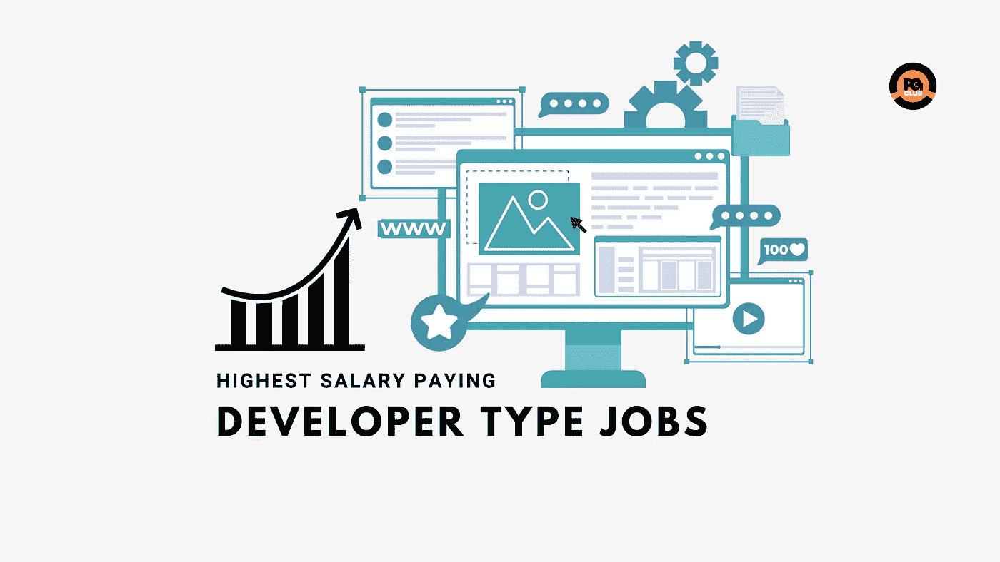

# 开发人员收入最高的工作

> 原文：<https://blog.devgenius.io/highest-paying-jobs-for-developers-cb51d58af9ec?source=collection_archive---------7----------------------->

收入最高的工作:软件行业正在爆炸式增长，全世界对有技术技能的人有着前所未有的需求。但是并不是所有的技能都是平等的。

超过 70，000 名开发人员参与了 Stack Overflow 的 2022 年年度开发人员调查(T1)，这是对技术行业状况的最佳观察，由实际在其中工作的人报告。

根据业内开发人员和管理人员的报告，如果你想在科技界赚到六位数，这些都是你应该争取的高薪职位。

# 收入最高的工作

高管和工程经理等高级职位往往薪水最高。

但在美国、德国、英国和加拿大，我们看到区块链开发人员的工资相当，尽管他们的平均经验年数最低。

以下是收入最高的工作列表

## 1.高管

高级管理人员通常负责管理公司内的各个部门或分部，并确保它们与公司的发展战略和计划保持一致。他们还可能负责监督管理较小员工团队的部门主管的工作。

工资:117，126 美元

## 2.工程经理

工程经理的工作职责包括监督工程项目和团队。他们在每个阶段帮助制定战略、设计和管理项目，确保项目高效、正确和按时完成。

工资:111976 美元

## 3.现场可靠性工程师

站点可靠性工程师(SRE)通过承担通常由运营部门完成的任务，在开发和 IT 运营之间架起了一座桥梁。相反，这样的任务被交给这些类型的工程师，他们使用自动化工具通过创建可伸缩的和可靠的软件系统来解决问题。

工资:95979 美元

## 4.安全专业人员

安全专业由安全执行官、经理、主管及其员工组成，他们是组织中负责保护资产免受安全风险的人员。该责任由企业的所有者和高级管理人员委派给安全专业人员。

工资:91416 美元

## 5.云基础设施工程师

云工程师是构建和维护云基础设施的 IT 专业人员。云工程师可以有更具体的角色，包括云架构(为组织设计云解决方案)、开发(为云编码)和管理(使用云网络)。

工资:89580 美元

## 6.区块链开发者

区块链软件开发者在现有的区块链平台上构建应用。他们处理前端和后端开发、设计和维护。

工资:79983 美元

## 7.数据工程师

数据工程师的主要关注点是在将原始数据呈现给组织之前，将其转化为可行和可读的内容。不仅如此，他们还需要在众多来源的帮助下设计、构建、测试、混合、管理和优化数据

工资:79983 美元

## 8.DevOps 专家

DevOps 工程师引入流程、工具和方法来平衡整个软件开发生命周期的需求，从编码和部署到维护和更新。

工资:79236 美元

## 9.生产部经理

产品经理是这样一个人，他确定客户需求和产品或功能将实现的更大的商业目标，阐明产品成功的样子，并召集团队将愿景变为现实。

工资:76783 美元

## 10.数据科学家或机器学习专家

数据科学家:简单来说，数据科学家的工作是分析数据，以获得可操作的见解。具体任务包括:识别为组织提供最大机会的数据分析问题。确定正确的数据集和变量。

机器学习专家:机器学习专家是专门从事开发机器学习的专业人员，机器学习是计算机科学的一个分支，专注于开发可以“学习”或适应数据并进行预测的算法。

工资:74651 美元

*本文原贴于*[*【programmingeeksclub.com】*](https://programmingeeksclub.com/highest-paying-jobs-for-developer-profile-2022//)

*我的个人博客网址:* [*编程极客俱乐部*](https://programmingeeksclub.com/)
*我的脸书页面:* [*编程极客俱乐部*](https://www.facebook.com/profile.php?id=100086258693659)
*我的电报频道:* [*编程极客俱乐部*](https://t.me/dpgcl)
*我的推特账号:* [*库尔迪普辛格*](https://twitter.com/kusinghofficial)
*我的*