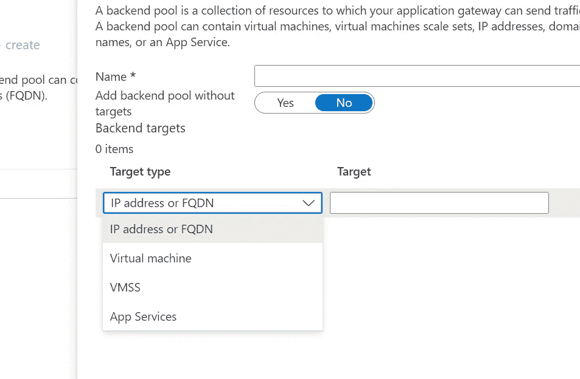
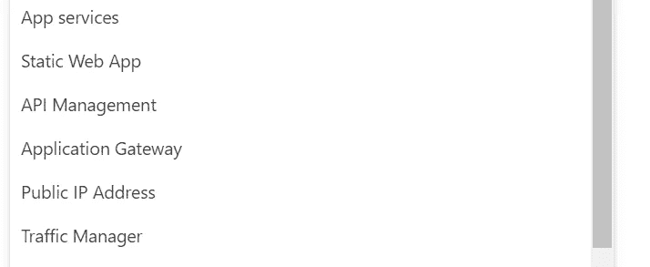

# 高度可伸缩和可用的架构——在 Azure 中设计解决方案——第二部分

> 原文：<https://blog.devgenius.io/highly-scalable-and-available-architecture-designing-solutions-in-azure-part-ii-4f8155ff008a?source=collection_archive---------13----------------------->

# 在第一部分中，我们看到了高可用性和可伸缩性架构之间的差异。

第一部分:[https://medium . com/@ vinothrao 89/highly-scalable-and-available-architecture-differences-and-solutions-part-I-CCA 53237 f 77 c](https://medium.com/@vinothrao89/highly-scalable-and-available-architecture-differences-and-solutions-part-i-cca53237f77c)

由[卢卡·布拉沃](https://unsplash.com/es/@lucabravo?utm_source=medium&utm_medium=referral)在 [Unsplash](https://unsplash.com?utm_source=medium&utm_medium=referral) 上拍摄

在这一部分，我们将深入了解如何使用各种 Azure 服务来设计架构。我们将看到的服务列表包括:

对于可扩展性:

1.  虚拟机规模集
2.  应用服务自动扩展。

关于可用性:

1.  内部和外部负载平衡器
2.  应用网关
3.  前门
4.  营业主任

在深入探讨之前，我们需要了解两个主要的关键词，因为这些服务是基于这些类型进行隔离的:

全球:全球应用程序跨地区部署，即在美国和英国，并且需要跨多个地区进行负载平衡或路由。

区域性:区域性应用程序跨可用性区域或在多个实例中部署在一个区域内，需要在它们之间进行负载平衡或路由。

# **虚拟机规模设置:**

这是一个 IAAS 扩展解决方案，您可以同时部署多个相同的虚拟机。这些应用程序将被安装在虚拟机中，并向全世界提供服务。自动缩放可以基于特定条件进行配置，Azure 会在需要时负责添加实例。它为虚拟机提供了高可用性和可扩展性解决方案。

# **自动缩放:**

自动扩展是大多数 IAAS 和 PAAS 服务(如应用服务或容器实例)中提供的一个选项，您可以根据特定条件(如 CPU 或内存使用情况)配置添加实例或增加资源(CPU 或内存)。

# **可用性:**

为什么高可用性需要负载平衡器选项？

高可用性意味着我们的服务需要响应请求，即使某个地区/区域中的某个虚拟机或应用服务出现故障。那么，我们如何确保流量被重新路由到我们的应用程序启动并运行的地方呢？接下来是负载平衡器，其中一个好处是对我们将要配置为**后端**的服务进行**健康检查**(这是应用程序部署虚拟机或应用程序服务或 AK 的地方),并在出现故障时**将流量**重新路由到可用的服务。

由于我们希望重新路由流量的要求可能不同，因此我们有很多选择。让我们逐一讨论。

# 负载平衡器:

负载平衡器主要用于在虚拟机/VMSS/内部负载平衡器之间路由流量。如图所示，负载平衡器可以是公共的或内部的，也可以是区域性或全球性的。

公共负载平衡器用于在全局情况下跨区域路由流量，或在区域情况下在区域内路由流量，后端作为一组内部负载平衡器。内部负载平衡器用于部署了大量虚拟机的虚拟网络中。

如何在高可用性架构中使用这些负载平衡器取决于应用程序的部署位置和所需的可用性。

如果应用程序需要启动并运行，即使其中一个区域中的虚拟机出现故障，则需要具有全局路由的公共负载平衡器。如果在可用区域内，那么公共区域就足够了。

# 应用程序网关:

应用程序网关是第 7 层区域负载平衡选项，其中路由只能在跨可用性区域的区域内发生。后端(部署应用程序的地方)可以是图中所示的任何地方。

# 前门:

前门是一个全局路由解决方案，您可以在其中跨区域路由流量。前门中的源类型配置，您在其中指定应该在哪些服务内路由流量。这些可以是区域性负载平衡器选项，如应用网关或公共负载平衡器。

为了更好地理解它，我们举一个例子。

让我们考虑一个为美国和加拿大客户部署在 VMSS 的应用程序。同样的情况也发生在新加坡，面向亚洲客户。VMSS 将内置内部负载平衡器。由于这些部署在不同的区域(美国和新加坡)，我们需要一个全局负载平衡解决方案，以便在其他区域出现故障时将流量重新路由到其中一个可用区域。这就是前门发挥作用的地方，在一个区域出现故障的情况下，将流量重新路由到其他区域。最重要的是，这是第 7 层服务，您可以根据 URL 模式或一些头值将流量路由到其他服务。

前门可以将上述任何一个作为起点(应用程序部署的地方)。大多数情况下，区域性负载平衡选项(如应用程序网关或负载平衡器)将与全局负载平衡器相结合，为应用程序提供高可用性。

# 交通经理:

流量管理器是另一个全局负载平衡，也称为流量路由选项。它与前门相同，只是它是第 4 层路由，不能用于基于报头或 url 路径路由流量，并且没有 CDN。但它也将与区域负载平衡选项(如 App gateway 或负载平衡器)相结合，为应用程序提供高可用性。

希望这篇文章很好地概述了 Azure 中可用的服务，使您的应用程序具有高度的可伸缩性和可用性。