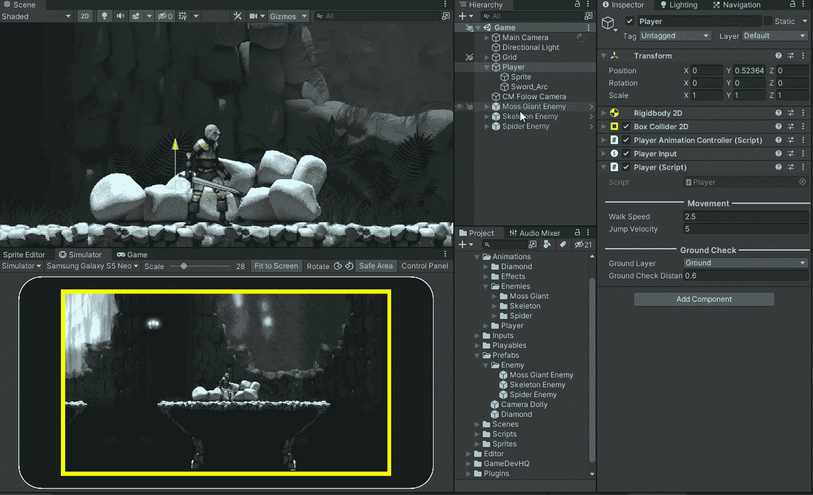
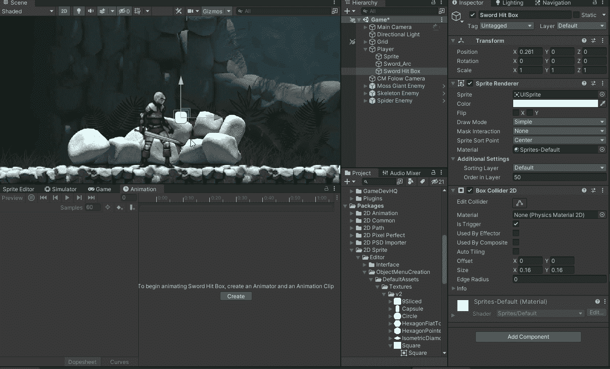
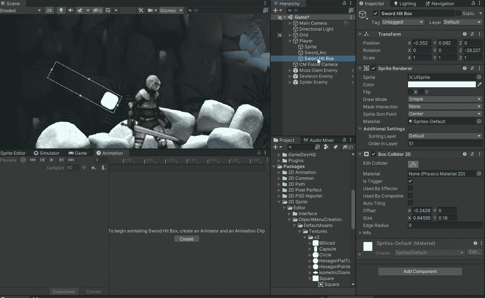
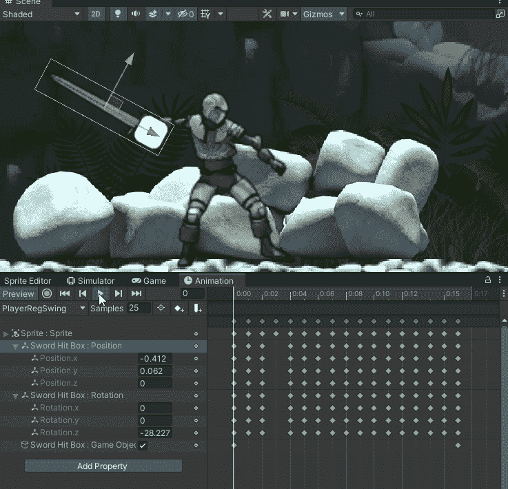
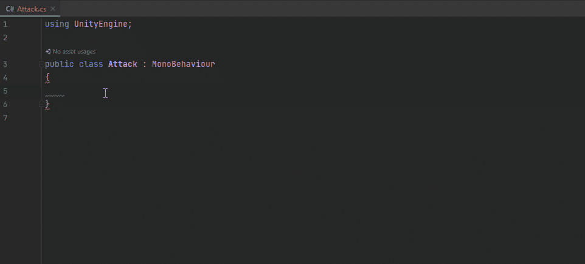
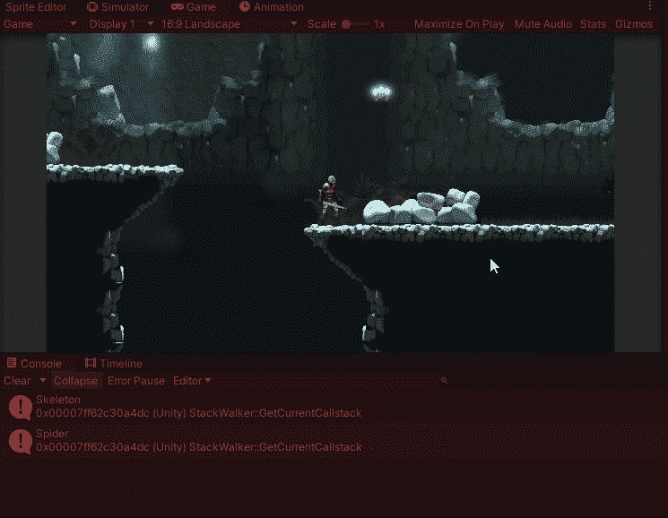

# Hitbox 攻击系统单元 2D

> 原文：<https://blog.devgenius.io/hitbox-attack-system-unity2d-a73258de62e1?source=collection_archive---------7----------------------->

## 刚体碰撞器触发。

我给我的播放器添加了一个精灵，这样我可以在定位点击框时看到它。

接下来，我把我的命中盒做成剑的形状。

然后，我将点击框添加为我的精灵的子对象。然后，我通过记录我的关键帧并定位击中框以匹配每一帧的剑来编辑动画。

现在我的命中盒跟着剑走。

现在我可以创建一个攻击行为，并将其附加到剑命中框。

我还没有创建任何会受到伤害的东西，我要调试一条消息来指示被击中的东西。

我现在可以攻击东西了。

