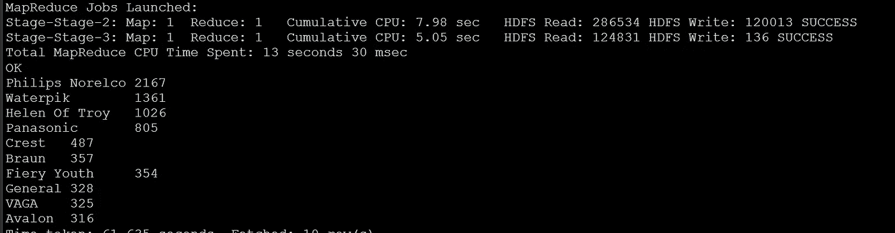

# 亚马逊数据集上的 Hive 查询优化

> 原文：<https://blog.devgenius.io/hive-query-optimization-on-an-amazon-dataset-2e36fd5f0d8a?source=collection_archive---------12----------------------->


作为一名数据工程师，我开发过许多针对大型数据集的复杂 Hive 查询。由于 Hive 是在 Apache Hadoop 框架上构建的，它自带了一套分析功能和优化技术，如分区、分桶、压缩、反规范化、矢量化等。这使得它非常适合像脸书这样处理数 Pb 数据的公司。

虽然我已经在真实世界的数据中使用了其中的一些概念，但我想进一步探索它们，以了解它是如何工作的以及可以看到多少性能改进。我决定使用亚马逊产品评论数据集，特别是美容产品类别，在其上构建一些查询，以便分析数据。

我们开始吧，好吗？

**第一部分:压缩**

*什么是压缩？*

压缩基本上是一种二进制存储格式，它以紧凑的二进制方式存储数据，以减少空间。它可以是面向行的格式，也可以是面向列的格式。面向列的格式使用惰性反序列化，只对被访问的列字段进行反序列化。这无疑降低了数据处理的成本。我们将使用的一种列数据格式是 ORCFile(优化的记录列文件),它将原始数据的大小减少了 75%。

为了这个小型项目的目的，我们使用两个数据集。一个是亚马逊美容产品评论(300k 行)，另一个是亚马逊美容产品的元数据(30k 行)。首先，我们将在 Hive 中使用 JsonSerDe 从 JSON 文件中获取原始数据。

```
create table raw_beauty(`overall` string,`verified` boolean,`reviewTime` string,`reviewerID` string,`asin` string,`reviewerName` string,
`reviewText` string,`summary` string,`unixReviewTime` string,`vote` string,`style` string,`image` string)
ROW FORMAT SERDE
'org.openx.data.jsonserde.JsonSerDe'
WITH SERDEPROPERTIES('mapping.reviewtime'='reviewTime',
'mapping.reviewerid'='reviewerID','mapping.reviewername'='reviewerName','mapping.reviewtext'='reviewText','mapping.unixreviewtime'='unixReviewTime')
STORED AS INPUTFORMAT
'org.apache.hadoop.mapred.TextInputFormat'
OUTPUTFORMAT
'org.apache.hadoop.hive.ql.io.HiveIgnoreKeyTextOutputFormat'
TBLPROPERTIES(
'serialization.null.format'='');#Creating the metadata table
create table raw_meta_beauty(title string,image array<string>,brand string,rank string,main_cat string,asin string,
description string,also_view array<string>,also_buy array<string>,price string,similar_item string,details string,feature string,tech1 string,`date` string)
ROW FORMAT SERDE 
'org.openx.data.jsonserde.JsonSerDe'
STORED AS INPUTFORMAT
'org.apache.hadoop.mapred.TextInputFormat'
OUTPUTFORMAT
'org.apache.hadoop.hive.ql.io.HiveIgnoreKeyTextOutputFormat'
TBLPROPERTIES(
'serialization.null.format'='');
```

注意，因为这是一种简单的文本输入格式，所以字段以冗长的文本格式存储，并且不是很紧凑。

此外，我们将创建可信的表，这些表将被 OrcSerDe 压缩，我们将把原始数据接收到这些表中。

```
create table beauty(`verified` boolean,`reviewtime` string,`reviewerid` string,`asin` string,`reviewername` string,
`reviewtext` string,`summary` string,`unixreviewtime` string,`vote` string,`style` string,`image` string,`overall` string)
ROW FORMAT SERDE
'org.apache.hadoop.hive.ql.io.orc.OrcSerde'
STORED AS INPUTFORMAT
'org.apache.hadoop.hive.ql.io.orc.OrcInputFormat'
OUTPUTFORMAT
'org.apache.hadoop.hive.ql.io.orc.OrcOutputFormat';insert overwrite table beauty
select verified,reviewtime,reviewerid,asin,reviewername,
reviewtext,summary,unixreviewtime,vote,style,image,overall
from raw_beauty;create table meta_beauty(title string,image array<string>,brand string,rank string,main_cat string,asin string,
description string,also_view array<string>,also_buy array<string>,price string)
ROW FORMAT SERDE 
'org.apache.hadoop.hive.ql.io.orc.OrcSerde'
STORED AS INPUTFORMAT
'org.apache.hadoop.hive.ql.io.orc.OrcInputFormat'
OUTPUTFORMAT
'org.apache.hadoop.hive.ql.io.orc.OrcOutputFormat';insert overwrite table meta_beauty 
select title,image,brand,rank,main_cat,asin,description,
also_view,also_buy,price from raw_meta_beauty
```

我们将在 amazon 产品唯一标识符(asin)上连接这两个表，首先使用原始表，其次使用可信表。让我们看看我们观察到的查询执行时间的差异有多大。

```
create table raw_beauty_analysis as 
select b.asin,m.title,m.image,m.brand,b.overall,b.reviewerid,
b.reviewername,b.summary,m.also_view
from raw_beauty b inner join raw_meta_beauty m 
on b.asin=m.asin;
```


总 MapReduce CPU 时间:1 分 3 秒

```
create table beauty_analysis as 
select b.asin,m.title,m.image,m.brand,b.overall,b.reviewerid,
b.reviewername,b.summary,m.also_view
from beauty b inner join meta_beauty m 
on b.asin=m.asin;
```


总 MapReduce CPU 时间:18 秒 100 毫秒

因此，我们已经可以看到，在连接压缩的 ORC 表时，MapReduce 的总 CPU 时间减少了 50%以上。

但是为什么会这样呢？在简单连接中，Hive 使用了一个 MapReduce 连接框架，其中 2 个不同的映射器将根据连接键对这些表进行排序，并发出一个中间文件，Reducer 将把中间文件作为输入文件，并执行真正的连接工作。

但是 Hive 有一个名为“hive.auto.convert.join”的参数，该参数默认设置为 true。如果其中一个连接表的大小小于 25MB，则将较小的表加载到内存中，并且在映射阶段本身执行连接，这降低了混洗-排序和归约操作的成本。这是一个地图连接。我们连接压缩表的第二个查询自动执行了映射连接，因为由于压缩，较小的表具有非常紧凑的大小。


压缩和非压缩文件的大小比较

我检查了原始和可信元数据表的大小。原始表有 266MB，而可信表只有 12MB。这绝对证明了 ORC 是多么有冲击力。

顺便说一下，我们可以通过将“hive . map join . small table . filesize”设置为我们选择的值来定制较小文件的大小。

**第二部分:分区**

*什么是分区？*

Hive 中的分区是一种根据分区列的值将表分成不同部分的方法。使用分区可以更快地对数据切片进行查询。

让我们构建一个分区表并查看一些查询示例，好吗？

```
create table beauty_dpart(verified boolean,reviewtime string,reviewerid string,asin string,reviewername string,
reviewtext string,summary string,unixreviewtime string,vote string,style string,image string)
PARTITIONED BY (overall string)
ROW FORMAT SERDE
'org.apache.hadoop.hive.ql.io.orc.OrcSerde'
STORED AS INPUTFORMAT
'org.apache.hadoop.hive.ql.io.orc.OrcInputFormat'
OUTPUTFORMAT
'org.apache.hadoop.hive.ql.io.orc.OrcOutputFormat';
```

在我们的项目中，我们将使用动态分区，在插入过程中我们可以动态地对数据进行分区。对于我们的表格，我们将在“总体”一栏中对其进行划分，这是评审者给出的评级(从 1 到 5)。

```
SET hive.exec.dynamic.partition = true;
SET hive.exec.dynamic.partition.mode = nonstrict;insert overwrite table beauty_dpart partition(overall)
select * from beauty order by overall;
```


将数据插入分区表

为了试验分区表和非分区表，我决定为以下用例开发查询。

1.  **找出排名最高和最低的品牌。**

让我们看看排名最低的品牌，即出现低评级频率最高的品牌。(注意:我们使用 limit 是因为结果集可能非常大。)

```
select * from (
select m.brand,count(m.brand) as count_frequency
from beauty b inner join meta_beauty m on b.asin=m.asin 
where b.overall in('1.0','2.0')
group by m.brand) tmp
order by tmp.count_frequency desc
limit 10;
```


总 MapReduce CPU 时间:23 秒 60 秒

```
select * from (
select m.brand,count(m.brand) as count_frequency
from beauty_dpart b inner join meta_beauty m on b.asin=m.asin 
where b.overall in('1.0','2.0')
group by m.brand) tmp
order by tmp.count_frequency desc
limit 10;
```



总 MapReduce CPU 时间:13 秒 30 毫秒

当我们使用分区时，有 10 秒的时间差。这是因为我们不需要扫描整个表来查找总体评分 1 和 2，我们已经将它们存储在一个单独的分区文件中。我们观察到的另一件事是，在分区表查询中，跳过了映射连接步骤。stage 2 中两个表的连接本身，而不是为它构建一个不同的 stage，与前面的图相反。

**2。找出最满意和最不满意的评价者。**

这里，我们有一个查询来查找最满意的评论者，因为他们给出了最大数量的高评级。我们在这里也使用了一些 Hive 分析函数。

```
select distinct c.* from (
select reviewerid,reviewername,
count(overall) over (partition by reviewerid) as ratings_count, avg(overall) over (partition by reviewerid) as avg_rating
from beauty where overall in('4.0','5.0'))c
order by c.ratings_count desc
limit 10; 
```


总 MapReduce CPU 时间:37 秒 450 毫秒

```
select distinct c.* from (
select reviewerid,reviewername,
count(overall) over (partition by reviewerid) as ratings_count, avg(overall) over (partition by reviewerid) as avg_rating
from beauty_dpart where overall in('4.0','5.0'))c
order by c.ratings_count desc
limit 10;
```


总 MapReduce CPU 时间:26 秒 970 毫秒

这将产生 26.97 秒的 CPU 时间，而使用非分区表的相同查询将产生 37.45 秒的 CPU 时间。我们还观察到第一个 MR 任务在非分区表中花费了两倍的时间。这可能是在“总体”上过滤数据的步骤。

**3。排名高的产品价格更低吗？**

```
select distinct b.asin,m.title,m.brand,b.overall,m.price
from beauty b inner join meta_beauty m on b.asin=m.asin
where b.overall in('5.0') and m.price is not null
limit 15;
```


总 MapReduce CPU 时间:18 秒 40 毫秒

```
select distinct b.asin,m.title,m.brand,b.overall,m.price
from beauty_dpart b inner join meta_beauty m on b.asin=m.asin
where b.overall in('5.0') and m.price is not null
limit 15;
```


总 MapReduce CPU 时间:11 秒 860 毫秒

因此，一些排名靠前的产品价格较低，而一些则相当昂贵。无论如何，这里的要点是我们再次看到两个查询相差 7 秒。

**4。2005 年至 2010 年间，哪些产品是流行趋势？**

在这里，我构建了一个查询来获取 2005 年到 2010 年间每个亚马逊产品的平均评分，以及给它的评论总数和验证评论总数。我只考虑有超过 50 个验证评论的产品，因为我认为至少有 50 个人认可一个产品是一个好的衡量标准。

```
select distinct asin,avg_rating,reviews_count,verified_reviews 
from(
select asin,avg(overall) over (partition by asin) as avg_rating,
count(overall) over (partition by asin) as reviews_count,
count(case when verified=true then overall else null end) over (partition by asin) as verified_reviews,
year(from_unixtime(unix_timestamp(reviewtime,'MM dd, yyyy'),'yyyy-MM-dd')) as custom_year 
from beauty
)tmp
where custom_year>=2005 and custom_year<2010 and verified_reviews>50
order by avg_rating desc
limit 10;
```


总 MapReduce CPU 时间:30 秒 520 秒

```
select distinct asin,avg_rating,reviews_count,verified_reviews 
from(
select asin,avg(overall) over (partition by asin) as avg_rating,
count(overall) over (partition by asin) as reviews_count,
count(case when verified=true then overall else null end) over (partition by asin) as verified_reviews,
year(from_unixtime(unix_timestamp(reviewtime,'MM dd, yyyy'),'yyyy-MM-dd')) as custom_year 
from beauty_dpart
)tmp
where custom_year>=2005 and custom_year<2010 and verified_reviews>50
order by avg_rating desc
limit 10;
```


总 MapReduce CPU 时间:27 秒 960 毫秒

我们只看到了 CPU 时间上的微小差异，因为我们并没有真正利用我们的分区美丽表的优势。但是，我们使用的是 PARTITION BY analytic 函数，它将结果集划分为多个分区，并在每个分区上应用 window/aggregate 函数。因此，与 GROUP BY 相反，您可以在同一个查询中对不同的字段进行分区。

因此，我又构建了几个查询，并制作了一个比较表来计算平均性能改进。当我们使用分区时，我们看到执行时间减少了 **32%** 。

**第三部分:铲斗**

*什么是 bucketing？*

分桶是将表(或分区)组织成数据块的技术。对于数据采样来说，这是最有效的，并且在相同列上存储的两个表的连接可以实现为存储桶映射连接。

> 映射连接可以利用分桶表，因为处理左侧表的桶的映射器只需要加载右侧表的相应桶来执行连接。
> 
> — Hadoop，权威指南第 4 版

如果两个表在连接列上进行分区，并在该列上进行排序，这通常效果最好，因为这样就变成了一种有效的合并排序。

以下是如何建立一个桶形表。

```
create table beauty_bucket(verified boolean,reviewtime string,reviewerid string,asin string,reviewername string,
reviewtext string,summary string,unixreviewtime string,vote string,style string,image string,overall string)
CLUSTERED BY(asin) SORTED BY (asin) INTO 8 buckets
ROW FORMAT SERDE
'org.apache.hadoop.hive.ql.io.orc.OrcSerde'
STORED AS INPUTFORMAT
'org.apache.hadoop.hive.ql.io.orc.OrcInputFormat'
OUTPUTFORMAT
'org.apache.hadoop.hive.ql.io.orc.OrcOutputFormat';
```

要将数据加载到分桶表中，首先需要在 Hive 中启用分桶参数。我还将最大减速器的数量设置为 4，因为 MR 引擎倾向于将减速器的总数设置为铲斗的总数。

```
set hive.enforce.bucketing=true;
set hive.exec.reducers.max=4;insert overwrite table beauty_bucket
select * from beauty order by asin;
```

因此，我在相同数量的桶上制作了一个分桶元数据表，并用我们在第 1 部分中使用的相同查询将它们连接起来。为了利用桶映射连接，您需要首先设置参数。

```
set hive.optimize.bucketmapjoin=true;
```

对于我的表，我看到非分桶表的执行时间略有减少。也许你应该在一个更大的数据集上尝试一下，看看有什么巨大的不同。您选择的桶的数量也很重要，因为它应该与表的大小相对应。但同时，它不应该有太多的桶，因为这会给资源管理器带来不必要的复杂性。

**第四部分:结论**

虽然有各种各样的 Hive 优化技术，但我在这篇博客中探索了三种非常强大的技术。其他一些值得考虑的是:

1.  Tez 执行引擎(比 MapReduce 引擎强大得多)
2.  矢量化(用例仅限于过滤器和聚合)
3.  反规格化和基于成本的优化

对于许多公司来说，Hive 无疑是一个即将到来的查询框架，因为它提供了一个带有分布式执行引擎的类似 SQL 的平台。如果您对数据工程领域感兴趣，您应该在 Hive 中获得一些很好的实践机会。

注意:我在一个伪分布式 Hadoop 集群上使用 vagger 实现了这个迷你项目。在我的 VirtualBox 上，我将基本内存设置为 4096MB，并将处理器数量设置为 4。

【http://deepyeti.ucsd.edu/jianmo/amazon/index.html】数据集链接:

**参考文献**

1.  Hadoop 权威指南第四版—汤姆·怀特
2.  [https://docs . cloud era . com/HDP documents/HDP 2/HDP-2 . 6 . 3/bk _ data-access/content/wn _ data _ access . html](https://docs.cloudera.com/HDPDocuments/HDP2/HDP-2.6.3/bk_data-access/content/wn_data_access.html)
3.  [https://data-flair . training/blogs/hive-optimization-techniques/](https://data-flair.training/blogs/hive-optimization-techniques/)

快乐生活！