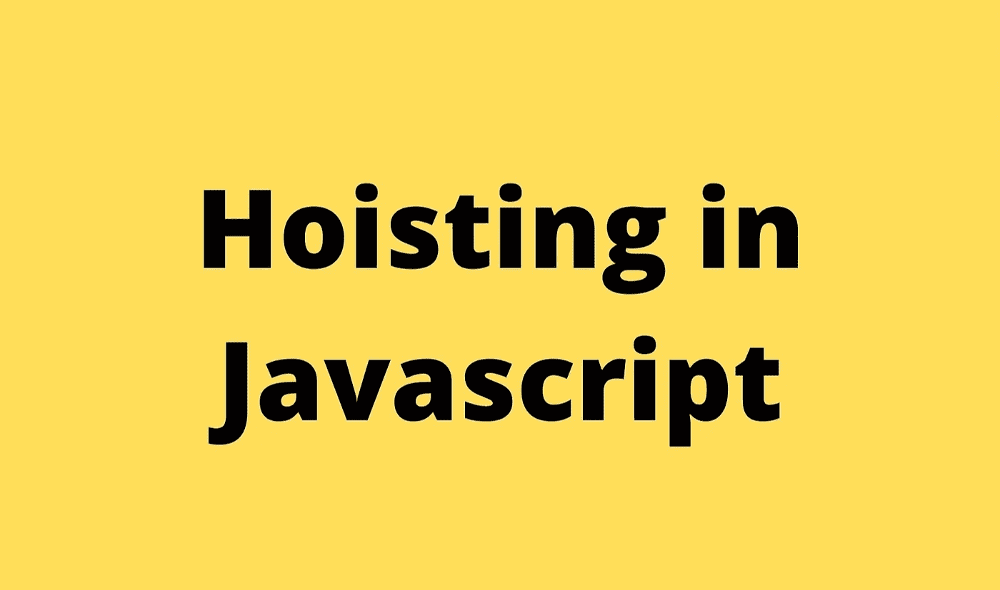

# 在 Javascript 中提升

> 原文：<https://blog.devgenius.io/hoisting-in-javascript-c90f6d03d2df?source=collection_archive---------8----------------------->

在声明变量和函数之前访问它们的机制称为提升。

考虑下面这段代码:

但是，JavaScript 只提升声明，不提升初始化。这意味着变量的初始化会一直进行到相关的代码行被执行，即使变量最初被初始化然后被声明，或者声明和初始化在同一行。

为什么会这样？为什么我们能够访问变量，甚至在变量声明之前初始化它们？奇怪的 Javascript，对吧？实际上，这就是 Javascript 中**执行上下文**的工作方式。在 Javascript 的**代码执行阶段**发生之前，在 Javascript 的**内存分配阶段**期间，Javascript 引擎浏览代码并用`undefined`初始化`var`的所有变量声明。你可以在这里阅读更多关于**执行上下文**和 Javascript 如何工作的信息[。](https://rabisiddique.medium.com/how-javascript-runs-in-the-browser-part-1-7a2b3ce7f5e5)

## 是否悬挂 let 和 const 声明？

问题的答案是肯定的！`let`和`const`声明挂在 Javascript 中。但是，在初始化之前，我们无法访问这些声明。试图在初始化之前访问这样的声明会导致 Javascript 抛出一个`ReferenceError`

考虑下面这段代码:

上述代码片段将导致以下错误:

`ReferenceError: Cannot access ‘name’ before initialization`

该错误信息意味着`name`变量已经存在于内存中。如前所述的`let`和`const`由 Javascript 引擎提升，但与`var`声明不同，它们没有使用`undefined.` `let`进行初始化，并且`const`遵循**时间死区**的原则。由于时间死区的原理，试图在声明之前访问`let`和`const`总是会给`ReferenceError`。

> 一个**时间死区(TDZ)** 是一个变量在计算机用一个值完全初始化之前不可访问的块区域。

简而言之，临时死区是在代码执行阶段，从`let`和`const`声明被提升到这些声明被初始化为某个值的时间。当`let` 和`const`声明已经在代码中初始化/赋值时，时间死区结束。

注意，如果你访问一个不存在的变量，JavaScript 抛出一个不同的`ReferenceError`:

由于`lastname`不存在，Javascript 抛出:

`ReferenceError: lastname is not defined`

到目前为止，我们已经在代码片段示例中使用了`let`。如果我们使用了`const`，会出现什么情况？嗯，使用`const`而不是`let`会显示相同的行为。`let`和`const`声明之间唯一的关键区别在于初始化。与`let`声明不同，`const declarations`必须在声明时初始化，否则 Javascript 会抛出一个`SyntaxError`。

如果我们用`let`声明了`name`，上面的代码片段显示了完全相同的行为，即抛出:

`ReferenceError: Cannot access 'name' before initialization`

然而，不像上面的代码片段那样初始化`const`声明会导致:

`SyntaxError: Missing initializer in const declaration`

此外，与`var`声明不同的是，`const`和`let`声明没有附加到全局`window`对象上。`const`和`let`声明出现在一个单独的空格中。因此，我们不能使用全局`window`对象访问这些声明。

在上面的代码片段中，如果我们试图使用`window`对象打印`middleName`和`lastName`的`let`和`const`声明的值，那么`undefined`将被打印在控制台上。当试图在没有`window` 对象的情况下访问它们时，将打印这些声明的实际值。

## 函数声明和函数表达式的提升

就像变量一样，函数声明也在 Javascript 中被挂起。
此处详细解释了[中函数声明和函数表达式的区别。](https://rabisiddique.medium.com/function-buzzwords-in-javascript-af24c3488a75)

在执行上下文的内存分配阶段，函数声明被放在内存堆中。因此，我们能够在函数声明之前调用它。

考虑到上面的代码片段，调用函数声明，在声明之前先调用`sayMyName`，总是可行的。

那么，函数表达式呢？不，它们在 Javascript 中没有被提升。

当上面的代码片段执行时，它将导致:

`TypeError: sayMyName is not a function`

这是因为，在执行上下文的内存分配阶段，变量`sayMyName`存储在内存中，并用值`undefined`初始化

只有在代码执行阶段，控制台上打印的匿名函数`Heisenberg`才被分配给变量`sayMyName`

因此，函数表达式在 Javascript 中不会被提升。这同样适用于箭头函数，它会抛出同样的错误。因为箭头函数只是定义函数表达式的语法糖。

## 优先顺序

如果一个变量和函数有相同的名字，并且变量被初始化，那么变量赋值优先于函数声明。

> ***变量赋值超过函数声明***

而如果变量没有初始化，那么函数声明优先于变量声明。

> ***函数声明超过变量声明***

非常感谢你花时间阅读这篇博客。

让我们连接:

*   [领英](https://www.linkedin.com/in/rabi-siddique-b6b4971a0/)
*   [推特](https://twitter.com/rabisiddique234)