# home bridge[您需要知道的一切]

> 原文：<https://blog.devgenius.io/homebridge-all-you-need-to-know-631279415c86?source=collection_archive---------2----------------------->

HomeKit 是一个紧凑的家庭自动化解决方案，结合了苹果生态系统和体面的第三方软件应用程序。说到 HomeKit，Homebridge 的作用是最重要的。因此，它提供了一种方法来连接那些可能永远不会添加官方支持的设备。

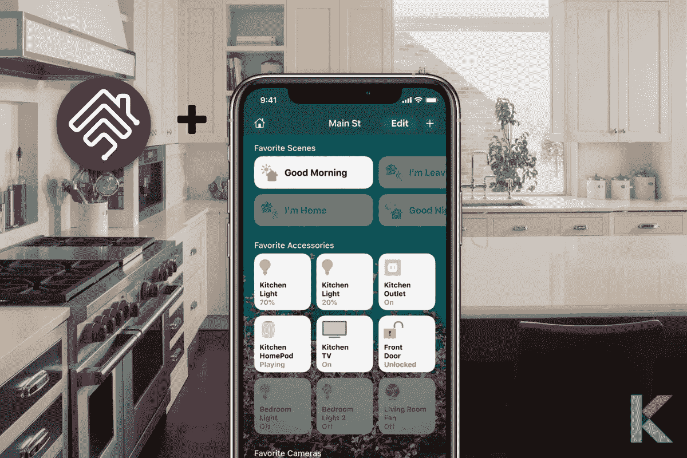

住宅桥

***在本文中，我们将介绍:***

*   *什么是 Homebridge？*
*   *什么是 Homebridge 插件？*
*   【Homebridge 是如何工作的？
*   *如何使用 Homebridge 控制设备？*
*   *为什么需要 Homebridge？*
*   *住宅桥的限制*
*   我们应该在哪台计算机上运行 Homebridge？
*   *如何将不兼容的配件连接到 Homekit？*
*   *如何安装 Homebridge？*
*   *如何卸载 Homebridge？*
*   什么是 Homebridge 金融服务？
*   *最佳 Homebridge 兼容产品*
*   *home bridge 兼容设备的价格和品牌比较*

# 什么是 Homebridge？

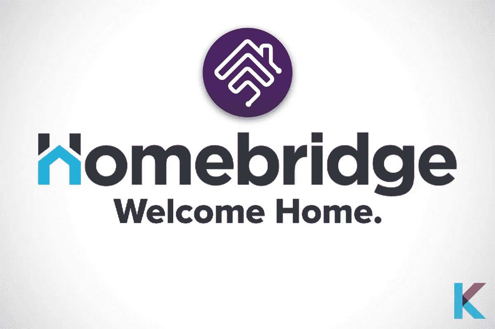

住宅桥

简单来说，Homebridge 就是智能家居设备和[苹果 Homekit](https://kodmy.com/apple-homekit/) 之间的桥梁。它是一个轻量级的节点 JS 服务器。我们可以使用不支持 HomeKit 的 Homebridge 集成我们的智能家居设备。此外，它的用户界面是我们非常熟悉的。因此，您可以使用这个 UI 轻松管理您的插件、附件和配置。

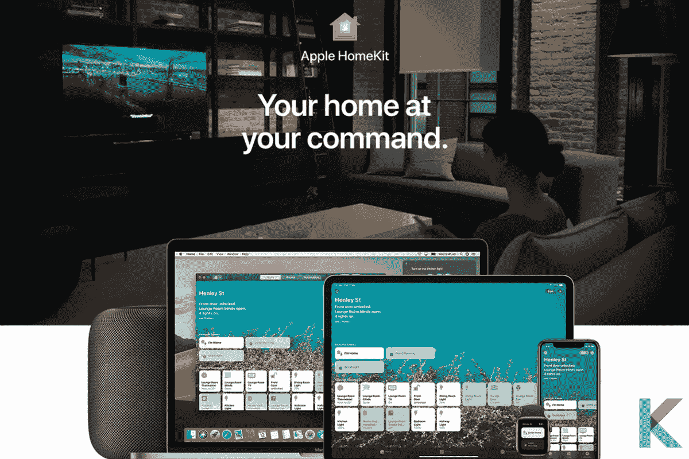

带有 Homebridge 的 Apple HomeKit

还有，HomeKit 是苹果在 2014 年推出的智能家居平台。它让苹果用户能够通过苹果 HomeKit 徽章轻松安全地控制任何家庭设备，如门锁、灯、插座等。

您可以使用 iPhone、Apple iWatch、iPad 和 Mac 控制您的 [Homebridge](https://kodmy.com/homebridge/) 配件并设置自动化。此外，即使不在家，您也可以通过家庭中枢(HomePod、Apple TV 或 iPad)实现安全控制和强大的自动化。实际上它很容易在任何计算机上运行。

虽然苹果 HomeKit 提供了一些强大的自动化和语音控制，但它仅限于硬件支持。例如，您无法为平台找到任何环或嵌套支持。此外，它们与 Sons、Arlo 等其他大品牌不兼容。这就是 Homebridge 对我们非常重要的原因。它很容易解决所有问题。

而且官方 Reddit 社区和 Homebridge Discord 服务器是 Homekit 社区中的两个。你可以讨论这个问题，并通过他们的社区寻求帮助。此外，这些社区可以在 Reddit 和 Discord 上找到。

# 有哪些 Homebridge 插件？

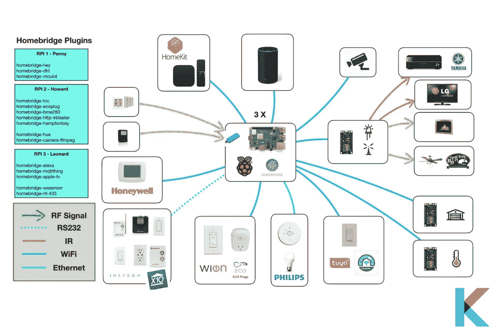

Homebridge 插件

Homebridge 通过其插件提供可扩展的设备支持。这些插件是由第三方开发者建立的。因此，您需要将每个插件安装到 Homebridge 中并进行配置。

有许多插件可用于支持各种智能配件，如 Ring、 [Nest](https://kodmy.com/google-nest-mini-vs-google-home-mini/) 、Hue 和 UniFi protect。这里有一些最好的插件的例子。

*   **图雅 Homebridge 插件**

它是 HomeKit 中图雅设备的自定义插件。它基于图雅开放 API。图雅开发团队正在正式维护这个插件。

有几种类型的图雅设备。它可以支持这个插件，如灯，插座，烟雾传感器，开关，加热器，风扇和车库门。

*   **home bridge-mi-湿度计**

它是小米传感器作为 Homekit 配件推出的 Homebridge 插件。它用于显示测量的湿度和温度。它还支持 E-link 传感器、E-link 时钟和温湿度计 2。

*   **homebridge-zigbee-nt**

这个插件暴露了 Zigbee 设备。它连接到 TI 的 CC253X 无线 SoC 到苹果的 Homekit。它使用 Zigbee-hersman 转换器和 Zigbee-hersman 引擎盖下。

所有支持的设备在技术上都映射到该转换器中。您必须实现一个新的 HomeKit 设备类来启用一个新设备并注册它。此外，它支持[飞利浦](https://kodmy.com/about-philips-hue/)、宜家、虾米、图雅 Innr、LinkIn 设备。

*   **Homebridge-efergy-ego**

Efergy-Ego 是聪明的出路之一。它可以通过 WiFi 进行通信。此外，这个插件允许您通过 Homekit 设备进行控制。

*   **Homebridge RPi**

这是一个树莓的 Homebridge 插件。它暴露给 HomeKit Raspberry Pi 设备和计算机，并连接到 Pi 的 GPIO 引脚。此外，它还可以从 Pi CPU 的 Homkit 监控温度、频率和电压。

它可以监控连接到 Pi 的 GPIO 引脚的 HomeKit 输入和输出设备，如按钮、接触传感器、继电器、伺服迫击炮等。它不像其他的树莓 Pi 插件。此外，它可以运行任何常规的 Homebridge 设置。

# Homebridge 是如何工作的？

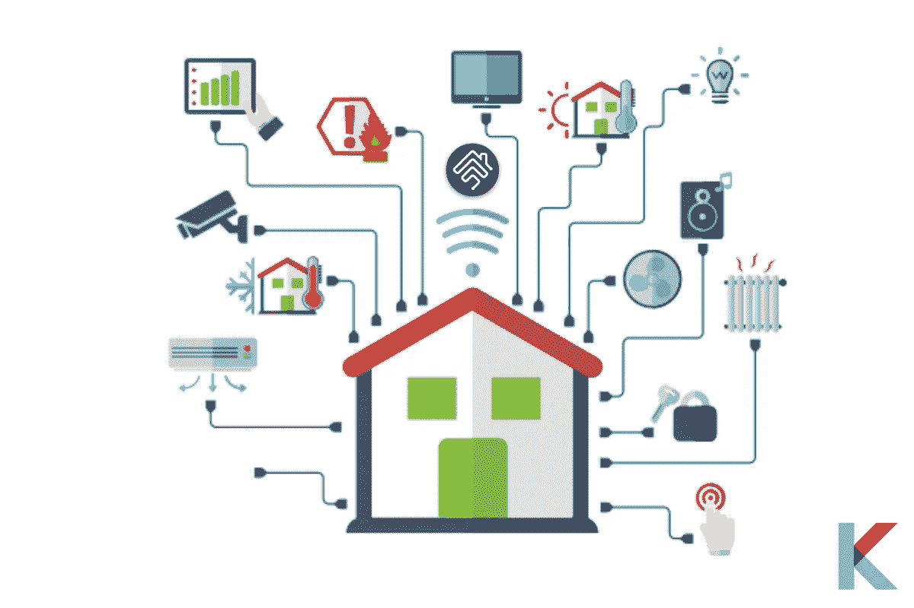

Homebridge 充当了不支持的智能家居设备和 Apple HomeKit 之间的桥梁。它将苹果 HomeKit 的 API 转换为智能设备可理解的 API，反之亦然。它还通过使用插件模拟 iOS HomeKit API 来进行控制。

此外，它们还有用户贡献的组件。知名品牌都有自己的插件可以添加到 Homebridge 中，比如 WeMo、Demotics 和 Netatmo。插件和 Homebridge 都可以从命令行提示符配置为全局 NPM 模块。他们对 Raspberry Pi 系统和 Linux 都很友好。

# 如何使用 Homebridge 控制设备？

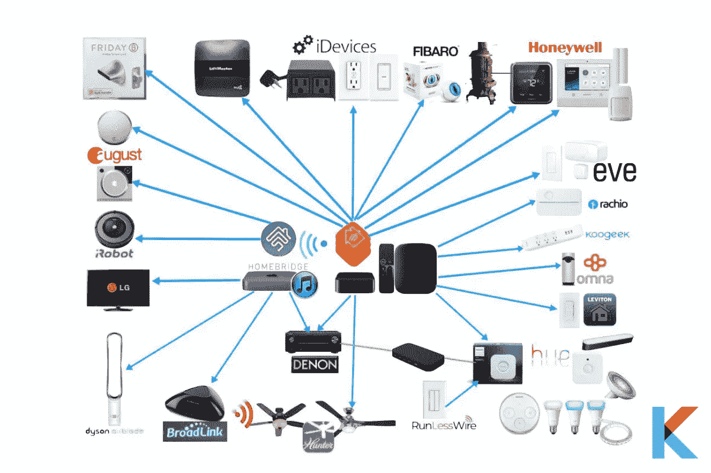

首先，您希望为 Homebridge 设备供电，并为您的 iPad、Apple iWatch、iPhone 和 Mac 进行设置。需要利用 Eve for HomeKit、Apple Home App 或任何其他第三方 HomeKit 软件来调节您的电脑。

此外，一旦您的设备被添加到 HomeKit，您就可以通过 Siri 语音助手使用语音控制您的配件。Siri 是云服务。因此，iOS 需要一些时间来将您的设备数据与 iCloud 同步。

*“Siri，打开餐厅的风扇”*

*“Siri，把温度调到 50 度”*

*“Siri，楼上的灯关了吗？”*

# 为什么需要 Homebridge？

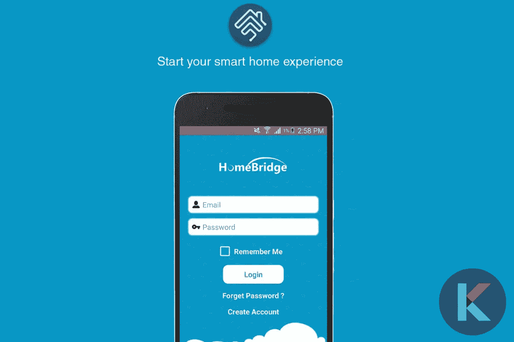

当我们考虑自动化和语音管理时，苹果 HomeKit 是一款很棒的设备。然而，当考虑硬件支持时，它有几个限制。例如，网络上没有 Nest 支持或 Sons 兼容性。它充当计算机和家庭工具包之间的链接。此外，它可以在任何机器上运行。

# 住宅桥的限制

由于 HomeKit 的限制，一个桥只能暴露 150 个附件。但是，您可以将插件作为子桥运行，或者运行多个 Homebridge 实例。

一个附件已经添加到 Home 应用程序一次，通过 Homebridge 更改其名称不会自动在 iOS 中重现。你一定也通过主页应用程序更改了它。

# 我们应该在哪台计算机上运行 Homebridge？

Homebridge 支持 Windows、Linux 和 Raspberry Pi。有一件重要的事情要记住。无论你把它安装在什么设备上，都必须一直开机才能工作。根据这一点，它可以安装在树莓派。此外，这种小型计算机运行起来耗电很少。

有时候，你没有覆盆子酱。但是你想在几种类型的计算机上试用这个系统。首先，你要下载并安装 Node.js 的最新版本，它适用于 Linux、Mac 和 Windows。

# 如何将不兼容的配件连接到 Homekit？

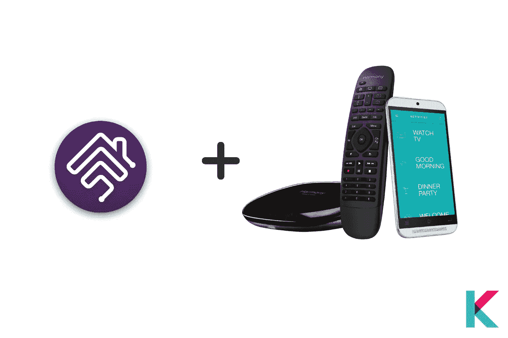

你有没有尝试过把自己喜欢的配件连接到 Homekit 上？以下是一些可能对你有帮助的选择。

你可以通过适当的硬件或软件将你的 Nest 恒温器或门铃带入家庭应用程序。你可以把它们放在最好的家用相机、门锁等等旁边。将不兼容的设备连接到您的 Homekit 很简单。

*   **开始前**

在开始之前，有几件事需要考虑。支持 Homekit 的产品经过了一轮又一轮的艰难测试，并遵循严格的安全准则。对于未启用 HomeKit 的产品，情况有所不同。如果你已经决定遵循这个选项，你可以继续关注，并留意你选择安装在你家。

此外，可能需要一些高级配置。有时，您会对在这里插入一些代码感到不舒服。你可能想坚持点击几下最好的 HomeKit 配件。

*   **添加嵌套附件**

Starling Home Hub 是你入手 Nest 恒温器的最佳选择。它是一个小型集线器设备，通过简单的浏览器界面将选择的 Nest 设备连接到 HomeKit。这款 Starling Home Hub 可以支持 [Google Nest 恒温器](https://kodmy.com/smart-home-technology/#smartHomeDevices)、 [Nest Yale lock](https://kodmy.com/smart-lock-for-smart-life/#best) 、Nest Protect、Nest Learning 恒温器、Nest Cam Outdoor 等几款 Nest 配件。

安装 starling Home Hub 需要几分钟的时间。然后你就可以登录你的账户了。接下来，您希望将中枢添加到 homeKit 主页，就像通过 Home 应用程序扫描二维码来设置 HomeKit 附件一样。

*   **智能物、戒指等**

Homebridge 是连接智能配件和 HomeKit 的替代产品之一。它配有完全组装的 Raspberry Pi 和服务器预装的 microSD 卡。此外，您可以通过插件将各种流行的非 HomeKit 功能的附件连接到您的 Homekit。支持 Ring、SmartThing、 [Wink](https://kodmy.com/wink-smart-home-solution/) 、Nest、MyQ 等智能家居配件厂商。

此外，它只需要点击几次来安装和配置插件。一些插件可能无法正常工作，因为 HOOBS 运行的是 Homebridge 的改进版本。

*   **运行您的服务器**

设置您的服务器很容易。此外，Homebridge 的最新版本现已免费提供。它还可以运行在不同的平台上，如 Windows、Linux 和 macOS。它需要 Node.js 和一些终端命令才能安装在这个平台上。完成所有步骤后，您需要安装插件，并通过干净的网络界面管理您的智能家居。

Homebridge 团队提供了一个智能图像文件。此外，您可以直接闪存到 microSD，以便与 Raspberry 一起使用。将 Homebridge 闪存到存储卡后，您可以将其引导至 Homebridge。有必要通过你的浏览器有一个本地 IP 地址。

# 如何安装 Homebridge？

*   **苹果操作系统**

在 macOS 上安装 Homebridge 之前，您必须确保您的电脑安装了最新版本的 macOS、终端应用程序、Apple Silicon/M1 设备。此外，您必须确保您的系统上还没有它。

**第一步:**安装节点。射流研究…

您必须安装 Node.js。因此，下载 Node.js 的最新版本，并使用默认选项运行安装程序。

**步骤 2:** 安装 Homebridge 和 Homebridge UI

你必须使用"*sudo NPM install-g—unsafe-perm homebridge home bridge-config-UI-x*"命令和 *"sudo hb-service install* "命令来安装 home bridge 和 Homebridge UI。

**第三步:**登录 Homebridge UI

这个界面可以让你安装、更新和删除插件，也可以修改 Homebridge config.json 和管理其他东西。

*   **Windows 10**

在开始安装之前，你必须确保你有一台装有最新版本 Windows 10 的电脑和一个具有管理员权限的帐户。

**第一步:**安装 Node.js

您必须下载最新版本的 Node.js 和安装程序，并选择默认选项。然后以 administration 身份打开一个新的 Node.js 命令提示符窗口。

**步骤 2:** 安装 Homebridge

您可以使用此命令安装 Homebridge UI。NPM install-g-unsafe-perm home bridge home bridge-config-ui-x

**步骤 3:** 将 Homebridge 设置为服务器

使用 Homebridge UI 插件提供的 hb-service 命令。h b-服务安装。

*   **树莓派 OS**

**官方 Homebridge Raspberry Pi 图像设置说明**

在开始设置 Homebridge Raspberry Pi 映像之前，您需要确保您有一个受支持的 Raspberry Pi 型号、一个更大的 SD 卡或一个 4 GB SD 卡。此外，您需要一台 Windows、macOS 或 Linux 电脑，并配备 SD 读卡器。

**步骤 1:** 下载并闪存至 SD 卡

它是完全免费的。您可以将最新版本的 Raspberry Pi 映像安装到 SD 卡上。

第二步:连接网络

您可以使用以太网或 WiFi 连接连接 Raspberry Pi。

第三步:管理你的 Homebridge

此 UI 允许您安装、更新、删除和修改 Homebridge。

**步骤 4:** 连接至 Homekit

您可以在设备上打开 Home 应用程序，然后轻按“添加附件”。

**第五步:**安装并配置插件

使用这个 UI，选择插件，它允许您从 GUI 配置插件。然后，您可以转到 config 选项卡，编辑 Homebridge config.json 文件。

**在 Raspbian 上安装 home bridge**

在开始安装之前，你必须确保你有一个 Ubuntu，Debian 或 Raspbian Linux 机器，桌面终端应用程序，并确保你的系统上没有 Homebridge 或 Node.js。

**步骤 1:** 安装节点 j.s

您希望从授权的存储库中安装 Node.js 的 LTS 版本和其他依赖项。

**步骤 2:** 使用命令安装 Homebridge 和 Homebridge 用户界面。

**第三步:**登录 Homebridge 用户界面

# 如何卸载 Homebridge？

如果要删除 Homebridge 服务运行，请使用此命令。

*sudo HB-服务卸载*

然后，您可以使用此命令删除 Homebridge 和 Homebridge UI 运行。

*sudo NPM uninstall-g home bridge home bridge-config-ui-x*

# 什么是 Homebridge 金融服务？

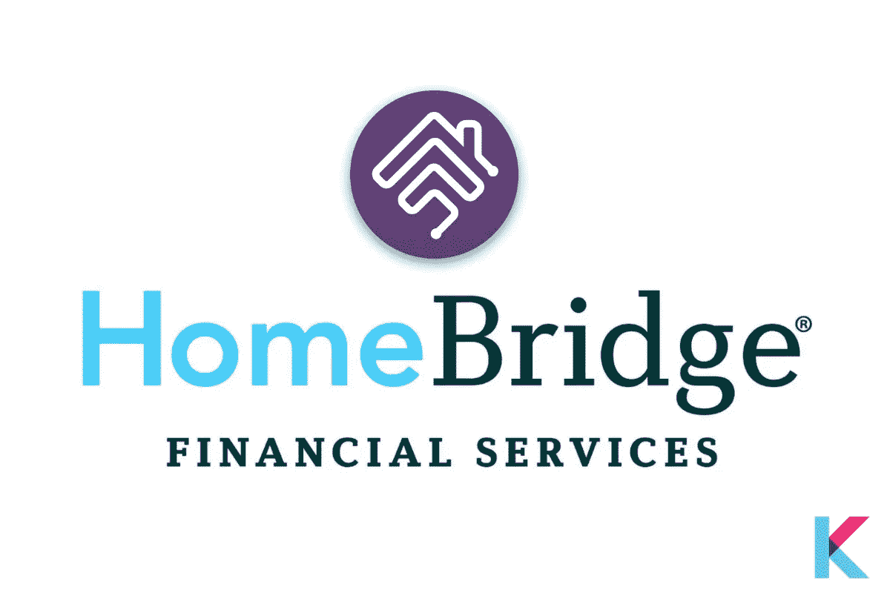

Homebridge 金融服务

Homebridge Financial Services Inc .是一家非银行贷款机构。他们为每个人提供不同类型的住房贷款，从首次购房者到转按揭者。

他们在将近 49 个州设立了分支机构。在完成申请之前，他们鼓励与贷款官员进行讨论。此外，它有广泛的抵押贷款类型和产品。但是，他们不会在网站上公布利率。他们为购房者提供了面对面和在线的多种贷款选择。

根据 Christine 的说法，Homebridge 的贷款大约是政府支持和传统抵押贷款产品的 50/50 组合。这包括面向高收入借款人的巨额抵押贷款和面向中低收入借款人的 FHS 贷款。

此外，还有用于房屋装修的贷款，即翻新贷款。它是将住房改善融资纳入抵押贷款。

有几个再贷款或购买贷款。它可以用于家庭维修和升级。FHA 203(k)贷款、FHA 203(h)贷款和家居风格贷款是 Homebridge 提供的三种 FHA 贷款。

# 最佳 Homebridge 兼容产品

许多智能家居配件无法与苹果 HomeKit 配合使用。然而，你可以很容易地用苹果 Homekit 使这些配件工作。

*   **罗技和谐枢纽**

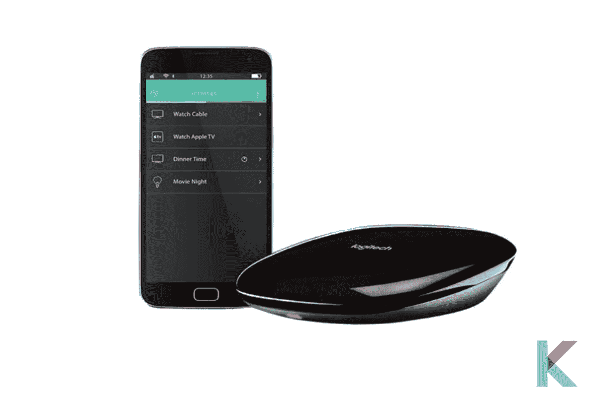

罗技和谐中心

罗技 Harmony Hub 是一个有八个遥控器的小 Hub。你可以使用这个集线器控制你的电视、风扇、音响系统和 [Sonos 扬声器](https://kodmy.com/smart-home-technology/#smartHomeDevices)。它也可以与亚马逊 Alexa 一起工作。你可以用你的声音控制 Harmony Hub，这是一个 iOS 家庭应用程序，当与 Homebridge 配对时，可以使用 Siri。这个插件将 Harmony Hub 活动转换成支持 HomeKit 的开关。

*   **Kasa 智能 Wi-Fi 插头迷你**

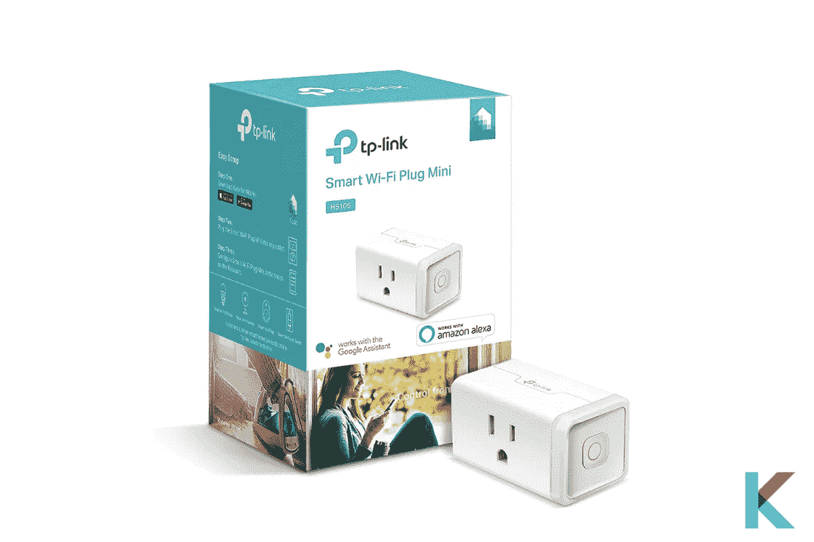

Kasa 智能 Wi-Fi 插头迷你

Kasa Smart Wi-Fi Plug Mini 采用紧凑可靠的设计，从 TP-link 插入。这是最便宜的设备。它还与谷歌助手和亚马逊 Alexa 合作。这很容易与 Homebridge 联系起来。此外，当与 Homebridge 配对时，您可以切换 TP-link 智能插头的电源。

*   **嵌套产品**

嵌套产品

由于缺乏对 HomeKit 的支持，Nest 产品在 HomeKit 爱好者中有点声名狼藉。但使用 Homebridge 插件，你可以很容易地插入你的 Nest 恒温器，Nest 保护烟雾，以及使用它的相机。

*   **WeMo 产品**

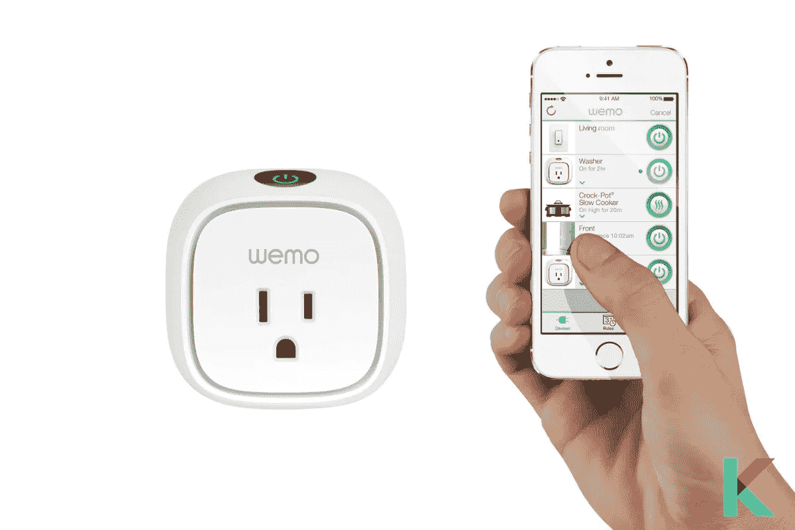

WeMo 产品

您现在可以购买 WeMo Bridge 来为您的 WeMo 小工具添加 HomeKit 支持。您可以使用这个免费的 Homebridge 来完成这项工作。许多 Wemo 附件可以使用这个插件来加载，比如 Wemo 开关、Wemo 灯泡和 WeMo 调光器。

# Homebridge 兼容设备的价格和品牌比较

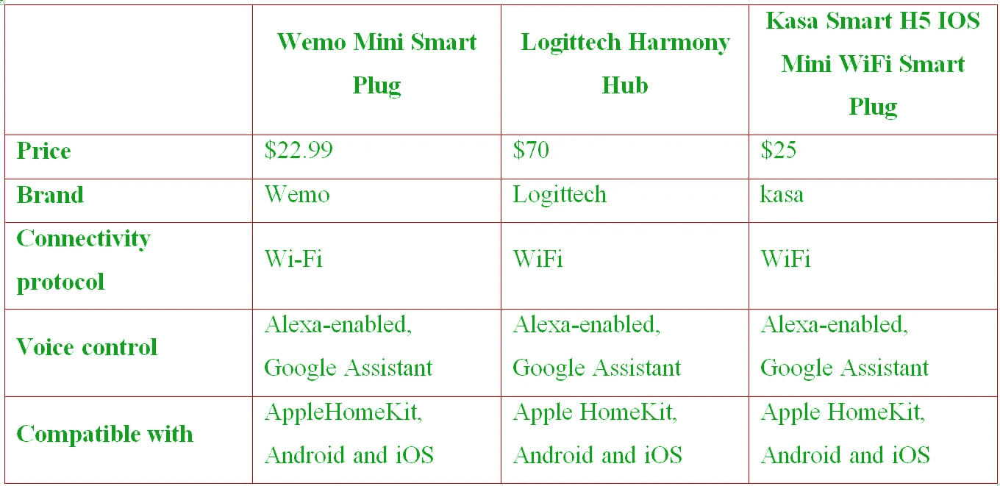

# 定论

不用再担心了。您可以使用 Homebridge 轻松控制不支持 HomeKit 的智能家居设备。配置用户名和密码、添加设备以及将计算机连接到 HomeKit 都包含在向导中。所以你可以在设置好之后让它在 Wi-Fi 上运行。