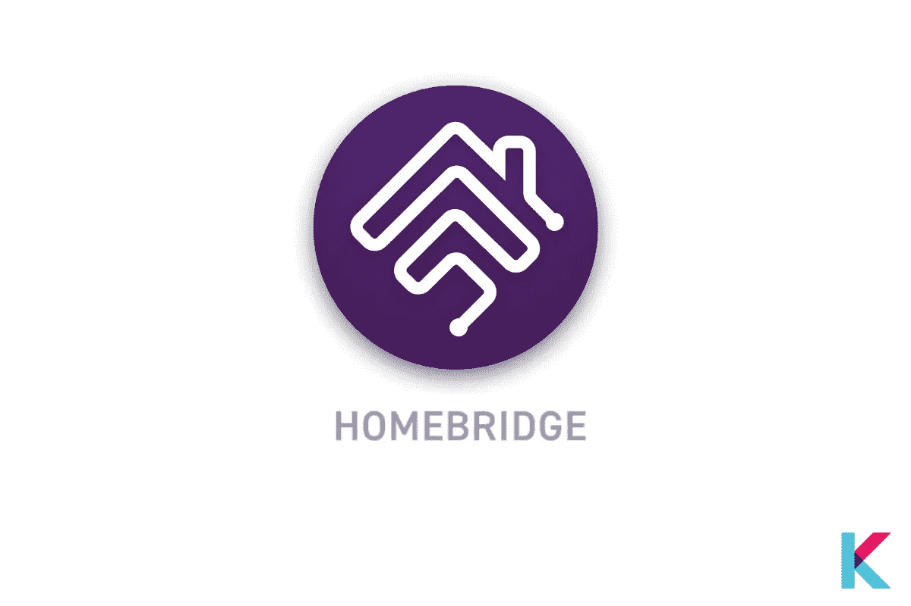

# 环形 Homekit —如何配合 Apple HomeKit 使用环形设备

> 原文：<https://blog.devgenius.io/homebridge-ring-how-to-use-ring-devices-with-apple-homekit-743b9e04433a?source=collection_archive---------0----------------------->

随着 Ring 设备生态系统的不断发展，所有这些设备都有能力在 HomeKit 中发挥作用，而不仅仅是它们的基本功能。虽然 Ring 本身不能提供这种功能，但 Homebridge 提供了通过 Apple HomeKit 使用 Ring 设备的能力。

带有环形设备的家庭桥

在本文中:

*   什么是 Homebridge？
*   环形设备的计算机上的 Homebridge Hub 或 Homebridge？
*   为什么 HomeKit 需要 Homebridge？
*   Ring 可以和苹果 HomeKit 一起用吗？
*   您可以利用 Ring-home kit 集成做些什么？
*   为什么 HOOB 要连接环？
*   如何使用 HOOB 连接 Ring 和 HomeKit？
*   胡博安全吗？

# 什么是 Homebridge？

住宅桥

Homebridge 是一个轻量级服务器。它可以与您的家庭系统集成，为不直接支持 Apple HomeKit 的智能家居配件提供 [HomeKit 集成。换句话说，它是 HomeKit 和第三方应用程序之间的桥梁。](https://kodmy.com/homebridge/)

# 环形设备的计算机上的 Homebridge Hub 或 Homebridge？

计算机上用于环形设备的 Homebridge 集线器或 Homebridge

您可以通过电脑上的 Homebridge Hub 或 Homebridge 将环形设备与 Apple HomeKit 配合使用。让我们看看如何使用 Homebridge Hub 设置带有环形设备的 Homebridge。它是一个小型设备，具有预打包的软件和硬件解决方案。它已经配备了 Homebridge 设置。它连接到家庭网络，以[将戒指配件与您的苹果 HomeKit](https://kodmy.com/apple-homekit/) 集成。

第二种方法是在计算机上设置 Homebridge。我认为这不是一个好的解决办法。因为，要使用这种方法控制设备，您需要让您的计算机全天候运行。这对大多数人来说可能是昂贵的。所以，Homebridge Hub 比第二个便宜。您需要为要连接到 HomeKit 的环形设备安装插件。

# 为什么 HomeKit 需要 Homebridge？

Homekit 只需要支持桥接设备。因此，HomeKit 会自动识别连接到网桥的任何设备。通常，这种装置是由桥梁制造者引入的。但在这种情况下，它是由第三方插件定义的。有许多可用的插件。因此，您可以轻松地将这些附件添加到 HomeKit 中。一旦 Homebridge 安装完毕，你就可以找到其他有用的选项。

当我们考虑 Ring 的情况时，合适的插件提供了 Ring 的云服务和家庭集线器之间的连接。它允许 Homekit 像查找其他 HomeKit 设备一样查找您的戒指设备。

# Ring 可以和苹果 HomeKit 一起用吗？

苹果 HomeKit 支持 Ring 吗

铃声设备不支持 HomeKit。但是您可以使用集线器或网桥将您的智能设备连接到智能家庭网络。它处理网络协议或不同平台之间的通信。此外，它还充当翻译。已经创建了 Homebridge 来处理 Ring 产品和 HomeKit 之间的命令事务。

为 Homebridge 安装 Ring 插件以进行设置。然后，你可以得到一个刷新令牌来设置你的戒指插件。此外，您可以对 Ring 帐户使用电子邮件、密码和双因素鉴定代码。之后，戒指装置应该在你的 HomeKit 上的 Home 应用中可见。

此外，戒指设备或任何产品都没有得到苹果公司的官方认证。您只能[集成环产品或任何使用 Homebridge](https://kodmy.com/homebridge-ring/) 的产品。

# 您可以利用 Ring-home kit 集成做些什么？

HomeKit 集成

您可以轻松控制您的相机流，打开/关闭灯，并通过 HomeKit 集成戒指设备从 Home 应用程序触发您的警报。

*   **用 HomeKit 按门铃**

现在门铃可以集成到您的家庭工具包。集成后，你可以通过点击家庭应用程序上的门铃图标来监控你的门铃。如果有人按你的门铃，你会收到通知。这是真棒，它还包括从相机的快照。

*   **带 HomeKit 的环形安全摄像头**

类似于响[门铃](https://kodmy.com/alexa-smart-home-devices/#smartHomeDevice)。它还可以非常流畅地与您的 HomeKit 配合使用。您可以获得运动传感器警报、丰富的通知以及来自相机的快照。您可以从 Ring 应用程序中打开实时流。

*   **用 HomeKit 响铃报警**

当与 HomeKit 集成时，铃声闹钟是一个奇妙的小工具。你可以从你的家庭应用程序启动或解除警报。此外，您可以使用 HomeKit 设置个性化自动化。

*   **带 HomeKit 的环形智能照明**

您可以使用 Home 应用程序控制和触发所有环形[智能照明产品](https://kodmy.com/about-philips-hue/)，如路径灯、聚光灯和泛光灯。此外，你可以使用它与你的环形相机或警报器，以防止入侵者。当有入侵者时，它会自动触发。

# 为什么 HOOB 要连接环？

胡博

HOOB 代表 Homebridge out of the box，由 RaspberryPi 组成。它还附带预装的软件和 SD 卡。它可以将数千种[第三方配件与 HomeKit](https://kodmy.com/how-to-connect-homebridge-to-my-iphone/#HOOBS) 集成。

只需几分钟即可完成设置，并将所有戒指装置集成到 HomeKit 中。这很容易，简化了设置过程。是的。你不需要自己配置插件。插件开发人员和 HOOB 密切合作，以确保您收到所有您需要的更新和支持。HOOB 不支持 Ring 产品，但也支持数千种其他产品，如图雅、Sonos 和 Harmony。

# 如何使用 HOOB 连接 Ring 和 HomeKit？

通过设置 Hoobs，您可以轻松集成您的环形摄像机、门铃或智能照明。以下是使用 Hoobs 将您的戒指产品与 HomeKit 集成的几个步骤。

***步骤 01:*** 首先，你要将 Hoobs 连接到你的家庭网络

在集成之前，您需要将 Hoobs 连接到您家庭网络。您可以使用 WiFi 或以太网将 Hoobs 直接连接到您的路由器。

***步骤 02:*** 然后，在浏览器上打开 Hoobs 界面。

这可以通过在浏览器上导航到 [http://hoobs.local](http://hoobs.local/) 来完成。传播需要几分钟。之后，您可以通过输入您的用户名、您的姓名和密码轻松创建一个管理员帐户。

***步骤 03:*** 为 Hoobs 安装戒指插件

Ring 插件通过了 Hoobs 的认证，可以与所有 Homebridge 插件一起使用。现在，您已经设置了您的帐户。然后，您可以转到您的仪表板，并单击插件选项卡。

***步骤 04:*** 安装完成后，Hoob 系统会重启，你会看到一个配置插件的屏幕。然后，您可以使用您的电子邮件和密码刷新令牌。

***步骤 05:*** 生成刷新令牌，打开 Hoobs 终端。

在屏幕的右上角有三个点。您可以单击这些点来启动终端并从选项导航到终端。然后，您可以使用以下命令来获取刷新令牌。

*npx-p ring-client-API ring-auth-CLI*

它的功能相当于一个设置向导，会提示您输入 Ring 2FA 代码、电子邮件和密码。然后，输入您的电子邮件和密码。如果您将智能手机设置为响铃，会在您的智能手机上收到 2FA 代码，否则会发送到您注册的电子邮件。一旦这个过程完成，它应该生成一个刷新令牌。

***步骤 06:*** 在 Ring 插件配置界面粘贴刷新令牌。

收到刷新令牌后，请复制并粘贴到 Ring plugin 配置页面的空白处。现在，您已经将戒指装置与您的 HomeKit 整合在一起。除了相机风格的配件，所有的戒指配件都应该出现在你的苹果家里。按照以下步骤添加环形摄像机配件。

***第 07 步:*** 如果你有任何门铃或环形摄像头，你必须手动添加到你的 Apple Home。它们不会自动相加。首先，你想在你的苹果设备上打开 Apple Home。然后，点击添加附件。选择“无法扫描或我没有代码”。一旦你的环形摄像机出现在屏幕上。你想输入 8 位数字相加。此外，您可以在仪表板上找到设置代码。有时，你会得到警告，忽略它，点击“无论如何添加”。最后，您现在已经使用 Hoobs 将所有戒指配件与 HomeKit 集成在一起。

# 胡博安全吗？

在我看来，只要它运行在一个安全的硬件上，Homebridge 就可以安全使用。此外，HOOB 是一个专用的开箱即用套件。它应该是非常安全的，因为它使用 HomeKit 级别的安全性。然而，它运行在您自己的 Raspberry Pi 或其他自己的设备上，漏洞可能由其他程序引入。