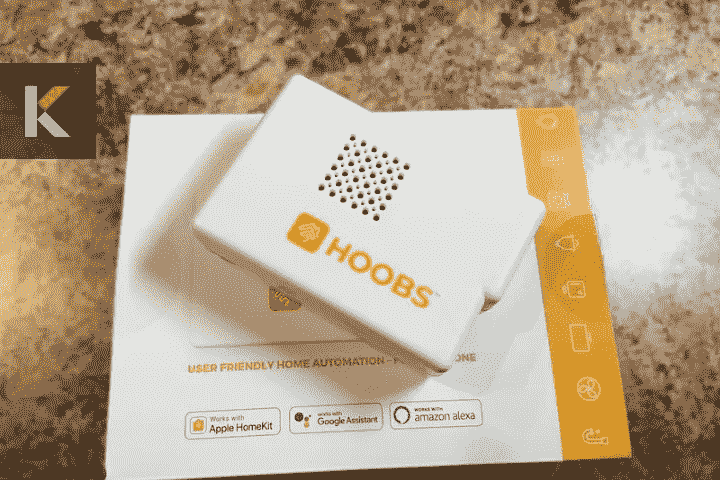
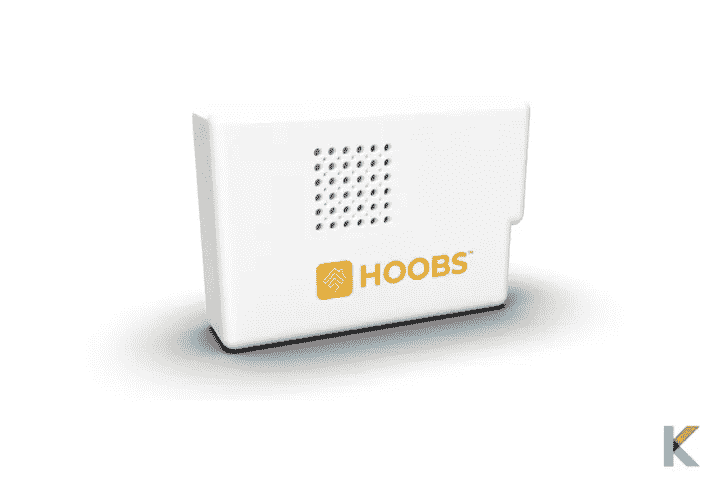
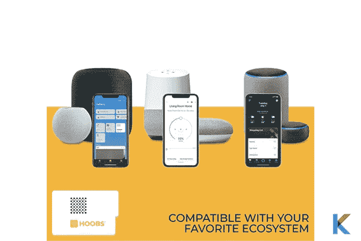
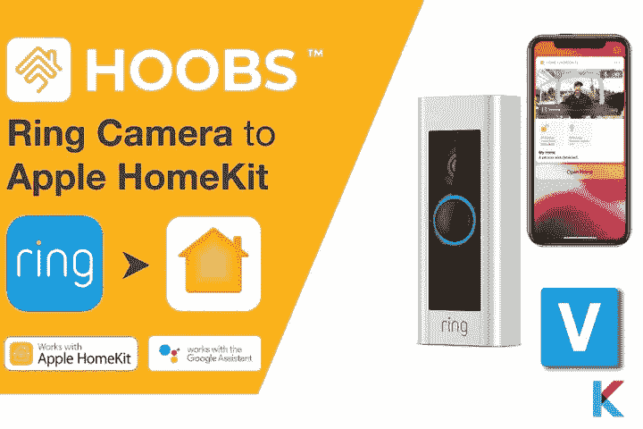
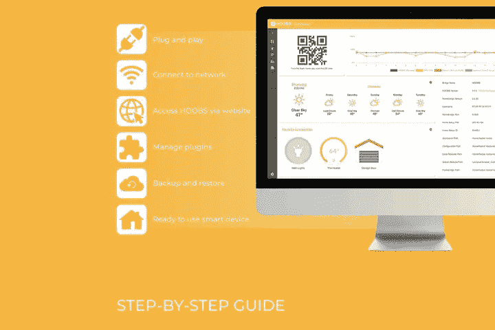
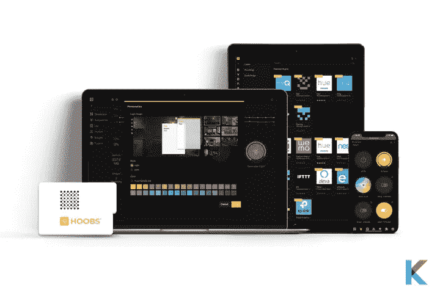

# HOOBS 智能家居自动化—全面回顾

> 原文：<https://blog.devgenius.io/hoobs-369e8b3fea17?source=collection_archive---------6----------------------->

你喜欢把你的智能家居配件连接到你喜欢的生态系统吗？放松点。这篇评论很适合你。智能家居中的一些大品牌现在都与 Home Kit 兼容，如 SmartThings、Ring、Nest、Dyson、iRobot、Honeywell、broad link、Wink、SimpliSafe、Logitech Harmony 等。现在，我将介绍一个可以简化 Homebridge 任务的神奇设备。让我们进入 HOOBS 智能家庭自动化。

# 在这篇文章中，你会学到；

*   什么是 HOOBS？
*   你为什么想要妓女？
*   妓女的利与弊
*   HOOBS 的技术规格
*   胡布斯的主要特征
*   用于 HOOBS 的环形和嵌套插件
*   如何设置 HOOBS？
*   胡布斯安全吗？
*   HOOBS 值钱吗？

# 什么是 HOOBS？

简单来说， [HOOBS](https://kodmy.com/hoobs/) 是你最喜爱的智能家居设备和 HomeKit 之间的桥梁。它代表 Homebridge out of the box，由覆盆子 Pi 组成。它包括 SD 卡和预安装的 Homebridge 软件。此外，新的 HOOBS 4 很快就稳定下来，并且具有令人印象深刻的好看的关键 UI 元素。它极大地改善了整体体验。

胡布斯

HOOBS 是我见过的最小的智能家居服务器。智能插头适合你的口袋。此外，它在您的 WiFi 路由器上本地运行，为您提供多功能性和最大限度的家庭连接。是的。HOOBS 是 Homebridge 的首选解决方案。它有一个简化安装插件和配置的网络界面。

[Homebridge](https://kodmy.com/homebridge/) 有助于将非 HomeKit 兼容设备和自动化引入 HomeKit 兼容设备。它也是一个轻量级服务器，可以在 Raspberry Pi 或计算机上运行。你可以在 Apple Home 应用程序中控制所有非 HomeKit 兼容设备，如[门铃](https://kodmy.com/ring-video-doorbell-3-plus/)，Nest 恒温器或三星 SmartThings 传感器。您可以使用 Homebridge 社区实际构建的 Homebridge 集成或插件。

查看更多:[如何将 Homebridge 连接到我的 iPhone](https://kodmy.com/how-to-connect-homebridge-to-my-iphone/)

但是，这需要大量的故障排除时间和一些编码经验。如果你是第一次接触 HomeKit 或者你没有太多的编程经验，HOOBS 特别适合你。这让所有这些事情变得更容易。他们的目标是统一简化，使 Homebridge 生态系统更加用户友好。

如果你想用可下载的 HOOBS 软件和你自己的 Pi 创建一个 HOOBS 设备，你可以很容易地自己创建它。如果你是智能家居的初学者，它是为每个人设计的。它允许[家庭自动化系统](https://kodmy.com/best-home-automation-systems/)相互通信。此外，有超过 2000 个插件为许多设备带来了兼容性。

此外，它对初学者来说非常友好，具有一体化的简易控制系统。它可以与每个房间的顶级配件搭配。它也有超过 20 种语言的设计。现在，您可以使用 HOOBS 家庭自动化系统从一台设备控制您的所有设备。

**在购买之前检查你的智能设备的兼容性**

许多智能家居设备本身不支持 HomeKit。现在，您可以使用 Canda 智能设备检查器来检查智能家居设备与 Siri 的兼容性。不仅仅是 Siri 兼容性，你还可以用 Alexa 和 Google Assistant 检查你的智能家居设备的兼容性。[立即在 App Store](https://apps.apple.com/us/app/canda-compatibility-checker/id1630339464) 下载智能设备检查器。

[从应用商店下载→](https://apps.apple.com/us/app/canda-compatibility-checker/id1630339464)

[从 Play Store 下载→](https://play.google.com/store/apps/details?id=com.knovik.canda)

# 你为什么想要妓女？

选择这个聪明哥们的理由还有很多。对每个人来说都很容易使用。通过即插即用的解决方案，您可以在几分钟内完成设置。他们为 HOOBS 客户提供插件配置的免费支持。此外，有超过 2000 个插件可供选择，为市场上的许多智能家居设备带来兼容性。

与您喜爱的生态系统兼容的 HOOBS

你知道吗？全世界有超过 300000 个用户，包括自动化家庭和企业。此外，HOOBS in a Box starter Kit 提供了您设置此功能所需的一切，包括 HOOBS in a Box、电源适配器、以太网电缆和微型 USB 电缆。

# 妓女的利与弊

**优点**

*   使用方便
*   可以使用插件创建虚拟配件
*   易于设置
*   响应时间快
*   允许非本地 HomeKit 产品进入 HomeKit

**缺点**

*   一些插件需要配置
*   昂贵的

# HOOBS 的技术规格

*   **WiFi** — BCM43438 无线局域网
*   **蓝牙** —蓝牙低能耗
*   **以太网** — 100mBlt 基础以太网
*   **CPU** —四核 1.2 GHz 64 位
*   **内存** — 1GB 内存，16GB 闪存

# 胡布斯的主要特征

**仪表盘**—HOOBS 的仪表盘允许定制对你来说重要的东西。此外，您还可以向仪表板添加附件和小部件。

**配件** -配件屏幕可以让你控制视野，把家里的配件布置到房间里。

**日志** —这个日志屏幕向你展示你的 HOOBS 设备发生了什么。插件和桥标签是可点击的。因此，它们可以直接访问负责日志消息的插件和桥。

**桥接** -桥接屏幕允许插件相互隔离。默认情况下，您可以通过安装一个插件来创建一个新桥。此外，HOOBS Bridge 是一个完整的 Homebridge 实例，具有独立的配置和插件。

**插件**—HOOBS 插件的屏幕允许您从系统中安装、移除和更新插件。它还支持 Homebridge 插件。

**配置** -配置屏幕允许您更改所有插件和集线器设置。

# 用于 HOOBS 的环形和嵌套插件

环形 HOOBS 插件

环形 HOOBS 插件为环形摄像机、环形门铃、环形报警系统、环形照明系统和连接到环形报警系统的第三方设备提供了一个平台。您需要做的就是安装环插件，并在插件配置页面上使用环登录凭证登录，以连接到环服务器。一旦您的环形设备被链接，您就可以继续使用 Apple Home 应用程序添加环形设备。它们会自动出现在 Apple Home 应用程序中，无需手动添加。

**查看更多**:[Ring home kit——如何配合 Apple HomeKit 使用戒指设备](https://kodmy.com/ring-homekit/)

Nest HOOBS 插件提供了一个平台，将 Nest 恒温器、Nest Protect、温度传感器、Nest x Yale 锁设备集成到您的 Apple Home 系统中。目前，这个插件支持所有这些设备，包括欧盟/英国型号的恒温器。此外，您可以从 HOOBS UI 中的配置屏幕配置这个插件。如果您需要高级配置，可以进一步转到高级配置部分。

# 如何设置 HOOBS？

HOOBS 的设置指南

初始设置很容易。只需要几分钟。您只需将 HOOBS 盒插入插座，然后使用随附的以太网电缆将 HOOBS 连接到您的路由器。之后，想用附带的插头和微型 USB 电缆给集线器加电。接下来，在您的 Raspberry Pi 3b/ 3b +或 4b 中安装 microSD 卡。你想下载 HOOBS 应用程序，并等待几分钟，直到 HOOBS 启动。然后，打开 HOOBS app 它将指导您完成整个安装过程。此外，你可以得到 support.hoobs.com 大学篮球队的支持。

# 胡布斯安全吗？

HOOBS 是非常安全的，因为它运行在您的网络本地。这不是任何向世界开放的机会。它有军用级别的加密技术，可以加密外部通信。所以不要再担心妓女的安全了。

# HOOBS 值钱吗？

如果你想将 HomeKit 添加到不兼容的配件中，或者你想购买不支持 HomeKit 的设备，那么 HOOBS 值得考虑。您将能够将主要的智能家居设备集成到您的智能家居中，如 Nest、Ring 等。如果你不想设置 Homebridge 的麻烦，HOOBS 是适合你的。Homebridge 需要额外的硬件，如 [Raspberry Pi](https://www.raspberrypi.org/) 以及永远安装在 Mac/PC 上。此外，安装和配置过程可能会因终端命令和编辑而变得困难。

胡布斯

你可以用 HOOBS 做一个虚拟 HomeKit 配件的实验。因此，它是一个非常有用的工具，可以让你的家庭各个方面实现自动化。此外，您可以使用现有的传感器和扬声器创建虚拟开关和虚拟报警系统。当我们考虑它的成本时，它只有 199.99 美元。

# 我们的选择

HOOBS 初学者工具包实际上值得一看。它是一个很小的盒子。但是它为你做了所有的工作。它有数以千计的配件插件和易于使用的界面。你需要做的只是点击几下，将 Nest 恒温器和门铃等 HomeKit 附件添加到 Home 应用程序中。它为每个用户提供了一个简单的推荐。此外，您还可以向新配件、自动化可能性和设备类别开放您的 HomeKit 主页。如果你渴望用 HOOBS 打造你的智能家居，现在是时候把你所有的配件都连接到 HOOBS 上了。它为每个人提供用户友好的家庭自动化。

如果你对另一个智能家居系统感兴趣，你可以找到我们的 [KNX 智能家居](https://kodmy.com/knx-smart-home/)文章。