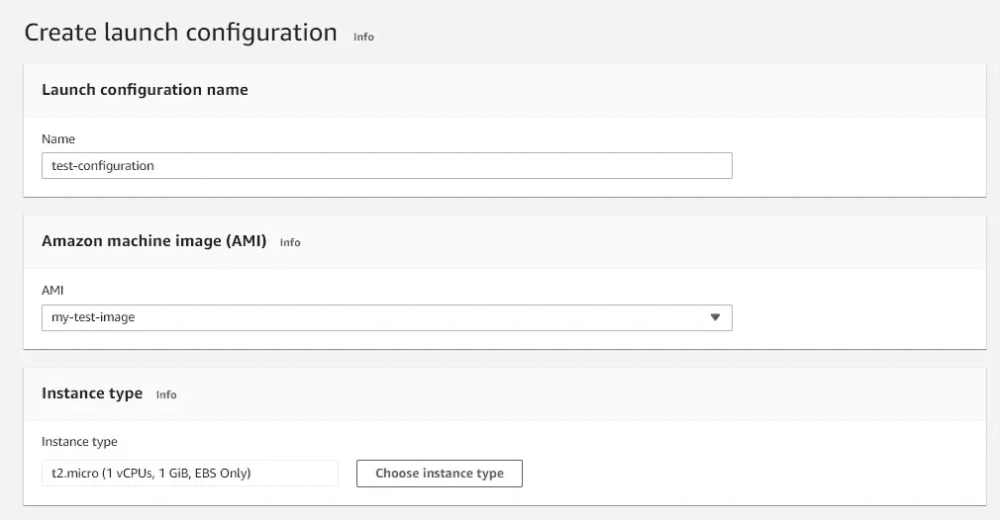

# 使用 EC2 自动扩展组的水平可扩展性

> 原文：<https://blog.devgenius.io/horizontal-scalability-using-ec2-auto-scaling-groups-c15f9eb63a58?source=collection_archive---------6----------------------->

“水平可扩展”系统可以通过向系统添加更多机器来增加容量，因此使用“水平”一词。这与“垂直可伸缩”系统形成对比，后者只能在一台计算机上运行其进程；在这样的系统中，提高性能的唯一方法是以更快(或更多)的 CPU、[内存](https://wa.aws.amazon.com/wellarchitected/2020-07-02T19-33-23/wat.concept.memory.en.html)或存储的形式在一台计算机中添加更多的资源。


通过支持并行执行[工作负载](https://wa.aws.amazon.com/wellarchitected/2020-07-02T19-33-23/wat.concept.workload.en.html)并将它们分布在许多不同的计算机上，水平可扩展系统的表现通常优于垂直可扩展系统。让我们更详细地理解这一点。

假设我们有一个运行在单台机器上的 web 服务，它接受一个请求，对它执行 CPU 密集型计算，并以一个结果作为响应。现在想象一下，几千个这样的请求同时被发送到这个 web 服务，你认为会发生什么？

如果你认为机器变得很慢，没有反应，那么你是正确的。我们该如何应对？

一种解决方案是在不同的机器上托管我们的 web 服务的几个实例，并在它们前面部署一个负载平衡器。在本文中，我们将学习在 AWS 上配置自动伸缩组，以根据其中一台机器的平均 CPU 利用率指标部署额外的实例，作为概念验证。

**创建自动缩放组**

1.  访问此[链接](https://ap-south-1.console.aws.amazon.com/ec2autoscaling)并点击“创建自动缩放组”。


创建自动缩放组。

2.输入自动缩放组的名称，并创建启动模板或配置。在本文中，我们将创建一个启动配置。



正在创建启动配置

在上面的步骤中，输入名称后，我们需要选择一个机器映像，我已经从以前存在的 t2.micro CentOS 实例之一创建了一个映像。如果您想从现有的 ec2 实例中创建一个映像，您可以遵循这里列出的步骤。


3.如果要使用新的安全组，请创建一个安全组，并选择一个密钥对用于登录。如果您想了解更多关于如何创建安全组的信息，请访问此[链接](https://docs.aws.amazon.com/AWSEC2/latest/UserGuide/working-with-security-groups.html#creating-security-group)。完成后，按“创建启动配置”。创建启动配置后，您可以返回“创建自动扩展组”屏幕并选择此配置。


第 2 步到第 6 步是可选的，所以按照你认为合适的方式进行配置。


对于本教程，我选择了所需的容量为 1，最小实例数为 1，最大容量为 2。完成后，您可以在创建自动扩展组之前检查所有配置。

一旦成功创建了自动扩展组，导航到 Services/EC2/instances，您将看到创建了一个实例，如下所示。


到目前为止，我们刚刚创建了一个自动缩放组。我们还没有跟踪 CPU 利用率的机制。为此，我们可以利用 AWS CloudWatch 度量服务。

3.为此，点击“报警状态”栏下的添加报警，如下所示。


上述配置表明，如果发现 CPU 利用率在 5 分钟内平均超过 60%,则触发此警报。到目前为止，我们只创建了一个警报，我们还没有真正将它与自动缩放的概念联系起来。我们现在就去做。

4.转到 Services/EC2/Auto Scaling groups，单击我们之前创建的自动扩展组。见下文。


导航到“自动缩放”选项卡，然后单击“创建动态缩放策略”。


创建动态扩展策略

上面的配置表明，如果触发了这个警报，那么向自动缩放组添加另一个实例。

我们现在要做的就是连接到之前创建的单个实例，并在 1 分钟内将其 CPU 负载增加到 60%以上。

# **我们如何模拟高 CPU 负载的情况？**

我们可以使用[压力工具](https://linux.die.net/man/1/stress)来完成这个任务。使用以下命令连接到 CentOS 实例

```
ssh -i “your .pem file” ec2-user@ec2–xx–xxx–xxx–xxx.ap-south-1.compute.amazonaws.com
```

下载。应力工具的 rpm 文件如下所示

```
curl fr2.rpmfind.net/linux/dag/redhat/el7/en/x86_64/dag/RPMS/stress-1.0.2–1.el7.rf.x86_64.rpm -o stress-1.0.2–1.el7.rf.x86_64.rpm
```

使用 yum 安装它

```
yum localinstall stress-1.0.2–1.el7.rf.x86_64.rpm
```

现在，我们可以使用下面的命令让 CPU 利用所有资源。

```
stress — cpu 8 — io 4 — vm 2 — vm-bytes 128M — timeout 150s
```

您可以访问 CloudWatch 管理控制台，查看 CPU 利用率趋势的可视化。在我的例子中，使用上面的命令，我能够成功地使 CPU 超过我们设置的 60%的阈值。


由于超出了阈值，根据我们之前配置的动态伸缩策略，ec2 自动伸缩服务已经启动并自动创建了一个额外的实例。请看下文。


这难道不令人着迷吗？

在本文中，我们主要讨论了 ec2 自动伸缩如何与 CloudWatch 警报结合使用，以自动添加额外的实例。这同样适用于缩减所用机器的数量，具体取决于具体的指标。

虽然可以使用微服务，但除了 Docker 和 Kubernetes 之类的技术来实现固有的自动扩展之外，了解云技术也很重要，云技术允许我们在相对较短的时间内实现类似的事情。这种意识有助于我们为日常工作中遇到的问题/挑战选择适当而简单的解决方案。

# **参考文献**

1.  AWS 架构良好的框架
    https://wa . AWS . Amazon . com/Well Architected/2020-07-02t 19-33-23/index . en . html
2.  什么是亚马逊 EC2 自动缩放？
    https://docs . AWS . Amazon . com/auto scaling/ec2/user guide/what-is-Amazon-ec2-auto-scaling . html。
3.  使用亚马逊 CloudWatch 警报
    [https://docs . AWS . Amazon . com/Amazon cloud watch/latest/monitoring/alarmthatsendsemail . html](https://docs.aws.amazon.com/AmazonCloudWatch/latest/monitoring/AlarmThatSendsEmail.html)。
4.  缩放您的自动缩放组的大小
    [https://docs . AWS . Amazon . com/Auto Scaling/ec2/user guide/Scaling _ plan . html](https://docs.aws.amazon.com/autoscaling/ec2/userguide/scaling_plan.html)。
5.  从 Amazon EC2 实例创建 AMI
    [https://docs . AWS . Amazon . com/toolkit-for-visual-studio/latest/user-guide/tkv-create-AMI-from-Instance . html](https://docs.aws.amazon.com/toolkit-for-visual-studio/latest/user-guide/tkv-create-ami-from-instance.html)