# 医院满意度调查-数据分析项目。

> 原文：<https://blog.devgenius.io/hospital-satisfaction-survey-data-analysis-project-a238c5a1dbe5?source=collection_archive---------0----------------------->

在 [Unsplash](https://unsplash.com?utm_source=medium&utm_medium=referral) 上[精确拍摄](https://unsplash.com/@accuray?utm_source=medium&utm_medium=referral)

我没想到我会带着另一个项目回到这里，但是好吧，我来了。由于我已经处理过数据集/提取了我自己在不同领域的数据，如媒体、呼叫中心、人力资源、我们自己的假数据，我想改变我处理的数据类型，所以决定使用卫生部的数据。

该项目的步骤:

*   了解我们的数据。
*   使用 Python 清理和转换我们的数据。
*   将其可视化，然后使用 Tableau 构建一个仪表板。

> 这个项目的 GitHub 库在这里 链接 [*。*](https://github.com/Armonia1999/Hospital_Satisfaction_Survey)

# 第一步:了解我们的数据。

这里 可以找到原始数据 [**。如果你不会说希伯来语，没有必要对这种语言感到害怕，因为随着我们的进行，所有这些都会被翻译/解释。**](https://data.gov.il/dataset/satisfaction-hosp-general2016)

在你下载了链接中提供的 xls 文件后，你会发现 3 张表格:第一张包含原始数据，第二张包含关于专栏内容的信息，最后第三张解释了不同答案背后的含义。例如，一些列的值在 1 到 5 之间。1 是什么意思？5 是什么意思？

这是什么数据？基本上，这是 2016 年在以色列医院进行的一项调查。它有关于医院的信息:医院名称，规模，病人所在的病房。关于病人本身的信息:性别、年龄、宗教、语言和他们的健康状况等等。最后，它列出了这些患者提交的大约 37 个调查问题的答案。这就是我们的数据，令人兴奋，不是吗？我们走吧。

看了我们的数据，竟然有这么多列，让我大吃一惊！143 列和 11k+行，但是在浏览每一列之后，很明显，有些列是重复的，但是名称不同，有些列没有值，有些列基本上没有任何用途。真正帮助我摆脱很多问题的是，调查问题每个重复 3 次！起初，我认为这可能是有目的的，可能是不同的人或不同形式的问题，但当我们看到列出列和它们是什么的表格时，没有任何解释。一点也不。所以我也摆脱了他们。但是不要太快！永远不要删除这样的数据，除非它是空的或者绝对是另一个数据的副本。所以我做的是创建另一个名为“修改”的工作表，并复制其中的所有数据，然后我才应用这些更改。去我上面提供的仓库看看我到底修改了什么。现在让我们从原始数据开始查看我们的数据:

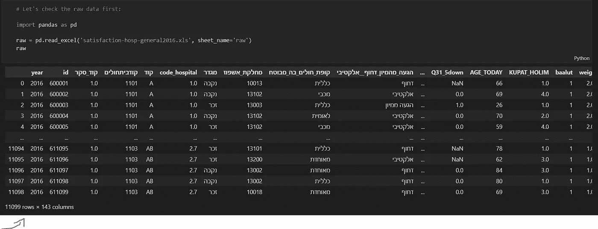

怪异。改装的呢？

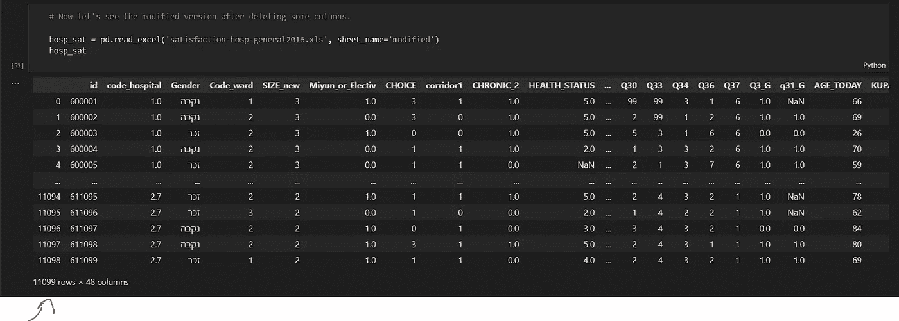

从 143 列增加到 48 列。吵闹。然后..

# 第二步:使用 Python 清理和转换我们的数据。

让我们获取一些关于这些列的信息:

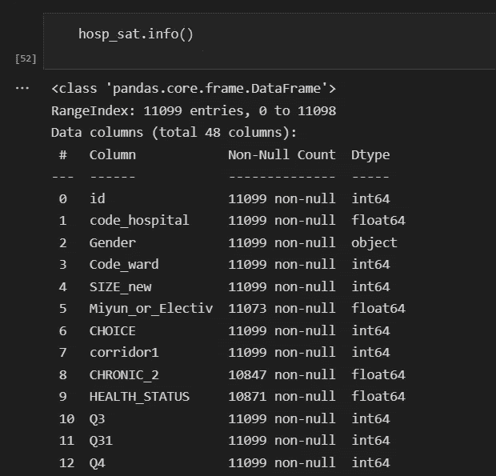

其余的列也列出来了，但是没有在这里添加，因为列表太长了。

我们已经可以发现一些 NaN 值，如列 *Miyun_or_Electiv、CHRONIC_2、HEALTH_STATUS* 以及底部的一些我们看不到的值，因此我们需要继续工作。

这里需要注意的另一件事是，我们需要改变一些数据类型。例如:column SIZE_new 是一个列，它使用数字 1-3 列出了医院的大小，这些数字分别对应于小-中-大。但在我们用实际值而不是数字填充数据帧后，这种情况最终会改变，这样就可以很容易地使用 Tableau 来显示它。

这些列中的每一列有多少个空值:

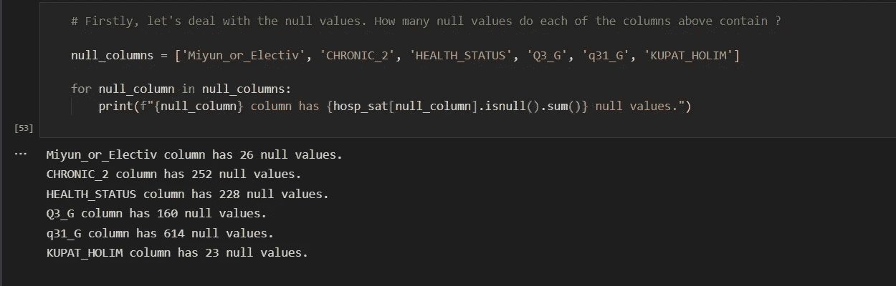

这些列的唯一值是什么？

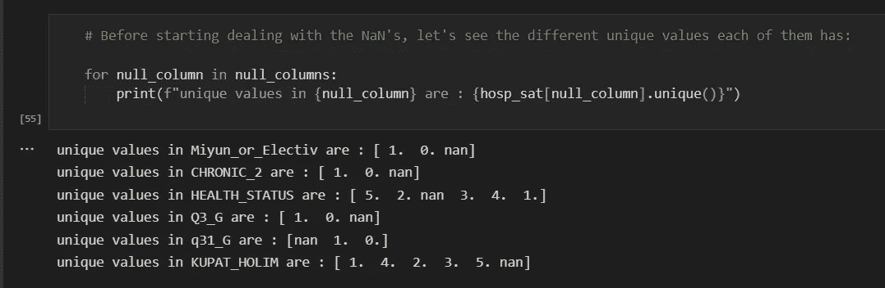

让我们开始填写这些 NaN:

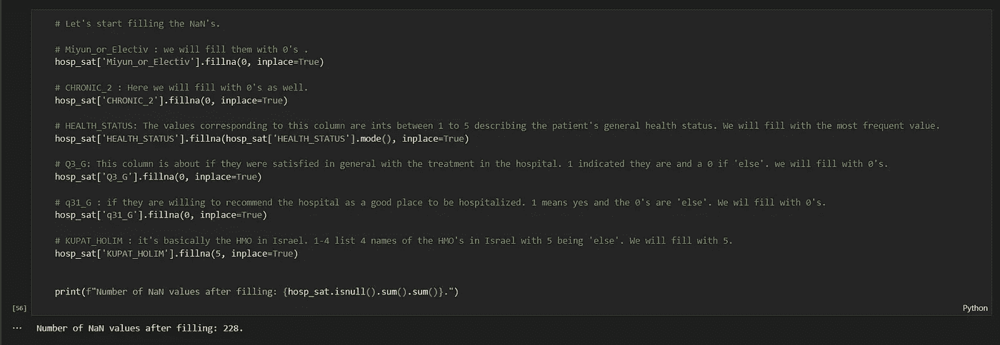

我们产生幻觉了吗？你说还有几个没受伤的奶奶是什么意思？巧合的是，这也是 health_status 一栏中 nans 的数量，但是为什么呢？这个模式有用吗？

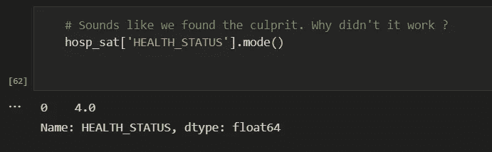

是的，它在工作，那么问题是什么呢？快速搜索让我找到了[这个](https://stackoverflow.com/questions/42789324/how-to-pandas-fillna-with-mode-of-column) stackoverflow 问题，并得到了解决:)让我们来解决它:

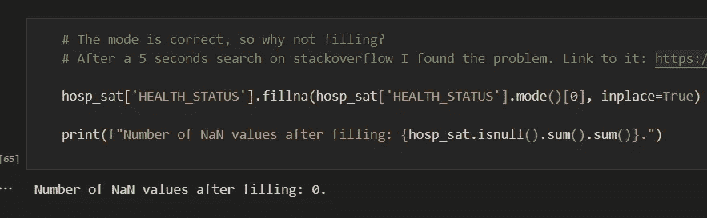

**如释重负* *不再有空值。我们的下一个任务:我们确定每一列只列出它应该列出的值吗？

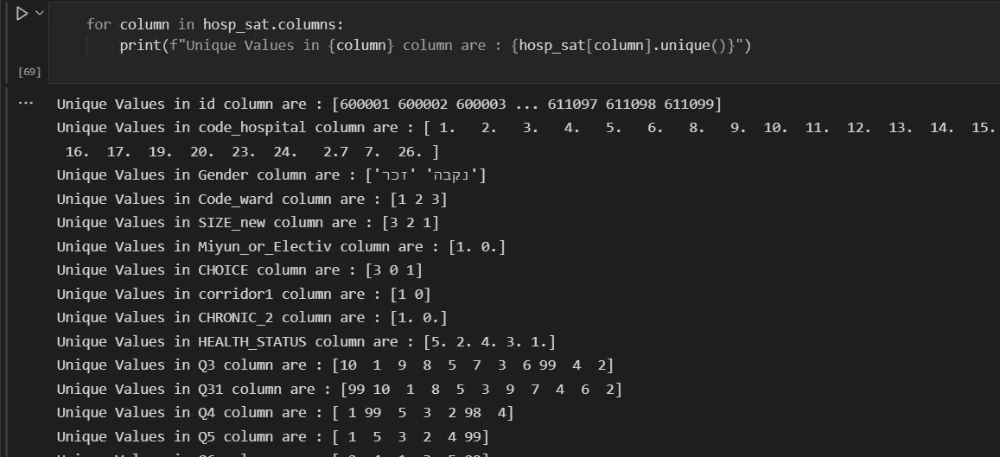

因为太长，裁剪了图片。

休斯顿，我们有麻烦了。有问题的列是“选择”和“代码 _ 医院”。选择应该只有值 0 和 1。谁邀请的那 3 个？列代码 _ 医院有重复值。如果我们检查 excel 值，我们发现值 2.7 和 27 列出了同一家医院:

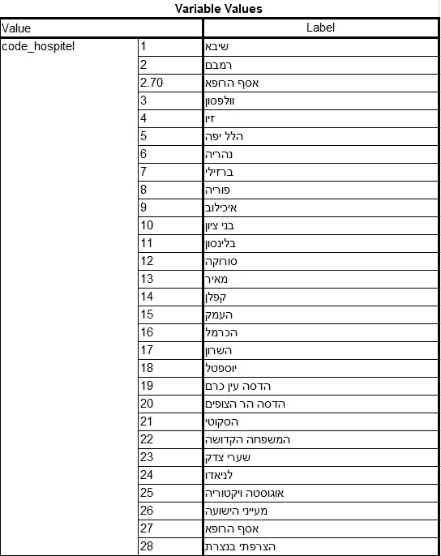

首先，让我们处理选择。我们有多少个 0，1 和 3？

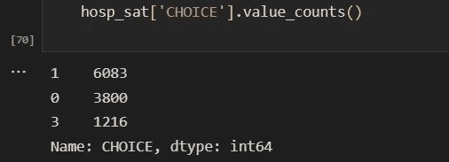

这是很多 3。我们不能简单地选择用 0 或 1 来代替它们，甚至删除它们各自的行。因此，我们将使用一种称为向前填充的技术，基本上是插入 3 之前的值作为替换。

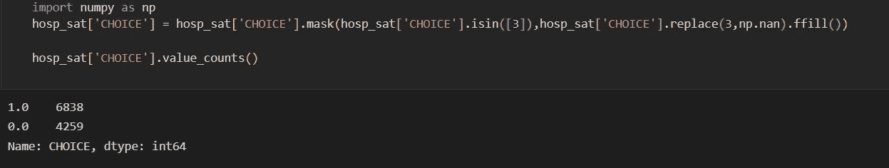

我们来处理代码 _ 医院:

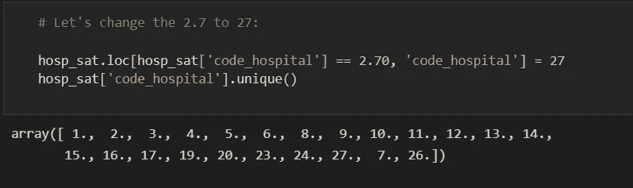

既然我们已经处理了这个问题，是时候用一些单词填充我们的数据框架了。从医院名称开始:

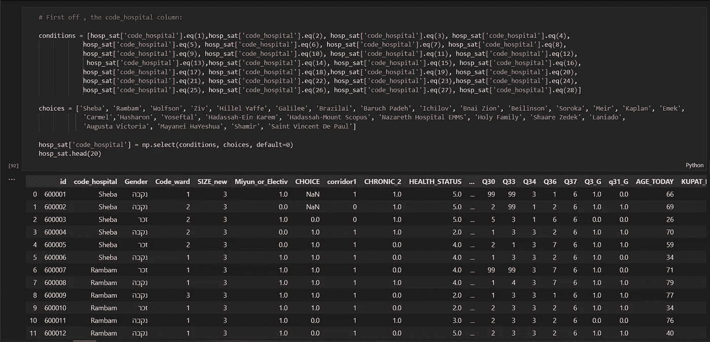

接下来是性别:

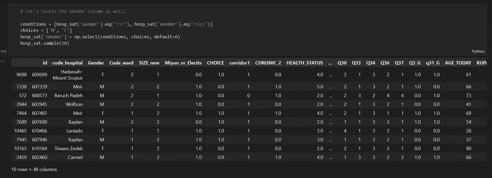

现在您已经掌握了它的窍门，没有必要继续为这篇文章截屏了，我继续在其余的专栏中做同样的事情，并且非常欢迎您去检查我在开始时提供的存储库并亲自查看。这是它最后的快照:

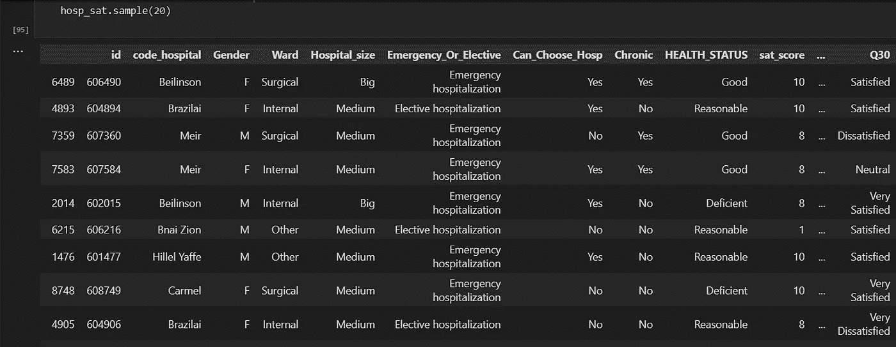

好多好多~

既然我们已经清理了 dataframe，让我们将它保存为 xlsx 文件，以便稍后用于 tableau 仪表板。

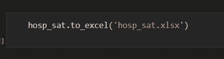

在继续我们的分析之前，我将最后把我们的问题翻译成英语:

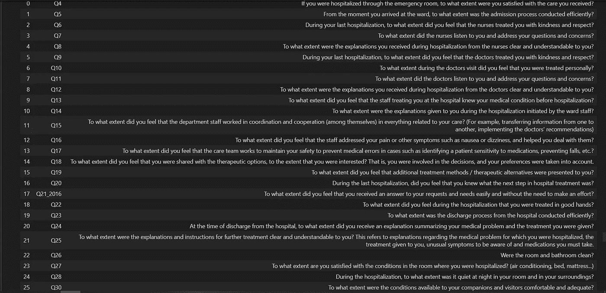

最好去朱庇特笔记本看看。

好吧，来点更有趣的:一些小小的 EDA。

我们从每家医院调查了多少病人，这家医院有多大？

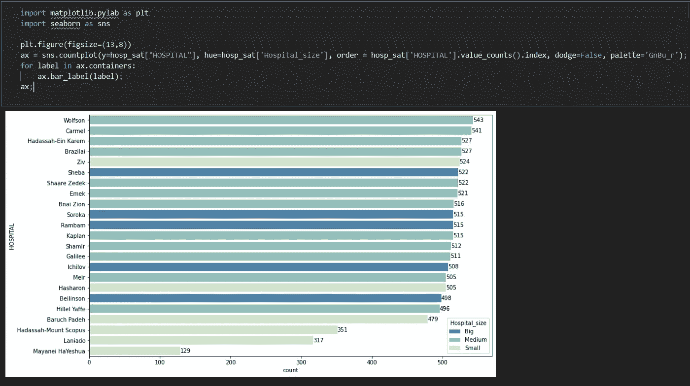

我们不能从这个图中推断出大小和病人数量有什么关系。下一个问题:我们有多少男性和女性病人？

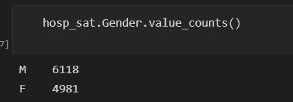

病人是如何分布在不同的病房的？

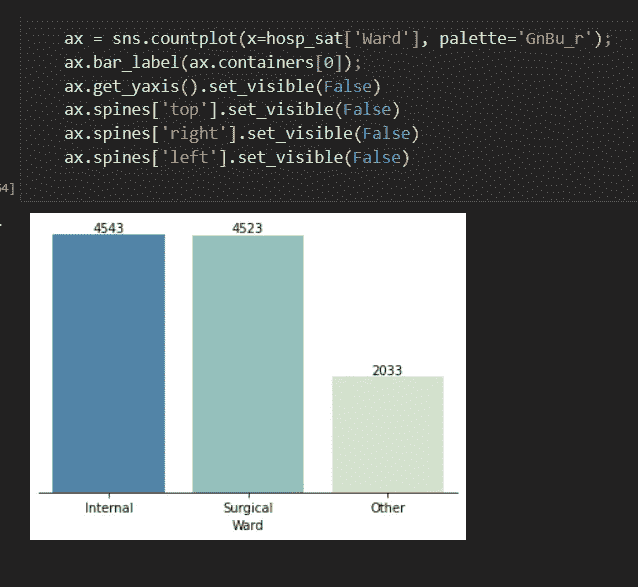

相当接近。年龄和慢性疾病有什么关系？

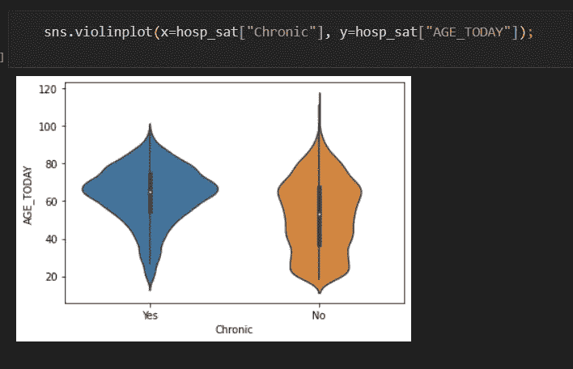

我们可以看到大多数慢性病患者年龄在 60 到 80 岁之间。

被调查者中哪个库帕特·霍利姆的病人最多？对于那些不知道这意味着什么的人来说，这是我能想到的:

> 根据法律每个以色列居民。必须在**健康维护组织** (HMOs)之一注册。那些没有注册的人将在他们选择的健康维护组织注册后立即开始接受健康服务。

好吧，现在我们在同一页上，有多少？

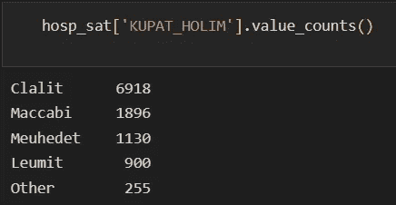

当然，岩石碎片！

语言对他们给出的满意度评分有影响吗？

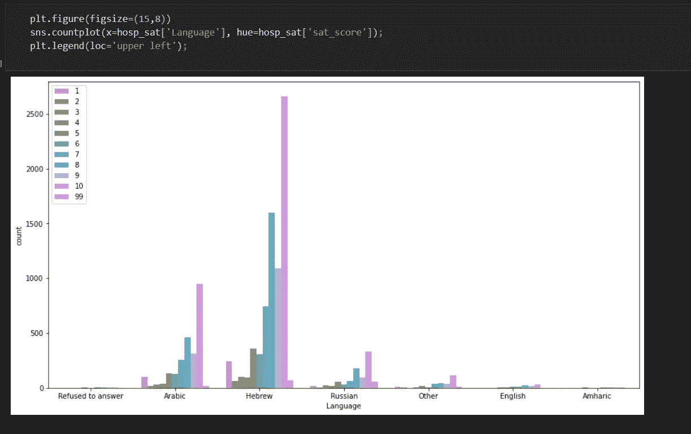

几乎所有语言都是一样的。很高兴见到你。

转到一些问题:**您认为在住院之前，医院治疗您的工作人员在多大程度上了解您的身体状况？**

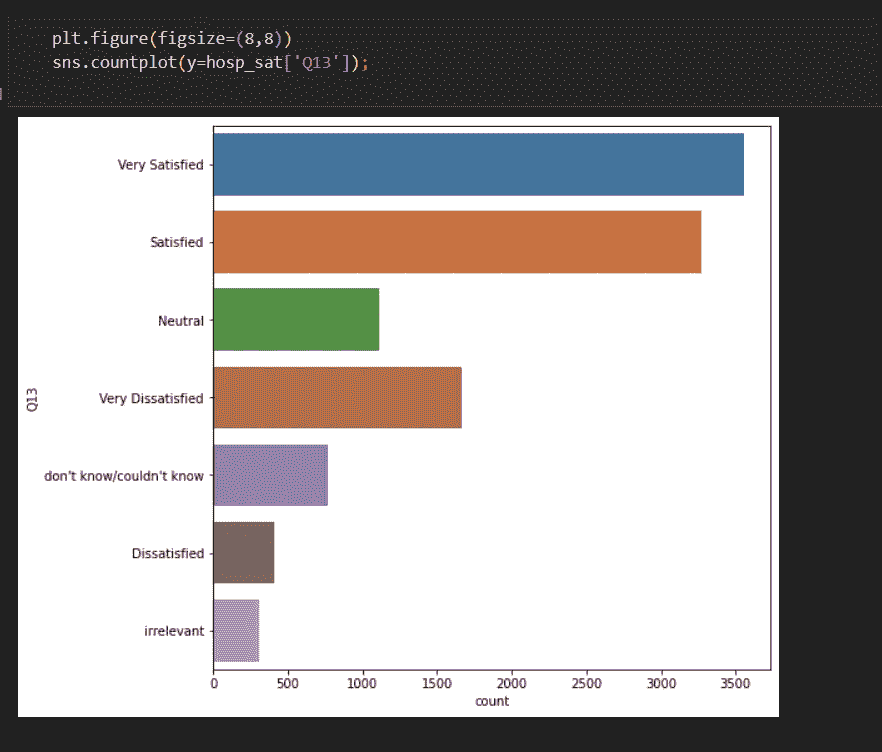

**你觉得工作人员在多大程度上解决了你的疼痛或其他症状，如恶心或头晕，并帮助你解决了这些问题？**

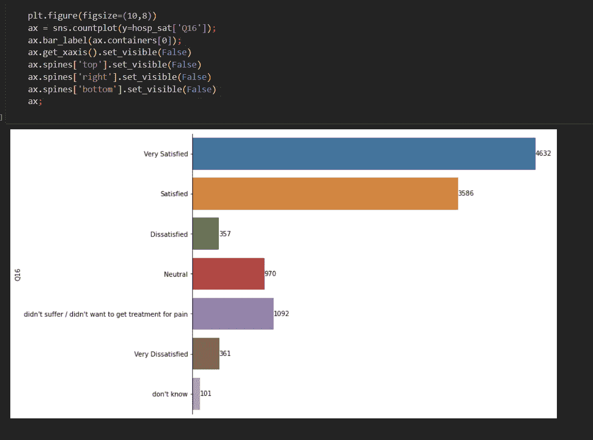

**出院时，您在多大程度上收到了总结您的医疗问题和您接受的治疗的说明？**

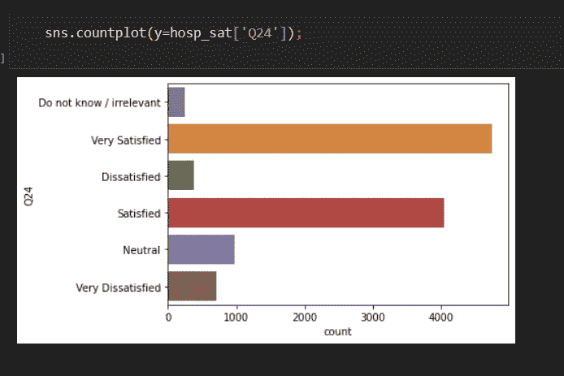

这就是我为这篇文章所提供的。你可以策划不同的事情和不同的问题，也许还可以做一些额外的事情，比如预测通过建立模型得到的满意度分数，并练习你的 ML 技能。任何适合你的。

最后，让我最头疼的部分是使用 Tableau 构建一个仪表板。一般来说，Tableau 对于像我这样的初学者来说是一种享受，但我变得大胆起来，想要一个别致的仪表板，所以我必须在旅途中学习很多东西，并在设计部分加入 figma。总的来说，我为自己感到骄傲。

链接到我亲爱的仪表板可以在这里找到**。使用侧面的按钮浏览幻灯片，惊叹我的创造力。讽刺那些新来这里读我的故事并感到困惑的人。**

**仪表板中的一些片段:**

**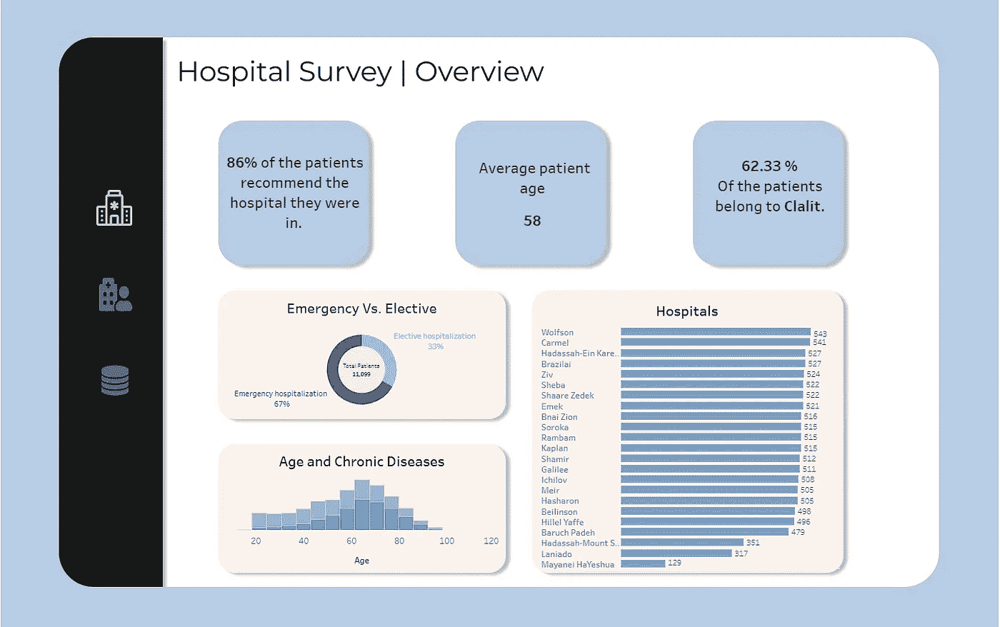****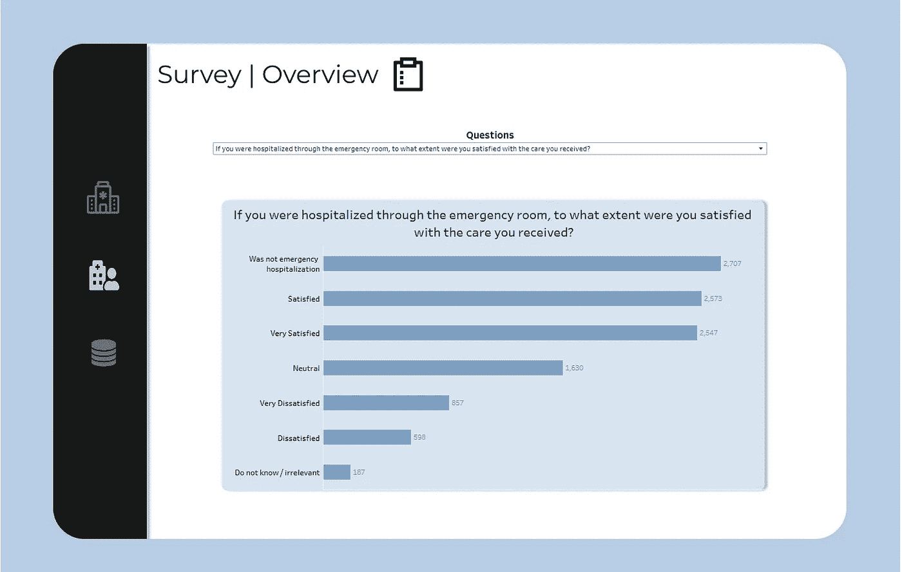****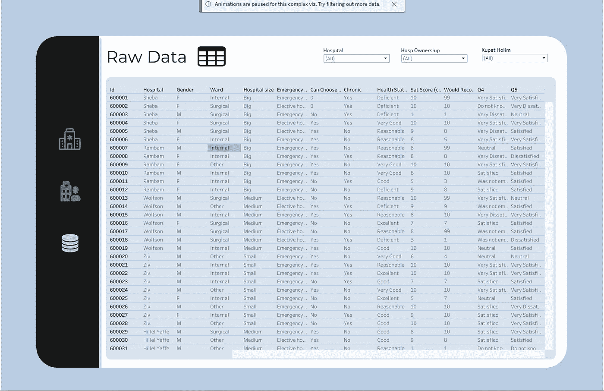**

**希望你喜欢我的这个项目的演练。请在评论中提出您对改进我的代码/仪表板或任何其他方面的建议。**

**またね 👋**