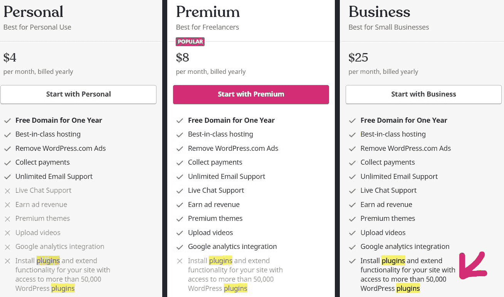
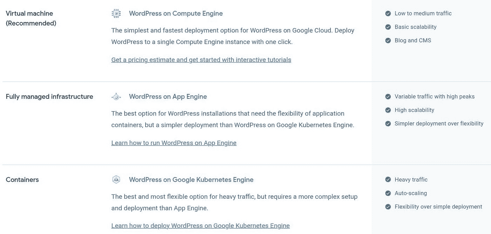
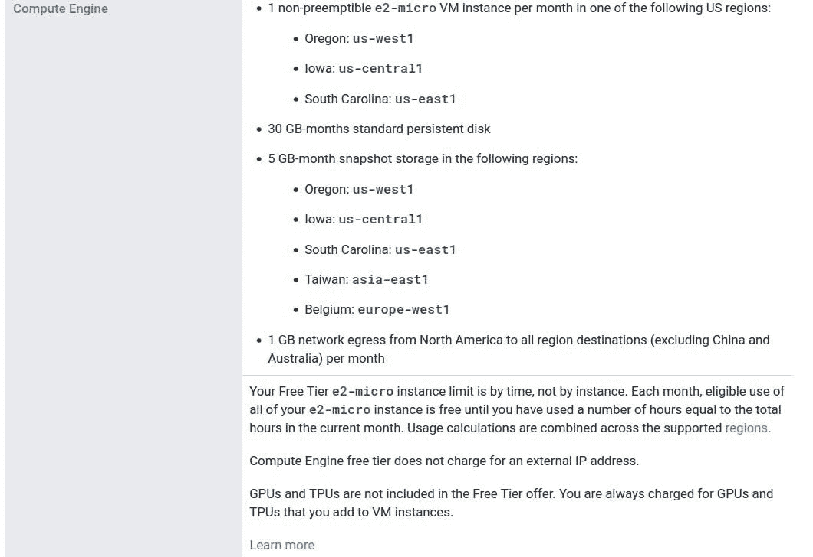
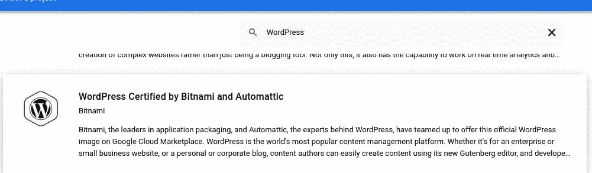
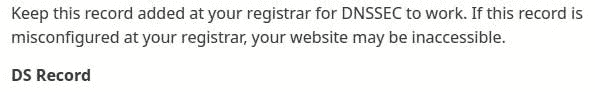
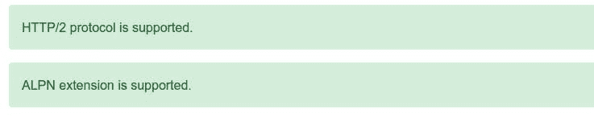
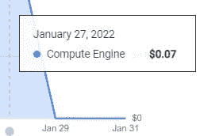

# 使用谷歌云平台和 Cloudflare 免费托管一个 WordPress 站点

> 原文：<https://blog.devgenius.io/host-a-wordpress-site-for-free-using-google-cloud-platform-and-cloudflare-ba48efd91b42?source=collection_archive---------10----------------------->

## 小型网站和企业的预算解决方案

这篇文章将包括一系列我自己提出和回答的问题，以找到解决方案。这更多的是描述我的个人经历，而不是关于这个主题的一步一步的教程，所以一些概念解释将被省略。欢迎对任何错误进行更正！如果这篇文章对你有帮助，你可以在 https://hungvu.tech/[阅读我的其他文章。](https://hungvu.tech/?utm_source=medium.com&utm_medium=referral&utm_campaign=medium_crossposting)

# 问题陈述

WordPress 站点是使用几个插件(例如 Elementor)构建的。要使用插件，我需要一份在 WordPress.com[的商业计划，每月 25 美元，对我的用例来说太贵了。也就是说，我需要一个更经济的选择，那么我应该从哪里开始呢？](http://WordPress.com)

WordPress.com 相当贵

# 问题:我对谷歌云平台有一些经验，也许我需要先看看那里？

事实上，他们确实提供了解决方案。

在 GCP 上托管 WordPress 网站的选项

我的目标是有一个类似于[WordPress.com](https://hungvu.tech/WordPress.com)的东西，一个几乎没有代码的环境。交互是通过管理面板中的图形用户界面。在这三个引擎中，只有谷歌计算引擎(GCE)能满足我的需求，所以我选择了它。

# 问:价格呢？

幸运的是，谷歌为 GCE 提供了一个免费的等级。2021 年，Google 将一个免费 GCE 实例的规范从`f1-micro`升级到`e2-micro`，这对于我的用例来说已经足够了。

谷歌计算引擎免费层

# 问:GCE 是一个虚拟机实例，这意味着我必须从头开始配置一切？

从某种意义上说，这是真的，但也是不利的一面。使用托管服务，如[WordPress.com](http://WordPress.com)意味着我还支付了所有的后端管理(软件栈和服务器配置)。走自主路线意味着我需要做所有的事情，是吗？

通常，一个成熟的平台会提供某种预配置的包。在这里，我有[谷歌云市场](https://cloud.google.com/marketplace)。在那里使用关键词“WordPress”进行普通搜索，会出现几个选项。就我而言，我选择了 Bitnami 认证的 *WordPress 和 automatic*。这个包是免费的，将为我做大部分的配置。况且这个包在某种意义上是跨平台的，所以我去亚马逊 Web Service (AWS)等另一家云提供商也会有同样的体验。

GCP WordPress 设置的 Bitnami 包

**注意**，似乎没有官方的方法来更新已安装的堆栈，无论是通过 GUI 还是 SSH。我需要删除一个虚拟机，并使用最新的 Bitnami 包创建一个新实例。

# 问题:我需要手动配置什么？

这里有一些要考虑的。

1.  虚拟机规范设置。
2.  域设置，IP 设置，DNSSEC。
3.  SSL 设置。
4.  HTTP/2 设置。默认情况下，配置是 HTTP/1.1。

# 问题:第一步，虚拟机配置如何？

使用自由层中指定的配置，我使用

1.  区域:`us-west1-a`
2.  机器类型:`e2-micro`
3.  启动盘:30 GB，硬盘

其他设置为默认设置。接受服务条款并继续创建实例。这可能需要几分钟时间。完成后，现在我可以使用提供的 VM 的外部 IP 地址登录 WordPress admin。

这是自托管的，所以我拥有常规 WordPress 应用程序的全部功能。插件现在可以用了。一些在[WordPress.com](https://hungvu.tech/WordPress.com)上实现的特定功能不会在这里出现，我猜是专有的吧？

# 问题:第二步，如何维护静态 IP 地址，设置域名？

1.  默认情况下，GCE 的 IP 地址是短暂的，这意味着它会在每次重置后发生变化。我需要一个静态 IP 地址，这样我的域就可以始终指向正确的位置。为此，转到 *VPC 网络/外部 IP 地址*并为 GCE 实例保留一个静态 IP 地址。
2.  我需要注册一个域名。大多数域名注册商也有 DNS 服务。然后我设置我的域指向 GCE 静态 IP 地址。这只是一个初始配置。

在 Cloudflare DNS 页面上，有一个 DNSSEC 设置说明。设置相当简单，主要是复制和粘贴值。

云闪上的 DS 记录

# 问题:第三步，如何设置 SSL 证书？

到目前为止，由于缺少 SSL 证书，我的网站是不安全的。有两个选项:

1.  从您的域名注册商处购买证书。通常，这是不必要的，除非您是一个大客户，需要对数百个域、子域进行适当的 SSL 管理和遵从。
2.  使用免费的，让我们加密可以通过 SSH 注册的 SSL 认证。这里可以看到[的说明](https://youtu.be/LDVQhN7zJvQ)。**注意**，即使指令在亚马逊 Web 服务(AWS)上，也还是 Bitnami 栈，所以配置是一样的。所有目标子域名都必须注册，否则会导致 SSL 握手错误(例如，通过 CNAME 记录将`www`映射到非 www)。

现在，返回到 Cloudflare，将 SSL 模式更改为`Full (strict)`。你的网站应该是安全的，这可以通过浏览器栏上的挂锁来检查。别忘了，Cloudflare 还有更多服务，您可以根据需要对它们进行微调。

# 问题:第四步，如何设置 HTTP/2？

HTTP/2 比 HTTP/1.1 协议提供了更多的优势。另一家大型云提供商 Digital Ocean 的文章中有更详细的讨论。在我看来，最值得注意的是速度的提高，这可以通过灯塔测试看出。

Bitnami 有一个关于用 HTTP/2 配置 Apache 服务器的官方文档。

HTTP/2 支持可以使用[关键 CDN 站点](https://tools.keycdn.com/http2-test)进行测试，看起来我的成功了。

使用密钥 CDN 成功进行 HTTP/2 检查

# 问题:为什么我在计费报告中看到一些小额费用？我以为这应该是免费的？

是的，设置是免费的，也就是说，如果我留在提供的配额。如下图所示，我的计算引擎实例有一些费用。我还没有找到根本原因，但我相信这是由于出口交通到中国或澳大利亚(不自由出口目的地)。在一些小尖峰之后，它再次回到零。如果您不为这些地区的客户提供服务，IP 地址块可能是一个选择。

WordPress 的 GCE 实例的少量费用

# 包裹

这一次，我学到了一个省钱的方法，也是一个玩 GCE 服务的机会。当然，在考虑将应用程序投入生产之前还有很多任务，但是，我可以使用 [All-in-One WP Migration](https://wordpress.org/plugins/all-in-one-wp-migration/) 将旧站点迁移到 GCE，所以没有太多事情要做。

我会说，一个意想不到的，但重要的教训是关于收费“免费”一个 GCE 实例。这意味着我需要在任何情况下都仔细监控账单。截至目前，当账单金额超过阈值时，GCP 似乎没有关闭服务的选项。幸运的是，这不是我身上的 1000 美元。