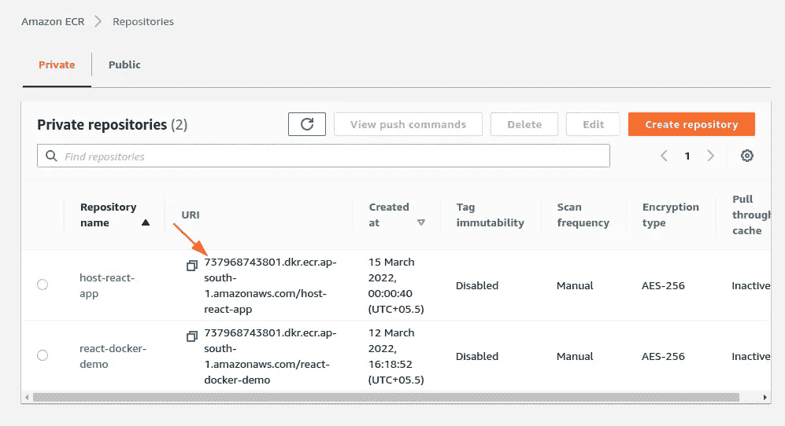
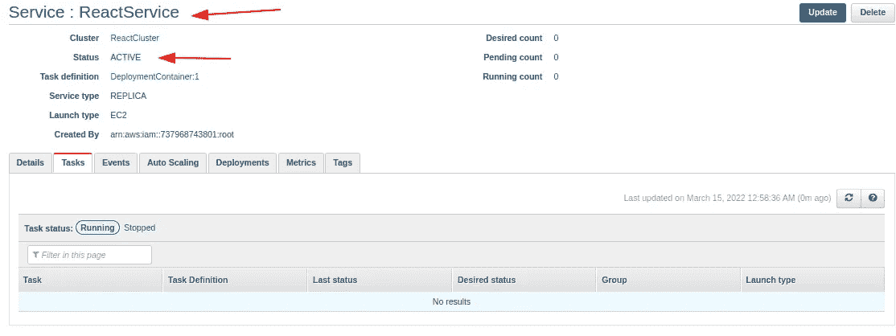

# 使用 ECR 和 GitHub 托管 Docker 应用程序，自动构建 Docker 映像并将其推送到 AWS ECS 持续部署(CI/CD)[逐步执行]。

> 原文：<https://blog.devgenius.io/host-any-app-to-aws-and-github-using-continuous-deployment-ci-cd-pipeline-step-by-step-d4150dbee2e8?source=collection_archive---------0----------------------->

让我们为 AWS 托管一个 **React** 或任何应用程序或网站。


官方标志

# 先决条件

1.  [**AWS** 账户(自由层)](https://aws.amazon.com/free/)。
2.  **Docker** 、 **Git** & **Github** 、 **AWS** 的基础知识。
3.  [节点 js](https://nodejs.org/en/download/)

## 参考 Github repo:

[](https://github.com/sagarkudu/host-any-app-to-AWS-using-CI-CD-pipeline) [## GitHub-sagarkudu/host-any-app-to-AWS-using-CI-CD-pipeline

### 这个项目是用 Create React App 引导的。在项目目录中，您可以运行:在…中运行应用程序

github.com](https://github.com/sagarkudu/host-any-app-to-AWS-using-CI-CD-pipeline) 

# 步骤 1:创建 React 项目

确保您的本地计算机上安装了 [***节点 js***](https://nodejs.org/en/download/) ，并且您可以访问 npm。

对于本教程，我们将**创建一个新的应用程序**只需遵循以下步骤:[https://reactjs.org/docs/create-a-new-react-app.html](https://reactjs.org/docs/create-a-new-react-app.html)

```
npx create-react-app app
cd app
npm start
```

# 第二步:将项目推送到 Github

1.  推动变革。
2.  首先在 Github 创建一个回购:
    [**https://github.com/new**](https://github.com/new)
3.  给出项目名称说:[**host-any-app-to-AWS-using-CI-CD-pipeline**](https://github.com/sagarkudu/host-any-app-to-AWS-using-CI-CD-pipeline)

代码:

```
git init
git add .
git commit -m "uploading project"
git remote add origin [https://github.com/sagarkudu/host-any-app-to-AWS-using-CI-CD-pipeline.git](https://github.com/sagarkudu/host-any-app-to-AWS-using-CI-CD-pipeline.git)
git checkout master
git push origin -u master
```


# 步骤 3:使用 Amazon ECR 创建一个存储库

—登录您的 [AWS](https://aws.amazon.com/console/) ，在搜索栏中搜索**弹性容器注册表** (ECR)。(注意:您可能需要先选择您所在的地区)。


1.  **让我们在 AWS 上创建一个** [**资源库**](https://ap-south-1.console.aws.amazon.com/ecr/create-repository) **。**


创建存储库

2.成功创建了 **host-react-app** 的存储库。


存储库已成功创建

**注意**:在我们创建 **ECS 任务定义时，我们将需要 **URI** 。**

# 步骤 4:创建 Amazon 弹性容器服务(ECS)

1.  登录您的 AWS 帐户。
2.  单击服务菜单并搜索“ECS”。
3.  在下拉列表中选择弹性容器服务。

## **1。点击任务定义**


## **2** 。**创建新的任务定义**


## **3。选择启动 EC2 兼容性。**


## **4。配置任务和容器定义**

设置以下值:

1.  在任务定义名称中输入“ **DeployContainer** ”。
2.  任务存储器(MiB)=128
3.  任务 CPU(单位)=1 个 vCPU


添加到容器

## — **现在转到 ECR，复制存储库的 URI。**



## — **点击添加容器后添加以下参数。**

1.  点击**添加容器**按钮。
2.  在容器名称中输入“**reatappcontainer**”。没有空间。
3.  在图像中，输入进入 ECR URI。
4.  在**端口映射下**设置
5.  主机**端口** =80，这将让我们在端口 80 访问 react 应用程序
6.  集装箱**港口** =80，Nginx 港口
7.  点击**添加**。
8.  点击**创建**。


## — **点击创建**


立即创建

## — **现在点击集群**


## — **创建集群**


## — **选择集群模板**


## — **配置集群**

1.  在左侧，点击**亚马逊 ECS / Clusters。**
2.  点击创建**集群**。
3.  选择 **EC2 Linux +网络**。
4.  点击**下一步**。

—设置以下字段

1.  **集群名称** =" **反应集群**"。
2.  **EC2 实例类型*** = **t2.micro** (非常重要)
3.  在**联网**部分，选择一个 **VPC** 如果你已经有一个，否则，让它为你创建。
4.  如果已经有子网，请选择它们。
5.  选择一个允许公共访问的安全组，或者在我们的例子中，将端口 80 向外界公开。
6.  点击**创建**。
7.  点击查看**集群**。

## — **启动状态**


## —群集:反应群集

点击**创建**


*   输入值，然后下一步


点击下一步

— **负载平衡器类型:**无(单击后续步骤)

— **服务自动缩放:**不要调整服务的期望计数

—最后，单击**创建服务**，因为我们不会创建负载平衡器。

## -查看服务



**最后，服务创建成功。**

# 步骤 5:创建 AWS 访问密钥

1.  点击服务菜单，搜索“ **IAM** ”，然后点击菜单中的**用户**。之后点击**添加用户。**


身份和访问管理

**2。设置用户详细信息** 给出用户名: **react-app** 并检查**编程访问**，这将允许我们创建一个**密钥**对。


3.点击**下一步:权限**后，选择“**直接附加已有策略**”。


**3。跳过步骤 3**

4 **。**点击**下一步:标签**跳过步骤 **3** 现在点击**下一步:查看**并确认**创建用户。**

5.创建完成后，您需要保存凭证文件并复制**“访问密钥 ID”**和**“秘密访问密钥”。**


秘密钥匙

# 步骤 6:添加和配置 Github 动作

## 在添加动作之前，我们需要首先设置 AWS 密钥。

1.  在 Github 中打开你的**项目**。
2.  点击**设置**选项卡。
3.  点击**秘密**菜单，输入 2 个键。
    **AWS _ ACCESS _ KEY _ ID**
    AWS _ SECRET _ ACCESS _ KEY


ID 和密钥机密

**注意—** 添加的 ID 和密码已成功创建。

现在点击**新的存储库密码**来添加变量和它们的值。

*   添加 **AWS_ACCESS_KEY_ID** 作为名称，并从控制台粘贴**访问密钥 ID** 。
*   类似地，添加 **AWS_SECRET_ACCESS_KEY** 作为名称，并粘贴**访问密钥**作为控制台的值。
*   从这里，我们将 ID 和密钥复制到 GitHub:


## 步骤 7:将 Github 操作工作流写入现有项目

1.  现在转到 **AWS 控制台**>**ECS**>**任务定义** >选择**部署容器** >复制所有 **JSON** 数据

> 使用 vs 代码编辑器在根文件夹中创建一个新的: **task-definition.json** 并粘贴所有内容


2.在根目录下创建一个名为' **Dockerfile** 的文件。

```
FROM node:alpine as builder
WORKDIR '/app'
COPY . .
RUN npm install# lets build the application
 RUN npm run buildFROM nginx
EXPOSE 80
COPY --from=builder /app/build /usr/share/nginx/html
```

## 添加动作。

有**多种方法**您可以创建您设置的 **Github 动作**即直接从 GitHub repo 或自定义创建文件和文件夹到您的项目中。根据你的喜好只选择一种方法。

1.  在你的浏览器中浏览 **Github** ，然后**打开你的项目**。
2.  点击**动作选项卡**。
3.  点击**新建工作流程**。
4.  搜索"**部署到亚马逊 ECS** "操作。
5.  在其下，点击**设置该工作流**。

— *按照脚本顶部的说明操作。*


设置工作流

*   **点击配置**


提交代码

*   **编码:** aws.yml

```
name: Deploy to Amazon ECSon:
  push:
    branches:
      - masterenv:
  AWS_REGION: ap-south-1                   # set this to your preferred AWS region, e.g. us-west-1
  ECR_REPOSITORY: host-react-app          # set this to your Amazon ECR repository name
  ECS_SERVICE: ReactService                 # set this to your Amazon ECS service name
  ECS_CLUSTER: ReactCluster                 # set this to your Amazon ECS cluster name
  ECS_TASK_DEFINITION: task-definition.json # set this to the path to your Amazon ECS task definition
                                               # file, e.g. .aws/task-definition.json
  CONTAINER_NAME: ReactAppContainer           # set this to the name of the container in the
                                               # containerDefinitions section of your task definitionjobs:
  deploy:
    name: Deploy
    runs-on: ubuntu-latest
    environment: productionsteps:
    - name: Checkout
      uses: actions/checkout@v2- name: Configure AWS credentials
      uses: aws-actions/configure-aws-credentials@v1
      with:
        aws-access-key-id: ${{ secrets.AWS_ACCESS_KEY_ID }}
        aws-secret-access-key: ${{ secrets.AWS_SECRET_ACCESS_KEY }}
        aws-region: ${{ env.AWS_REGION }}- name: Login to Amazon ECR
      id: login-ecr
      uses: aws-actions/amazon-ecr-login@v1- name: Build, tag, and push image to Amazon ECR
      id: build-image
      env:
        ECR_REGISTRY: ${{ steps.login-ecr.outputs.registry }}
        IMAGE_TAG: ${{ github.sha }}
      run: |
        # Build a docker container and
        # push it to ECR so that it can
        # be deployed to ECS.
        docker build -t $ECR_REGISTRY/$ECR_REPOSITORY:$IMAGE_TAG .
        docker push $ECR_REGISTRY/$ECR_REPOSITORY:$IMAGE_TAG
        echo "::set-output name=image::$ECR_REGISTRY/$ECR_REPOSITORY:$IMAGE_TAG"
    - name: Fill in the new image ID in the Amazon ECS task definition
      id: task-def
      uses: aws-actions/amazon-ecs-render-task-definition@v1
      with:
        task-definition: ${{ env.ECS_TASK_DEFINITION }}
        container-name: ${{ env.CONTAINER_NAME }}
        image: ${{ steps.build-image.outputs.image }}- name: Deploy Amazon ECS task definition
      uses: aws-actions/amazon-ecs-deploy-task-definition@v1
      with:
        task-definition: ${{ steps.task-def.outputs.task-definition }}
        service: ${{ env.ECS_SERVICE }}
        cluster: ${{ env.ECS_CLUSTER }}
        wait-for-service-stability: true
```

> **在 VS 代码终端键入以下命令:**

```
git pull
```

> 为任务定义创建文件

—进入亚马逊控制台>搜索 ECR


> 单击 DeploymentContainer > JSON >复制所有 JSON 数据。

—在根目录下创建一个名为“ **task-definition.json** 的文件，粘贴所有内容


# 步骤 8:提交、构建和部署。

> 设置工作流。

—在 VS 代码终端输入以下命令 **:**

```
git add .
git commit -m "added task definition file" 
git push
```

1.  一旦变更被推送到存储库，签出 **Actions** 选项卡。—这里您将看到一个新的**动作已经开始，用黄色的**表示，表示构建正在工作流程中进行。****


2.在这里，您可以看到构建日志，其中每个选项卡显示当前任务，展开每个选项卡，您可以看到其日志。


3.等待部署完成，如果颜色为**绿色**，则图像已成功部署到 AWS ECR，如果颜色为红色，则表示存在错误。


部署完成。

> 现在，我们将为 VPC 指定端口

—转到亚马逊控制台，然后搜索“EC2”，现在转到网络和安全>安全组


—点击**入站规则** >编辑入站规则并相应添加端口。


—点击**出站规则** >编辑出站规则并相应添加端口。


—现在我们已经成功配置了端口。

## 获取 URL

现在转到亚马逊控制台，搜索“ECS”，然后点击 Clusters > ReactCluster。


—点击 **ECS 实例**容器实例>


—复制公共 DNS 的 **URI** 并粘贴到浏览器的**新建**标签中。


— React 网站成功托管。


**结论**:我们已经使用持续部署(CI/CD 管道)成功地将 React 应用托管到 AWS。

# 您可能会对以下内容感兴趣:

[](https://sagarkudu.medium.com/host-any-app-to-aws-and-github-using-continuous-deployment-ci-cd-pipeline-step-by-step-d4150dbee2e8) [## 托管网站或应用程序，使用 ECR 和 GitHub 自动构建 Docker 映像并将其推送到 AWS ECS | Continuous…

### 让我们为 AWS 托管一个 React 或任何应用程序或网站。

sagarkudu.medium.com](https://sagarkudu.medium.com/host-any-app-to-aws-and-github-using-continuous-deployment-ci-cd-pipeline-step-by-step-d4150dbee2e8) [](/build-a-docker-image-and-publish-it-to-aws-ecr-using-github-actions-step-by-step-2cd2f4e667a7) [## 使用 Github 操作自动构建 Docker 映像并将其推送到 AWS ECR 逐步]

### 让我们看看如何在 Github 到 AWS 上构建 CI/CD 管道和云映像。

blog.devgenius.io](/build-a-docker-image-and-publish-it-to-aws-ecr-using-github-actions-step-by-step-2cd2f4e667a7) 

# 我的完整 DevOps 博客列表:

[](https://sagarkudu.medium.com/lists) [## 媒介上的萨加尔·库杜策划了一些名单

### 开始探索 Devops，React，SpringBoot 和更多

sagarkudu.medium.com](https://sagarkudu.medium.com/lists) 

# 作者:萨加尔·库杜

1.  [Github](https://github.com/sagarkudu)
2.  [领英](https://www.linkedin.com/in/sagarkudu/)

**感谢您的宝贵时间！**