# 用免费的 Docker 桌面在你的 Win 11 / 10 上托管 WordPress

> 原文：<https://blog.devgenius.io/host-wordpress-on-your-win-11-10-with-free-docker-desktop-5d69d3bcc8ed?source=collection_archive---------1----------------------->

WordPress 是世界上最受欢迎的 CMS，你想尝试一下，但不确定如何在自己的 Windows 11 / Windows 10 PC 上实现。

让我一步一步地指导你如何用**零成本**在你的 Windows PC 上托管 WordPress。当然，在文章的最后，我会分享你如何把你的完整 WordPress 安全地放到互联网**！**

****视频教程:**[](https://youtu.be/zePv61DUqgk)**

# ****🐧安装 WSL 2(Linux 的 Windows 子系统)****

****🛠️ **简化安装(Windows 11 / Windows 10 version 2004 或更高版本)** 用**管理员权限**打开命令窗口，运行
`wsl --install`，重启后就可以使用 WSL 了。****

****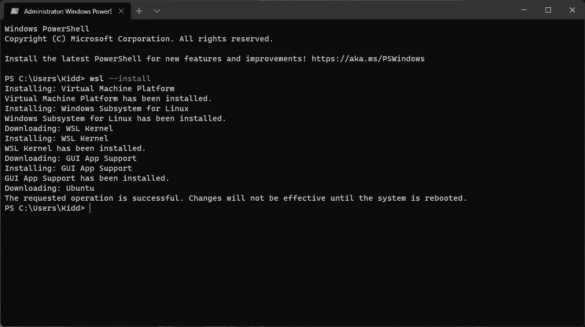****

****在 Windows 11 上用一个命令安装 WSL2****

****如果该命令不适用于您的 Windows 10 版本，请尝试下面的手动安装。或者，您可以查找 [KB5004296](https://support.microsoft.com/en-us/topic/july-29-2021-kb5004296-os-builds-19041-1151-19042-1151-and-19043-1151-preview-6aba536a-6ed2-41cb-bc3d-3980e8693cc4) 了解更多详细信息。****

****🛠️ **手动安装
(windows 10 build 18362****或更高，** **包括家庭版)******

******1。启用 WSL******

****以管理员权限打开命令窗口，然后运行****

```
**dism.exe /online /enable-feature /featurename:Microsoft-Windows-Subsystem-Linux /all /norestart**
```

******2。启用虚拟机功能******

****WSL 2 仍然需要虚拟化功能。以管理员权限打开命令窗口，然后运行****

```
**dism.exe /online /enable-feature /featurename:VirtualMachinePlatform /all /norestart**
```

******3。下载 Linux 内核更新包******

****下载[x64 机器的 WSL2 Linux 内核更新包](https://wslstorestorage.blob.core.windows.net/wslblob/wsl_update_x64.msi)并安装。****

****然后，重新启动计算机。****

******4。将 WSL 2 设置为默认版本******

```
**wsl --set-default-version 2**
```

******5。安装 Ubuntu(或您选择的 Linux 发行版)******

****I)打开[微软商店](https://aka.ms/wslstore)然后搜索&选择 **Ubuntu** 。
II)在发行版页面中，选择“获取”，然后选择“安装”
III)准备就绪后，单击“启动”
IV)为您的 Ubuntu 创建用户名和密码****

******6。使用** `wsl --list --verbose` **来验证您的安装******

****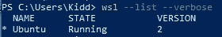****

****如果您遇到任何问题，您可以在这里参考一些故障排除技巧[。](https://docs.microsoft.com/en-my/windows/wsl/install-win10#troubleshooting-installation)****

# ****🐳安装 Docker****

******1。下载 Docker 桌面**
下载[最新 Docker 桌面](https://desktop.docker.com/win/main/amd64/Docker%20Desktop%20Installer.exe)。****

******2。安装**
按照安装向导安装 Docker 桌面。****

****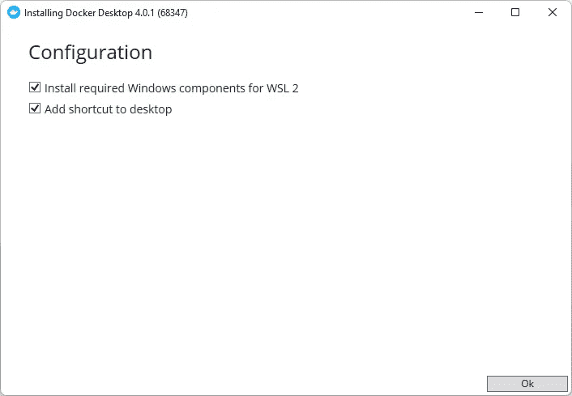****

****如果您的 WSL 2 配置正确，它应该在安装过程中提示您启用 WSL 2。如果您选中了上面的 WSL2 选项，提示将不会出现。****

****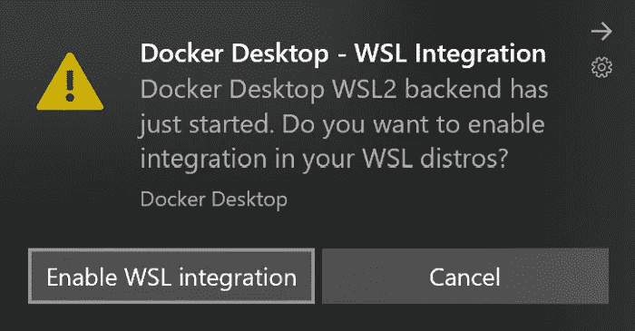****

****图片来源: [Visual Studio 代码—在 WSL 2 中使用 Docker](https://code.visualstudio.com/blogs/2020/03/02/docker-in-wsl2)****

****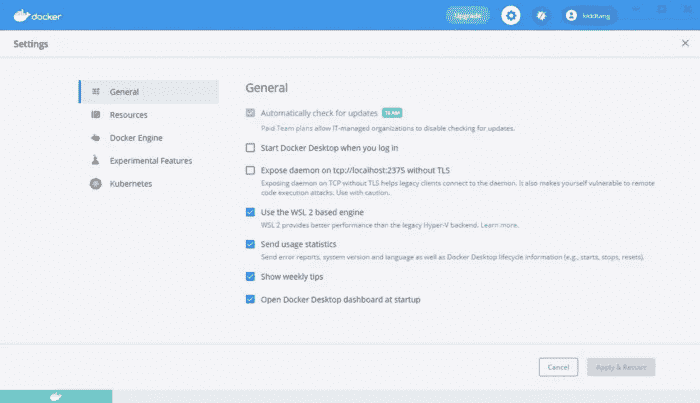****

****在 Docker 菜单中，选择设置>常规:确保 WSL 2 已启用。****

******3。配置 WSL 集成** 确保为正确的 Linux 发行版打开它。****

****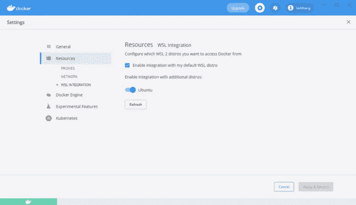****

****在 Docker 菜单中，选择设置>资源> WSL 集成****

# ****🐳Docker 撰写和 docker 文件****

****Docker Compose 让你定义你的“图片”(也就是你想要的包),轻松一致地在本地/网络上托管你的 WordPress。****

****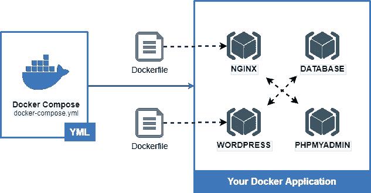****

****关于实施的说明****

****如果您想要更改配置或定制映像，您可以编写 **Dockerfile** 来指示 Docker 相应地构建映像。****

****你现在有先决条件了！让我们开始构建自己的 Docker 容器吧！****

****在 [Windows 终端](https://www.microsoft.com/en-us/p/windows-terminal/9n0dx20hk701)中使用以下命令启动 WSL:****

```
**wsl**
```

****进入您的 Linux 主目录以获得最佳性能。****

```
**cd ~**
```

****在您的 Linux 主目录下创建一个项目文件夹:****

```
**mkdir ~/wordpress**
```

# ****步骤 1 —您的环境变量****

******环境文件**(又名`.env`文件)是一般你**不想**跟陌生人分享的变量，只对某个环境有效。****

****在项目文件夹根目录下创建一个`.env`文件:****

```
**nano ~/wordpress/.env**
```

****用下面的内容替换您喜欢的值:****

****~/wordpress/。包封/包围（动词 envelop 的简写）****

****MySQL `root`密码用于 phpMyAdmin 配置，MySQL 用户和密码用于 WordPress 数据库。****

# ****步骤 2 —您的网络服务器(NGINX)配置****

****创建一个文件夹来存储 NGINX 相关的配置文件:****

```
**mkdir ~/wordpress/nginx-conf**
```

****创建文件`nginx.conf`，内容如下:****

```
**nano ~/wordpress/nginx-conf/nginx.conf**
```

****~/WordPress/nginx-conf/nginx . conf****

****有三个`server`块:
- **行 1** :默认 HTTP 端口带 HTTPS 重定向
- **行 12** : HTTPS 端口用于你的 **WordPress** 应用
- **行 56** : HTTPS 端口用于 **phpMyAdmin** 应用(用于管理 DB)****

****我在这里不解释 NGINX 指令，如果你对学习 NGINX 配置感兴趣，你可以阅读文章底部的参考资料。****

****此外，使用以下内容创建文件`security.conf`:****

```
**nano ~/wordpress/nginx-conf/security.conf**
```

****这个文件包含在`nginx.conf`中，它是针对我们的自签名 SSL 证书的。****

****~/WordPress/nginx-conf/security . conf****

# ****第 3 步 NGINX 的`Dockerfile`****

****我们需要用生成的自签名证书定制 NGINX 映像。****

****为 NGINX 创建一个文件夹来存储`Dockerfile`:****

```
**mkdir -p ~/wordpress/.docker/nginx**
```

****在上面的文件夹中创建文件`Dockerfile`，内容如下:****

```
**nano ~/wordpress/.docker/nginx/Dockerfile**
```

****~/wordpress/。docker/nginx/Dockerfile****

****我们从`[nginx:stable-alpine](https://hub.docker.com/_/nginx)`中获得自定义映像，然后安装`openssl`来为本地主机生成自签名证书。****

# ****步骤 WordPress 的定制****

****这一步可能是可选的，它用于解决 WSL 上的权限问题。****

****为 WordPress 创建一个文件夹来存储`Dockerfile`:****

```
**mkdir -p ~/wordpress/.docker/wordpress**
```

****在上面的文件夹中创建文件`Dockerfile`，内容如下:****

```
**nano ~/wordpress/.docker/wordpress/Dockerfile**
```

****~/wordpress/。docker/wordpres/Dockerfile****

****另外，创建一个 PHP 配置文件来更改上传设置:****

```
**nano ~/wordpress/.docker/wordpress/uploads.ini**
```

****~/wordpress/。docker/wordpres/uploads.ini****

# ****步骤 5 —您的服务定义(Docker-Compose)****

****最后，在项目根文件夹中创建文件`docker-compose.yml`，内容如下:****

```
**nano ~/wordpress/docker-compose.yml**
```

****~/wordpress/docker-compose.yml****

****有四种服务:`db`、`wordpress`、`webserver`和`phpmyadmin`。
`volumes`为我们的应用定义了持久存储。
`networks`定义了所述服务的相互连接。****

****每项服务的简要说明:****

******📦数据库—** `[**db**](https://hub.docker.com/_/mysql)`****

****这是 MySQL 8.0 镜像，我们基本上需要配置 root 密码和数据库名。然后，直接使用 Docker Hub 中的图像。****

******📦WordPress—******

****这是带有 PHP-FPM 的 WordPress docker 图片。然而，由于 WSL 中的文件权限问题，我们用`Dockerfile`定制了它，并且映射了我们自己版本的`uploads.ini`来覆盖默认的 PHP 配置。需要一些必要的 WordPress 相关配置(`WORDPRESS_`)来连接数据库和直接在 WordPress 中上传文件。****

******📦网络服务器—** `[**webserver**](https://hub.docker.com/_/nginx)`****

****这是 NGINX 服务器，是所有 web 应用程序的“窗口”。它读取我们在[步骤 2](#d2d0) 中设置的配置(`nginx.conf`，以服务于`wordpress`和`phpmyadmin`的 PHP-FPM。我们并不直接使用 Docker Hub 中的图像，所以我们创建了`Dockerfile`来定制我们自己在[步骤 3](#50d2) 中的图像版本。NGINX 也需要卷映射来服务 web 应用程序。****

******📦phpMyAdmin —** `[**phpmyadmin**](https://hub.docker.com/_/phpmyadmin)`****

****这是为了让你在 Web 界面中管理和查看 MySQL 数据库。与`wordpress`类似，我们使用`fpm-alpine`变体通过 PHP-FPM 经由 NGINX 服务应用程序。****

# ****第 6 步——启动你的容器！****

****确保您在`docker-compose.yml`所在的目录中。****

```
**cd ~/wordpress**
```

****然后，要调出您的容器:****

```
**docker-compose up -d**
```

****要关闭容器，请执行以下操作:****

```
**docker-compose down**
```

# ****步骤 7-完成 WordPress 的安装****

****转到 [https://localhost](https://localhost/) 。****

****由于自签名证书，您应该会收到警告。****

****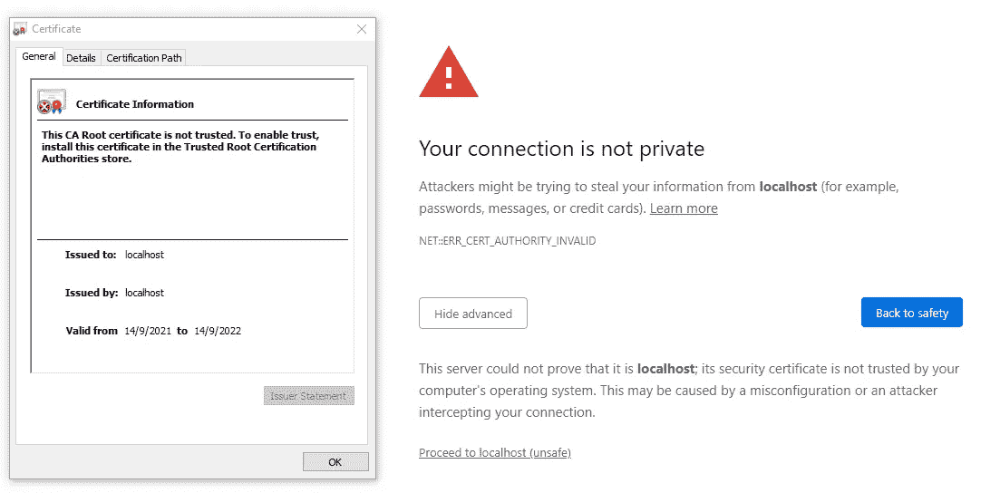****

****点击**高级** > **前进**到本地主机****

****忽略警告并继续，你应该看到 WordPress 语言选择****

****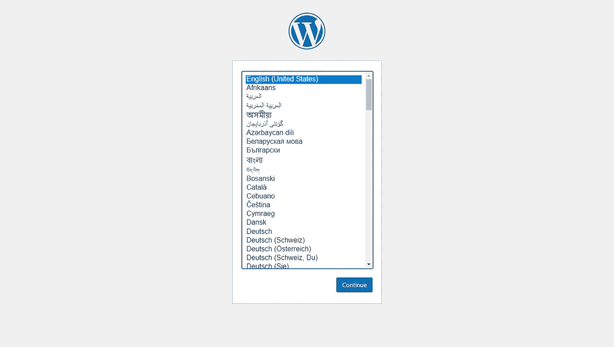****

****填写所有必要的信息以继续…****

****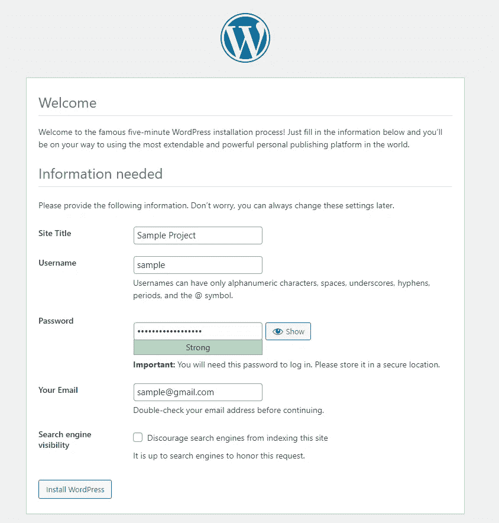****

******🎊**搞定！现在你可以在你的 Windows PC 上运行你的 WordPress 并四处玩耍了！****

****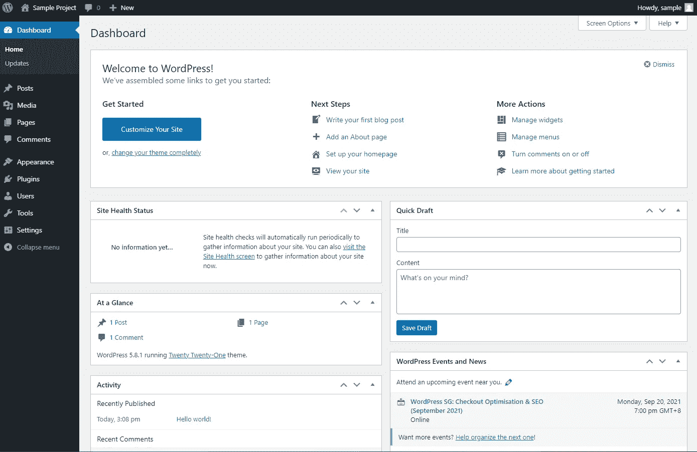****

# ****EXTRA— phpMyAdmin****

****可以通过 [https://localhost:8080](https://localhost:8080/) 登录 **phpMyAdmin** 。使用`root`或者为 WordPress 创建的用户登录(你已经在`.env`文件中定义)****

****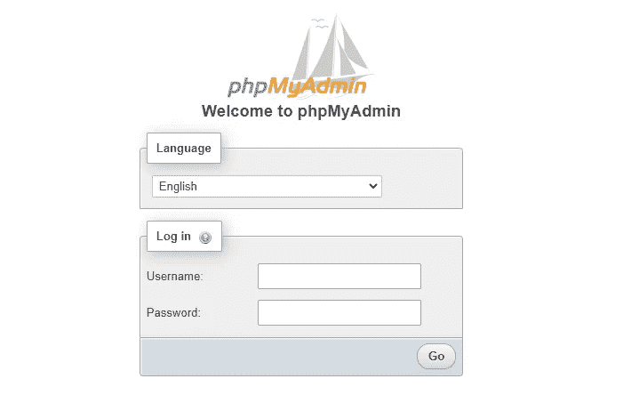****

****[https://localhost:8080](https://localhost:8080/)—phpMyAdmin 登录页面****

# ****额外——让你的 WordPress 在互联网上直播！****

> ****事实:WordPress 是最受恶意黑客欢迎的目标之一！****

****我个人推荐**托管**的 WordPress，这将帮助你自动修补操作系统、应用程序& WordPress，阻止僵尸程序和恶意攻击你的 WordPress 站点。 **Cloudways** 提供了大量的功能，让你可以轻松托管你的 WordPress 站点，而不用担心网络安全的噩梦。
最重要的是……很实惠！！！****

****现在，您可以在 BFCM 2022 活动期间享受额外折扣！****

********

****链接:www.cloudways.com/en/?id=66136****

****让我们开始尝试**云道**！****

****您可以按照这个指南将您的本地主机迁移到 live 服务器
[https://www . cloudways . com/blog/migrate-WordPress-using-duplicator/](https://www.cloudways.com/blog/migrate-wordpress-using-duplicator/)****

******参考** : [如何用 Docker Compose 安装 WordPress】](https://www.digitalocean.com/community/tutorials/how-to-install-wordpress-with-docker-compose)****

****如果你喜欢我的文章，请鼓掌，关注并分享我的文章(或者你可以去☕[☕给我买杯咖啡)。保重，再见！](https://buy.stripe.com/7sI03C9S56Upcpi8ww)****