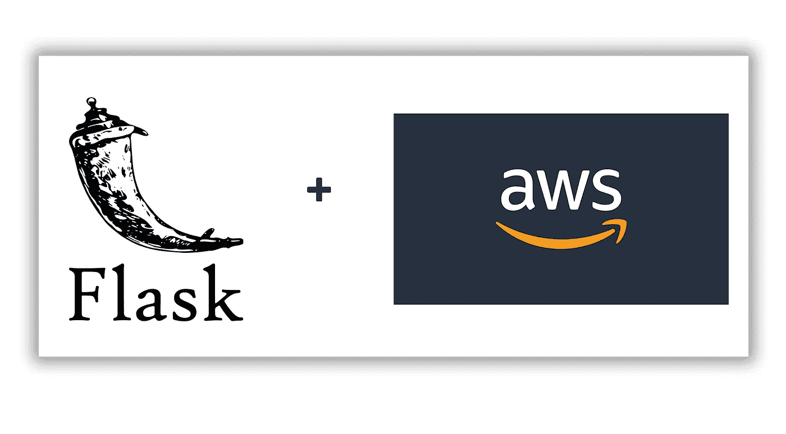
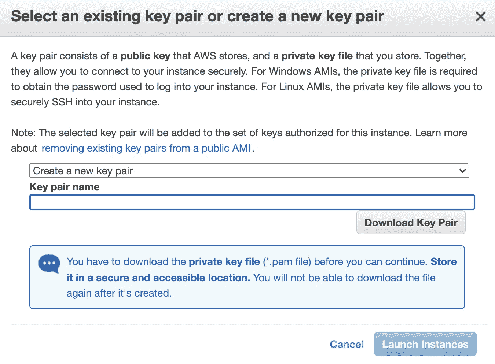
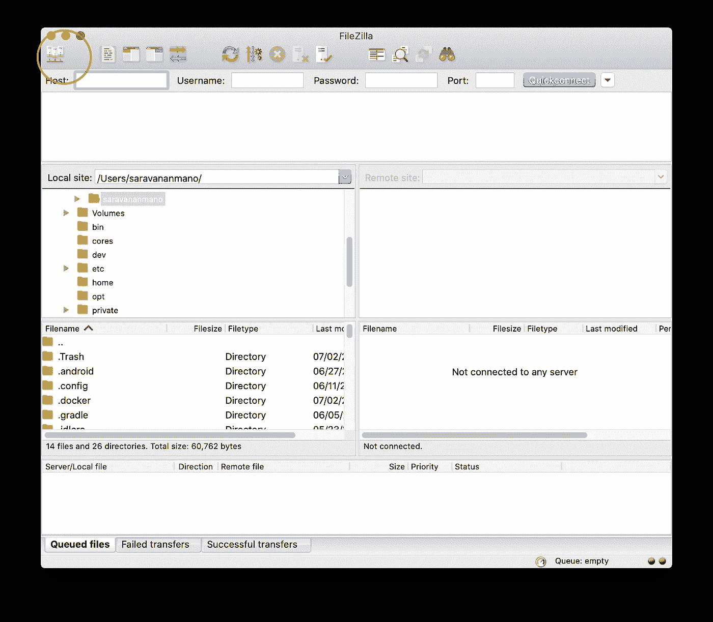
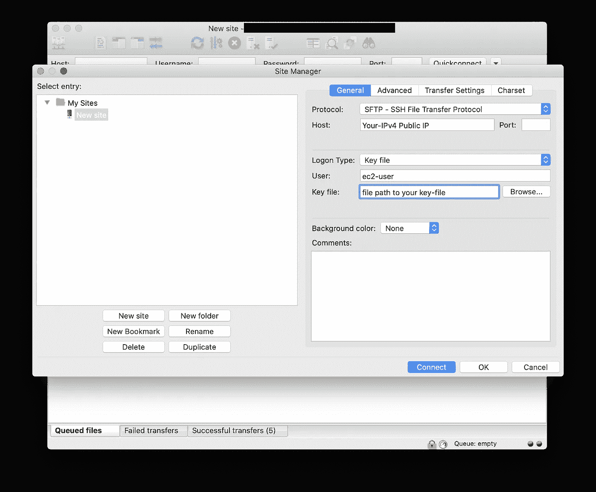
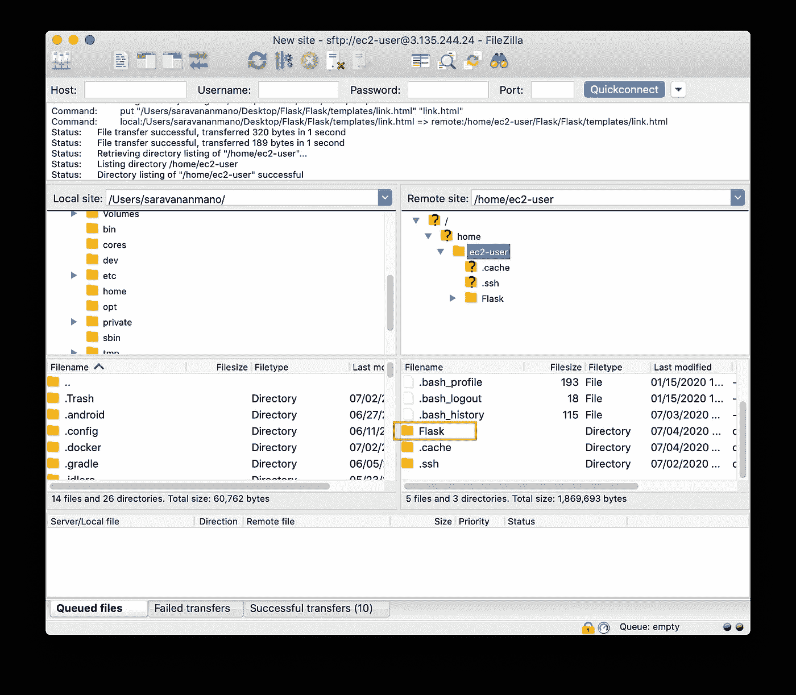
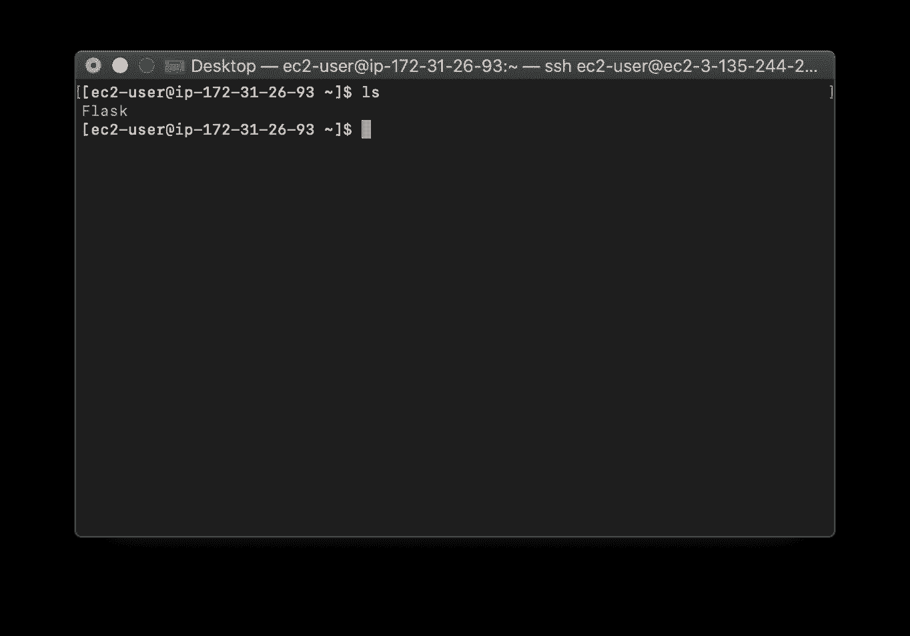
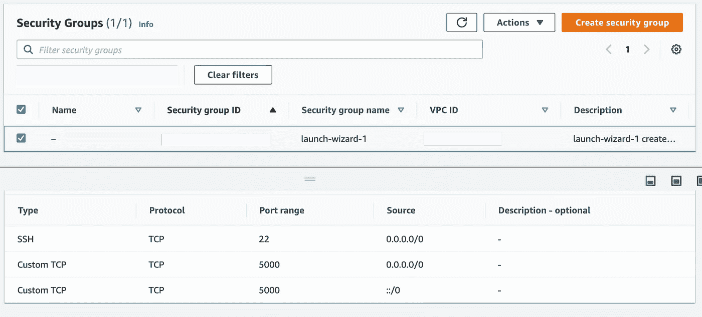
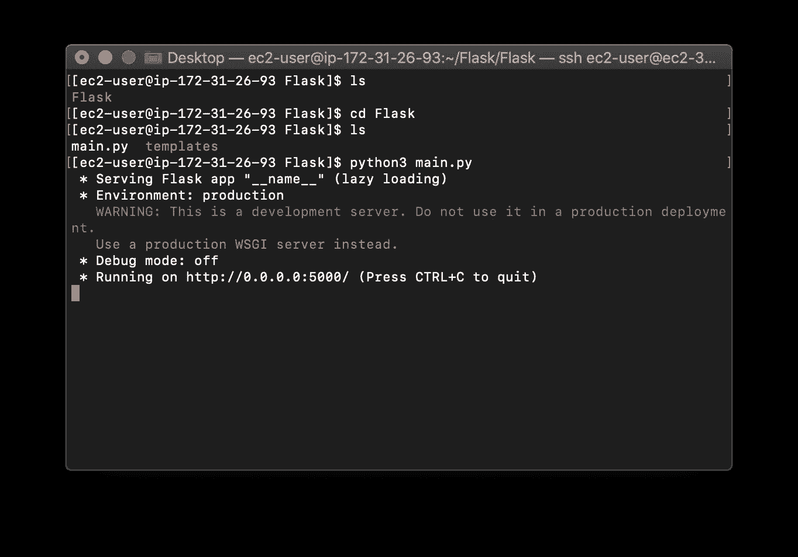

# 在 AWS EC2 上托管您的 python flask

> 原文：<https://blog.devgenius.io/host-your-python-flask-on-aws-ec2-91735aa7127a?source=collection_archive---------2----------------------->

这是一个帮助您将 python flask 应用程序托管到 EC2 实例的教程。我将解释如何创建一个 EC2 实例和一个样本 flask 程序！

在进入程序之前，让我简单介绍一下 Flask 和 EC2。

**Python 烧瓶:**

Python Flask 是一个微型 web 框架，用于快速 web 开发。Flask 非常简单，易于实现。Flask 可以很容易地导入到 python 项目中，他们的[文档](https://flask.palletsprojects.com/en/1.1.x/)对入门非常有帮助。

**亚马逊的 EC2 :**

亚马逊弹性计算云(EC2)(技术上应该是 EC LOL)是亚马逊提供的一种 [**IaaS**](https://en.wikipedia.org/wiki/Infrastructure_as_a_service) (基础设施即服务)云计算服务。EC2 通过提供一个 web 服务来帮助部署应用程序，用户可以通过这个 web 服务启动一个 **Amazon 机器映像(AMI)** 来配置一个名为**实例**的虚拟机。

**程序:**

首先，让我们创建 flask 程序。flask 包含包含端点的 python 代码。端点可以是一个在被调用时可以运行并返回响应的函数。如果返回的响应是一个 HTML 文件，那么它应该保存在一个**模板**文件夹中。

下面是 flask 的 python 代码

以下是网站模板的 Github 链接:[https://github.com/saro-mano/Flask_Medium.git](https://github.com/saro-mano/Flask_Medium.git)

现在，让我们跳到 AWS 部分。

第一步:报名

所以如果你还没有注册 AWS 账户，那就注册吧，因为它是免费的。您可以注册为根用户，这样您就可以完全控制您的控制台。

**步骤 2:启动 EC2 并选择一个 AMI**

进入 AWS 控制台后，点击“使用 EC2 启动虚拟机”。我打算在这个项目中使用 Linux。所以，我选择**亚马逊 Linux 2 AMI (HVM)，SSD 卷型【64 bit】。**

**第三步:选择即时型**

对于我们的项目，一个具有 1gb 内存的通用实例就足够了。所以，我选择了这个:

在这一步之后，点击审查和启动。但是，如果您愿意，您可以配置实例类型、安全性、添加存储、添加标记。我将让他们保留默认配置。

**第四步:启动实例**

单击启动实例后，系统会提示您生成密钥对。这是重要的一步，从这一步生成的密钥将帮助您从您工作的系统连接到 EC2 实例。

密钥对生成窗口

现在给你的密钥对起一个名字。pem 文件)并下载该密钥，然后单击“启动实例”。

所以，现在你有你的钢笔文件。使用它，我们现在可以使用 SSH 客户端通过我们的终端连接到 EC2。

现在保持。pem 文件，并在那里打开终端。现在输入以下命令代替。pem 文件名:

> **chmod 400 your-file-name . PEM**

然后从 AWS 控制台获取公共 DNS 名称。大概会是这样的:ec2-**x**–**XXX**–**XXX**–**xx**。us-east-2.compute.amazonaws.com

> **ssh ec2-user @ public-DNS-name-I your-file-name . PEM**

然后它会要求确认，给**是。**

瞧啊。现在您已经连接到 EC2 实例了。请记住，这个 EC2 实例只不过是一个 Linux 系统。所以您可以使用 Linux shell 命令控制整个 EC2。

对于启动器，键入 **ls** 并检查。你不会看到任何东西，因为我们没有加载任何东西。

要将文件传输到 EC2，我们需要一个 FTP 代理。为此，我们需要一个软件( [**FileZilla**](https://filezilla-project.org/) )来帮助我们将数据加载到 EC2 中。

所以，这就是 Filezilla 的样子(下图)。点击左上角的“打开站点管理器”按钮

Filezilla 主屏幕

然后，在站点管理器中设置协议为 **SFTP** 。然后输入主机号。主机号只是公共 IPv4 公共 ID[例如:3.136.245.22]，可以从 EC2 控制台找到。将登录类型作为密钥文件。让用户名为 ec2-user，因为这是默认的 Amazon Linux 用户名。然后将路径文件给你的。pem 文件并建立连接。您将连接到您的 Linux。现在你只需将文件拖放到 Filezilla 中，它就会被传输到 EC2 中。

站点管理器窗口

拖放我的烧瓶文件夹

现在在 EC2 实例[即您的终端]中，当您键入 ***ls*** 时，您可以看到 Flask 文件夹。

终端显示烧瓶

因此，在运行您的 flask 之前，让我们将 python2 升级到 python3，然后我们应该在您的 EC2 中安装 flask 库。这可以通过运行以下命令来完成:

> **须藤百胜安装 python37**
> 
> **curl-O**[**https://bootstrap.pypa.io/get-pip.py**](https://bootstrap.pypa.io/get-pip.py)

然后:

> **sudo pip3 安装烧瓶**

因此，当您在本地运行 python flask 时，默认情况下，它在本地主机( [http://127.0.0.1](http://127.0.0.1:5000/) )和端口 5000 上运行。但是当您在 EC2 上运行相同的命令时，您必须启用端口和主机地址。为此，我们需要打开安全向导

AWS 实例页

现在，单击当前运行的实例的安全组，然后编辑入站规则。然后添加一个带有您选择的端口号和主机地址的自定义 TCP。记住，这里给出的端口和主机地址应该与 flask 程序中的相同。

添加了自定义 TCP

所以，我在端口 5000 上运行我的程序。

烧瓶运转

最后，我们的 Flask 程序正在 EC2 实例上运行，我们可以通过调用公共 IPv4 DNS(在您的 EC2 实例中找到)来检查这一点。

在末尾加上你的端口号。

AWS 上的烧瓶

最后，我们将 flask 托管到 EC2 实例上。但是这个程序将在 EC2 上持续到我们关闭终端。记住 python flask 只是为了快速开发。它不适合用于生产目的。为此，我们需要使用 NGINX 和 Apache web 服务器。

这是我的第一篇博文。我尽力把所有的事情都搞清楚。如果你觉得有什么不明确的地方，请在评论中告诉我。感谢阅读！