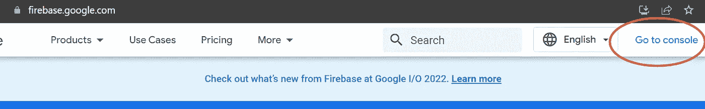
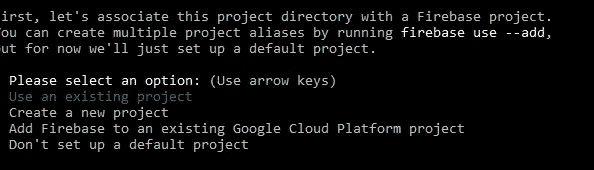

# 在 Google Firebase 中托管 Angular 应用程序

> 原文：<https://blog.devgenius.io/hosting-an-angular-application-in-google-firebase-f1da6e6cad9?source=collection_archive---------3----------------------->


大家好。在本文中，我将向大家展示如何在 Google Firebase 中托管 Angular 应用程序。因此，在这一点上，您可能已经花了相当多的精力来开发一个有趣的 Angular 应用程序，它可以在您的本地机器上很好地运行。此时，您可能已经准备好将您的项目托管在某个地方，以便您可以向来自世界各地的访问者展示它。也许你想增加你的投资组合，向你展示一个潜在的雇主，或者你想以某种方式将你的申请货币化。无论您的理由是什么，Firebase 都提供了一种快速简单的方法来托管您的应用程序，以便您的应用程序可以公开共享。我将一步一步地教你如何完成这个任务，从创建一个非常基本的 Angular 应用程序开始，一直到将你的应用程序部署并托管在 Firebase 上，作为一个可以从任何机器上公开访问的网站。

## 创建您的角度项目

在这个例子中，我们将在 Windows 10 环境下使用 Angular 13。让我们从创建一个非常基本的角度项目开始。要创建新的角度项目，您将从命令提示符下运行以下命令。在这个例子中，我们称我们的项目为`angular-firebase-hello-world`，但是您可以随意命名您的项目。

```
ng new angular-firebase-hello-world
```

接下来，您可以导航到`src\app`目录中的`app.component.html`文件，并用一个简单的标记替换所有的样板文件内容，如下所示:

```
<h1>Angular Firebase Hello World</h1>
```

接下来，让我们在本地测试这个简单的应用程序，并确保可以通过运行以下命令从 web 浏览器访问它:

```
ng serve
```

看到应用程序编译成功后，您可以在 web 浏览器中导航到适当的 URL。在我们的示例中，URL 将是您网站上的`[http://localhost:4200](http://localhost:4200.)`，您应该会看到类似如下的页面:


简单角度应用示例

## 构建您的项目

至此，您已经有了一个非常简单的应用程序，可以部署到 Firebase 了。从这里开始，您要采取的第一步是构建您的项目。在命令提示符下，运行命令

```
ng build
```

一旦构建成功，您应该会在命令提示符下看到类似下面的内容


ng 构建成功

## 创建一个新的 Firebase 项目

该过程的下一步是从 Firebase 控制台创建一个新项目。从您首选的网络浏览器中，导航至 https://firebase.google.com/的。一旦你进入这个页面，你会在页面的右上角看到一个链接，上面写着“转到控制台”。你会想要点击这个链接。



页面右上角的时钟“转到控制台”

单击此链接后，您会在下一页看到一个选项，内容为“添加项目”。你会想要点击这个选项。


单击“添加项目”

然后，您将转到安装向导来创建项目。看到的第一个提示将要求您输入项目名称。对于这个例子，我们的项目将被命名为“Angular-Firebase-Hello-World”。


项目名称字段

下一页你来将提示你是否要启用谷歌分析为这个项目。默认设置为“是”。我们可以接受默认值，然后单击“继续”按钮。

在安装向导的最后一页，您将被要求为 Google Analytics 选择一个现有帐户或创建一个现有帐户。在这个例子中，我有一个现有的“测试帐户”，我选择用于这个项目。然后，您可以单击“创建项目”按钮来完成新 Firebase 项目的创建。


Google Analytics 帐户

## 本地安装 Firebase 工具并登录 Firebase

在 Firebase 控制台中创建新项目后，您需要返回到命令提示并安装 Firebase 工具:

```
npm install -g firebase-tools
```

## 登录 Firebase 命令行界面

安装 Firebase 工具后，接下来您需要登录 Firebase CLI。在命令提示下，键入以下命令:

```
firebase login
```

在这里，系统将提示您选择要使用哪个 Google 帐户登录。选择所需的帐户后，即可继续身份验证过程。完成这些步骤后，您将看到一个来自您的命令行的提示，表明您已成功登录。

## 初始化 Firebase 项目

成功登录 Firebase CLI 后，您需要将项目初始化为 Firebase 项目。在项目目录中的命令提示下，键入以下命令:

```
firebase init
```

在这里，您将完成初始化 Firebase 项目的安装向导。当被问及是否准备继续时，选择“是”或“是”。下一个提示将询问您要为此目录设置哪些 Firebase 功能。在我们的示例中，我们希望导航到显示`Hosting: Configure files for hosting and (optionally) set up Github action deploys`的选项。按空白键选择此选项，然后按回车键确认我们的选择。


为我们的项目选择我们想要的 Firebase 特性

我们看到的下一个提示将要求我们将此项目目录与 Firebase 项目相关联。由于我们已经从控制台创建了 Firebase 项目，因此我们可以为此提示选择选项`Use an existing project`。



使用现有项目

在下一个提示，你会看到一个列表的所有现有 Firebase 项目下存在这个谷歌帐户。我们可以选择我们之前创建的项目`Angular-Firebase-Hello-World`。


选择我们现有的 Angular-Firebase-Hello-World 项目

您看到的下一个提示将要求您指定您希望用于您的公共目录的内容。您可以键入如下所示的`dist\angular-firebase-hello-world`。


指定您的公共目录

对于下一个提示，询问您是否希望配置为单页应用程序，您可以指定“否”或“否”。在本例中，当您完成设置向导中的所有提示后，我们还为提示`Set up automatic builds and deploys with Github`选择“否”,为`File dist\angular-firebase-hello-world/index.html already exists. Overwrite?`选择“否”。您将看到 Firebase 初始化完成。


Firebase 初始化已完成

现在要做的最后一步是通过在命令提示符下键入以下命令，将应用程序部署到 Firebase

```
firebase deploy
```

部署完成后，您应该能够看到一个`Hosting URL`，您可以在首选的 web 浏览器中导航到它。在我们这里[https://angular-firebase-hello-w-2b 539 . web . app](https://angular-firebase-hello-w-2b539.web.app)


部署成功

让我们打开 web 浏览器，导航到这个 URL。您将会看到，现在您已经有了一个在 Firebase 上公开可用的应用程序。


您的应用程序现在对访问者公开

感谢大家花时间阅读这个解释。我希望这个例子有所帮助。如有任何问题或意见，请随时联系我。

*如果你喜欢阅读这篇文章，请考虑使用* [*我的推荐链接*](https://medium.com/@michelle.wiginton00/membership) *注册 Medium。这种订阅保证了可以无限制地访问我的文章以及其他许多学科的数千名天才作家的文章。*