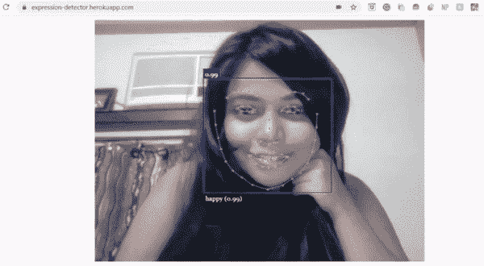

# 多亏了 Heroku，在线托管你的网站比你想象的更容易！

> 原文：<https://blog.devgenius.io/hosting-your-website-online-is-easier-than-you-think-thanks-to-heroku-bd7413f6aec5?source=collection_archive---------21----------------------->


动态网站和静态网站都托管在 Heroku 上。

如果你是 web 开发的新手，你可能会非常害怕类似于**节点**、**后端**、**本地主机、**等词汇。觉得它们对你来说太复杂了。作为一名 ML 工程师，我曾经认为在线托管我的项目工作量太大，我必须学习一种全新的技术来托管哪怕是简单的网站。这与事实相去甚远，有了 Heroku 和 Nodejs，您的网站可以在几分钟内建立并运行，几乎不需要任何努力。请继续阅读，找出方法。:)
我会把这个教程分成两部分:
1。第一部分将主办一个只有 HTML 和 CSS 的静态网站，即前端。
2。第二部分也将包括后端。

> ***先决条件:***
> 
> ***1。git on system
> 2 命令行基础知识***

# 1.静态网站

我们将用 Node.js 托管我们的站点。如果你去 Heroku 页面，你会看到说明非常详细。让我们一步一步地分解说明。


[https://dev center . heroku . com/articles/getting-started-with-nodejs #设置](https://devcenter.heroku.com/articles/getting-started-with-nodejs#set-up)

## 第一步:从[这里](https://www.npmjs.com/get-npm)下载 node.js 和 npm 并安装在你的系统上。


[https://www.npmjs.com/get-npm](https://www.npmjs.com/get-npm)

## 第二步:下载 [Heroku CLI](https://devcenter.heroku.com/articles/getting-started-with-nodejs#set-up) 并开通 Heroku 账户。


## 第三步:进入命令行，导航到你选择的目录，里面有你的网站文件，

```
heroku login
```

输入您的用户名和密码。

## 步骤 4:克隆示例目录，给它起一个自己选择的名字，并导航到该文件夹。

```
git clone [https://github.com/heroku/node-js-getting-started.git](https://github.com/heroku/node-js-getting-started.git) <your repo name>cd <your repo name>
```

## 步骤 5:设置一个本地服务器来查看你的网站。

```
npm install
node index.js
```

然后去本地主机:5000。该网站现在运行在 node express 后端，你可以对前端做任何更改。

## 步骤 5:打开你的文本编辑器，打开 index.ejs，在里面重写你的 HTML 和 CSS 代码。


<your repo="">/视图/页面/索引. ejs</your>

用您的 HTML 文件替换它。

## 第六步:把你的网站放到网上。


我的网站

这是我为这个教程开发的网站，我将向你展示我是如何在线主持这个网站的。是的，它是一只非常时髦的猫。
打开命令行并键入

```
heroku create <your app name>
```

然后通过 git 推送到主分支。

```
git init
git add .
git commit -m "First commit"
heroku git:remote -a <your app name>
git push heroku master
```

你完了！真的就这么简单。


推送成功后可以找到你的网站链接。
我的网站代码[这里](https://github.com/catplotlib/StylishCat)。

# 2.动态网站

为了建立一个动态网站，我们需要从头开始编写所有的组件。

***确保遵循静态网站的步骤 1、2、3。***

我们开始吧！

## 步骤 4:导航到您的项目目录并创建以下文件

**一、Package.json:**

```
{
  "name": "tutorial",
  "version": "1.0.0",
  "scripts": {
    "start": "node server.js"
  },
  "dependencies": {
    "express": "4.13.3"
  },
  "author": "Puja Chaudhury",
  "License": "MIT"
}
```

这将包含您网站的详细信息。根据您的项目修改您的文件。Server.js 包含指示启动我们的 web 应用程序(基本上是后端)的数据。

**二。过程文件**

```
web: node server.js
```

这表明我们正在 server.js 上启动我们的网站，node 是我们的后端工具。

**三。Server.js**

```
//We are using express dependency
var express=require('express');
var app=express();//set port
var port=process.env.PORT || 8080//allowing html and css to load
app.use(express.static(__dirname));//routes
app.get("/",function(req,res){
    res.render("index");
})//listen to requests
app.listen(port,function(){
  console.log("app running");
})
```

这是我们网站的主要后端，包含所有细节，如路线、请求和对重要目录的访问。

## 步骤 5:安装我们的依赖项

```
 npm install
```

这将安装我们的 npm 依赖项。

下一步与静态网站的第 6 步非常相似。

## 第六步:把你的网站放到网上。

我已经在一个 web 应用程序中实现了一个名为 [faceapi.js](https://justadudewhohacks.github.io/face-api.js/docs/index.html) 的惊人脚本，它是一个**“在 tensorflow.js 核心之上实现的用于浏览器和 nodejs 的 JavaScript 人脸识别 API”**并且它是真正的天才，一定要看看这个。



看看我的网站:[https://expression-detector.herokuapp.com/](https://expression-detector.herokuapp.com/)

这是我为这个教程开发的网站，我将向你展示我是如何在线主持这个网站的。
打开命令行并键入

```
heroku create <your app name>
```

确保你的 HTML 文件被命名为***index.html***。然后通过 git 推送到主分支。

```
git init
git add .
git commit -m "First commit"
heroku git:remote -a <your app name>
git push heroku master
```

你完了！


推送成功后可以找到你的网站链接。
此处[为网站代码](https://github.com/catplotlib/Expression-detector)。

非常感谢你的阅读，我希望你觉得这是有帮助的！