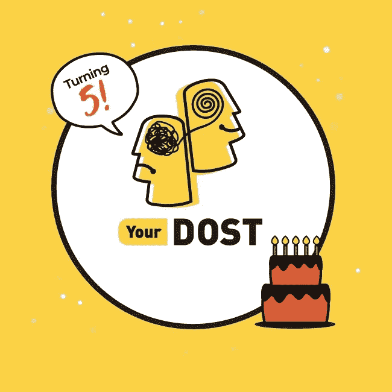

# 一个冒险的决定如何将我从一场可能的灾难中拯救出来？

> 原文：<https://blog.devgenius.io/how-a-risky-decision-saved-me-from-a-possible-disaster-9374fae9ee4?source=collection_archive---------8----------------------->

> *免责声明:这篇帖子完全基于我的行业经验，并非针对* **批评** *任何人。*

大家好，这段时间我们听到的都是关于日冕以及它如何影响我们的经济。我正在写我的第一篇博客，因为我最近从某人那里听说我启发了他/她，并且因为这个决定而大开眼界。如果它能激励其他阅读它的人，我会非常高兴。

# 第一个错误

我没有一级或二级大学背景，但我从我的大学中学到了很多，没有他们我不会在这个位置上。我分享这一点是因为在这样的环境下，获得 5L、6L、7L 左右的报价是一件大事。

假设我的第一家公司是有 2000 名员工的 **X** 。他们给了我一个很好的提议，我无法拒绝。事实上，我是他们招聘批次中待遇最好的人之一！！

我对此感到非常自信和特别。没有对公司做太多调查。我在飞一个正常人会有什么反应。

> 那是我最大的错误。如果我研究了 Glassdoor 或任何其他平台，我可能会寻找其他机会

# 陷入循环

在我的培训期间，我获得了 a，他们把我调到了他们产品的主要核心团队。我不知道，它更像是一盒有限的供应品。

> 注意:我不会抱怨公司，事情就是这样&这是一种不同的体验，不是我喜欢的！！

他们遵循**学校文化**迟到 1 分钟，请假半天。

让我告诉你什么是不存在的，这很容易解释！>有-

*   *没有食堂/自助餐厅*
*   *没有基本的生活设施*
*   *没有笔记本电脑，所以没有 WFH 功能*
*   我们的工作没有得到认可
*   *限制使用手机【看来是生产力问题】*

我们基本上应该是一个机器人。我忍受了这一切，因为这很有挑战性&也许这是上帝教给我的东西。我不能接受的一件事是，他们**屏蔽了** **谷歌**。

是的，你读了，对吧。没有**谷歌**！！

*   *无堆栈溢出😅*
*   *没有编码或算法练习*
*   *没有知识充实活动*
*   *工作没有得到认可*

该公司有一个个人维基百科网站，可以访问该网站了解公司的产品。

> 我在那里学到的一切主要是提高我在公司的技能。

推动我完成这次旅行的一个因素是出色的团队，我最终和几个高级开发人员一起工作。我在脚本方面比以前有了更多的经验。我将永远感谢那支特别的队伍。我在 X 公司的经历并不完全是一场灾难。

**弊**大于**利**，我的 java 技能没有得到充分利用。我找不到以前引导我走向成功的火花。我知道我不能像这样在任何地方生存。

以我的经历和包装，应该知道的更多。我失去了与我的**编码**技能的联系，无法准备。有人可能会问，为什么不在星期天准备呢？拜托，我只是个人。我不能通过一周写一天代码来进行适当的练习！！Idk，很多人可能会说我本可以做这件事，但是当你站在我的鞋子上时，那简直是地狱。

# 我做了什么？

这是一件好事，我总是从未来的角度考虑问题。有一天，我对自己说，够了。如果我在这里多呆 1 到 2 年，我的薪水会大幅增加，但我的知识会保持不变。在公司之外，我还是一个知识有限的菜鸟。很少有人是例外，但我不是。呆那么久完全是我的错，如果我后悔也没用。

由于没有准备和对未来的压力太大，我辞去了工作。每个人都告诉我，我辞职并辞去高薪工作是个傻瓜。我知道我会看起来像一个小丑，但我总是相信自己和我的决定。

> 你必须明白，我是一个中产阶级的人，经历着我这个年龄的人所面临的一切。对我来说这也不是一个容易的决定。

感谢上帝，我很幸运有这么好的父母和姐姐，他们相信并支持我。我休了个短假，放松了一下，找到了缺失的火花。我开始日夜准备。在朋友的帮助下，我感到有动力，提高了技能，完成了各种认证，以基于当前行业的需求而进化。

# 找到一份很棒的工作

凭借努力工作和奉献精神，我得到了一份在《YourDOST》中扮演 SDE 的好工作。他们帮助人们的努力确实是人类所代表的，我很高兴成为其中的一员！！我在这里的短暂时间里进步了很多，我仍在向我的团队和导师学习。他们每次都认可我的工作，这激励我去学习更多的东西。

还有，你的爸爸今天满 5 岁了，祝贺你👏 👏

# 写这篇文章的原因

由于电晕，许多公司正面临着巨大的垮台。昨天我听到一个令人不安的消息，X 公司是其中之一。

这么多人被 X 公司炒了！！不管你是谁，做一个有 2 到 7 年经验的专业人士——✅被解雇了，据说在接下来的几天里会有数百人被解雇。

我最害怕的事情真的发生了。请理解，我没有嘲笑任何人，每个人都有他们留在 x 的理由。可能很少有人真正学到了一些东西，但相信我，不是所有人都这样做了。我做了一个冒险的决定，听从自己的感觉，辞去了那份工作。如果我一年前没有辞职，我也会失业。

> 想象一下，**普通技术人员**由于高薪而背负着巨大的期望，在**疫情**时期失业。我无法想象他们每个人都在经历什么！！

不管我的决定是鲁莽的还是事实上我去了未来。！重要的是，我跟随了我的心，现在我在一个快乐的地方。我从不怀疑我的决定。我相信通过适当的练习，我会找到一份好工作，我做到了。

永远不要怀疑自己。当情况太糟糕时，跟随你的直觉，在生活中冒险。我希望它至少能激励一个读它的人，♥️