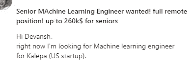
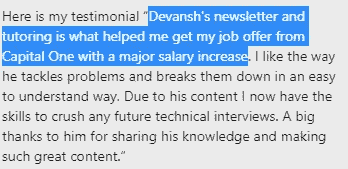
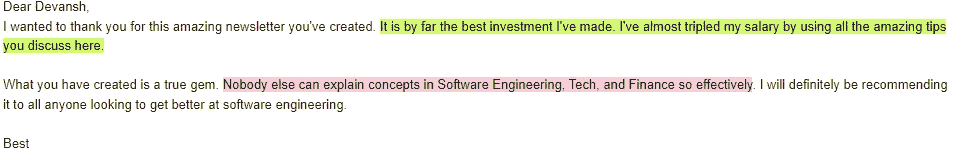
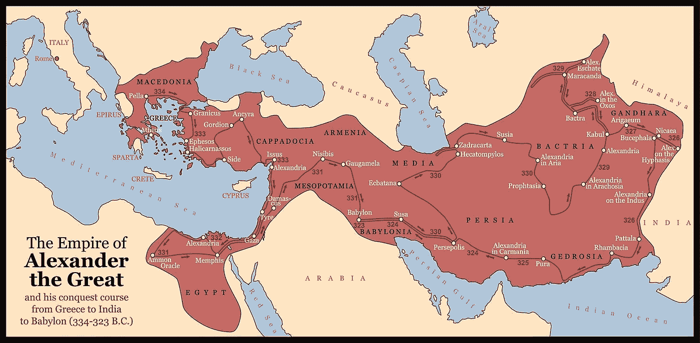
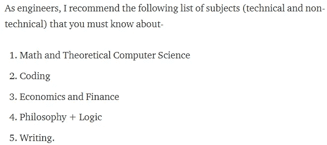
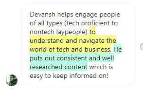

# 一名软件工程师如何在 4 年内从 SW2 升至校长

> 原文：<https://blog.devgenius.io/how-a-software-engineer-went-from-sw2-to-principal-in-4-years-4c708dbfae40?source=collection_archive---------0----------------------->

## 如何快速获得提升。工程师如何在不到 4 年的时间内获得 4 次晋升

为了帮助我理解您[填写本调查表(匿名)](https://forms.gle/7MfQmKhEhyBTMDUD7)

晋升对软件工程职业来说非常重要。这是因为，作为一名高级软件工程师，你的影响力通常比作为一名初级工程师要大得多。这也是为什么高级工程师的薪酬往往也要高得多，以及为什么拥有几年经验的程序员总是受到如此高的需求。



仅仅获得几年的工作经验就让我获得了高得多的薪水。

好消息是，您不必等待数年时间来攀登高峰。软件是一个最有效率的人会很快得到回报的领域。那么，您可以做些什么来快速获得这些促销活动呢？您如何成为一名在排名中脱颖而出的工程师，并为自己赢得那些甜蜜的高级工程职位？

在这篇文章中，我将讲述一个我遇到的非常有趣的故事。这是一个真正的摇滚明星软件工程师的故事。在不到 4 年的时间里，他从一个微不足道的软件工程师 2 成长为首席技术经理。今天，我们将介绍如何操作。

```
The estimated total pay for a Principal Technical Program Manager is $165,559 per year in the San Francisco, CA Area area, with an average salary of $144,822 per year.
```

*   [根据格拉斯门的说法。对于更成熟的公司来说，这一比例一直高达 322K。](https://www.glassdoor.com/Salaries/san-francisco-principal-technical-program-manager-salary-SRCH_IL.0,13_IM759_KO14,49.htm)

如果你喜欢这样的内容，你会喜欢我每天的科技时事通讯[简单的科技访谈](https://codinginterviewsmadesimple.substack.com/)。它涵盖了科技行业、计算机科学和软件工程的许多故事，以帮助您在职业生涯中取得进步，并在长期成功的基础上为自己奠定基础。这个故事最初是在那里被报道的。



我们有 100%的满意度保证，所以您可以毫无风险地订阅。

# 背景

这个故事最先在拉胡尔·潘迪的 YouTube 频道上被报道。一个团队正在努力降低其服务的运营成本。当工程团队专注于工程重型解决方案时，一位富有创造力的工程师开始深入研究这个问题。他注意到有一些客户增加了很多成本，但没有增加多少收入。通过降低这些客户的成本，这个问题就会得到解决。不需要昂贵的工程。而且要快得多。这让他获得了很多晋升。

# 亮点

这个故事将涵盖以下观点

1.  有时候你必须快刀斩乱麻。软件工程通常是要解决一大堆问题。有时，工程师们不得不想出复杂的解决方案来解开这些头绪。其他时候，你想直接穿过去。讲述亚历山大大帝的故事。
2.  **工科好。经济解决方案背景下的工程要好得多。**这位工程师试图解决经济方面的问题(使解决方案更具可持续性)，而不是将事情作为一个纯粹的工程问题来处理(这很难)。这好多了。
3.  **开阔眼界。**我们美丽的摇滚明星提出的解决方案是帕累托原则(80-20 法则)的主要例子之一。每个认真对待自己职业的软件开发人员都必须大量阅读。或者让自己接触不同的想法。能够编码很酷。做出正确的决定更重要。

这不是你想错过的帖子。让我们变得时髦起来。



# 亚历山大大帝和戈登结

我想以我最喜欢的一个历史故事开始这篇文章。这个故事是改变你的战斗来结束战争的最好例子。

当亚历山大大帝开始对抗强大的波斯帝国时，许多人认为他疯了。波斯人是一个强大的帝国，而马其顿相对来说是个无名小卒。


由于早期的胜利，亚历山大到达了戈尔迪姆镇。那里躺着著名的戈尔迪纽结，一团乱糟糟的绳子。传说中，任何解开绳子的人都将统治世界。请记住，希腊人对此深信不疑。因此解开这个非常重要。

亚历山大为此挣扎了一会儿。他花的时间越多，他的士兵(和他自己)就会变得越不安。最后，亚历山大宣称，这个传说并没有说明这个结必须以一种特殊的方式解开。于是他拔出剑，割断了绳结，在这个过程中解开了绳结。



我得说这对他来说很好。

我为什么要告诉你这些？软件工程很相似。现实世界的问题不会随说明书而来。然而，我们的大脑是自动驾驶仪的专家，并尝试他们一直在做的事情。当问题与我们熟悉的其他问题相似时，这是有效的。然而，当涉及到新的问题时，这可能是一种损害。你很可能会陷入同样的旧思维中。帮助你解决问题的假设和约束会阻止你解决问题。

那么如何才能确保自己不陷入这个陷阱呢？让我们接下来讨论这个问题。

# 深呼吸，喝水，然后缩小

当面对一个我们认为自己知道的问题时，我们很容易马上投入进去。[然而，有时后退一步，在应用问题和解决方案的背景下审视这些问题和解决方案会很有用](https://codinginterviewsmadesimple.substack.com/p/attentional-blindness-storytime-saturdays?s=w)。大多数人认为降低成本是一个纯粹的工程问题。然而，我们的摇滚明星后退了一步。他看到，无论构建什么工程解决方案，最终都必须由客户使用。客户的使用最终决定了利润和成本。解决这一问题也将带来高投资回报率的解决方案。

缩小可以让你从整体上看你的系统。你会意识到你的假设，以及不同的事物是如何结合在一起的。一旦你开始发展这种技能，你将会在解决问题上变得更加出色。

缩小很重要。然而，如果你没有知识知道你在看什么，缩小对你没有太大帮助。这就是下一步将改变游戏规则的地方。

# 阅读阅读和阅读更多

糟糕的软件工程师根本不读书。优秀的工程师阅读大量的技术资料(博客、演讲、论文和书籍)。卓越的工程师阅读所有这些，但也学习更多的“软”技能(沟通、学习、组织)或更多的“文科”(经济学、历史、社会学等)。).请记住，无论我们构建什么代码，我们都是为人们而构建的(直接或间接)。如果没有人能使用你所建造的东西，它就毫无价值。学习如何构建能增加很多价值的解决方案，并与他人合作来创建您的解决方案，这是您获得成功的关键技能。忽视这些，后果自负。

大多数科技进步都受到了其他领域的启发。布尔代数受中国哲学的启发。机器学习从生物学中获得了很多灵感。大部分计算机科学来自数学。例子不胜枚举。

那么你如何发展你的基础呢？第一步是弄清楚你对什么感兴趣。然后开始阅读更多关于这类话题的书籍。它不一定仅仅来自于大书。电影、播客、有声书、讲座和谈话是你可以了解你感兴趣的话题的许多方式中的一部分。

信不信由你，这个过程不一定会很无聊。例如，我是一个超级漫画/动画迷。这些故事通常表达了相当有趣的哲学主题，关于先天与后天，社会/团体运行的理想方式，以及对经济、权力和责任的思考。如果你是这些科目的初学者，这些将提供一个很好的切入点。



如果你正在寻找包含一些最重要的软件技能的指南，请查看我在[上的帖子，我是如何在 21](https://medium.datadriveninvestor.com/how-i-got-a-100-dollars-per-hour-offer-in-machine-learning-at-21-366708e6c6b6) 获得每小时 100 美元的机器学习机会的。最后有一个关于我最喜欢的资源的指南，可以帮助你在以上所有领域建立技能。

以上是我的简讯[中的一段，由简单的](https://codinginterviewsmadesimple.substack.com/)技术采访组成。更多此类高水平的免费分析，请查看。时事通讯不需要名字，不需要个人信息。只有你的邮件。而且没有垃圾邮件。永远不会。


对于机器学习来说，结合软件工程、数学和计算机科学的基础至关重要。它将帮助你概念化，建立和优化你的 ML。我的每日时事通讯，[Technology interview simpled](https://codinginterviewsmadesimple.substack.com/)涵盖了算法设计、数学、最近的科技事件、软件工程等主题，让你成为更好的开发人员。 [**我目前正在进行一整年的八折优惠，一定要去看看。**](https://codinginterviewsmadesimple.substack.com/subscribe?coupon=1e0532f2)


我创造了[技术面试，使用通过指导多人进入顶级技术公司而发现的新技术，使面试变得简单](https://codinginterviewsmadesimple.substack.com/)。时事通讯旨在帮助你成功，避免你在 Leetcode 上浪费时间。我有一个 100%满意的政策，所以你可以尝试一下，没有任何风险。[您可以阅读常见问题解答并在此了解更多信息](https://codinginterviewsmadesimple.substack.com/p/faqs-and-about-this-newsletter?r=4tnbw&s=w&utm_campaign=post&utm_medium=web)



如果你也有任何有趣的工作/项目/想法给我，请随时联系我。总是很乐意听你说完。

以下是我的 Venmo 和 Paypal 对我工作的金钱支持。任何数额都值得赞赏，并有很大帮助。捐赠解锁独家内容，如论文分析、特殊代码、咨询和特定辅导:

https://account.venmo.com/u/FNU-Devansh

贝宝:[paypal.me/ISeeThings](https://www.paypal.com/paypalme/ISeeThings)

# 向我伸出手

使用下面的链接查看我的其他内容，了解更多关于辅导的信息，或者只是打个招呼。

机器学习重要更新的免费每周总结(赞助)-[https://lnkd.in/gCFTuivn](https://lnkd.in/gCFTuivn)

查看我在 Medium 上的其他文章。:【https://rb.gy/zn1aiu 

我的 YouTube:【https://rb.gy/88iwdd 

在 LinkedIn 上联系我。我们来连线:[https://rb.gy/m5ok2y](https://rb.gy/f7ltuj)

我的 insta gram:[https://rb.gy/gmvuy9](https://rb.gy/gmvuy9)

我的推特:[https://twitter.com/Machine01776819](https://twitter.com/Machine01776819)

如果你正在准备编码/技术面试:[https://codinginterviewsmadesimple.substack.com/](https://codinginterviewsmadesimple.substack.com/)

获得罗宾汉的免费股票:[https://join.robinhood.com/fnud75](https://join.robinhood.com/fnud75/)