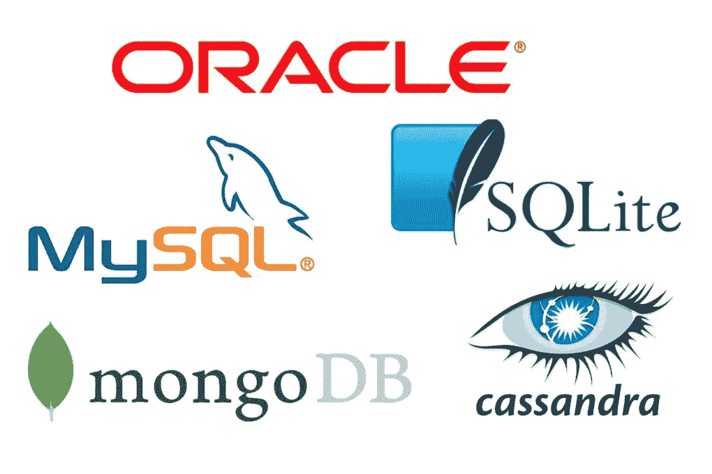
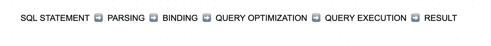
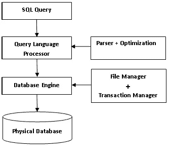
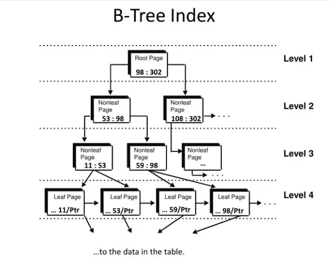
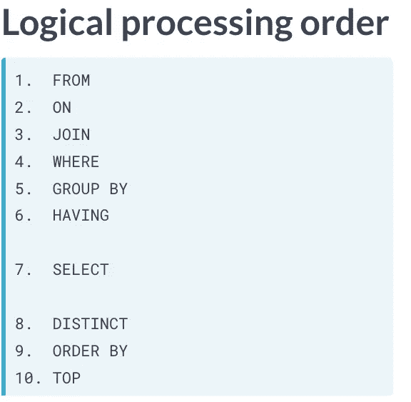

# SQL 数据库引擎如何工作

> 原文：<https://blog.devgenius.io/how-a-sql-database-engine-works-c319200889d7?source=collection_archive---------7----------------------->


美国宇航局在 [Unsplash](https://unsplash.com?utm_source=medium&utm_medium=referral) 拍摄的照片

了解 SQL 如何工作的重要性在于能够在进行查询时识别错误并优化查询过程。这就是它如何让您大致了解当今市场上最常用的数据管理语言之一是如何工作的。

# 数据库

> 数据的系统收集。这意味着它是按字段、记录和文件组织的信息，以便可以快速选择所需的数据片段。

# 数据管理

> (1)数据管理是吸收、存储、组织和维护组织创建和收集的数据的过程。有效的数据管理是部署 IT 系统的关键部分，IT 系统运行业务应用程序并提供分析信息，以帮助企业高管、业务经理和其他最终用户制定运营决策和战略规划。

# 关系数据库管理系统

> 它是一个软件，提供用户之间的接口，用于定义、操作、检索和管理数据库中的数据。当使用我们无法管理的大量数据时，需要考虑这一点。'
> 
> 要使用关系数据库管理系统，必须使用定义语言来操作数据，使用查询语言来访问数据。
> 
> 因此，它的特性非常重要，因为它们将依赖于这些决策，以及它的工程设计，这将决定它的性能、安全性、可用性和可伸缩性。
> 
> 这些功能有:
> -进行事务
> -存储过程
> -允许客户端-服务器模式的连接



出发地:马琳河(2020 年)。洛斯·马斯·乌萨多斯(SGBD)基地仓库。检索于 2020 年 7 月 15 日，来自[https://Revista digital . inesem . es/informatica-y-tics/los-gestores-de-bases-de-datos-MAS-usados/](https://revistadigital.inesem.es/informatica-y-tics/los-gestores-de-bases-de-datos-mas-usados/)

# 结构化查询语言

> (2)SQL 最初基于关系代数和关系计算，由数据定义语言、数据操作语言和数据控制语言组成。SQL 的范围包括数据插入、查询、更新和删除、模式创建和修改以及数据访问控制。此外，SQL 有时被描述为一种声明性语言；它还包括程序要素。SQL 的目标是管理大量数据，尤其是在大量数据同时写入的情况下

# 询问

> (3)它是从数据库中的一个表或多个表的组合中请求数据或信息。这些数据可以作为结构化查询语言(SQL)返回的结果生成。

这是一个用 SQL 编写的查询示例。

# 数据库管理系统和数据库引擎有什么区别？🤔

> 数据库管理系统是具有自身功能的软件，允许我们连接到数据库引擎，始终保持引用的完整性。数据库引擎是内部工具，允许或方便对表及其数据进行一定数量的操作。

## 数据定义语言

代表数据定义语言用于创建数据库、模式、约束、用户、表等。

## DoctorofModernLanguages 现代语言博士

代表数据操作语言，用于插入、更新或删除记录。

# 存储引擎

> 存储引擎负责在物理存储系统中存储和检索数据。

# 数据库引擎

> 数据库引擎是创建、读取、更新、删除数据以及保护其收集的数据和解释 SQL 命令的主要服务。它确切地决定了您的查询需要做什么，以及完成它的最佳方式。

所有数据库引擎都有一个编译器来将 SQL 语句翻译成字节码，还有一个虚拟机来评估字节码。

主要组件:

*   存储引擎
*   编译程序
*   查询处理器。

这是优化查询时需要考虑的一个问题。有两种类型的查询，它们是 DDL 和 DML。如上所述，DDL 查询要快得多，因为只需改变现有数据集的结构。
查询数据库的过程如下:



# **1。**编译

## **1.1** 分析

在这一部分中，查询用各种可以识别的单词来标记。

```
HELLO WORLD =      ['HELLO', 'WORLD']
```

## **1.2** 验证语义

检查子句是否存在，进行查询的用户是否有权执行声明，以及是否以及何时所有的表和列都可以按照您的指定在数据库中使用。

## **1.3** 装订

它为宣言生成一个协商计划，该计划是执行宣言所需步骤的二进制表示。

# **2。**查询优化器

当先前已经进行了具有类似要求的查询时，这被称为软解析。如果之前进行过查询，它将再次使用相同的执行计划并显示结果。如果您没有优化查询计划并选择最佳算法，请进行搜索和排序。这样做的结果是一个准备好的 SQL 语句。

# **3。**执行

RDBMS 或虚拟机获得优化的字节码并执行 SQL 语句。

关系引擎的各种任务是:

*   内存管理
*   缓冲管理
*   分布式查询处理
*   询问处理
*   线程和任务管理



> (4) SQL 是用 C 语言编写的，使用二叉树原理，使输入的数据存储在行和列中。在二叉树结构中，我们有几个分支仍然指向新的数据元素。SQL 数据库也遵循同样的结构，其中数据被转换成表格，表格中的每一列和每一行数据相互指向对方。



出发地:纽约州丹尼市(2020)。数据库管理:实践和程序完全指南。检索于 2020 年 7 月 15 日，来自[https://www . slide serve . com/yap het/database-administration-the-complete-guide-to-practices-and-procedures](https://www.slideserve.com/yaphet/database-administration-the-complete-guide-to-practices-and-procedures)

# 查询执行评估顺序

优化器将根据可用信息(如表索引和扫描机制)尝试找到最有效的方法来执行查询。



查询执行默认顺序为:
- **从**-
-**其中**-
-**分组按**-
-**有**-
-**选择**-
-**顺序按**

总之，我们需要一个数据库引擎来创建数据库环境。这是用低级编程语言构建的，因为它们让用户控制内存管理，除此之外，它还有自己的编译和执行阶段。

## **参考:**

*   关系数据库管理系统的定义。(2020).检索于 2020 年 7 月 15 日，来自[https://techlib . net/definition/RDBMS . html #:~:text = DBMS % 20m % C3 % A1s % 20 conocido % 20 aplicaciones % 20 caer，de % 20 bases % 20 de % 20 datos % 20 relationales。](https://techlib.net/definition/rdbms.html#:~:text=DBMS%20m%C3%A1s%20conocido%20aplicaciones%20caer,de%20bases%20de%20datos%20relacionales.)
*   数据库管理系统中 DDL 和 DML 的区别。(2020).检索于 2020 年 7 月 16 日，来自[https://www . tutorialspoint . com/difference-between-DDL-and-DML-in-DBMS #:~:text = DDL % 20 代表% 20 数据% 20 定义，代表% 20 数据% 20 操作% 20 语言。](https://www.tutorialspoint.com/difference-between-ddl-and-dml-in-dbms#:~:text=DDL%20stands%20for%20Data%20Definition,stands%20for%20Data%20Manipulation%20Language.)
*   (1)什么是数据管理，为什么它很重要？。(2018).2020 年 7 月 15 日检索，来自[https://search Data management . techtarget . com/definition/Data-management #:~:text = Data % 20 管理% 20 涉及% 20 种类% 20 和% 20 应用% 20 访问% 20 它们。](https://searchdatamanagement.techtarget.com/definition/data-management#:~:text=Data%20management%20involves%20a%20variety,and%20applications%20that%20access%20them.)
*   (2) SQL。(2020).检索于 2020 年 7 月 15 日，来自[https://es.wikipedia.org/wiki/SQL](https://es.wikipedia.org/wiki/SQL)
*   (3)什么是查询？—来自 Techopedia 的定义。(2017).检索于 2020 年 7 月 15 日，来自 https://www.techopedia.com/definition/5736/query